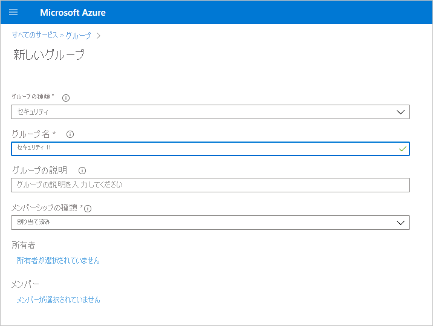
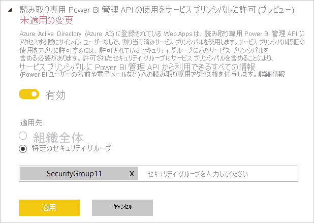

# 読み取り専用の管理 API に対してサービス プリンシパル認証を有効にする (プレビュー)

サービス プリンシパルとは、Azure Active Directory (Azure AD) アプリケーションが Power BI サービスのコンテンツと API にアクセスできるようにするための認証方法です。
Azure AD アプリを作成すると、[サービス プリンシパル オブジェクト](/azure/active-directory/develop/app-objects-and-service-principals#service-principal-object)が作成されます。 サービス プリンシパル オブジェクト (単にサービス プリンシパルとも呼ばれる) を使用することで、Azure AD によるご利用のアプリの認証が可能になります。 認証が完了すると、アプリは Azure AD テナント リソースにアクセスできるようになります。

## Method

Power BI 読み取り専用 API のサービス プリンシパル認証を有効にするには、次の手順に従います。

1. [Azure AD アプリを作成します](/azure/active-directory/develop/howto-create-service-principal-portal)。 使用する Azure AD アプリが既にある場合は、この手順を省略できます。 後の手順のために、アプリ ID をメモしておきます。 
2. Azure Active Directory に新しい **セキュリティ グループ** を作成します。 [Azure Active Directory を使用して基本グループを作成し、メンバーを追加する方法の詳細を参照してください](/azure/active-directory/fundamentals/active-directory-groups-create-azure-portal)。 使用するセキュリティ グループが既にある場合は、この手順を省略できます。
    グループの種類として **[セキュリティ]** を選択してください。

    

3. 作成したセキュリティ グループのメンバーとして、使用するアプリ ID を追加します。 次の手順に従います。
    1. **Azure portal > [Azure Active Directory] > [グループ]** の順に移動して、手順 2 で作成したセキュリティ グループを選択します。
    1. **[メンバーの追加]** を選択します。
    注意:Azure portal で、使用するアプリに Power BI 管理者ロールが設定されていないことを確認してください。 これを確認するには: 
       * グローバル管理者、アプリケーション管理者、またはクラウド アプリケーション管理者として **Azure portal** にサインインします。 
        * **[Azure Active Directory]** を選択した後、 **[エンタープライズ アプリケーション ]** を選択します。 
        * Power BI へのアクセス権を付与するアプリケーションを選択します。 
        * **[アクセス許可]** を選択します。 

        > [!IMPORTANT]
        > このアプリケーションには、Power BI 管理者の同意が必要なアクセス許可が設定されていないことを確認してください。 詳細については、「[アプリケーションの同意の管理と同意要求の評価](/azure/active-directory/manage-apps/manage-consent-requests)」を参照してください。 
4. Power BI サービス管理者設定を有効にします。 手順は次のとおりです。
    1. Power BI 管理ポータルにログインします。 テナントの設定ページを表示するには、Power BI 管理者である必要があります。
    1. **[Admin API settings]\(管理 API 設定\)** に、 **[読み取り専用 Power BI 管理 API の使用をサービス プリンシパルに許可 (プレビュー)]** が表示されます。 次の図に示すように、切り替えを [有効] に設定し、 **[特定のセキュリティ グループ]** ラジオ ボタンをオンにして、その下に表示されるテキスト フィールドに手順 2 で作成したセキュリティ グループを追加します。

        

 5. 読み取り専用管理 API の使用を開始します。 サポートされている API の一覧については、以下をご覧ください。

    >[!IMPORTANT]
    >Power BI でサービス プリンシパルを使用できるようにすると、アプリケーションの Azure AD アクセス許可は効果を持たなくなります。 アプリケーションのアクセス許可はその後、Power BI 管理ポータルを介して管理されます。

## サポート対象 API

現在、サービス プリンシパルでは次の API がサポートされています。
* [GetGroupsAsAdmin](/rest/api/power-bi/admin/groups_getgroupsasadmin) (dashboards、datasets、reports、dataflows の $expand と共に) 
* [GetDashboardsAsAdmin](/rest/api/power-bi/admin/dashboards_getdashboardsasadmin) ($expand tiles と共に)
* [GetDatasourcesAsAdmin](/rest/api/power-bi/admin/datasets_getdatasourcesasadmin) 
* [GetDatasetToDataflowsLinksAsAdmin](/rest/api/power-bi/admin/datasets_getdatasettodataflowslinksingroupasadmin)
* [GetDataflowDatasourcesAsAdmin](/rest/api/power-bi/admin/dataflows_getdataflowdatasourcesasadmin) 
* [GetDataflowUpstreamDataflowsAsAdmin](/rest/api/power-bi/admin/dataflows_getupstreamdataflowsingroupasadmin) 
* [GetCapacitiesAsAdmin](/rest/api/power-bi/admin/getcapacitiesasadmin)
* [GetActivityLog](/rest/api/power-bi/admin/getactivityevents)
* [GetModifiedWorkspaces](/rest/api/power-bi/admin/workspaceinfo_getmodifiedworkspaces)
* [WorkspaceGetInfo](/rest/api/power-bi/admin/workspaceinfo_postworkspaceinfo)
* [WorkspaceScanStatus](/rest/api/power-bi/admin/workspaceinfo_getscanstatus)
* [WorkspaceScanResult](/rest/api/power-bi/admin/workspaceinfo_getscanresult)

## 考慮事項と制限事項

* サービス プリンシパルを使用して Power BI ポータルにサインインすることはできません。
* Power BI 管理ポータルの [Admin API settings]\(管理 API 設定\) でサービス プリンシパルを有効にするには、Power BI 管理者権限が必要です。