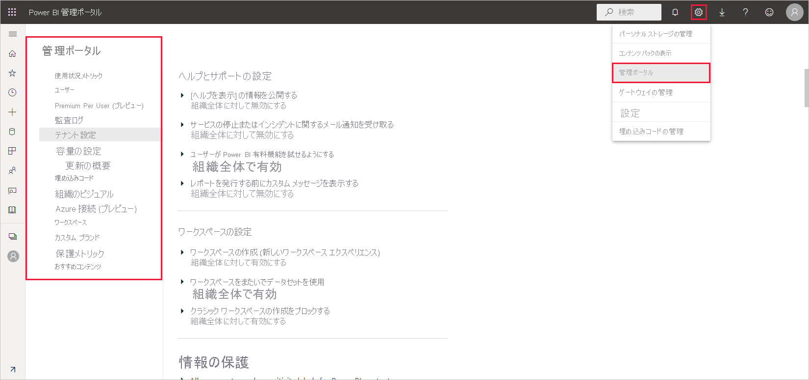

# Power BI 管理とは

Power BI 管理とは、Power BI の動作を制御する組織全体設定を管理することです。 管理者ロールに割り当てられたユーザーは、組織のリソースを構成し、監視し、プロビジョニングします。 この記事では、管理を速やかに始められるよう、管理者ロール、管理者タスク、管理者ツールの概要を説明します。

## Power BI に関連する管理者ロール

組織の Power BI を管理するとき、連動するロールがいくつかあります。 ほとんどの管理者ロールは Microsoft 365 管理センターで割り当てられるか、PowerShell を利用して割り当てられます。 Power BI Premium 容量と Power BI Embedded 容量の管理者ロールは、容量の作成時に割り当てられます。 管理者ロールのそれぞれの詳細については、「[管理者ロールについて](/microsoft-365/admin/add-users/about-admin-roles)」を参照してください。 管理者ロールを割り当てる方法については、「[管理者ロールを割り当てる](/microsoft-365/admin/add-users/assign-admin-roles)」を参照してください。

| **管理者の種類** | **管理者のスコープ** | **Power BI タスク** |
| --- | --- | --- |
| グローバル管理者 | Microsoft 365 | 組織のあらゆる管理機能に制限付きでアクセスできる |
| | | 他のユーザーにロールを割り当てる |
| 課金管理者 | Microsoft 365 | サブスクリプションの管理 |
| | | ライセンスの購入 |
| ライセンス管理者 | Microsoft 365 | ユーザーのライセンスを割り当てるか、削除する |
| ユーザー管理者 | Microsoft 365 | ユーザーとグループを作成し、管理する |
| | | ユーザー パスワードのリセット |
| Power BI 管理者 | Power BI サービス | Power BI 管理タスクのフル アクセス|
| | | Power BI 機能を有効または無効にする |
| | | 使用状況とパフォーマンスに関してレポートする |
| | | 監査をレビューして管理する |
| Power BI Premium 容量管理者 | 単一の Premium 容量 | 容量にワークスペースを割り当てる|
| | | 容量に対するユーザー アクセス許可を管理する |
| | | ワークロードを管理してメモリ使用量を構成する |
| | | 容量を再起動する |
| Power BI Embedded 容量管理者 | 単一の Embedded 容量 | 容量にワークスペースを割り当てる|
| | | 容量に対するユーザー アクセス許可を管理する |
| | | ワークロードを管理してメモリ使用量を構成する |
| | | 容量を再起動する |

## 管理タスクと管理ツール

Power BI 管理者は主に Power BI 管理ポータルで作業します。 ただし、関連するツールと管理センターに精通している必要があります。 上の表を参照しながら、以下に挙げるツールを使用してタスクを実行するために必要なロールを判断します。

| **ツール** | **一般的なタスク** |
| --- | --- |
| [Power BI 管理ポータル](https://app.powerbi.com/admin-portal) | Premium 容量を取得して操作する |
| | サービスの品質を確保する |
| | ワークスペースを管理する |
| | Power BI ビジュアルを発行する |
| | Power BI を他のアプリケーションに埋め込むために使用されるコードを検証する |
| | データ アクセスとその他の問題をトラブルシューティングする |
| [Microsoft 365 管理センター](https://admin.microsoft.com) | ユーザーとグループの管理 |
| | ライセンスを購入し、割り当てる |
| | ユーザーによる Power BI へのアクセスをブロックする |
| [Microsoft 365 セキュリティ/コンプライアンス センター](https://protection.office.com) | 監査をレビューして管理する |
| | データの分類と追跡 |
| | データ損失防止ポリシー |
| | 情報ガバナンス |
| [Azure portal の Azure Active Directory](https://aad.portal.azure.com) | Power BI リソースへの条件付きアクセスを構成する |
| | Power BI Embedded 容量をプロビジョニングする |
| [PowerShell コマンドレット](/powershell/power-bi/overview) | スクリプトによってワークスペースと Power BI のその他の側面を管理する |
| [管理 API と SDK](service-admin-reference.md) | カスタム管理ツールをビルドします。 たとえば、Power BI Desktop では、これらの API を使用して管理に関連するデータに基づくレポートを作成できます。 |

## 次の手順

Power BI 管理に関連する事柄の基本については、次の記事で詳細をご覧ください。

- [Power BI 管理ポータルを使用する](service-admin-portal.md)
- [テナント設定のガイダンス](../guidance/admin-tenant-settings.md)
- [PowerShell コマンドレットを使用する](/powershell/power-bi/overview)
- [Power BI 管理のよく寄せられる質問](service-admin-faq.md)
- [組織のユーザーに Power BI サービスのライセンスを与える](service-admin-licensing-organization.md)
- わからないことがある場合は、 [Power BI コミュニティで質問してみてください](https://community.powerbi.com/)。
- Power BI チームへのご提案は、 [Power BI を改善するためのアイデアをお寄せください](https://ideas.powerbi.com/)