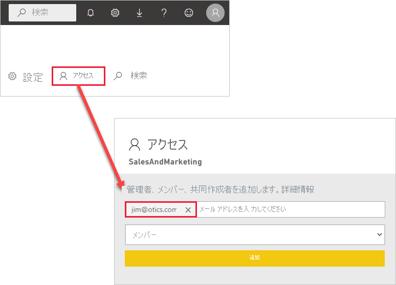

# Azure AD B2B で外部ゲスト ユーザーに Power BI コンテンツを配布する

Power BI を使用すると、Azure Active Directory Business-to-Business (Azure AD B2B) を介して外部のゲスト ユーザーとコンテンツを共有できます。 Azure AD B2B を使用することにより、組織では、中央の場所で外部ユーザーとの共有を可能にし、管理することができます。 既定では、外部のゲストには使用のみのエクスペリエンスが提供されます。 さらに、組織内のコンテンツの編集と管理を組織外のゲスト ユーザーに許可できます。

この記事では、Power BI での B2B Azure AD の基本的な概要を示します。 詳細については、「[Azure Active Directory B2B を使用して外部ゲスト ユーザーに Power BI コンテンツを配布する](../guidance/whitepaper-azure-b2b-power-bi.md)」を参照してください。

## アクセスを有効にする

ゲスト ユーザーを招待する前に、Power BI 管理ポータル内で [[外部ユーザーとコンテンツを共有する]](service-admin-portal.md#export-and-sharing-settings) 機能を有効にします。 このオプションが有効な場合でも、ゲスト ユーザーを招待するには、Azure Active Directory でゲスト招待元ロールをユーザーに付与する必要があります。

[[外部のゲストユーザーによる組織内のコンテンツの編集および管理を許可する]](service-admin-portal.md#allow-external-guest-users-to-edit-and-manage-content-in-the-organization) オプションを使用すると、ゲスト ユーザーは、組織の Power BI の参照を含め、ワークスペースでコンテンツを表示したり作成したりすることができます。

> [!NOTE]
> [[外部ユーザーとコンテンツを共有する]](service-admin-portal.md#export-and-sharing-settings) 設定を使用すると、Power BI で組織に外部ユーザーを招待できるかどうかを制御できます。 外部ユーザーは、招待を受け入れると、組織内の Azure AD B2B ゲスト ユーザーになります。 これらは、Power BI のエクスペリエンス全体でユーザー ピッカーに表示されます。 この設定が無効な場合、組織内の既存のゲスト ユーザーは、既にアクセス権を持っていたすべてのアイテムに引き続きアクセスできます。また、ユーザー ピッカー エクスペリエンスに引き続き表示されます。 さらに、ゲストは、[計画的な招待](#planned-invites)方法で追加された場合、ユーザー ピッカーにも表示されます。 ゲスト ユーザーが Power BI にアクセスできないようにするには、Azure AD の条件付きアクセス ポリシーを使用します。

## 招待できるユーザー

gmail.com、outlook.com、hotmail.com などの個人用メール アカウントを含め、ほとんどのメール アドレスは、ゲスト ユーザーの招待でサポートされています。 Azure AD B2B では、これらのアドレスは "*ソーシャル ID*" と呼ばれます。

[米国政府向け Power BI](service-govus-overview.md) など、政府機関向けクラウドに関連付けられているユーザーを招待することはできません。

## ゲスト ユーザーを招待する

ゲスト ユーザーの招待が必要なのは、初めて自分の組織に招待するときだけです。 ユーザーを招待するには、計画的な、またはアドホック招待を使用します。

アドホック招待を使用するには、次の機能を使います。

* レポートとダッシュボードの共有
* [アプリのアクセス] 一覧

アドホック招待は、ワークスペース アクセス リストではサポートされていません。 これらのユーザーを組織に追加するには、[計画的な招待方法](#planned-invites)を使用します。 外部ユーザーが組織内のゲストになったら、ワークスペース アクセス リストに追加します。

### 計画的な招待

招待するユーザーがわかっている場合は、計画的な招待を使用します。 Azure portal または PowerShell を使用すると、招待を送信できます。 ユーザーを招待するには、ユーザー管理者ロールが割り当てられている必要があります。

Azure portal で招待を送信するには、次の手順のようにします。

1. [Azure portal](https://portal.azure.com) で、 **[Azure Active Directory]** を選択します。

1. **[管理]** で、 **[ユーザー]**  >  **[すべてのユーザー]**  >  **[新しいゲスト ユーザー]** を選択します。

    ![[新しいゲスト ユーザー] オプションが強調された Azure portal のスクリーン ショット。](media/service-admin-azure-ad-b2b/azure-ad-portal-new-guest-user.png)

1. **メール アドレス** と **個人的なメッセージ** を入力します。

    ![電子メールとメッセージ フィールドが強調表示されている [新しいゲスト ユーザー] ダイアログのスクリーンショット。](media/service-admin-azure-ad-b2b/azure-ad-portal-invite-message.png)

1. **[招待]** を選びます。

複数のゲスト ユーザーを招待するには、PowerShell を使用するか、Azure AD で一括招待を作成します。 一括招待に PowerShell を使用するには、「[チュートリアル: PowerShell を使用して Azure AD B2B コラボレーション ユーザーを一括で招待する](/azure/active-directory/b2b/bulk-invite-powershell/)」の手順を実行します。 一括招待に Azure portal を使用するには、「[チュートリアル: Azure AD B2B コラボレーション ユーザーを一括で招待する](/azure/active-directory/b2b/tutorial-bulk-invite/)」の手順を実行します。

ゲスト ユーザーは、受信した招待メール内で **[開始]** を選択する必要があります。 これで、ゲスト ユーザーが組織に追加されます。

![[開始] が強調表示されたゲスト ユーザーの招待メールのスクリーンショット。](media/service-admin-azure-ad-b2b/guest-user-invite-email.png)

### アドホック招待

任意の時点で外部ユーザーを招待するには、共有機能を使ってダッシュボードやレポートに、またはアクセス ページを使ってアプリに、それらの外部ユーザーを追加します。 アプリを使うよう外部ユーザーを招待するときに行うことの例を次に示します。

ゲスト ユーザーには、アプリをそのゲスト ユーザーと共有したことを示すメールが届きます。

ゲスト ユーザーは、自分の所属する組織の電子メール アドレスでサインインする必要があります。 サインイン後、招待を受け入れるよう求められます。 サインイン後、ゲスト ユーザーに対してアプリが開かれます。 アプリに戻るには、リンクをブックマークするか、電子メールを保存する必要があります。

## ライセンス

ゲスト ユーザーは、共有されているコンテンツを表示するために、適切なライセンスが必要になります。 ユーザーが適切なライセンスを持っていることを確認するには、Power BI Premium の使用、Power BI Pro ライセンスの割り当て、ゲストの Power BI Pro ライセンスの使用の、3 つの方法があります。

[組織内のコンテンツを編集および管理できるゲスト ユーザー](service-admin-portal.md#allow-external-guest-users-to-edit-and-manage-content-in-the-organization)がワークスペースにコンテンツを投稿したり、他のユーザーとコンテンツを共有したりするには、Power BI Pro ライセンスが必要です。

### Power BI Premium を使用する

[Power BI Premium 容量](service-premium-what-is.md)にワークスペースを割り当てると、ゲスト ユーザーは Power BI Pro ライセンスなしでアプリを使用できるようになります。 Power BI Premium を使用すると、高いリフレッシュ レートや大規模なモデル サイズなどの他の機能をアプリで活用することもできます。

### ゲスト ユーザーに Power BI Pro ライセンスを割り当てる

組織からゲスト ユーザーに Power BI Pro ライセンスを割り当てると、そのゲスト ユーザーは共有されているコンテンツを表示できるようになります。 ライセンスの割り当ての詳細については、「[[ライセンス] ページでユーザーにライセンスを割り当てる](/office365/admin/manage/assign-licenses-to-users#assign-licenses-to-users-on-the-licenses-page)」を参照してください。 Pro ライセンスをゲスト ユーザーに割り当てる前に、[製品条項サイト](https://www.microsoft.com/licensing/terms)に関するページをご覧いただき、Microsoft のライセンス契約の条項に確実に準拠するようにしてください。

### ゲスト ユーザーが独自の Power BI Pro ライセンスを使用する

ゲスト ユーザーは、自分の組織を通じて割り当てられた Power BI Pro ライセンスを既に持っている可能性があります。

## コンテンツを編集および管理できるゲスト ユーザー

[[外部のゲスト ユーザーによる組織内のコンテンツの編集および管理を許可する]](service-admin-portal.md#allow-external-guest-users-to-edit-and-manage-content-in-the-organization) 機能を使用すると、指定されたゲスト ユーザーは組織の Power BI への追加のアクセス権を得ることができます。 許可されたゲストは、アクセス許可がある任意のコンテンツの表示、ホームへのアクセス、ワークスペースの参照、アプリのインストール、アクセス リストでのそれらの場所の確認、およびワークスペースへのコンテンツの投稿を行うことができます。 新しいワークスペース エクスペリエンスを使用するワークスペースを作成したり、その管理者になったりすることができます。 いくつかの制限が適用されます。 「考慮事項と制限事項」のセクションでは、これらの制限事項が一覧表示されています。

許可されたゲストが Power BI にサインインできるようにするには、テナントの URL を提供します。 テナントの URL を見つけるには、次の手順に従います。

1. Power BI サービスのヘッダー メニューで、ヘルプ ( **[?]** ) を選択し、 **[Power BI のバージョン情報]** を選択します。

2. **[テナントの URL]** の横にある値を見つけます。 テナントの URL を、許可されたゲスト ユーザーと共有します。

    ![ゲスト ユーザーのテナントの URL が強調された [Power BI について] ダイアログのスクリーンショット。](media/service-admin-azure-ad-b2b/power-bi-about-dialog.png)

## 考慮事項と制限事項

* 既定では、外部の Azure AD B2B によってゲストはコンテンツの使用のみに制限されます。 外部の Azure AD B2B ゲストは、アプリ、ダッシュボード、レポートを表示したり、データをエクスポートしたりできます。 ワークスペースにアクセスしたり、独自のコンテンツを公開することはできません。 これらの制限を解除する場合は、[[外部のゲスト ユーザーによる組織内のコンテンツの編集および管理を許可する]](service-admin-portal.md#allow-external-guest-users-to-edit-and-manage-content-in-the-organization) 機能を使用できます。

* ゲスト ユーザーを招待するためには、Power BI Pro のライセンスが必要です。 Pro 試用版のユーザーが Power BI にゲスト ユーザーを招待することはできません。

* [組織内のコンテンツを編集および管理できるゲスト ユーザー](service-admin-portal.md#allow-external-guest-users-to-edit-and-manage-content-in-the-organization)は、一部のエクスペリエンスを利用できません。 ゲスト ユーザーがレポートを更新または発行するには、[データの取得] などの Power BI サービスを使用して、Power BI Desktop ファイルをアップロードする必要があります。  次のエクスペリエンスはサポートされていません。
  * Power BI Desktop から Power BI サービスに直接発行することはできません。
  * ゲスト ユーザーは、Power BI Desktop を使用して Power BI サービス内のサービス データセットに接続することができません
  * Microsoft 365 グループに関連付けられた従来のワークスペース
    * ゲスト ユーザーは、これらのワークスペースを作成したり、その管理者になったりすることはできません
    * ゲスト ユーザーはメンバーであってもかまいません
  * ワークスペース アクセス リストに対して、アドホック招待の送信はサポートされていません
  * ゲスト ユーザーに対して、Power BI Publisher for Excel はサポートされていません
  * ゲスト ユーザーは、Power BI Gateway をインストールして組織に接続することができません
  * ゲスト ユーザーは、組織全体に発行されるアプリをインストールできません
  * ゲスト ユーザーは組織のコンテンツ パックを使用、作成、更新、またはインストールできません
  * ゲスト ユーザーは [Excel で分析] を使用できません
  * ゲスト ユーザーはコメント時に @mentioned の対象になりません
  * ゲスト ユーザーはサブスクリプションを使用できません
  * この機能を使用するゲスト ユーザーには、職場または学校のアカウントが必要です。

* ソーシャル ID を使用するゲスト ユーザーの場合は、サインインの制限により、さらに多くの制限事項が発生します。
  * Web ブラウザーを通じて Power BI サービスの利用を体験することができます。
  * Power BI Mobile アプリを使用することはできません
  * 職場または学校アカウントが必要な場所にサインインすることはできません

* 現在、この機能は Power BI SharePoint Online レポート Web パーツでは使用できません。

* Azure Active Directory には、全体的な組織内で外部ゲスト ユーザーが実行できる内容を制限できる設定が存在します。 これらの設定は、Power BI 環境にも適用されます。 これらの設定については、次のドキュメントで説明されています。
  * [外部コラボレーションの設定を管理する](/azure/active-directory/b2b/delegate-invitations#configure-b2b-external-collaboration-settings)
  * [特定の組織からの B2B ユーザーへの招待を許可またはブロックする](/azure/active-directory/b2b/allow-deny-list)
  * [条件付きアクセスを使用してアクセスを許可またはブロックする](/azure/active-directory/conditional-access/concept-conditional-access-cloud-apps)

* GCC などの政府機関のクラウドから外部の商用クラウド ユーザーに対してコンテンツを共有することができます。 ただし、ゲスト ユーザーは自分のライセンスを使用することができません。 コンテンツにアクセスできるようにするには、Premium に割り当てられた容量に格納する必要があります。 または、ゲスト アカウントに Power BI Pro ライセンスを割り当てる方法があります。

* 組織外での共有は、ドイツや中国のクラウド インスタンスなどの国内クラウドではサポートされていません。 代わりに、外部ユーザーがコンテンツにアクセスするために使用できるユーザー アカウントを組織内に作成してください。

* ゲスト ユーザーに対して直接共有を行うと、Power BI によって、リンクを含む電子メールが送信されます。 電子メールが送信されないようにするには、ゲスト ユーザーをセキュリティ グループに追加し、セキュリティ グループに対して共有を行います。  

## 次の手順

行レベル セキュリティのしくみなど、詳細については、ホワイトペーパー「[Distribute Power BI content to external guest users using Azure AD B2B (Azure AD B2B を使用して外部ゲスト ユーザーに Power BI のコンテンツを配布する)](../guidance/whitepaper-azure-b2b-power-bi.md)」をご覧ください。

Azure AD B2B について詳しくは、「[Azure Active Directory B2B コラボレーションとは](/azure/active-directory/active-directory-b2b-what-is-azure-ad-b2b/)」をご覧ください。
