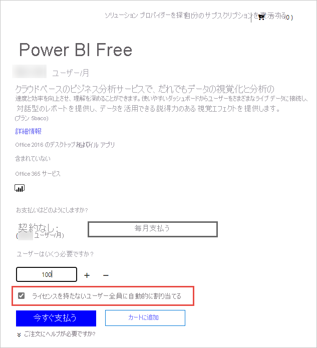

# 組織のユーザーに Power BI サービスのライセンスを与える

Power BI サービスでユーザーが実行できる操作は、そのユーザーが持っているユーザーごとのライセンスの種類によって異なります。 そのライセンスによって提供されるアクセスのレベルは、アクセスされているワークスペースが Premium ワークスペース内にあるかどうかによって異なります。 Power BI サービスのすべてのユーザーにライセンスが必要です。

ユーザーがライセンスを取得する方法は 2 つあります。 ユーザーは、セルフサービス サインアップ機能と職場または学校アカウントを使用して、独自の無料、Pro、または Premium Per User ライセンスを取得できます。 または、管理者が Power BI ライセンス サブスクリプションを取得し、ユーザーにライセンスを割り当てることができます。

この記事では、管理者の観点からのサービスの購入と、ユーザーごとのライセンスについて重点的に説明します。 ユーザーがライセンスを取得する方法の詳細については、「[個人として Power BI にサインアップする](../fundamentals/service-self-service-signup-for-power-bi.md)」を参照してください。

## ライセンスを購入して割り当てることができるユーザー

組織のライセンスを購入または割り当てるには、管理者ロールが割り当てられている必要があります。 管理者ロールは、Azure Active Directory 管理センターまたは Microsoft 365 管理センターを使用して割り当てられます。 次の表に、購入とライセンスに関連するタスクを実行するために必要なロールを示します。 Azure Active Directory での管理者ロールの詳細については、「[Azure Active Directory で管理者ロールを表示して割り当てる](/azure/active-directory/users-groups-roles/directory-manage-roles-portal)」を参照してください。 ベスト プラクティスなど、Microsoft 365 での管理者ロールの詳細については、「[管理者ロールについて」](/microsoft-365/admin/add-users/about-admin-roles)を参照してください。

| サービスとライセンスを購入できるユーザー | ユーザー ライセンスを管理できるユーザー |
| --------------- | --------------- |
| 課金管理者 | ライセンス管理者 |
| 全体管理者 | ユーザー管理者 |
|  | 全体管理者 |

これらのロールでは組織を管理します。 Power BI サービス管理者のロールについては、「[Power BI サービス管理者ロールについて](service-admin-role.md)」を参照してください。

## 組織の Power BI を取得する

価格の詳細については、「[価格と製品の比較](https://powerbi.microsoft.com/pricing/)」を参照してください。

グローバル管理者または課金管理者は、Power BI サービスにサインアップし、組織内のユーザーのライセンスを購入できます。 購入する準備ができていない場合は、Power BI Pro 試用版を選択してください。 25 個のライセンスを取得して、1 か月間ご利用いただけます。 サインアップの詳しい手順ついては、「[組織の Power BI サブスクリプションを取得する](service-admin-org-subscription.md)」を参照してください。

## セルフサービス サインアップについて

個々のユーザーは、職場または学校のアカウントでサインアップすることで、自分の Power BI ライセンスを取得できます。 無料ライセンスの場合、ユーザーはマイ ワークスペースを使用して Power BI の個人データの分析と視覚化を試すことができますが、他のユーザーと共有することはできません。 コンテンツを共有するには、Power BI Pro または Power BI Premium Per User ライセンスが必要です。 Power BI Premium サブスクリプションによって、Premium でしかアクセスできない、さまざまな機能やコンテンツの種類へのアクセスがロック解除されます。 Premium Per User ライセンスによって、これらの機能へのアクセスが、Premium Per User ライセンスを持っている他のユーザーに制限されます。 容量ベースの Premium サブスクリプションの場合、無料ライセンスを持つユーザーは任意のコンテンツにアクセスできますが、コンテンツを作成できるのは Pro または Premium Per User ライセンスを持つユーザーだけです。 ユーザーは、ライセンスの種類を Pro にアップグレードすることができます。また、組織で商用クラウドを使用している場合は、直接 Pro にサインアップすることができます。 Azure Government、Azure Germany、または Azure China 21Vianet クラウドにデプロイされた組織や教育機関では、Pro を直接購入したり、Pro にアップグレードしたりすることはできません。

組織内のユーザーがセルフサービス サインアップを使用できないようにする場合は、[セルフサービス サインアップの有効化または無効化](service-admin-disable-self-service.md)に関する記事を参照し、これをオフにする方法を確認してください。

セルフサービス サインアップを無効にすると、ユーザーはデータの視覚化と分析のために Power BI を探索できなくなります。 個々のサインアップをブロックする場合、組織用に Power BI Free ライセンスを取得して、すべてのユーザーに割り当てることができます。 Power BI Free ライセンスをすべての既存のユーザーに自動的に割り当てるには、次の手順を実行します。

1. グローバル管理者または課金管理者の資格情報を使用して、[Microsoft 365 管理センター](https://admin.microsoft.com)にサインインします。
1. 左側のサイドバー メニューから、 **[課金]**  >  **[サービスを購入する]** を選択します。
1. 検索またはスクロールして Power BI Free オファーを見つけます。 オファーを選択し、 **[はじめましょう]** を選択します。
1. すべてのユーザーに対応するために必要なライセンスの数を入力します。
1. **[ライセンスを持たないユーザー全員に自動的に割り当てる]** を選択し、チェックアウトします。

  

組織内のどのユーザーが既にライセンスを所有している可能性があるかを確認する場合は、「[ユーザー ライセンスを表示および管理する](service-admin-manage-licenses.md)」を参照し、その方法を確認してください。

## ライセンスの種類と機能

Power BI のユーザーごとのライセンスには、無料、Pro、Premium Per User の 3 種類があります。 ユーザーに必要なライセンスの種類は、コンテンツの格納場所、そのコンテンツとのやりとりの方法、そのコンテンツに Premium 機能を使用するかどうかによって決まります。 コンテンツを格納できる場所は、組織の[サブスクリプション ライセンスの種類](#subscription-license-types)によって決定されます。

組織のサブスクリプションの 1 つの種類である [Power BI Premium](service-admin-premium-purchase.md) は、容量ベースのライセンスです。 Premium を使用すると、無料ライセンスを持つユーザーは、Premium 容量に割り当てられているワークスペース内のコンテンツを操作できます。 Premium 容量以外では、無料ライセンスを持つユーザーは、**マイ ワークスペース** 内でデータに接続したり、レポートやダッシュボードを作成したりするためにのみ Power BI サービスを使用できます。 他のユーザーとコンテンツを共有したり、他のワークスペースにコンテンツを発行したりすることはできません。 ワークスペースの種類の詳細については、「[ワークスペースの種類](../consumer/end-user-workspaces.md#types-of-workspaces)」をご覧ください。

ユーザーごとの無料および Pro ライセンスのみを持つ Power BI 組織では、制限された共有容量を使用してコンテンツを処理します。 コンテンツがその共有容量に格納されている場合、Power BI Pro ライセンスが割り当てられているユーザーは、他の Power BI Pro ユーザーとのみ共同作業できます。 他のユーザーが共有しているコンテンツの利用、アプリ ワークスペースへのコンテンツの発行、ダッシュボードの共有、ダッシュボードとレポートのサブスクライブを行うことができます。  ワークスペースが Premium 容量にある場合、Pro ユーザーは、Power BI Pro ライセンスを持っていないユーザーにコンテンツを配布できます。

Premium Per User ライセンスが割り当てられているユーザーによって作成されたコンテンツは、そのコンテンツが Premium 容量でホストされたワークスペースに明確に配置されていない限り、Premium Per User ライセンスを持つ他のユーザーとのみ共有できます。 以下の表は、各ライセンスの種類の基本的な機能をまとめたものです。 ライセンスの種類ごとの利用可能な機能の詳細については、「[ライセンスの種類別の機能](../fundamentals/service-features-license-type.md)」を参照してください。

| ライセンスの種類 | ワークスペースが共有容量にある場合の機能 | ワークスペースが Premium 容量にある場合のその他の機能 |
| --------- | ----------- | ----------- |
| Power BI (無料) | マイ ワークスペースのコンテンツにアクセスする | 共有されているコンテンツを使用する |
| Power BI Pro | 他のワークスペースへのコンテンツの発行、ダッシュボードの共有、ダッシュボードとレポートのサブスクライブ、Pro ライセンスを持つユーザーとの共有を行う | 無料ライセンスを持つユーザーにコンテンツを配布する |
| Power BI Premium Per User | 他のワークスペースへのコンテンツの発行、ダッシュボードの共有、ダッシュボードとレポートのサブスクライブ、Premium Per User ライセンスを持つユーザーとの共有を行う | 無料および Pro ライセンスを持つユーザーにコンテンツを配布する |

## サブスクリプション ライセンスの種類

Microsoft からのユーザー ベースの商用ライセンスはすべて、Azure Active Directory の ID に基づいています。 Power BI サービスを使用するには、商用ライセンス向けに Azure Active Directory でサポートされている ID を使用してサインインする必要があります。 ID サービスに Azure Active Directory が使用されている任意の Microsoft ライセンスに Power BI を追加することができます。 Office 365 E5 など、一部のライセンスには Power BI Pro ライセンスが含まれているため、Power BI に対して個別のサインアップを行う必要はありません。

組織向けの Power BI サブスクリプション ライセンスには、Standard と Premium の 2 種類があります。

標準のセルフサービス Power BI サブスクリプションでは、管理者がユーザーごとのライセンスを割り当てます。 Power BI Pro ライセンスについては、ユーザーごとの月額料金が発生します。 このライセンスの種類では、コラボレーション、発行、共有、およびアドホック分析が可能になります。 コンテンツは、Microsoft によって完全に管理されている共有ストレージ容量に保存されます。

Power BI Premium サブスクリプション ライセンスによって、組織に 1 つの容量が割り当てられます。 エンタープライズ BI、ビッグ データ分析、クラウドおよびオンプレミスのレポートに適しており、Premium では高度な管理とデプロイ制御が提供されます。 専用のコンピューティング リソースとストレージ リソースは、組織内の容量管理者によって管理されます。 この専用環境については、月額料金が発生します。 他の Premium の利点に加え、Premium 容量に格納されているコンテンツは、Power BI Pro ライセンスを持っていないユーザーがアクセスでき、それらのユーザーに配布することができます。 Premium を使用するには、少なくとも 1 人のユーザーに Power BI Pro ライセンスが割り当てられている必要があります。また、コンテンツ作成者と開発者には引き続き Power BI Pro ライセンスが必要です。

2 種類のサブスクリプションは相互に排他的ではありません。 Power BI Premium と Standard の両方を持つことができます。 この構成では、Premium 容量に格納されているコンテンツをすべてのユーザーと共有でき、共有容量も利用できます。 容量の制限については、「[Power BI ワークスペースでデータ ストレージを管理する](service-admin-manage-your-data-storage-in-power-bi.md)」を参照してください。

>[!NOTE]
>Power BI に Power BI Premium Gen2 がプレビュー オファリングとして導入されました。次の改善によって Power BI Premium のエクスペリエンスが向上しています。
>* パフォーマンス
>* ユーザーごとのライセンス。 詳細については、[Premium Per User の FAQ](service-premium-per-user-faq.md) を参照してください。
>* より大きなスケール
>* メトリックの改善
>* 自動スケール
>* 管理オーバーヘッドの削減
>
>Power BI Premium Gen2 の詳細については、[Power BI Premium Generation 2 (プレビュー)](service-premium-what-is.md#power-bi-premium-generation-2-preview) に関する記事を参照してください。
>

製品の機能と価格を比較する場合は、「[Power BI の価格](https://powerbi.microsoft.com/pricing)」を参照してください。

## ゲスト ユーザー アクセス

組織外のユーザーにコンテンツを配布することができます。 コンテンツをゲストとして表示するために招待することにより、外部ユーザーとコンテンツを共有することができます。 Azure Active Directory Business-to-Business (Azure AD B2B) を使用すると、外部のゲスト ユーザーと共有できます。 外部ユーザーと共有するには、次の前提条件を満たす必要があります。

- 外部ユーザーとコンテンツを共有する機能を有効にする必要があります

- ゲスト ユーザーは、共有コンテンツを表示するために適切なライセンスを取得している必要があります

ゲスト ユーザー アクセスの詳細については、「[Azure AD B2B で外部ゲスト ユーザーに Power BI コンテンツを配布する](service-admin-azure-ad-b2b.md)」を参照してください。

## Power BI Pro ライセンスを購入する

管理者として、Microsoft 365 または Microsoft パートナーを通じて Power BI Pro ライセンスを購入します。 ライセンスを購入した後、それを個々のユーザーに割り当てます。 詳細については、「[Power BI Pro のライセンスを購入して割り当てる](service-admin-purchasing-power-bi-pro.md)」を参照してください。

### Power BI Pro ライセンスの有効期限切れ

Power BI Pro ライセンスの有効期限切れ後には猶予期間があります。 ライセンスがボリューム ライセンス契約の一部である場合、猶予期間は 90 日です。 ライセンスを直接購入した場合、猶予期間は 30 日です。

Power BI Pro のライセンス ライフサイクルは Microsoft 365 と同じです。 詳細については、[一般法人向け Microsoft 365 のサブスクリプションが終了したときにデータとアクセスはどうなるか](/microsoft-365/commerce/subscriptions/what-if-my-subscription-expires)に関する記事をご覧ください。

## 次の手順

- [Power BI Pro のライセンスを購入して割り当てる](service-admin-purchasing-power-bi-pro.md)
- [ビジネス サブスクリプションと課金ドキュメント](/microsoft-365/commerce/)
- [サインインした Power BI ユーザーを見つける](service-admin-access-usage.md)
- 他にわからないことがある場合は、 [Power BI コミュニティで質問してみてください](https://community.powerbi.com/)。

