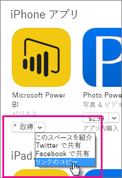
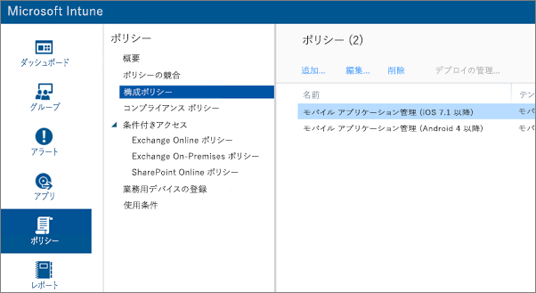
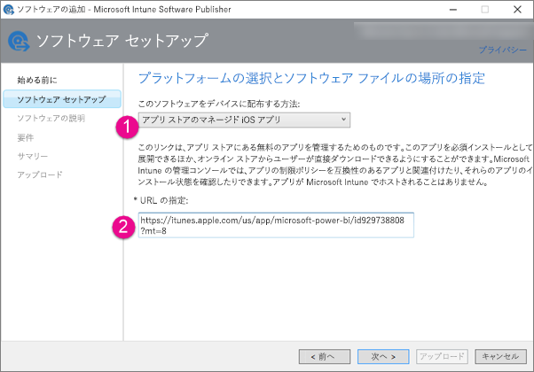
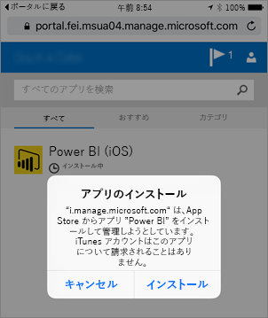
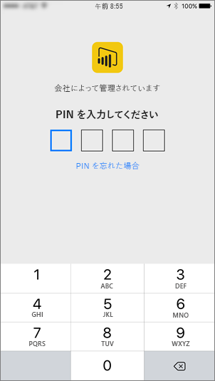

# Microsoft Intune でモバイル アプリを構成する

Microsoft Intune を使うと、組織でデバイスとアプリケーションを管理できます。 iOS および Android 用の Power BI モバイル アプリケーションは、Intune と統合されます。 この統合により、デバイス上のアプリケーションを管理し、セキュリティを制御することができます。 構成ポリシーを利用すると、アクセス PIN の要求、アプリケーションによるデータの処理方法、アプリが使用されていないときのアプリケーション データの暗号化といったことを制御できます。

## 全般的なモバイル デバイス管理の構成

この記事では、Intune が適切に構成されていることと、Intune に登録したデバイスがあることを想定しています。 この記事は、Microsoft Intune の構成に関する完全なガイドではありません。 Intune について詳しくは、「[Intune とは何か](/intune/introduction-intune/)」をご覧ください。

Microsoft Intune は、Microsoft 365 内でモバイル デバイス管理 (MDM) と共存できます。 MDM を使用している場合、デバイスは MDM に登録されているように表示されますが、Intune でも管理できます。

> [!NOTE]
> Intune を構成した後は、iOS または Android デバイス上の Power BI モバイル アプリに対するバックグラウンド データ更新はオフになります。 アプリに移動すると、Web 上の Power BI サービスからデータが更新されます。

## 手順 1:アプリケーションの URL を取得する

Intune 内でアプリケーションを作成する前に、アプリの URL を取得する必要があります。 iOS の場合は、iTunes から取得します。 Android の場合は、Power BI モバイル ページから取得します。

アプリケーションを作成するときに必要になりますので、URL を保存しておいてください。

### iOS の URL を取得する

iOS 用のアプリ URL は、iTunes から取得する必要があります。

1. iTunes を開きます。

1. *Power BI*を検索します。

1. **Microsoft Power BI** は、 **[iPhone App]** の下と、 **[iPad App]** の下に表示されるはずです。 どちらを使っても、同じ URL を取得できます。

1. **[入手]** ドロップダウンを選び、 **[リンクをコピー]** を選びます。

    

次に表示例を示します。 *https://itunes.apple.com/us/app/microsoft-power-bi/id929738808?mt=8*

### Android の URL を取得する

Google Play への URL は、[Power BI モバイル ページ](https://powerbi.microsoft.com/mobile/)から取得できます。 **[ダウンロード元 Google Play]** を選択すると、アプリのページに移動します。 ブラウザーのアドレス バーから URL をコピーすることができます。 次に表示例を示します。 *https://play.google.com/store/apps/details?id=com.microsoft.powerbim*

## 手順 2:モバイル アプリケーション管理ポリシーを作成する

モバイル アプリケーション管理ポリシーを利用すると、アクセスの暗証番号 (PIN) のようなアイテムを施行できます。 これは、Intune ポータル内で作成することができます。

アプリケーションを先に作成しても、ポリシーを先に作成しても構いません。 この 2 つを追加する順序は任意です。 展開の手順の際に両方が存在していれば十分です。

1. Intune ポータルで、 **[ポリシー]**  >  **[構成ポリシー]** を選択します。

    

1. **[追加]** を選択します。

1. **[ソフトウェア]** の下で、Android または iOS のいずれかのモバイル アプリケーション管理を選びます。 まず手始めに **[推奨設定を使用してポリシーを作成する]** を選ぶことも、カスタム ポリシーを作成することもできます。

1. ポリシーを編集して、アプリケーションに必要な制限を設定します。

## 手順 3:アプリケーションを作成する

アプリケーションは、展開のために Intune に保存される参照、またはパッケージです。 アプリケーションを作成し、先ほど Google Play または iTunes から入手したアプリの URL を参照する必要があります。

アプリケーションを先に作成しても、ポリシーを先に作成しても構いません。 この 2 つを追加する順序は任意です。 展開の手順の際に両方が存在していれば十分です。

1. Intune ポータルに移動し、左側のメニューから **[アプリ]** を選びます。

1. **[アプリの追加]** を選びます。 **[ソフトウェアの追加]** アプリケーションが起動します。

### iOS 用に作成する

1. ドロップダウンから、 **[アプリ ストアの管理されている iOS アプリ]** を選びます。

1. [手順 1](#step-1-get-the-url-for-the-application) で取得したアプリの URL を入力し、 **[次へ]** を選択します。

    

1. **[発行元]** 、 **[名前]** 、 **[説明]** を入力します。 必要に応じて **[アイコン]** を提供することもできます。 **[カテゴリ]** は、"ポータル サイト アプリ" にします。 完了したら、 **[次へ]** を選びます。

1. アプリの発行の種類を、 **[任意]** (既定値)、 **[iPad]** 、または **[iPhone]** の中から選びます。 既定では **[任意]** が表示され、どちらの種類のデバイスでも機能するようになります。 Power BI アプリの URL は、iPhone と iPad のどちらでも同じです。 **[次へ]** を選択します。

1. **[アップロード]** を選択します。

1. 一覧にアプリが表示されない場合は、ページを更新します。 **[概要]** に移動してから、 **[アプリ]** に戻ります。

    ![[アプリ] タブ](media/service-admin-mobile-intune/intune-add-software-ios2.png)

### Android 用に作成する

1. ドロップダウンから **[外部リンク]** を選びます。

1. [手順 1](#step-1-get-the-url-for-the-application) で取得したアプリの URL を入力し、 **[次へ]** を選択します。

    

1. **[発行元]** 、 **[名前]** 、 **[説明]** を入力します。 必要に応じて **[アイコン]** を提供することもできます。 **[カテゴリ]** は、"ポータル サイト アプリ" にします。 完了したら、 **[次へ]** を選びます。

1. **[アップロード]** を選択します。

1. 一覧にアプリが表示されない場合は、ページを更新します。 **[概要]** に移動してから、 **[アプリ]** に戻ります。

    ![[アプリ] タブ](media/service-admin-mobile-intune/intune-add-software-android2.png)

## 手順 4:アプリケーションを展開する

アプリケーションを追加した後は、それを展開して、エンドユーザーが入手できるようにする必要があります。 この手順で、先ほど作成したポリシーをアプリにバインドします。

### iOS 用の展開する

1. [アプリ] 画面で、作成したアプリを選びます。 次に、 **[展開の管理...]** リンクを選びます。

    

1. **[グループの選択]** 画面で、このアプリの展開先にするグループを選びます。 **[次へ]** を選択します。

1. **[展開アクション]** 画面で、このアプリを展開する方法を選びます。 **[利用可能なインストール]** または **[必須のインストール]** を選ぶと、ポータル サイトからユーザーが必要に応じてアプリをインストールできるようになります。 選び終えたら、 **[次へ]** を選びます。

    

1. **[モバイル アプリの管理]** 画面で、先ほど[手順 2](#step-2-create-a-mobile-application-management-policy) で作成したモバイル アプリの管理ポリシーを選びます。 作成したものが使用可能な唯一の iOS ポリシーの場合は、そのポリシーが既定値になります。 **[次へ]** を選択します。

    

1. **[VPN プロファイル]** 画面で、組織にポリシーがある場合は、1 つ選択できます。 既定値は **[なし]** です。 **[次へ]** を選択します。

1. **[モバイル アプリの構成]** 画面で、 **[アプリの構成ポリシー]** を選びます (作成してある場合)。 既定値は **[なし]** です。 これは必須ではありません。 **[完了]** を選択します。

アプリを展開した後は、アプリのページで展開済みが **[はい]** と表示されるはずです。

### Android 用に展開する

1. [アプリ] 画面で、作成したアプリを選びます。 次に、 **[展開の管理...]** リンクを選びます。

    
1. **[グループの選択]** 画面で、このアプリの展開先にするグループを選びます。 **[次へ]** を選択します。

1. **[展開アクション]** 画面で、このアプリを展開する方法を選びます。 **[利用可能なインストール]** または **[必須のインストール]** を選ぶと、ポータル サイトからユーザーが必要に応じてアプリをインストールできるようになります。 選び終えたら、 **[次へ]** を選びます。

    

1. **[モバイル アプリの管理]** 画面で、先ほど[手順 2](#step-2-create-a-mobile-application-management-policy) で作成したモバイル アプリの管理ポリシーを選びます。 作成したものが使用可能な唯一の Android ポリシーの場合は、そのポリシーが既定値になります。 **[完了]** を選択します。

    

アプリを展開した後は、アプリのページで展開済みが **[はい]** と表示されるはずです。

## 手順 5:アプリケーションをデバイスにインストールする

アプリケーションは、*Intune ポータル サイト* アプリを使用してインストールします。 ポータル サイト アプリをまだインストールしていない場合は、iOS プラットフォームまたは Android プラットフォームのどちらかでアプリケーション ストアを介して入手できます。 ポータル サイトには、組織のログインを使ってサインインします。

1. ポータル サイト アプリを開きます。

1. おすすめアプリに Power BI アプリが表示されていない場合は、 **[会社のアプリ]** を選びます。

    

1. 展開した Power BI アプリを選びます。

    

1. **[インストール]** を選択します。

    

1. iOS の場合は、アプリがプッシュ通知されます。 プッシュ通知ダイアログで **[インストール]** を選びます。

    

1. アプリをインストールした後は、 **[会社によって管理されています]** と表示されます。 ポリシーで暗証番号 (PIN) を設定した場合は、次のように表示されます。

    

## 次のステップ

[Microsoft Intune コンソールでモバイル アプリケーション管理ポリシーを構成して展開する](/intune/app-protection-policies/)  

[モバイル デバイス用 Power BI アプリ](../consumer/mobile/mobile-apps-for-mobile-devices.md)  

その他の質問 [Power BI コミュニティで質問してみてください](https://community.powerbi.com/)。  
