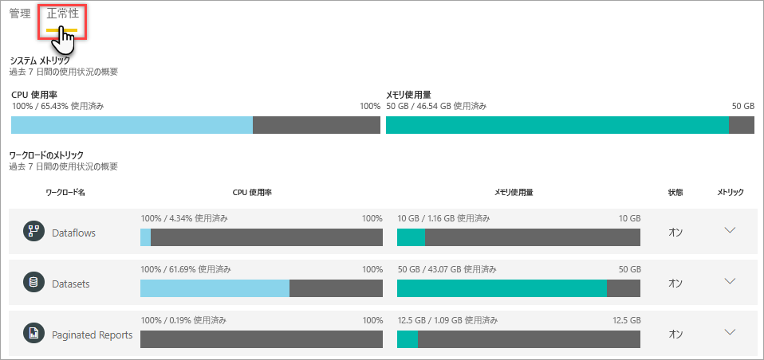

# 管理ポータルで容量を監視する

管理ポータルの **[容量の設定]** 領域の **[正常性]** タブには、容量と有効なワークロードについてのメトリックのサマリーが表示されます。  

より包括的なメトリックが必要な場合は、[Power BI Premium 容量メトリック](service-admin-premium-monitor-capacity.md) アプリを使用してください。 このアプリは、ドリルダウンとフィルタリング機能を備えているほか、容量のパフォーマンスに影響するほぼすべての側面について、きわめて詳細なメトリックを提供します。 詳細については、「[アプリで Premium 容量を監視する](service-admin-premium-monitor-capacity.md)」を参照してください。

> [!IMPORTANT]
> Power BI Premium 容量のリソース使用率が高いために、パフォーマンスや信頼性の問題が発生している場合は、通知メールを受信して問題を特定し、解決することができます。 これは、過負荷容量のトラブルシューティングを行うための合理的な方法である可能性があります。 詳細については、「[容量と信頼性に関する通知](service-interruption-notifications.md#capacity-and-reliability-notifications)」を参照してください。

## システム メトリック

**[正常性]** タブの最上位では、容量の最重要メトリックである CPU 使用率とメモリ使用量をひとめで把握できます。 これらのメトリックは、有効なすべてのワークロードを含む容量の累積値です。

| **メトリック** | **説明** |
| --- | --- |
| CPU 使用率 | CPU の平均使用率が、使用可能な合計 CPU に対する割合として示されます。 |
| メモリ使用量 | 平均メモリ使用量がギガバイト (GB) 単位で示されます。|

## ワークロードのメトリック

容量に対して有効な各ワークロードについて、 CPU 使用率とメモリ使用量が表示されます。

| **メトリック** | **説明** |
| --- | --- |
| CPU 使用率 | CPU の平均使用率が、使用可能な合計 CPU に対する割合として示されます。 |
| メモリ使用量 | 平均メモリ使用量がギガバイト (GB) 単位で示されます。|

### 詳細なワークロードのメトリック

それぞれのワークロードには、さらなるメトリックが存在します。 表示されるメトリックの種類は、ワークロードによって異なります。 ワークロードの詳細なメトリックを表示するには、展開矢印 (下矢印) をクリックします。

#### データフロー

##### データフロー操作

| **メトリック** | **説明** |
| --- | --- |
| 合計数 | 各データフローの合計更新数です。 |
| 成功数 | データフローごとの成功した合計更新数です。|
| 平均実行時間 (分) | データフローの更新の平均実行時間 (分) |
| 最大実行時間 (分) | データフローの最も時間のかかった更新の実行時間です (分)。 |
| 平均待機時間 (分) | データフローの更新のスケジュールされた時間と開始の間の平均ラグです (分)。 |
| 最大待機時間 (分) | データフローの最大待機時間です (分)。  |

#### データセット

##### 更新

| **メトリック** | **説明** |
| --- | --- |
| 合計数 | 各データセットの合計更新数です。 |
| 成功数 | データセットごとの成功した合計更新数です。 |
| 失敗数 | データセットごとの失敗した合計更新数です。 |
| 成功率  | 成功した更新数を合計更新数で割った値です。 信頼性の尺度となります。 |
| 平均実行時間 (分) | データセットの更新の平均実行時間です (分)。  |
| 最大実行時間 (分) | 最も時間のかかったデータセットの更新の実行時間です (分)。 |
| 平均待機時間 (分) | データセットの更新のスケジュールされた時間と開始の間の平均ラグです (分)。 |
| 最大待機時間 (分) | データセットの最大待機時間です (分)。 |

##### クエリ

| **メトリック** | **説明** |
| --- | --- |
| 合計数 | データセットに対して実行されたクエリの合計数です。 |
| 平均実行時間 (ミリ秒) |データセットの平均クエリ時間 (ミリ秒)|
| 最大実行時間 (ミリ秒) |データセット内で最も時間のかかったクエリの実行時間です (ミリ秒)。 |
| 平均待機時間 (ミリ秒) |データセットのクエリの平均待機時間です (ミリ秒)。 |
| 最大待機時間 (ミリ秒) |データセット内のクエリの最も長い待機時間です (ミリ秒)。 |

##### 削除

| **メトリック** | **説明** |
| --- | --- |
| モデル数 | この容量のデータセットの削除の合計数です。 容量でメモリ不足が発生した場合は、ノードでメモリから 1 つまたは複数のデータセットが削除されます。 非アクティブなデータセット (現在、実行している操作のクエリ/更新なし) が最初に削除されます。 次に、削除の順序は、'最も長く使われていない' (LRU) のメジャーに基づいています。 |

#### ページ分割されたレポート

##### レポートの実行

| **メトリック** | **説明** |
| --- | --- |
| 実行回数  | レポートがユーザーによって実行されて閲覧された回数です。|

##### レポートの使用状況

| **メトリック** | **説明** |
| --- | --- |
| 成功数 | レポートがユーザーによって閲覧された回数です。 |
| 失敗数 |レポートがユーザーによって閲覧された回数です。|
| 行数 |レポート内のデータ行の数です。 |
| データ取得時間 (ミリ秒) |レポートのデータの取得にかかる平均時間 (ミリ秒)。 この時間が長い場合は、低速クエリまたはデータ ソースのその他の問題を示している可能性があります。  |
| 処理時間 (ミリ秒) |レポートのデータの処理にかかった平均時間 (ミリ秒) です。 |
| レンダリング時間 (ミリ秒) |ブラウザーでのレポートのレンダリングにかかった平均時間 (ミリ秒) です。 |

> [!NOTE]
> **AI** ワークロードの詳細なメトリックは、まだご利用いただけません。

## 次の手順

Power BI Premium 容量を監視する方法について学習したので、容量の最適化について学習します。

> [!div class="nextstepaction"]
> [Power BI Premium の容量の最適化](service-premium-capacity-optimize.md)
