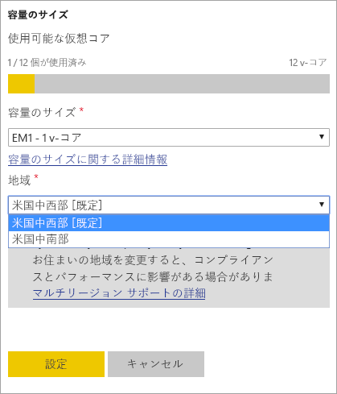
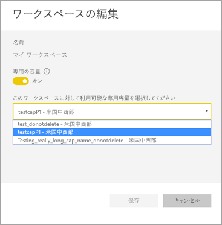
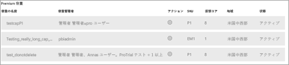

# Power BI Premium の Multi-Geo のサポートを構成する

Multi-Geo は、多国籍企業のお客様が、リージョン、業界固有、または組織のデータの配置場所に関する要件に対応するために役立つ Power BI Premium の機能です。 Power BI Premium をご利用の場合、Power BI テナントのホーム リージョン以外のリージョンにあるデータセンターにコンテンツを展開できます。 geo (地域) には、複数のリージョンが含まれる可能性があります。 たとえば、米国は geo であり、米国中西部と米国中南部は米国のリージョンです。 [Azure 地域のマップ](https://azure.microsoft.com/global-infrastructure/geographies/)で定義されている地域 (geo) のいずれかにコンテンツを展開できます。

ソブリン クラウドでは、そのクラウド内の各リージョンにまたがる複数の geo がサポートされています。

> [!NOTE]
> 現在、中国北部では Premium Gen2 容量に対して複数の geo がサポートされていません。

Multi-Geo は、Power BI Embedded でも使用できるようになりました。 詳細については、「[Power BI Embedded の Multi-Geo のサポート](../developer/embedded/embedded-multi-geo.md)」をご覧ください。

> [!NOTE]
> Power BI Premium に **Premium Gen2** という名前の新しいバージョンの Premium が最近リリースされました。現在はプレビュー段階です。 Premium Gen2 を使用すると、Premium 容量の管理が簡素化され、管理オーバーヘッドが削減されます。 詳細については、[Power BI Premium Generation 2 (プレビュー)](service-premium-what-is.md#power-bi-premium-generation-2-preview) に関する記事を参照してください。

## 有効化と構成

新しい容量の場合、Multi-Geo を有効にするには、ドロップダウンから既定のリージョン以外のリージョンを選択します。  利用可能な容量ごとに、**米国中西部** など、現在配置されているリージョンが表示されます。

容量を作成すると、そのリージョン内に残り、作成されるすべてのワークスペースのコンテンツはそのリージョンに保存されます。 ワークスペースの設定画面のドロップダウンから、ワークスペースを別のリージョンに移行することができます。

変更を確認するこのメッセージが表示されます。

移行中のこの時点では、ゲートウェイの資格情報をリセットする必要はありません。  Premium の容量リージョンに保存した後は、移行時にリセットする必要があります。

移行中は、新しいデータセットの発行やスケジュールされたデータの更新など、一部の操作が失敗することがあります。  

Multi-Geo を有効にすると、次の項目は Premium リージョンに格納されます。

- インポートおよび DirectQuery データセットのモデル (.ABF ファイル)
- クエリ キャッシュ
- R イメージ

以下の項目はテナントのホーム リージョン内に残ります。

- プッシュ データセット
- Excel ブック
- ダッシュボード/レポートのメタデータ: タイル名、タイルのクエリなど
- ゲートウェイ クエリまたはスケジュールされた更新ジョブのサービス バス
- アクセス許可
- データセットの資格情報

## 容量のリージョンを表示する

管理ポータルでは、Power BI テナントのすべての容量とその現在のリージョンを確認できます。

 

## 既存のコンテンツのリージョンを変更する

既存のコンテンツのリージョンを変更する必要がある場合は、2 つの選択肢があります。

- 2 つ目の容量を作成し、ワークスペースを移行します。 無料版をご利用の場合、テナントに予備の仮想コアがある限り、ダウンタイムが発生しません。
- 2 つ目の容量を作成することを選択できない場合、一時的にコンテンツを Premium から共有容量に戻すことができます。 追加の仮想コアは必要ありませんが、無料版をご利用の場合は、ある程度のダウンタイムが発生します。

## Multi-Geo からコンテンツを移行する  

次の 2 つの方法のいずれかで Multi-Geo 容量からワークスペースを取り出すことができます。

- ワークスペースが存在する現在の容量を削除します。  その結果、ワークスペースはホーム リージョンの共有容量に戻されます。
- 個々のワークスペースを、ホーム テナントにある Premium 容量に戻します。

大規模なストレージ形式のデータセットは、それが作成されたリージョンから移動しないでください。 大規模な形式のデータセットに基づくレポートを使用すると、データセットを読み込むことができず、"*モデルを読み込むことができません*" エラーが返されます。 大規模なストレージ形式のデータセットを元のリージョンに戻し、再び使用できるようにします。

## 制限と考慮事項

- データ転送を開始する前に、リージョン間で開始されるすべての動作が、会社と政府のコンプライアンス要件をすべて満たしていることを確認してください。
- リモート リージョンに格納されているキャッシュ クエリは、保存時はそのリージョン内に残ります。 ただし、転送中の他のデータは、複数の地域間を行き来する可能性があります。
- Multi-Geo 環境でデータを別のリージョンに移行する場合、ソース データは、データが移行された元のリージョンに最大 30 日間残る可能性があります。 その間、エンド ユーザーはそのデータにアクセスできません。 30 日の期間中に、そのデータはこのリージョンから削除され、破棄されます。
- インポートされたデータ モデルのクエリ テキストとクエリ結果のトラフィックは、ホーム リージョンを通過しません。 レポートのメタデータは引き続きリモート リージョンからのものであり、特定の DNS ルーティングの状態ではリージョンからトラフィックを受け取る可能性があります。 
- [データフロー](../transform-model/dataflows/dataflows-introduction-self-service.md)の機能は、この時点では Multi-GEO でサポートされていません。
- 大規模なストレージ形式のデータセットをそれが作成されたリージョンから移動すると、レポートでデータセットを読み込めなくなります。 大規模なストレージのデータセットを使用できるようにするには元のリージョンに戻します。 

## 次のステップ

- [Power BI Premium とは](service-premium-what-is.md)
- [Power BI Embedded の容量に対する Multi-Geo](../developer/embedded/embedded-multi-geo.md)

その他の質問 [Power BI コミュニティで質問してみてください](https://community.powerbi.com/)。

Power BI に Power BI Premium Gen2 がプレビュー オファリングとして導入されました。次の改善によって Power BI Premium のエクスペリエンスが向上しています。
* パフォーマンス
* ユーザーごとのライセンス
* より大きなスケール
* メトリックの改善
* 自動スケール
* 管理オーバーヘッドの削減

Power BI Premium Gen2 の詳細については、[Power BI Premium Generation 2 (プレビュー)](service-premium-what-is.md#power-bi-premium-generation-2-preview) に関する記事を参照してください。
