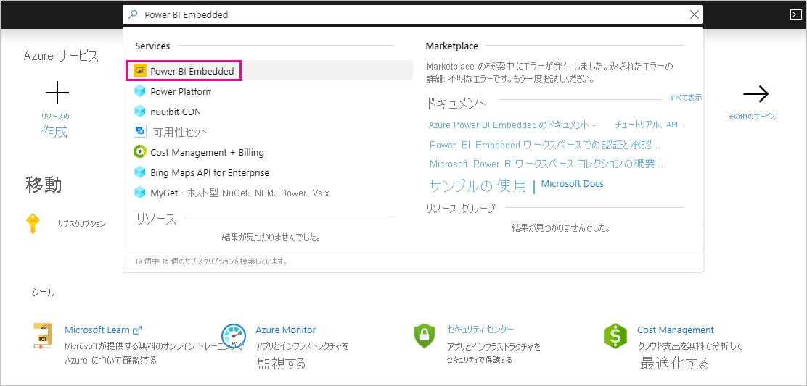
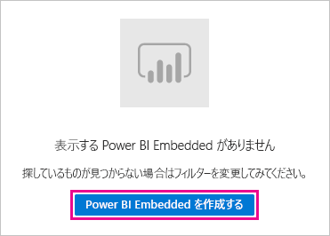
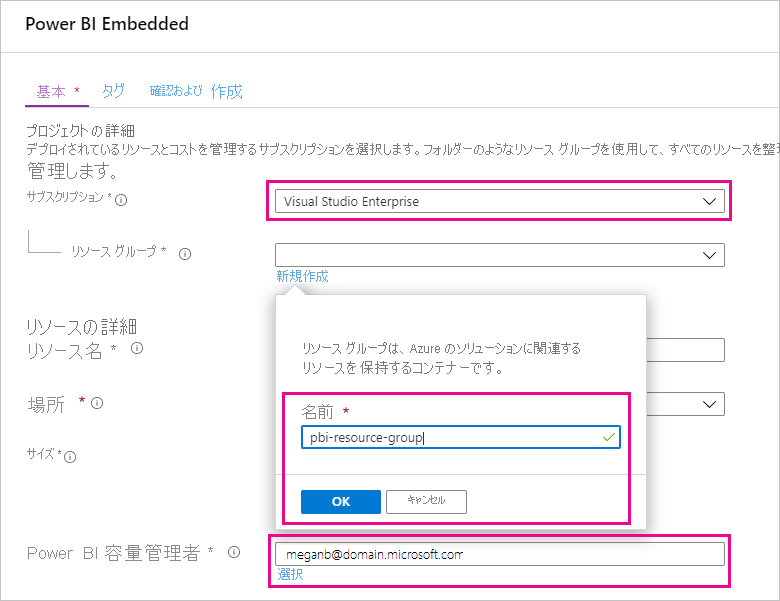
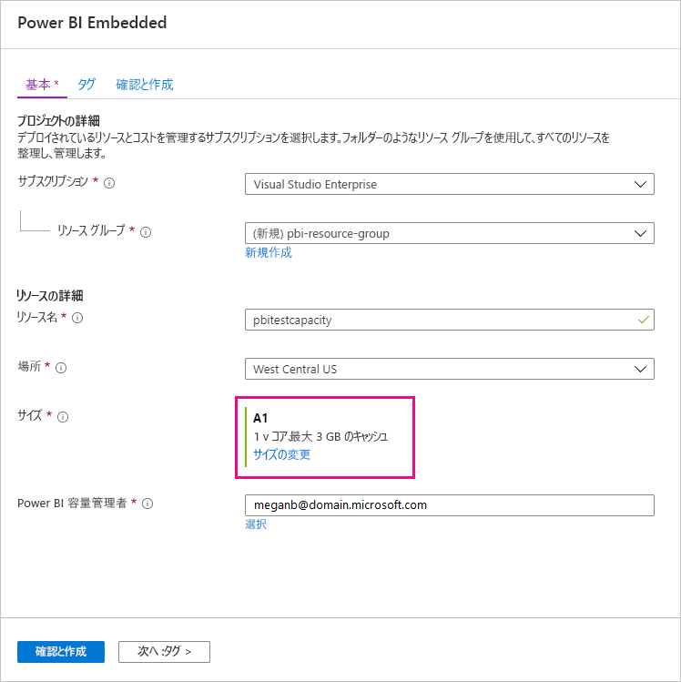
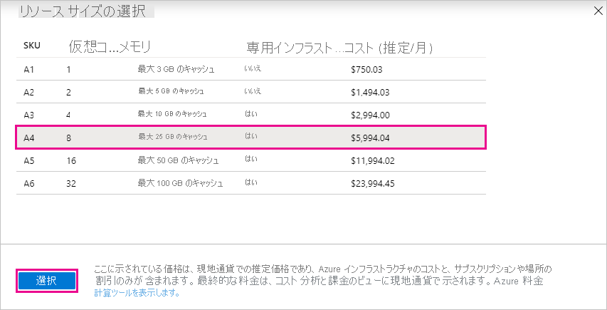
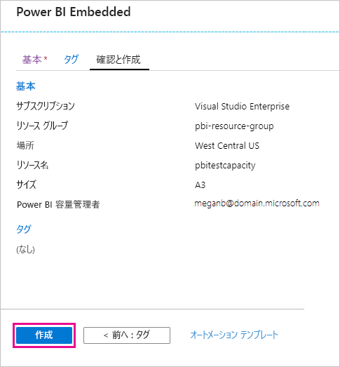
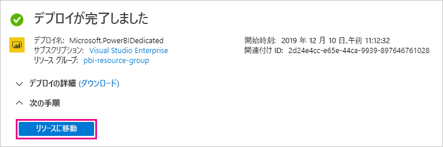
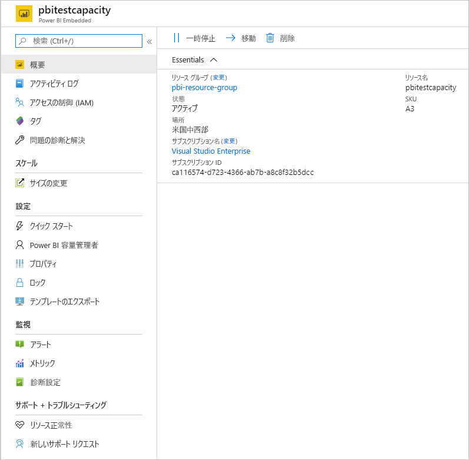

# テスト用の Power BI Premium を購入する

この記事では、テスト シナリオのために、および Power BI Premium P SKU の購入に必要な (Microsoft 365 グローバル管理者ロールまたは課金管理者ロール) のアクセス許可がない場合に、Power BI Premium A SKU を購入する方法について、 A SKU には時間のコミットメントは不要であり、課金は時間単位で行われます。 A SKU は [Azure portal](https://portal.azure.com) で購入します。

Power BI Premium の詳細については、「[Microsoft Power BI Premium とは何ですか?](service-premium-what-is.md)」を参照してください。 現在の価格と計画については、[Power BI の料金ページ](https://powerbi.microsoft.com/pricing/)および「[Power BI Premium 計算ツール](https://powerbi.microsoft.com/calculator/)」を参照してください。 ご自分の組織が Power BI Premium を使用している場合でも、コンテンツの作成者には引き続き [Power BI Pro のライセンス](service-admin-purchasing-power-bi-pro.md)が必要です。 組織で Power BI Pro ライセンスを少なくとも 1 つ購入してください。 A SKU では、コンテンツを使用する "_すべてのユーザー_" にも Pro ライセンスが必要です。

> [!NOTE]
> Premium サブスクリプションの有効期限が切れてから 30 日間は、容量への完全なアクセス権があります。 その後、コンテンツは共有された容量に戻ります。 1 GB を超えるモデルは、共有された容量ではサポートされません。

## テストおよびその他のシナリオ用に A SKU を購入する

A SKU は Azure Power BI Embedded サービスを通じて利用できます。 A SKU は、次の方法で使用できます。

- サード パーティ アプリケーションに Power BI を埋め込むことができるようにします。 詳細については、[Power BI Embedded](../developer/embedded/azure-pbie-what-is-power-bi-embedded.md) に関する記事を参照してください。

- P SKU を購入する前に、Premium 機能をテストします。

- P SKU を使用する運用環境と並行して、開発環境とテスト環境を作成します。

- Microsoft 365 のグローバル管理者ロールまたは課金管理者ロールではない場合でも、Power BI Premium を購入できます。

> [!NOTE]
> A4 以上の SKU を購入した場合、コンテンツの無制限の共有を除いたすべての Premium 機能をご利用になれます。 A SKU では、コンテンツを使用する "_すべてのユーザー_" に Pro ライセンスが必要です。

Azure portal で A SKU を購入するには、次の手順に従います。

1. Power BI の容量管理者以上のアクセス許可を持つアカウントを使用して、[Azure portal](https://portal.azure.com) にサインインします。

1. 「_Power BI Embedded_」を検索し、検索結果からサービスを選択します。

    

1. **[Create Power BI Embedded]\(Power BI Embedded を作成する\)** を選択します。

    

1. **[Power BI Embedded]** 作成画面で、次の情報を指定します。

    - Power BI Embedded サービスを作成する **[サブスクリプション]**。

    - そのサービスを含むリソース グループを作成する物理的な **[場所]**。 パフォーマンスの向上には、この場所は Power BI でお使いの Azure Active Directory テナントの近くにする必要があります。

    - 使用する既存の **[リソース グループ]**。この例のように、新規に作成することも可能です。

    - **[Power BI 容量管理者]**。 容量管理者は、ご自分の Azure AD テナントのメンバー ユーザーまたはサービス プリンシパルである必要があります。

    

1. Power BI Premium のすべての機能 (無制限の共有を除く) を使用するには、少なくとも A4 SKU が必要です。 **[サイズの変更]** を選択します。

    

1. A4、A5、または A6 の容量サイズを選択します。これは、P1、P2、および P3 に対応します。

    

1. **[確認および作成]** を選択し、選択を確認してから **[作成]** を選択します。

    

1. デプロイの完了には数分かかる場合があります。 準備ができたら、**[リソースに移動]** を選択します。

    

1. 使用していないときのサービスの一時停止など、サービスを管理するオプションを [管理] 画面で確認します。

    

容量の購入後は、[容量の管理](service-admin-premium-manage.md#manage-capacity)方法と、容量への[ワークスペースの割り当て](service-admin-premium-manage.md#assign-a-workspace-to-a-capacity)方法を学習してください。

## 次のステップ

[Power BI Premium とは](service-premium-what-is.md)
[Power BI Premium の購入方法](service-admin-premium-purchase.md)
[Power BI Premium で容量を構成および管理する](service-admin-premium-manage.md)\
[Power BI の料金ページ](https://powerbi.microsoft.com/pricing/)\
[Power BI Premium 計算ツール](https://powerbi.microsoft.com/calculator/)\
[Power BI Premium のよくあるご質問](service-premium-faq.md)\
[Power BI のエンタープライズ展開の計画に関するホワイト ペーパー](https://aka.ms/pbienterprisedeploy)

他にわからないことがある場合は、 [Power BI コミュニティで質問してみてください](https://community.powerbi.com/)。
