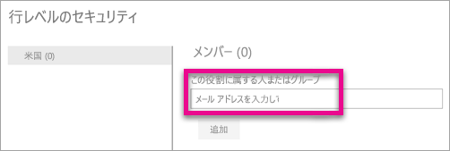
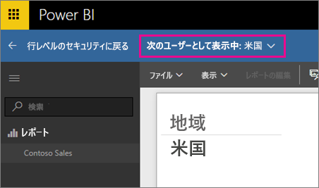

# Power BI での行レベルのセキュリティ (RLS)

Power BI で行レベル セキュリティ (RLS) を使用すると、特定のユーザーのデータ アクセスを制限できます。 フィルターでは行レベルでデータ アクセスが制限され、ロール内でフィルターを定義することができます。 Power BI サービスでは、ワークスペースのメンバーがそのワークスペース内のデータセットにアクセスすることができます。 RLS では、このデータ アクセスは制限されません。

Power BI Desktop で Power BI にインポートされたデータ モデルの RLS を構成できます。 SQL Server などの DirectQuery を使用しているデータセットに RLS を構成することもできます。 Analysis Services または Azure Analysis Services のライブ接続では、Power BI Desktop 内ではなく、モデル内の行レベルのセキュリティを構成します。 このセキュリティ オプションは、ライブ接続データセットには表示されません。

[!INCLUDE [include-short-name](../includes/rls-desktop-define-roles.md)]

既定では、リレーションシップが一方向と双方向のいずれに設定されているかに関係なく、行レベルのセキュリティ フィルターで一方向のフィルターが使用されます。 行レベルのセキュリティで双方向のクロス フィルターを手動で有効にすることができます。その場合は、リレーションシップを選択して、 **[両方向にセキュリティ フィルターを適用する]** チェック ボックスをオンにします。 サーバー レベルで、動的な行レベルのセキュリティも実装した場合 (行レベルのセキュリティはユーザー名またはログイン ID に基づく) は、このオプションをオンにします。

詳細については、「[Power BI Desktop での DirectQuery を使用する双方向のクロス フィルタリング](../transform-model/desktop-bidirectional-filtering.md)」と「[表形式の BI セマンティック モデルの保護](https://download.microsoft.com/download/D/2/0/D20E1C5F-72EA-4505-9F26-FEF9550EFD44/Securing%20the%20Tabular%20BI%20Semantic%20Model.docx)」の技術記事を参照してください。

[!INCLUDE [include-short-name](../includes/rls-desktop-view-as-roles.md)]

## モデルのセキュリティの管理

データ モデルのセキュリティを管理するには、次の手順を実行します。

1. Power BI サービスで、データセットの **[その他のオプション]** メニューを選択します。 このメニューは、ナビゲーション メニューまたはワークスペース ページのどちらから選択した場合でも、データセット名にカーソルを合わせると表示されます。

    ![ワークスペースの [その他のオプション] メニュー](media/service-admin-rls/dataset-leftnav-more-options.png)

    ![ナビゲーション メニューの [その他のオプション] メニュー](media/service-admin-rls/dataset-canvas-more-options.png)

1. **[セキュリティ]** を選択します。

   ![[その他のオプション] メニューから [セキュリティ] を選択する](media/service-admin-rls/dataset-more-options-menu.png)

[セキュリティ] を選択すると、移動先の RLS ページで、Power BI Desktop で作成したロールにメンバーを追加できます。 [セキュリティ] は、データセットの所有者のみに表示されます。 データセットがグループ内にある場合、セキュリティ オプションは、グループの管理者だけに表示されます。

Power BI Desktop 内でのみ、役割を作成または変更できます。

## メンバーの操作

### メンバーの追加

ロールにメンバーを追加するには、ユーザーまたはセキュリティ グループのメール アドレスまたは名前を入力します。 Power BI で作成されたグループを追加することはできません。 [組織外部の](../guidance/whitepaper-azure-b2b-power-bi.md#data-security-for-external-partners)メンバーを追加できます。

ロール名または [メンバー] の横のかっこ内の数字は、そのロールに属しているメンバーの数を示します。

### メンバーの削除

メンバーを削除するには、メンバー名の横の [X] を選択します。 

## Power BI サービス内でのロールの検証

役割をテストすることで、定義した役割が正しく動作することを検証することができます。

1. ロールの横にある**その他のオプション** (...) を選択します。
2. **[ロールとしてデータをテスト]** を選択します。

このロールで使用できるレポートが表示されます。 ダッシュボードは、このビューには表示されません。 ページ ヘッダーには、適用されているロールが表示されます。

**[次のユーザーとして表示中]** を選択することで、その他のロール、またはロールの組み合わせをテストすることができます。

特定のユーザーとしてデータを表示できます。または、ロールの組み合わせを選択してそれらの動作を検証できます。

通常の表示に戻るには、 **[行レベルのセキュリティに戻る]** を選択します。

[!INCLUDE [include-short-name](../includes/rls-usernames.md)]

## Power BI での RLS とワークスペースの使用

Power BI サービス内のワークスペースに Power BI Desktop レポートを発行した場合、ロールは読み取り専用のメンバーに適用されます。 メンバーはワークスペース設定内の Power BI コンテンツだけを表示できることを示す必要があります。

> [!WARNING]
> メンバーが編集アクセス許可を持つようにワークスペースを構成している場合、RLS ロールは適用されません。 ユーザーはすべてのデータを表示できます。

[!INCLUDE [include-short-name](../includes/rls-limitations.md)]

[!INCLUDE [include-short-name](../includes/rls-faq.md)]

## 次の手順

- [Power BI Desktop の行レベルのセキュリティを使用してデータ アクセスを制限する](../create-reports/desktop-rls.md)
- [Power BI Desktop での行レベルのセキュリティ (RLS) のガイダンス](../guidance/rls-guidance.md)
- わからないことがある場合は、 [Power BI コミュニティで質問してみてください](https://community.powerbi.com/)。
- Power BI チームへのご提案は、 [Power BI を改善するためのアイデアをお寄せください](https://ideas.powerbi.com/)
