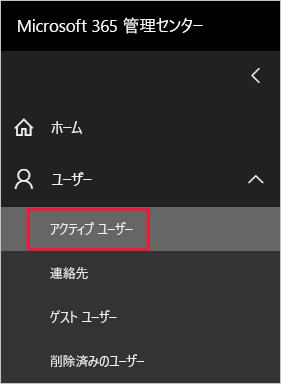
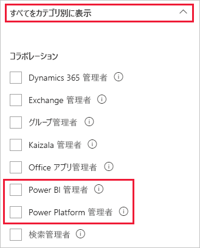

# <a name="understanding-power-bi-service-administrator-roles"></a>Power BI サービス管理者ロールについて

Power BI テナントを管理するには、次のいずれかのロールである必要があります。Power BI 管理者、Power Platform 管理者、または Microsoft 365 のグローバル管理者。Microsoft 365 ユーザー管理管理者が、Microsoft 365 管理センターで、または PowerShell スクリプトを使用して、ユーザーを Power BI 管理者ロールまたは Power Platform 管理者ロールに割り当てます。 詳細については、[PowerShell を使用してユーザー アカウントにロールを割り当てる方法](/office365/enterprise/powershell/assign-roles-to-user-accounts-with-office-365-powershell)に関する記事をご覧ください。

Power BI 管理者ロールと Power Platform 管理者ロールのユーザーは、Power BI テナントとその管理機能を完全に制御できます (ライセンス以外)。 割り当てられたユーザーは、[Power BI 管理ポータル](service-admin-portal.md)にアクセスできます。 そこで、テナント全体の利用状況の指標にアクセスでき、Power BI 機能のテナント全体の利用状況を制御できます。 これらの監理者ロールは、Microsoft 365 の完全な管理アクセス権を付与することなく、Power BI 管理ポータルにアクセスできるようにする必要があるユーザーに最適です。

> [!NOTE]
> Power BI のドキュメントでは、"Power BI 管理者" は、Power BI または Power Platform のいずれかの管理者ロールのユーザーを指します。 このドキュメントでは、タスクに Microsoft 365 のグローバル管理者ロールが必要な場合には、そのことが明記されています。

## <a name="limitations-and-considerations"></a>制限事項と考慮事項

Power BI サービス管理者ロールと Power Platform 管理者ロールには、次の機能はありません。

* Microsoft 365 管理センター内のユーザーとライセンスを変更する機能

* 監査ログへのアクセス 詳細については、「[Power BI でユーザー アクティビティを追跡する](service-admin-auditing.md)」を参照してください。

これらの機能には、Microsoft 365 のグローバル管理者ロールが必要です。

## <a name="assign-users-to-an-admin-role-in-the-microsoft-365-admin-center"></a>Microsoft 365 管理センターでユーザーを管理者ロールに割り当てる

Microsoft 365 管理センターでユーザーを管理者ロールに割り当てるには、以下の手順を行います。

1. [Microsoft 365 管理センター](https://portal.office.com/adminportal/home#/homepage)で、 **[ユーザー]**  >  **[アクティブなユーザー]** の順に選択します。

    

1. 役割を割り当てるユーザーを選択します。

1. **[ロール]** で **[ロールの管理]** を選びます。

    

1. **[すべてをカテゴリ別に表示]** を展開し、 **[Power BI 管理者]** または **[Power Platform 管理者]** を選択します。

    

1. **[変更の保存]** を選択します。

## <a name="assign-users-to-the-admin-role-with-powershell"></a>PowerShell で管理者ロールにユーザーを割り当てる

PowerShell を使用してロールにユーザーを割り当てることもできます。 ユーザーは、Azure Active Directory (Azure AD) で管理されます。 Azure AD PowerShell モジュールがまだない場合は、[最新バージョンをダウンロードしてインストール](https://www.powershellgallery.com/packages/AzureAD/)します。

1. 最初に、Azure AD に接続します。
   ```
   PS C:\Windows\system32> Connect-AzureAD
   ```

1. 次に、**Power BI サービス管理者** ロールに対する **ObjectId** を取得します。 [Get-AzureADDirectoryRole](/powershell/module/azuread/get-azureaddirectoryrole) を実行することで、**ObjectId** を取得できます。

    ```
    PS C:\Windows\system32> Get-AzureADDirectoryRole

    ObjectId                             DisplayName                        Description
    --------                             -----------                        -----------
    00f79122-c45d-436d-8d4a-2c0c6ca246bf Power BI Service Administrator     Full access in the Power BI Service.
    250d1222-4bc0-4b4b-8466-5d5765d14af9 Helpdesk Administrator             Helpdesk Administrator has access to perform..
    3ddec257-efdc-423d-9d24-b7cf29e0c86b Directory Synchronization Accounts Directory Synchronization Accounts
    50daa576-896c-4bf3-a84e-1d9d1875c7a7 Company Administrator              Company Administrator role has full access t..
    6a452384-6eb9-4793-8782-f4e7313b4dfd Device Administrators              Device Administrators
    9900b7db-35d9-4e56-a8e3-c5026cac3a11 AdHoc License Administrator        Allows access manage AdHoc license.
    a3631cce-16ce-47a3-bbe1-79b9774a0570 Directory Readers                  Allows access to various read only tasks in ..
    f727e2f3-0829-41a7-8c5c-5af83c37f57b Email Verified User Creator        Allows creation of new email verified users.
    ```

    この例では、ロールの **ObjectId** は 00f79122-c45d-436d-8d4a-2c0c6ca246bf となります。

1. 次に、ユーザーの **ObjectId** を取得します。 [Get-AzureADUser](/powershell/module/azuread/get-azureaduser) を実行して見つけることができます。

    ```
    PS C:\Windows\system32> Get-AzureADUser -ObjectId 'tim@contoso.com'

    ObjectId                             DisplayName UserPrincipalName      UserType
    --------                             ----------- -----------------      --------
    6a2bfca2-98ba-413a-be61-6e4bbb8b8a4c Tim         tim@contoso.com        Member
    ```

1. 役割にメンバーを追加するには、[Add-AzureADDirectoryRoleMember](/powershell/module/azuread/add-azureaddirectoryrolemember) を実行します。

    | パラメーター | Description |
    | --- | --- |
    | ObjectId |ロールの ObjectId。 |
    | RefObjectId |メンバーの ObjectId。 |

    ```powershell
    Add-AzureADDirectoryRoleMember -ObjectId 00f79122-c45d-436d-8d4a-2c0c6ca246bf -RefObjectId 6a2bfca2-98ba-413a-be61-6e4bbb8b8a4c
    ```

## <a name="next-steps"></a>次の手順

[組織内の Power BI を管理する](service-admin-administering-power-bi-in-your-organization.md)  
[Power BI 管理ポータル](service-admin-portal.md)  

他にわからないことがある場合は、 [Power BI コミュニティで質問してみてください](https://community.powerbi.com/)。