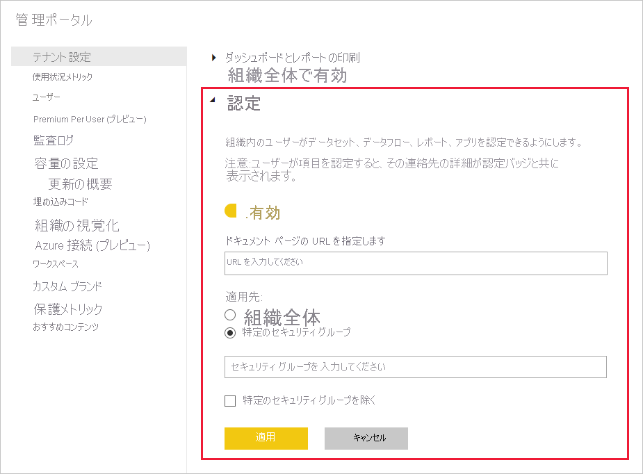

# コンテンツの認定を有効にする

組織は、選択されたコンテンツを認定することで、それを重要な情報の信頼できるソースとして識別することができます。 現在、認定できるコンテンツの種類は次のとおりです。
* データセット
* データフロー (プレビュー)
* レポート (プレビュー)
* アプリ (プレビュー)

Power BI 管理者は、自分が所属する組織の認定プロセスを有効にし設定する責任があります。 そのため、次のようになります。
* ご利用のテナントで認定を有効にする。
* コンテンツを認定することを承認されたメンバーで構成されているセキュリティ グループのリストを定義する。
* 組織のコンテンツ認定プロセスに関するドキュメントが存在する場合に、そのようなドキュメントを指す URL を指定する。

認定は、Power BI の " *承認* " 機能の一部です。 詳細については、「[承認: Power BI コンテンツの昇格と認定](../collaborate-share/service-endorsement-overview.md)」を参照してください。

## 認定を設定する

1. 管理ポータルで、[テナント設定] に進みます。
1. [エクスポートと共有の設定] セクションで、[認定] セクションを展開します。

   

1. トグルを **[有効]** に設定します。
1. 組織に発行済みの認定ポリシーがある場合は、ここでその URL を指定します。 これは、 [承認設定のダイアログ](../collaborate-share/service-endorse-content.md#request-content-certification)の認定セクションでは **[詳細情報]** リンクとなります。 リンクが指定されていない場合、自分のコンテンツの認定を要求するユーザーは担当の Power BI 管理者に連絡するように勧められることになります。
1. コンテンツを認定することを承認されたメンバーで構成されている 1 つまたは複数のセキュリティ グループを指定します。 このような承認された認定者は、[承認設定ダイアログ](../collaborate-share/service-endorse-content.md#certify-content)の認定セクションにある [認定] ボタンを使用できるようになります。
    
    認定の権限を付与したくないサブセキュリティ グループがセキュリティ グループに含まれている場合は、 **[特定のセキュリティ グループを除く]** ボックスをオンにし、表示されるテキスト ボックスに該当するグループの名前を入力してください。
1. **[適用]** をクリックします。

## 次のステップ
* [コンテンツの昇格または認定](../collaborate-share/service-endorse-content.md)
* [Power BI での承認について確認する](../collaborate-share/service-endorsement-overview.md)
* わからないことがある場合は、 [Power BI コミュニティで質問してみてください](https://community.powerbi.com/)。
