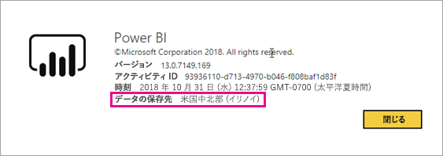
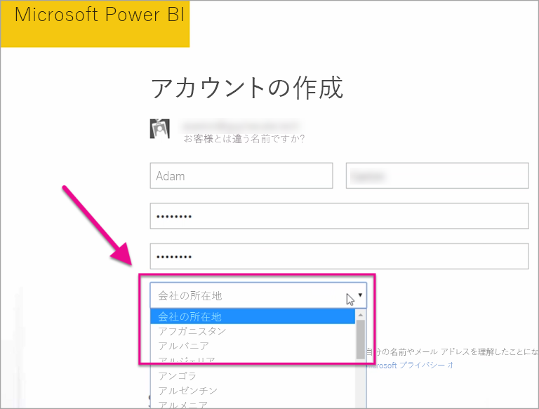

# Power BI テナントの場所

<iframe width="560" height="315" src="https://www.youtube.com/embed/0fOxaHJPvdM?showinfo=0" frameborder="0" allowfullscreen></iframe>

Power BI テナントが配置される場所およびその場所を選択する方法について説明します。 場所はユーザーとサービスのやり取りに影響を与える可能性があるので、場所について理解することは重要です。

## Power BI テナントの場所を確認する方法

テナントが存在するリージョンを調べるには、次の手順のようにします。

1. Power BI サービスの上部のメニューで、ヘルプ **[?]** を選択して、 **[Power BI について]** を選択します。

1. **[データの保存先]** の隣の値を確認します。 それが、テナントが存在しているリージョンです。 ワークスペース用に別のリージョンで容量を使用していない場合、その値はデータが格納されているリージョンでもあります。

    

## データ領域を選択する方法

データ領域は、AAD テナントのサインアップ中にテナントを作成した際に選択した国や地域に基づきます。 テナントの場所は、ユーザーの場所と一致している必要はありません。 この情報は共有されるので、その選択は Microsoft 365 と Power BI の両方のサインアップに適用されます。 新しいテナントである場合は、サインアップ時に、一覧から適切な国/地域を選択します。

Power BI によってこの選択に最も近いデータ リージョンが選択され、テナントのデータの保存場所が決まります。

> [!IMPORTANT]
> テナントを作成した後で、選択を変更することはできません。

他にわからないことがある場合は、 [Power BI コミュニティを利用してください](https://community.powerbi.com/)。
