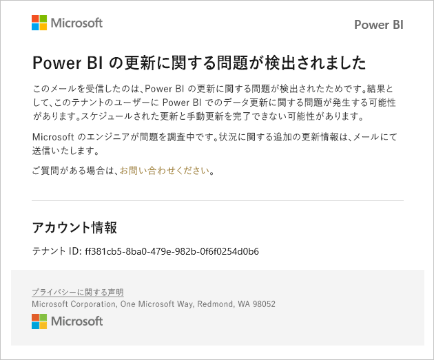

# サービス中断の通知

ミッション クリティカルなビジネス アプリケーションの可用性についての分析情報を得ることが重要です。 サービスの中断や低下がある場合に、必要に応じて電子メールを受け取ることができるように、Power BI でインシデント通知が提供されます。 Power BI の 99.9% のサービス レベル アグリーメント (SLA) では、これらはめったに発生しませんが、常に確実に通知されるようにする必要があります。 次のスクリーンショットは、通知を有効にした場合に受信する電子メールの種類を示しています。

現時点では、次の_信頼性のシナリオ_について電子メールを送信しています。

- レポートを開くの信頼性
- モデルの更新の信頼性
- クエリの更新の信頼性

通知は、レポートの表示、データセットの更新、クエリの実行といった操作で "_長い待ち時間_" が生じると送信されます。 インシデントが解決されると、フォローアップの電子メールを受信します。

> [!NOTE]
> 現在、この機能は Power BI Premium の専用容量に対してのみ使用できます。 共有や埋め込み容量には使用できません。

## 容量と信頼性に関する通知

Power BI Premium 容量が長期にわたって高リソース使用の状態になっており、信頼性に影響する可能性がある場合は、通知メールが送信されます。 このような影響の例として、レポートを開く、データセットを更新する、クエリを実行するなどの操作の遅延が長くなることが挙げられます。 

通知メールでは、次のようなリソース使用率が高い理由に関する情報が示されます。

* 原因であるデータセットのデータセット ID
* 操作の種類
* 高リソース使用率に関係がある CPU 時間

Power BI Premium 容量の過負荷が検出された場合にも、Power BI によってメール通知が送信されます。 このメールでは、過負荷の考えられる理由、過去 10 分間に負荷を発生させた操作、および各操作で発生した負荷の量について説明されます。 

Premium 容量が複数ある場合、メールには、過負荷期間中のそれらの容量に関する情報が含まれるため、リソースを集中的に使用する項目を含むワークスペースを、負荷が最も小さい容量に移行することを検討できます。

過負荷に関するメール通知が送信されるのは、過負荷のしきい値がトリガーされた場合のみです。 Premium 容量が非過負荷レベルに戻った場合、2 通目のメールを受信することはありません。

次の図は通知メールの例を示しています。

## 通知を有効にする

Power BI テナント管理者は、管理ポータルで通知を有効にします。

1. 通知を受信する電子メールが有効なセキュリティ グループを特定または作成します。

1. 管理ポータルで、 **[テナント設定]** を選択します。 **[ヘルプとサポートの設定]** で、 **[サービスの停止またはインシデントに関する電子メール通知を受け取る]** を展開します。

1. 通知を有効にし、セキュリティ グループを入力して、 **[適用]** を選択します。

    

> [!NOTE]
> Power BI では、アカウント no-reply-powerbi@microsoft.com から通知が送信されます。 このアカウントを差出人セーフ リストに追加してください。そうすると、通知が迷惑メール フォルダーで見つかることがなくなります。

## 次の手順

[Power BI Pro と Power BI Premium のサポート オプション](service-support-options.md)

他にわからないことがある場合は、 [Power BI コミュニティを利用してください](https://community.powerbi.com/)。
