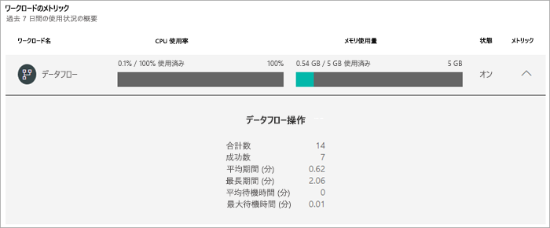
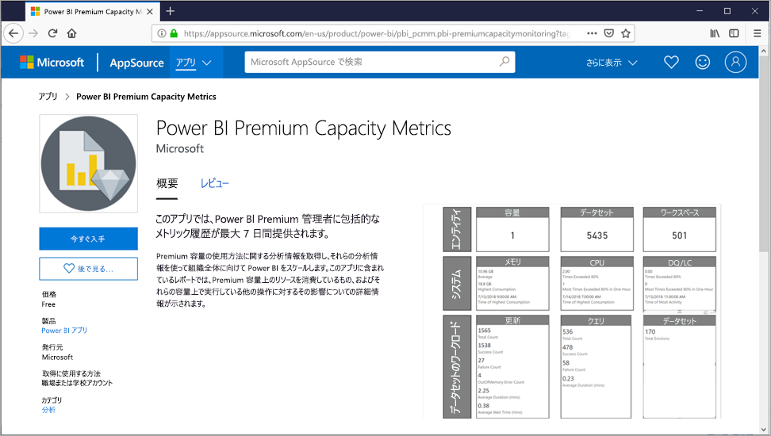

# Premium 容量を管理する

Power BI Premium の管理には、Premium 容量の作成、管理、監視が含まれます。 この記事では、容量の概要について説明します。詳細な手順については、[容量の構成と管理](service-admin-premium-manage.md)に関する記事を参照してください。

## 容量の作成と管理

Power BI 管理ポータルの **[容量の設定]** ページには、購入されている仮想コアの数と使用可能な Premium 容量が表示されます。 そのページでは、グローバル管理者または Power BI サービス管理者が、利用可能な仮想コアから Premium 容量を作成したり、既存の Premium 容量を変更したりできます。

> [!NOTE]
> Power BI Premium に **Premium Gen2** という名前の新しいバージョンの Premium が最近リリースされました。現在はプレビュー段階です。 Premium Gen2 を使用すると、Premium 容量の管理が簡素化され、管理オーバーヘッドが削減されます。 詳細については、[Power BI Premium Generation 2 (プレビュー)](service-premium-what-is.md#power-bi-premium-generation-2-preview) に関する記事を参照してください。

Premium 容量を作成するとき、管理者は以下を定義する必要があります。

- 容量の名前 (テナント内で一意)。
- 容量管理者。
- 容量のサイズ。
- データ所在地のリージョン。

少なくとも 1 人の容量管理者を割り当てる必要があります。 容量管理者として割り当てられたユーザーは、次のことが可能です。

- 容量にワークスペースを割り当てる。
- ユーザーのアクセス許可を管理し、割り当てアクセス許可を持つ容量管理者またはユーザーを追加する (容量にワークスペースを割り当てることができるようにするため)。
- ワークロードを管理し、ページ分割されたレポートおよびデータフローのワークロードに対する最大メモリ使用量を構成する。
- 容量を再起動し、システムの過負荷のためにすべての操作をリセットする。

容量管理者は、ワークスペースのアクセス許可で明示的に割り当てられている場合を除き、ワークスペースのコンテンツにアクセスできません。 また、利用状況メトリック、監査ログ、テナント設定など、すべての Power BI 管理領域に (明示的に割り当てられていない限り) アクセスできません。 重要なのは、容量管理者には、新しい容量の作成または既存容量のスケーリングを行うためのアクセス許可がないことです。 管理者は、容量ごとに割り当てられ、割り当てられている容量だけを表示および管理できます。

容量のサイズは、使用可能な SKU オプションの一覧から選択します。これは、プール内の使用可能な仮想コアの数によって制限されます。 プールから複数の容量を作成することができます。これは、1 つまたは複数の購入済み SKU から供給されます。 たとえば、P3 SKU (32 仮想コア) を使用して、3 つの容量 (1 つの P2 (16 仮想コア) と 2 つの P1 (2 x 8 仮想コア)) を作成できます。 「[Premium 容量を最適化する](service-premium-capacity-optimize.md)」で説明されているように、小さいサイズの容量を作成することにより、パフォーマンスとスケールを向上させることができます。 次の図で示す架空の Contoso 組織のセットアップ例は、それぞれにワークスペースが含まれる 5 つの Premium 容量 (3 x P1、2 x P3) と、共有容量内の複数のワークスペースで構成されています。

Power BI テナントのホーム リージョン以外のリージョンに、Premium 容量を割り当てることができます。これは、Multi-Geo と呼ばれます。 Multi-Geo を使用すると、定義されている地理的地域内のどのデータセンターに Power BI コンテンツを置くかを管理できます。 Multi-Geo のデプロイを使用する理由は、通常、パフォーマンスやスケールではなく、企業または政府のコンプライアンスのためです。 レポートとダッシュボードの読み込みではやはり、ホーム リージョンに対してメタデータを要求する必要があります。 詳細については、「[Multi-Geo support for Power BI Premium](service-admin-premium-multi-geo.md)」 (Power BI Premium の Multi-Geo のサポート) を参照してください。

Power BI サービス管理者とグローバル管理者は、Premium 容量を変更できます。 具体的には、次のことが可能です。

- 容量のサイズを変更して、リソースをスケールアップまたはスケールダウンする。
- 容量管理者を追加または削除する。
- 割り当てアクセス許可を持つユーザーを追加または削除する。
- 追加のワークロードを追加または削除する。
- リージョンを変更する。

特定の Premium 容量にワークスペースを割り当てるには、割り当てアクセス許可が必要です。 アクセス許可は、組織全体、特定のユーザー、またはグループに付与することができます。

Premium 容量では、Power BI クエリの実行に関連付けられているワークロードが既定でサポートされます。 Premium 容量では、次のような追加ワークロードもサポートされます: **AI (Cognitive Services)** 、**ページ分割されたレポート**、**データフロー**。 各ワークロードでは、ワークロードで使用できる最大メモリを (使用可能な合計メモリの割合として) 構成する必要があります。 最大メモリ割り当てを増やすと、ホストできるアクティブなモデルの数と更新のスループットに影響を与える可能性があることを理解しておくことが重要です。 

メモリは、データフローには動的に割り当てられますが、ページ分割されたレポートには静的に割り当てられます。 最大メモリが静的に割り当てられる理由は、ページ分割されたレポートは容量のセキュリティで保護された領域内で実行されるためです。 ページ分割されたレポートのメモリを設定するときは、モデルの読み込みに使用できるメモリが減るため、注意が必要です。 詳細については、「[既定のメモリ設定](service-admin-premium-workloads.md#default-memory-settings)」を参照してください。

Premium 容量を削除することができ、そのワークスペースやコンテンツが削除されることはありません。 代わりに、割り当てられているワークスペースは共有容量に移動されます。 Premium 容量が別のリージョンに作成されていた場合、ワークスペースはホーム リージョンの共有容量に移動されます。

### 容量へのワークスペースの割り当て

ワークスペースは Power BI 管理ポータルで Premium 容量に割り当てることができ、1 つのワークスペースの場合は **[ワークスペース]** ペインで割り当てることができます。

容量管理者、およびグローバル管理者または Power BI サービス管理者は、Power BI 管理ポータルでワークスペースを一括で割り当てることができます。 一括割り当ては次の対象に適用できます。

- **ユーザーごとのワークスペース** - 個人用ワークスペースを含む、これらのユーザーが所有するすべてのワークスペースが、Premium 容量に割り当てられます。 これには、既に別の Premium 容量に割り当てられているワークスペースの再割り当てが含まれます。 さらに、ユーザーにはワークスペース割り当てアクセス許可も割り当てられます。

- **特定ワークスペース**
- **組織全体のワークスペース** - 個人用ワークスペースを含むすべてのワークスペースが、Premium 容量に割り当てられます。 現在と将来のすべてのユーザーに、ワークスペース割り当てアクセス許可が割り当てられます。 この方法は推奨されません。 よりターゲットを絞った方法をお勧めします。

ユーザーがワークスペース管理者であり、かつ、割り当てアクセス許可を持っている場合は、 **[ワークスペース]** ウィンドウを使用して、Premium 容量にワークスペースを追加できます。

![[ワークスペース] ウィンドウを使用して、ワークスペースを Premium 容量に割り当てる](media/service-premium-capacity-manage/assign-workspace-capacity.png)

ワークスペース管理者は容量から (共有容量に) ワークスペースを削除できます。割り当てアクセス許可は必要ありません。 専用容量からワークスペースを削除すると、実質的に、ワークスペースは共有容量に再配置されます。 Premium 容量からワークスペースを削除すると、悪影響が発生する可能性があることに注意してください。たとえば、Power BI Free ライセンス ユーザーが共有コンテンツを使用できなくなったり、共有容量でサポートされる許容量を超過するとスケジュールされた更新が停止したりします。

Power BI サービスでは、Premium 容量に割り当てられているワークスペースを、ワークスペース名に付いた菱形アイコンで簡単に識別できます。

## 容量の監視

Premium 容量を監視することで、容量がどのように実行されているかを管理者は把握することができます。 Power BI 管理ポータルまたは **Power BI Premium 容量メトリック** (Power BI) アプリを使用することで、容量を監視できます。

### Power BI 管理ポータル

管理ポータルの **[正常性]** タブには、容量ごとに、容量と有効な各ワークロードの概要メトリックが表示されます。 メトリックでは過去 7 日間の平均が示されます。  

容量レベルのメトリックは、有効なすべてのワークロードの累積です。 次のメトリックが提供されます。

- **[CPU 使用率]** - CPU の平均使用率が、容量で使用可能な合計 CPU に対する割合として示されます。  
- **[メモリ使用量]** - 容量で使用可能なメモリの合計として、メモリの平均使用量 (GB 単位) が示されます。 

有効なワークロードごとに、CPU 使用率とメモリ使用量、および多くのワークロード固有のメトリックが提供されます。 たとえば、データフロー ワークロードの場合、 **[Total Count]\(合計カウント\)** では各データフローの合計更新数が示され、 **[Average Duration]\(平均継続時間\)** ではデータフローの更新の平均時間が示されます。

各ワークロードで使用可能なすべてのメトリックの詳細については、「[管理ポータルで容量を監視する](service-admin-premium-monitor-portal.md)」を参照してください。

Power BI 管理ポータルの監視機能は、主要な容量メトリックの概要がすぐにわかるように設計されています。 より詳細な監視を行うには、**Power BI Premium Capacity Metrics** アプリを使用することをお勧めします。

### Power BI Premium Capacity Metrics アプリ

[Power BI Premium Capacity Metrics アプリ](https://appsource.microsoft.com/en-us/product/power-bi/pbi_pcmm.capacity-metrics-dxt?tab=Overview)は、容量管理者が使用できる Power BI アプリであり、他の Power BI アプリと同様にインストールされます。 ダッシュボードとレポートが含まれています。

アプリが開くと、ダッシュボードが読み込まれ、ユーザーが容量管理者であるすべての容量について集計されたビューを表すさまざまなタイルが表示されます。ダッシュボードのレイアウトには、次の 5 つの主要なセクションがあります。

- **[Overview]\(概要\)** - アプリのバージョン、容量とワークスペースの数
- **[System Summary]\(システムの概要\)** - メモリと CPU のメトリック
- **[Dataset Summary]\(データセットの概要\)** - データセットの数、DQ/LC、更新、およびクエリのメトリック
- **[Dataflow Summary]\(データフローの概要\)** - データフローの数とデータセットのメトリック
- **[Paginated Report Summary]\(ページ分割されたレポートの概要\)** - 更新と表示のメトリック

ダッシュボードのタイルがピン留めされた基になっているレポートにアクセスするには、ダッシュボードのタイルをクリックします。 各ダッシュボード セクションの詳細な表示が提供され、対話型のフィルター処理がサポートされています。 

フィルター処理を行うには、日付の範囲、容量、ワークスペース、ワークロード (レポート、データセット、データフロー) によってスライサーを設定し、レポート ページのクロス フィルター処理を行うためにレポート ビジュアル内の要素を選択します。 クロス フィルター処理は、特定の期間、容量、ワークスペース、データセットなどに絞り込むための強力な手法であり、根本原因分析を実行するときに非常に役立ちます。

アプリのダッシュボードとレポートのメトリックの詳細については、「[アプリで Premium 容量を監視する](service-admin-premium-monitor-capacity.md)」を参照してください。

### メトリックの解釈

メトリックを監視して、リソースの使用状況とワークロードのアクティビティに関するベースラインの理解を確立する必要があります。 容量が遅くなった場合は、監視するメトリックと、下すことができる結論を、理解することが重要です。

レポート ユーザーに応答性の高いエクスペリエンスを提供し、より高いクエリ スループットを実現するため、理想的には、クエリは 1 秒以内に完了する必要があります。 通常、バックグラウンド プロセス (更新を含む) が完了するまでに時間がかかっても、それほど問題ではありません。

一般に、レポートの表示が遅い場合は、容量の負荷が増加していることを示している可能性があります。 レポートの読み込みに失敗した場合は、容量が過負荷状態であることを示します。 どちらの場合も、根本原因は次のような多くの要因に起因する可能性があります。

- **クエリの失敗** は、明らかに、メモリが不足しており、モデルをメモリに読み込めなかったことを示します。 Power BI サービスでは、失敗する前にモデルの読み込みが 30 秒間試みられます。

- **クエリ待機時間の超過** は、いくつかの理由で発生する可能性があります。
  - Power BI サービスで、最初にモデルを削除してから、クエリ対象のモデルを読み込む必要がある (データセットの削除率が高いだけで、メモリ スラッシングを示す長いクエリ待機時間が伴っていない場合は、容量の過負荷を示してはいないことを思い出してください)。
  - モデルの読み込み時間 (特に、大きなモデルをメモリに読み込むための待機)。
  - 実行時間の長いクエリ。
  - 多すぎる LC/DQ 接続数 (容量制限の超過)。
  - CPU の飽和。
  - ページのビジュアルが多すぎる複雑なレポート デザイン (各ビジュアルがクエリであることを思い出してください)。

- **長いクエリ時間** は、モデルのデザインが最適化されていないことを示している可能性があります。容量で複数のデータセットがアクティブになっていて、1 つのデータセットだけでクエリ時間が長い場合は、特にそうです。 これは、容量は十分に提供されていて、問題のあるデータセットが最適ではないか、単に遅いことを示します。 実行時間の長いクエリは、他のプロセスで必要なリソースへのアクセスをブロックする場合があるため、問題になる可能性があります。
- **長い更新待機時間** は、多くのアクティブなモデルがメモリを消費しているためにメモリが不足していること、または問題のある更新によって他の更新がブロックされている (並列更新の上限を超えている) ことを示します。

メトリックの使用方法の詳細については、「[Premium 容量を最適化する](service-premium-capacity-optimize.md)」を参照してください。

## 謝辞

この記事は、データ プラットフォーム MVP であり、[Bitwise Solutions](https://www.bitwisesolutions.com.au/) の独立 BI 専門家である Peter Myers によって執筆されました。

## 次の手順

> [!div class="nextstepaction"]
> [Premium 容量を最適化する](service-premium-capacity-optimize.md)   
> [!div class="nextstepaction"]
> [Premium 容量でワークロードを構成する](service-admin-premium-workloads.md)   

他にわからないことがある場合は、 [Power BI コミュニティで質問してみてください](https://community.powerbi.com/)。

Power BI に Power BI Premium Gen2 がプレビュー オファリングとして導入されました。次の改善によって Power BI Premium のエクスペリエンスが向上しています。
* パフォーマンス
* ユーザーごとのライセンス
* より大きなスケール
* メトリックの改善
* 自動スケール
* 管理オーバーヘッドの削減

Power BI Premium Gen2 の詳細については、[Power BI Premium Generation 2 (プレビュー)](service-premium-what-is.md#power-bi-premium-generation-2-preview) に関する記事を参照してください。
