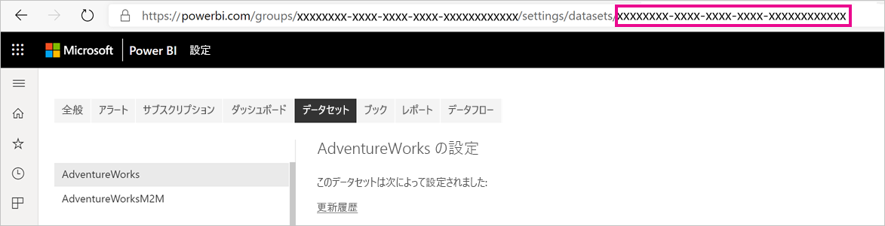
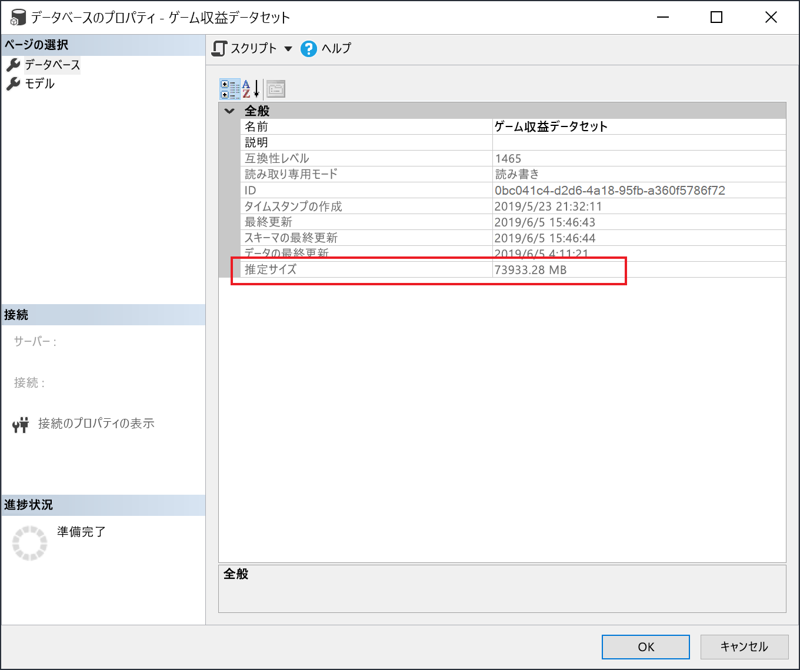

# <a name="large-datasets-in-power-bi-premium"></a>Power BI Premium での大規模なデータセット

Power BI データセットでは、クエリ パフォーマンスが最適化されるように、データを圧縮率の高い、メモリ内キャッシュに格納できます。これにより、ユーザー対話機能が高速になります。 Premium 容量に関しては、 **[Large dataset storage format]\(大規模なデータセットのストレージ形式\)** 設定を使用することで、既定の 10 GB の上限を超える大規模なデータセットを有効にすることができます。 有効にした場合、データセットのサイズは、Premium "*容量*" サイズによって制限されます。

すべての Premium P SKU および Embedded A SKU に対して、大規模なデータセットを有効にすることができます。 Premium での大規模なデータセットのサイズ制限は、データ モデルのサイズ制限の観点から、Azure Analysis Services に相当します。

データセットを 10 GB を超えて拡張する必要がありますが、[Large dataset storage format]\(大規模なデータセットのストレージ形式\) 設定を有効にすれば、追加の利点が得られます。 データセットの書き込み操作に XMLA エンドポイントベースのツールを使用する予定がある場合は、"*大規模な*" データセットとして必ずしも特徴付けるとは限らないデータセットについても、当該設定を必ず有効にしてください。 有効にすると、大規模なデータセットのストレージ形式によって、XMLA 書き込み操作のパフォーマンスが向上します。

Power BI Desktop モデルのアップロード サイズは、このサービスの大規模なデータセットの影響を受けることはなく、引き続き 10 GB に制限されます。 その代わり、データセットは更新時にサービス内で 10 GB を超える可能性があります。

## <a name="enable-large-datasets"></a>大規模なデータセットを有効にする

以下の手順では、サービスに発行される新しいモデルに対して大規模なデータセットを有効にする方法について説明します。 既存のデータセットの場合は、手順 3 のみが必要です。

1. Power BI Desktop で、モデルを作成します。 データセットがより大きくなり、徐々により多くのメモリを消費する場合は、必ず[増分更新](service-premium-incremental-refresh.md)を構成してください。

1. モデルをデータセットとしてサービスに発行します。

1. [サービス] > [データセット] > **[設定]** で、 **[Large dataset storage format]\(大規模なデータセットのストレージ形式\)** を展開し、スライダーをクリックして **[オン]** にして、 **[適用]** をクリックします。

    :::image type="content" source="media/service-premium-large-models/enable-large-dataset.png" alt-text="大規模なデータセットのスライダーを有効にする":::

1. 更新を呼び出し、増分更新ポリシーに基づいて履歴データを読み込みます。 最初の更新では、履歴の読み込みに時間がかかる場合があります。 ご利用の増分更新ポリシーによっては、それ以降の更新はより速くになります。

## <a name="set-default-storage-format"></a>既定のストレージ形式を設定する

Premium 容量に割り当てられたワークスペース内で作成されるすべての新しいデータセットについては、大規模なデータセットのストレージ形式を既定で有効にすることができます。

1. ワークスペースで、 **[設定]**  >  **[Premium]** の順にクリックします。

1. **[既定のストレージ形式]** で、 **[Large dataset storage format]\(大規模なデータセットのストレージ形式\)** を選択して、 **[保存]** をクリックします。

    :::image type="content" source="media/service-premium-large-models/default-storage-format.png" alt-text="既定のストレージ形式を有効にする":::

### <a name="enable-with-powershell"></a>PowerShell を使用した有効化

PowerShell を使用して、大規模なデータセットのストレージ形式を有効にすることもできます。 PowerShell コマンドレットを実行するには、容量管理者とワークスペース管理者の特権が必要です。

1. データセット ID (GUID) を確認します。 ワークスペースの **[データセット]** タブで、データセットの設定の下にある URL に ID が表示されます。

    

1. PowerShell 管理者プロンプトで、[MicrosoftPowerBIMgmt](/powershell/module/microsoftpowerbimgmt.data/) モジュールをインストールします。

    ```powershell
    Install-Module -Name MicrosoftPowerBIMgmt
    ```

1. 次のコマンドレットを実行してサインインし、データセットのストレージ モードを確認します。

    ```powershell
    Login-PowerBIServiceAccount

    (Get-PowerBIDataset -Scope Organization -Id <Dataset ID> -Include actualStorage).ActualStorage
    ```

    応答は次のようになります。 このストレージ モードは ABF (Analysis Services のバックアップ ファイル) です。これは既定値です。

    ```
    Id                   StorageMode

    --                   -----------

    <Dataset ID>         Abf
    ```

1. 次のコマンドレットを実行して、ストレージ モードを設定します。 Premium ファイルへの変換には、数秒かかることがあります。

    ```powershell
    Set-PowerBIDataset -Id <Dataset ID> -TargetStorageMode PremiumFiles

    (Get-PowerBIDataset -Scope Organization -Id <Dataset ID> -Include actualStorage).ActualStorage
    ```

    応答は次のようになります。 ストレージ モードが Premium ファイルに設定されました。

    ```
    Id                   StorageMode
    
    --                   -----------
    
    <Dataset ID>         PremiumFiles
    ```

[Get-PowerBIWorkspaceMigrationStatus](/powershell/module/microsoftpowerbimgmt.workspaces/get-powerbiworkspacemigrationstatus) コマンドレットを使用すると、Premium ファイルとの間のデータセットの変換状態を確認できます。

## <a name="dataset-eviction"></a>データセットの削除

Power BI では、動的メモリ管理を使用して、非アクティブなデータセットをメモリから削除します。 Power BI はデータセットを削除することで、ユーザー クエリに対処するために他のデータセットを読み込むことができます。 動的メモリ管理を使用すると、データセットのサイズの合計をその容量で使用可能なメモリよりも大幅に大きくすることができますが、1 つのデータセットはメモリに収める必要があります。 動的メモリ管理の詳細については、「[容量はどのように機能するのか](service-premium-what-is.md#how-capacities-function)」を参照してください。

削除による大規模なモデルへの影響を考慮する必要があります。 データセットの読み込み時間は比較的短いにもかかわらず、ユーザーは削除された大規模なデータセットの再読み込みを待つ必要がある場合に顕著な遅延が発生する可能性があります。 このため、現在の形では、大規模なモデルの機能は、セルフサービス BI 要件と混在した容量ではなく、主にエンタープライズ BI 要件専用の容量に対して使用することが推奨されます。 エンタープライズ BI 要件専用の容量では、削除が頻繁にトリガーされる可能性や、データセットの再読み込みが必要になる可能性は低くなります。 その一方、セルフサービス BI 用の容量には、メモリへの読み込みやメモリからの読み込みの頻度が高い小さなデータセットが数多く格納されています。

## <a name="checking-dataset-size"></a>データセット サイズの確認

履歴データを読み込んだ後、[XMLA エンドポイント](service-premium-connect-tools.md)を介して [SSMS](/sql/ssms/download-sql-server-management-studio-ssms) を使用して、モデルのプロパティ ウィンドウでデータセットの推定サイズを確認できます。



また、SSMS から次の DMV クエリを実行することによってデータセットのサイズを確認できます。 出力の DICTIONARY\_SIZE 列と USED\_SIZE 列を合計し、データセットのサイズ (バイト単位) を確認します。

```sql
SELECT * FROM SYSTEMRESTRICTSCHEMA
($System.DISCOVER_STORAGE_TABLE_COLUMNS,
 [DATABASE_NAME] = '<Dataset Name>') //Sum DICTIONARY_SIZE (bytes)

SELECT * FROM SYSTEMRESTRICTSCHEMA
($System.DISCOVER_STORAGE_TABLE_COLUMN_SEGMENTS,
 [DATABASE_NAME] = '<Dataset Name>') //Sum USED_SIZE (bytes)
```

## <a name="limitations-and-considerations"></a>制限事項と考慮事項

大規模なデータセットを使用する場合は、次の制限事項に留意してください。

- **新しいワークスペースが必要**: 大規模なデータセットは、[新しいワークスペース](../collaborate-share/service-create-the-new-workspaces.md)でのみ機能します。

- **Power BI Desktop へのダウンロード**:データセットが Premium ファイルに格納されている場合、[.pbix ファイルとしてのダウンロード](../create-reports/service-export-to-pbix.md)は失敗します。
- **サポートされているリージョン**: 大規模なデータ セットは、Premium ファイル ストレージをサポートするすべての Azure リージョンでサポートされています。 詳細については、「[リージョン別の利用可能な製品](https://azure.microsoft.com/global-infrastructure/services/?products=storage)」を確認し、次のセクションに記載されている表を参照してください。

## <a name="region-availability"></a>利用可能なリージョン

Power BI の大規模なデータセットは、[Azure Premium ファイル ストレージ](/azure/storage/files/storage-files-planning#storage-tiers)がサポートされている特定の Azure リージョンでのみ使用できます。

次の一覧には、Power BI の大規模なデータセットを使用できるリージョンを示しています。 次の一覧に含まれていないリージョンでは、大規模なモデルがサポートされていません。

|Azure リージョン  |Azure リージョンの省略形  |
|---------|---------|
|オーストラリア東部     | australiaeast        |
|オーストラリア南東部     | australiasoutheast        |
|米国中部     | centralus        |
|東アジア     | eastasia        |
|米国東部     | eastus        |
|米国東部 2     | eastus2        |
|東日本     | japaneast        |
|西日本     | japanwest        |
|韓国中部     | koreacentral        |
|韓国南部     | koreasouth        |
|米国中北部     | northcentralus        |
|北ヨーロッパ     | northeurope        |
|米国中南部     | southcentralus        |
|東南アジア     | southeastasia        |
|英国南部     | uksouth        |
|英国西部     | ukwest        |
|西ヨーロッパ     | westeurope        |
|米国西部     | westus        |
|米国西部 2     | westus2        |

## <a name="next-steps"></a>次のステップ

次のリンクには、大規模なモデルを使用する際に役立つ情報が用意されています。

* [Azure Premium ファイル ストレージ](/azure/storage/files/storage-files-planning#storage-tiers)
* [Power BI Premium の Multi-Geo のサポートを構成する](service-admin-premium-multi-geo.md)
* [Power BI で独自の暗号化キーを使用する](service-encryption-byok.md)
* [容量はどのように機能するのか](service-premium-what-is.md#how-capacities-function)
* [増分更新](service-premium-incremental-refresh.md)。

Power BI に Power BI Premium Gen2 がプレビュー オファリングとして導入されました。次の改善によって Power BI Premium のエクスペリエンスが向上しています。
* パフォーマンス
* ユーザーごとのライセンス
* より大きなスケール
* メトリックの改善
* 自動スケール
* 管理オーバーヘッドの削減

Power BI Premium Gen2 の詳細については、[Power BI Premium Generation 2 (プレビュー)](service-premium-what-is.md#power-bi-premium-generation-2-preview) に関する記事を参照してください。
