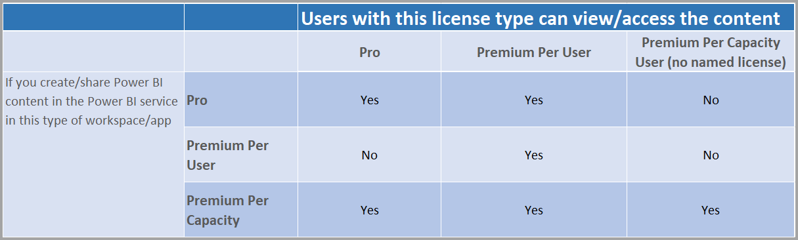

# Power BI Premium Per User に関する FAQ (プレビュー)

Power BI **Premium Per User** を使用することで、組織はユーザーごとに Premium 機能のライセンスを付与できます。 Premium Per User (PPU) には、Power BI Pro ライセンスのすべての機能が含まれるだけでなく、ページ分割されたレポート、AI、Premium サブスクライバーのみが利用できるその他の機能などの機能も追加されています。 

この記事では、Premium Per User ライセンスに関してよく寄せられる質問への回答を紹介します。 この記事のすべての情報は、Premium Per User がプレビュー期間を経て一般提供 (GA) にリリースされる過程で、変更され、改善されます。 

この記事では、質問と回答を次のカテゴリにまとめてあります。
* 一般的な質問 
* 管理に関する質問 
* エンド ユーザー エクスペリエンスに関する質問 

## 一般的な質問

1.  **Premium Per User (PPU) とはどのようなものですか?** 

    Premium Per User (PPU) は、ユーザー単位で Premium 機能のライセンスを付与する新しい方法です。 Power BI Pro ライセンスのすべての機能に加えて、ページ分割されたレポート、AI、現在 Premium でのみ利用可能な機能などの機能が含まれています。

2.  **いつ購入できるようになりますか?**

    開発が続けられており、2021 年までに PPU が GA にリリースされることはないものと予想されます。 一般提供までは、すべての組織がパブリック プレビューを無料で利用できます。

3.  **Power BI Pro と Premium Per User の両方のライセンスが必要ですか?**

    いいえ、Premium Per User ライセンスで、Power BI Pro のすべての機能を利用できます。

4.  **試用版を入手するにはどうすればよいですか?**

    製品内の試用版エクスペリエンスと、Microsoft 365 から利用可能な試用版エクスペリエンスがあります。 ユーザーは、組織で PPU が制限されていなければ、ワークスペースで Premium Per User を有効にすることにより、製品内の試用版エクスペリエンスにアクセスできます。 Microsoft 365 からの試用版エクスペリエンスは、現在 Power BI Pro 試用版を開始するのと同じように、ポータルで有効にすることができます。  

5.  **Premium Per User ではどのような機能を利用できますか?**

    機能を比較した表を次に示します。    

    

6.  **組織には既に Power BI Premium があります。コンテンツを自分の容量に発行するために、Premium Per User ライセンスが必要ですか?**
    
    組織で Premium 容量を補完するために Premium Per User が使用されている場合がありますが、既存の容量にコンテンツを発行するために Premium Per User は必要ありません。  

## 管理に関する質問

1.  **テナントで Premium Per User (PPU) を有効にするにはどうすればよいですか?**
    
    テナントで PPU のライセンスをプロビジョニングすると、それを有効にしてあるすべてのワークスペースで PPU の機能を使用できるようになります。 プレビューの場合は、次の図に示すように、容量ドロップダウン リストで Premium Per User 項目を選択して、Premium Per User 機能を有効にするだけです。

    

2.  **これは Premium 容量と同様に機能しますか? 機能のオンとオフを切り替えることができますか?**

    いいえ、PPU にはメモリまたは CPU の管理機能はありません。その点で、現在は Power BI Pro のように機能します。 テナント管理者は、選択した機能の設定を管理できますが、現在ダッシュボードを無効にできないのと同じように、ページ分割されたレポートのようなワークロードを無効にすることはできません 

3.  **公開されている Premium Per User の設定はどこで管理できますか?**

    テナント設定にある Premium Per User 用の新しいメニュー オプションを使用することで、管理者はそれらの設定を管理できます。

4.  **PPU ワークスペースを作成できるユーザーを制限できますか?**

    はい。現在ワークスペースを作成できるユーザーを制限するのと同じ方法でできます。

5.  **テナント管理者は、Premium Per User としてマークされているワークスペースを確認できますか?**

    はい。これらはテナント管理者画面のワークスペース メニュー項目で表示でき、Premium としてマークされているワークスペースが示されます。

6.  **Premium Per User 容量と Premium 容量の間でワークスペースを移動できますか?**

    はい。 一般提供 (GA) の場合は、Premium 容量に移行した後、ワークスペース内に存在するデータセットまたはデータフローの完全な更新を実行する必要があります。 この要件により、Premium Gen2 の CPU 課金メカニズムを回避しようとする企業による不正使用を防ぐことができます。

7.  **容量 API を Premium Per User で使用できますか?**

    ワークスペースを移動できるように限られた API のセットを利用できますが、ワークロードの無効化や他のそのようなアクティビティを行うことはできません。  

## エンド ユーザー エクスペリエンスに関する質問

1.  **ワークスペースを Premium Per User としてマークした場合、他のユーザーはどのようにすればそれがわかりますか?**
    
    次の図に示すように、ワークスペースが Premium Per User であることを示す新しいアイコンが導入されています。

        

2.  **Premium Per User のワークスペースやアプリのコンテンツにはどのようなユーザーがアクセスできますか?**

    Premium Per User ワークスペースのコンテンツを表示するすべてのユーザーは、Premium Per User ライセンスを持っている必要があります。 これには、ユーザーが XMLA エンドポイント、Excel で分析、複合モデルなどを使用してコンテンツにアクセスするシナリオが含まれます。 PPU ライセンスを持っていないユーザーにワークスペースへのアクセスを許可することはできますが、コンテンツにアクセスできないというメッセージが表示されます。 資格がある場合は、試用版ライセンスを求めるメッセージが表示されます。 資格がない場合は、テナント管理者によってライセンスを割り当てられる必要があります。

3.  **ユーザーは、付与されているライセンスの種類に応じて、どのような共有コンテンツを表示できますか?**

    次の表では、PPU で表示できるコンテンツの種類を示します。

       

4.  **埋め込みのユース ケースに Premium Per User を使用できますか?**

    Premium Per User は、Pro ライセンスを使用する場合と同じように埋め込みのユース ケースで動作します。 コンテンツを埋め込むことができ、それを表示するにはユーザーごとに PPU ライセンスが必要です。

5.  **試用版の有効期限が切れた場合、PPU のワークスペースはどうなりますか?**

    ユーザーは引き続きワークスペースにアクセスできますが、そのライセンスの種類を必要とするコンテンツは使用できません。 ワークスペースを Premium 容量に移動するか、単に要件をオフにする必要があります。 
6.  **Premium Per User で利用できるストレージはどれくらいですか?**

    ストレージに関しては、テナント全体で Premium 容量と同じ 100 TB を利用できます。

7.  **エクスポート API を Premium Per User で使用できますか?**

    現在、これはページ分割されたレポートで使用でき、5 分ごとに 1 回の呼び出しに制限されます。  Power BI レポートは現時点ではサポートされていません。  

8.  **PPU では電子メール サブスクリプションはどのように機能しますか?**

    添付ファイルがすべてのユーザーについて同じである場合に限り、PPU ライセンスまたは Pro ライセンスを持つすべてのユーザーが、サブスクリプションとその添付ファイルを受け取ることができます。 Pro ユーザーは、製品ポータルの内容を表示することはできません。 受信者ごとに異なるデータを表示できる追加のサブスクリプション機能が導入された場合、それらの機能を使用するには PPU ライセンス (または Premium 容量) が必要になります。

9.  **更新 API を使用してポータルから 48 回より多く更新を行うことはできますか?**

    現時点では、更新は制限されていません。  

10. **Power BI Premium Capacity Metrics アプリを使用して、Premium Per User の使用状況を監視できますか?**

    Power BI Premium Capacity Metrics アプリは Premium Gen2 では機能しないため、PPU 項目を表示することはできません。  

11. **PPU ワークスペースに Power BI データセットをホストし、それに対するレポートを作成して、非 PPU ワークスペースで発行し、PPU ライセンスを持たないユーザーがこのレポートにアクセスするのを許可することができますか?**

    いいえ。 データセットは Premium Per User ワークスペースに存在するので、非 PPU ワークスペースのレポートにアクセスできるユーザーであっても、ライセンスを持たない場合は表示できません。

12. **複数の 10 GB データ モデルを同時に更新することはできますか?**

    Premium Gen2 での並列更新に対するものと同じ制限が適用されます。

13. **Web への公開を使用して、Premium Per User でホストされているコンテンツを共有できますか?**

    現在、Web への公開は、Premium 容量でホストされているコンテンツと同じように動作します。

14. **Premium Per User ワークスペースでデータフローを実行し、別のワークスペースの Power BI データセットにインポートして、Premium Per User ライセンスを持たないユーザーがそのコンテンツを使用できるようにすることはできますか?**

    Power BI レポートの作成者が Premium Per User のライセンスを持っている限り、PPU のプレビュー期間中はこれが可能です。

15. **Premium Per User で Power BI モバイル アプリを使用できますか?**

    はい。Power BI モバイル アプリは、Premium Per User アプリまたはワークスペースに発行されたすべてのコンテンツで動作するように更新されています。

**次の手順**

* [Power BI Premium とは何ですか?](service-premium-what-is.md)
* [Microsoft Power BI Premium ホワイト ペーパー](https://aka.ms/pbipremiumwhitepaper)
* [Power BI のエンタープライズ展開の計画に関するホワイト ペーパー](https://aka.ms/pbienterprisedeploy)
* [Extended Pro Trial のアクティブ化](../fundamentals/service-self-service-signup-for-power-bi.md)
* [Power BI Embedded のよくあるご質問](../developer/embedded/embedded-faq.md)

他にわからないことがある場合は、 [Power BI コミュニティで質問してみてください](https://community.powerbi.com/)。
