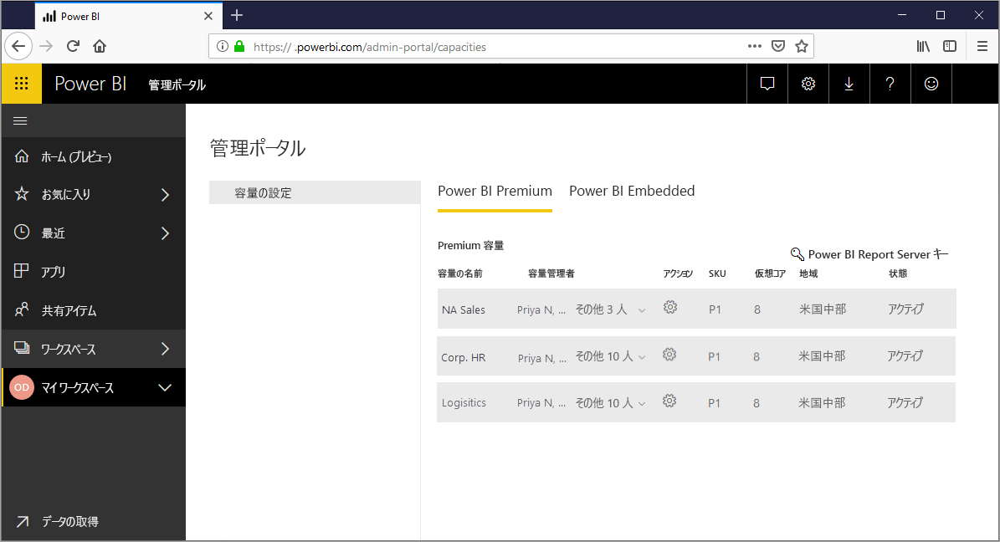
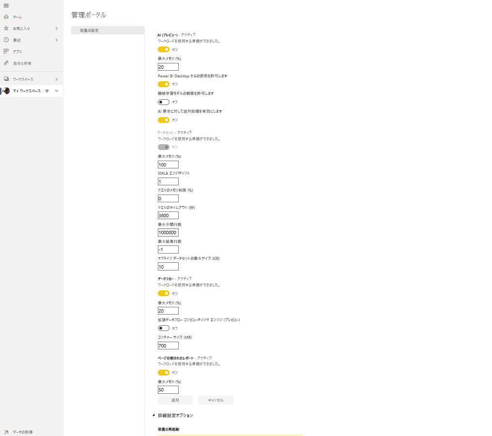
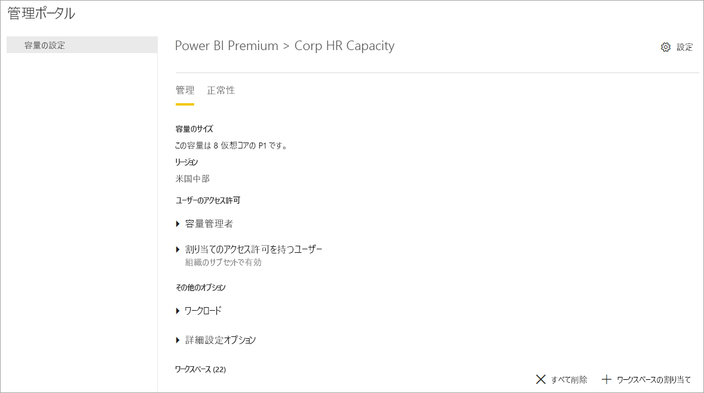
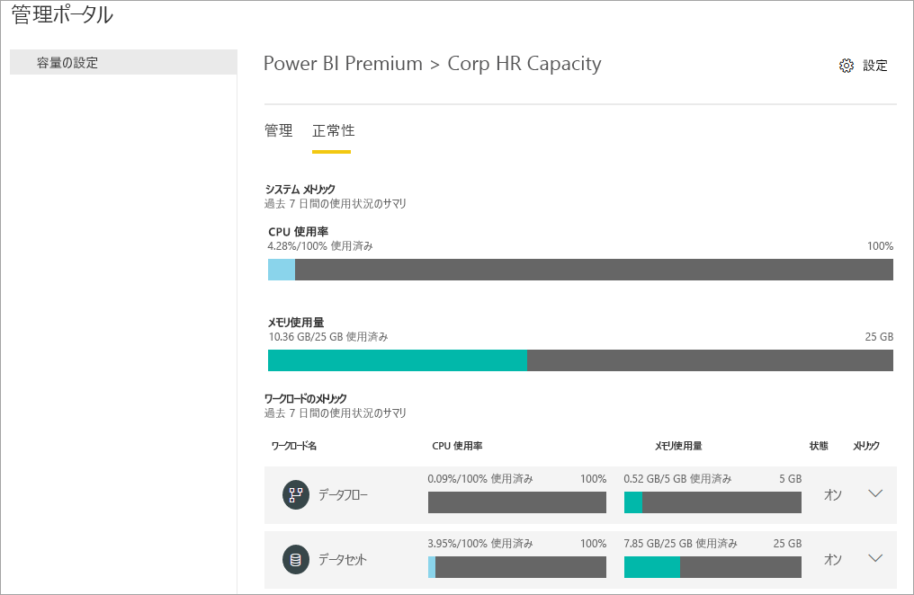
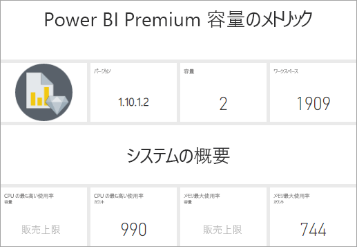
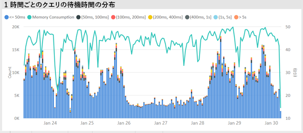
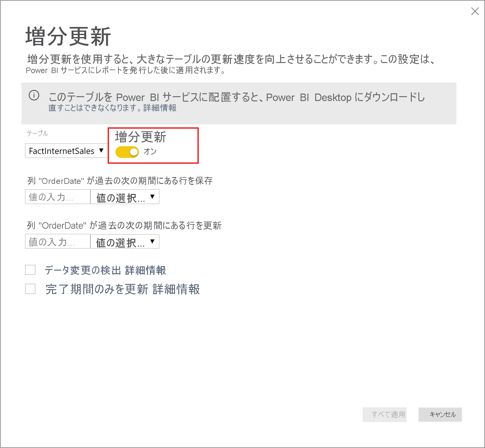
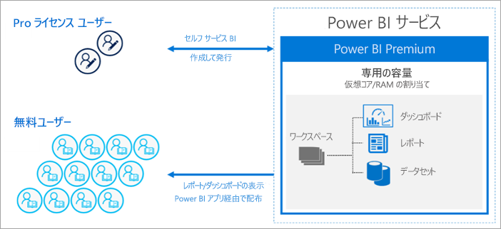
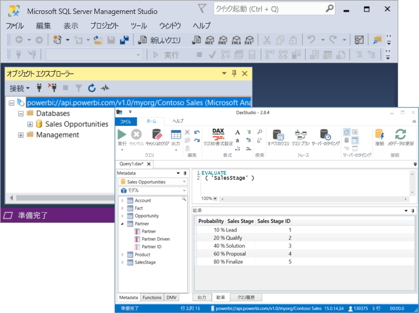

# Power BI Premium とは

Power BI Premium を使用すると、Premium でのみ利用可能な機能にアクセスできます。また、組織内の Power BI コンテンツのスケーリングとパフォーマンスが向上します。 Power BI Premium を使用すると、組織内のより多くのユーザーが Power BI を最大限に活用し、パフォーマンスと応答性を向上させることができます。 たとえば、Power BI Premium を使用すると、お客様とお客様のユーザーは次の機能を手に入れることができます。

> [!div class="checklist"]
> * Power BI レポートのスケーリングとパフォーマンスの向上
> * 容量別にライセンスされる柔軟性
> * AI による分析、コンポーザブルで再利用可能なデータフロー、ページ分割されたレポートなど、データの視覚化と分析情報の抽出のためのクラス最高の機能
> * 高負荷のワークロードをサポートし、エンタープライズ規模を必要とするさまざまな Premium 専用機能をセルフサービスおよびエンタープライズ BI に統合
> * Power BI Report Server を使用してオンプレミスの BI を拡張するための組み込みライセンス
> * リージョン別のデータ所在地 (Multi-Geo) と、お客様が管理する保存データ用暗号化キー (BYOK) のサポート
> * ユーザーごとのライセンスを購入することなく、Power BI コンテンツを (組織外でも) だれとでも共有できる

 

この記事では、Power BI Premium の主要な機能を紹介します。 必要に応じて、より詳細な情報が記載されているその他の記事へのリンクが提供されています。 Power BI Pro と Power BI Premium の詳細については、「[Power BI の価格](https://powerbi.microsoft.com/pricing/)」の「_Power BI 機能の比較_」セクションを参照してください。

## Power BI Premium Generation 2 (プレビュー)

Power BI Premium の新しいバージョンである **Power BI Premium Generation 2** が最近リリースされ、これは便宜上 **Premium Gen2** と呼ばれています。 Premium Gen2 は現在プレビュー段階であり、Premium サブスクライバーがプレビュー期間中に使用できます。 元のバージョンの Premium を使用することも、Premium Gen2 を使用するように切り替えることもできます。 Premium 容量の場合は、どちらか一方のみを使用できます。

Premium Gen2 では、次の更新または改善されたエクスペリエンスが提供されます。

* 容量単位に加えて、**ユーザーごとに Premium** のライセンスを付与できます。

* どのような場合でも、あらゆる容量サイズで **パフォーマンス** が向上します。Premium Gen2 では、分析操作が最大 16 倍の速さで実行されます。 操作は常に最高速度で実行され、容量に対する負荷が容量の上限に近づいても、速度が低下しません。

* **スケーリングの向上**:
    * 更新コンカレンシーに *制限なし*。容量に対して更新されるデータセットのスケジュールの追跡が不要に
    * メモリ制限の緩和
    * レポートの操作とスケジュールされた更新の完全な分離

* 明確で正規化された容量使用率データを使用して、**メトリックが改善** されました。これは、容積によって実行される分析操作の複雑さによるものであり、そのサイズ、分析実行中のシステムにかかる負荷のレベル、またはその他の要因によるものではありません。 改善されたメトリックにより、使用率分析、予算計画、配賦、およびアップグレードの必要性を組み込みレポートで明確に表示できます。 改善されたメトリックはその後、プレビュー期間中に使用できるようになります。 過去 7 日間の使用状況メトリックへのアクセスを希望するお客様は、カスタマー サポートにお問い合わせください。 

* 容量の負荷が制限を超えると、**自動スケーリング** により 24 時間中に 1 回、1 仮想コアを "*自動的に追加*" できるため、過負荷による速度低下を防ぐことができます。 アイドル時間が検出されると、仮想コアは自動的に削除されます。 追加の仮想コアは、従量課金制で Azure サブスクリプションに課金されます。 自動スケーリングは、プレビュー期間中に使用できるようになります。 

* 容量使用率レベルと負荷の増加に関する構成可能な事前の管理者通知を使用することで、**管理オーバーヘッドが削減** されます。

### Premium Gen2 の使用

Premium Gen2 を有効にして、その更新を利用します。 Premium Gen2 を有効にするには、次の手順に従います。

1. 管理ポータルで、 **[容量の設定]** に移動します。
2. **[Power BI Premium]** を選択します。
3. **[Premium Generation 2 (プレビュー)]** というセクションが表示されます。このセクションには、Premium Generation 2 (プレビュー) を有効にするためのスライダーがあります。 
4. スライダーを **[有効]** に移動します。

次の図は、Premium Gen2 を有効にする方法を示しています。 

 

### Premium Gen2 の既知の制限

現在、Premium Gen2 には次の既知の制限があります。

1.    Premium Gen2 の容量使用率をメトリック アプリで追跡できません。

2.    特定のワークロードの Premium Gen2 容量設定は、管理ポータルの Premium Gen2 容量設定ページにまだ表示されません。 設定を変更するには、容量を元のバージョンの Premium に切り替え、設定を変更してから、再び Premium Gen2 を使用するように容量を設定します。 メモリ割り当ての設定は、Premium Gen2 容量に適用されません。

3.  Premium Gen2 で XMLA を使用する場合は、最新バージョンの[データ モデリングおよび管理ツール](service-premium-connect-tools.md#data-modeling-and-management-tools)を使用していることを確認してください。 

4.  Premium Gen2 の Analysis Services の機能は、最新のクライアント ライブラリでのみサポートされています。 この要件をサポートするための依存ツールのリリース予定日は次のとおりです。

    |ツール|最小バージョンが必要|リリース予定日|
    |---|---|---|
    |SQL Server Management Studio (SSMS)|18.8|2020 年 12 月 8 日|
    |SQL Server Data Tools (SSDT)|2.9.15|一般提供 2020 年 11 月 30 日|
    | AS PowerShell| 21.1.18229 より後|2020 年 11 月 26 日|

## サブスクリプションとライセンス

Power BI Premium は、2 つの SKU (Stock Keeping Unit) ファミリで利用可能なテナントレベルの Microsoft 365 サブスクリプションです。

- **P** SKU (P1 から P5) - 埋め込みおよびエンタープライズ機能、月間契約または年間契約が必要、1 か月単位での課金。オンプレミスの Power BI Report Server をインストールするライセンスも含まれている。

- **EM** SKU (EM1 から EM3) - "_組織的な_" 埋め込み、年間契約が必要、1 か月単位での課金。 EM1 および EM2 SKU は、ボリューム ライセンス プランを通してのみ利用できます。 直接購入することはできません。

### 購入

Power BI Premium サブスクリプションは、Microsoft 365 管理センター内の管理者によって購入されます。 具体的には、グローバル管理者または課金管理者のみが SKU を購入できます。 購入すると、"*仮想コア プール*" と呼ばれる容量に割り当てられる対応した数の仮想コアがテナントに届きます。 たとえば、P3 SKU を購入すると、32 個の仮想コアがテナントに提供されます。 詳細については、「[How to purchase Power BI Premium](service-admin-premium-purchase.md)」(Power BI Premium の購入方法) を参照してください。

#### Power BI Premium Per User (プレビュー)

Power BI **Premium Per User** を使用することで、組織はユーザーごとに Premium 機能のライセンスを付与できます。 Premium Per User (PPU) には、Power BI Pro ライセンスのすべての機能が含まれており、ページ分割されたレポート、AI、Premium サブスクライバーのみが利用できるその他の機能などの機能が追加されています。 Premium Per User は現在、プレビュー段階です。 機能の比較やプレビュー リリースに関するその他の情報など、Premium Per User の詳細については、「[Power BI Premium Per User に関する FAQ (プレビュー)](service-premium-per-user-faq.md)」を参照してください。 

## 予約容量

Power BI Premium では、"*予約容量*" が提供されます。 他の顧客と共有された計算リソース上でワークロードの分析処理が実行される共有された容量とは対照的に、予約容量は組織によって排他的に使用されます。 これは、ホストされるコンテンツに対して信頼性が高く一貫したパフォーマンスを提供する予約計算リソースを使用して隔離されます。 次の種類の Power BI コンテンツの処理は、予約容量ではなく共有容量に格納されることにご注意ください。

* Excel ブック (データが最初に Power BI Desktop にインポートされる場合を除く)
* [プッシュ データセット](/rest/api/power-bi/pushdatasets)
* [ストリーミング データセット](../connect-data/service-real-time-streaming.md#set-up-your-real-time-streaming-dataset-in-power-bi)
* [Q&A](../create-reports/power-bi-tutorial-q-and-a.md)

ワークスペースは容量内に存在します。 各 Power BI ユーザーには、**マイ ワークスペース** と呼ばれる個人用のワークスペースが用意されます。 **ワークスペース** と呼ばれる追加のワークスペースを作成して、コラボレーションを有効にすることができます。 既定では、ワークスペース (個人用のワークスペースも含む) は、共有容量内に作成されます。 Premium 容量をお持ちの場合は、マイ ワークスペースとワークスペースの両方を Premium 容量に割り当てることができます。

容量管理者は、自分のマイ ワークスペースが Premium 容量に自動的に割り当てられます。

### Premium Gen2 (プレビュー) の更新

Premium Gen 2 ノードでは予約されたインフラストラクチャが使用されなくなりました。 代わりに、このサービスでは、非常に高機能なコンピューティング ノードの共有プールから十分なリソースを割り当てることで、実行中の各ワークロードで十分なコンピューティング能力を利用できるようにします。

### 容量ノード

「[サブスクリプションとライセンス](#subscriptions-and-licensing)」セクションで説明したように、Power BI Premium SKU ファミリには次の 2 つがあります: **EM** と **P**。Power BI Premium SKU はすべて、容量 "*ノード*" として利用でき、それぞれは、プロセッサ、メモリ、およびストレージから成る一定量のリソースを表しています。 リソースの他に、各 SKU には、1 秒あたりの DirectQuery 接続および Live Connection 接続の数と並列モデル更新の数についても運用上の制限があります。

処理は、バックエンドとフロントエンドの間で均等に分割された設定された数の仮想コアによって実現されます。

**バックエンド仮想コア** は、Power BI の中心的な機能を担います。これには、クエリ処理、キャッシュ管理、R サービスの実行、モデルの更新、サーバー側でのレポートと画像のレンダリングなどがあります。 バックエンド仮想コアには、アクティブ データセットとも呼ばれるモデルを主にホストするのに使用される固定量のメモリが割り当てられています。

**フロントエンド仮想コア** は、Web サービス、ダッシュボードとレポート ドキュメントの管理、アクセス権の管理、スケジューリング、API、アップロードとダウンロード、および一般にユーザー エクスペリエンスに関連するすべてのことを担当します。

ストレージは、**容量ノードごとに 100 TB** に設定されます。

次の表に、各 Premium SKU (および同等にサイズ指定された A SKU) のリソースと制限を示します。

| 容量ノード | 合計 v コア数 | バックエンド v コア数 | RAM (GB) | フロントエンド v コア数 | DirectQuery/ライブ接続 (秒あたり) | モデル更新並列処理 |
| --- | --- | --- | --- | --- | --- | --- |
| EM1/A1 | 1 | 0.5 | 3 | 0.5 | 3.75 | 1 |
| EM2/A2 | 2 | 1 | 5 | 1 | 7.5 | 2 |
| EM3/A3 | 4 | 2 | 10 | 2 | 15 | 3 |
| P1 | 8 | 4 | 25 | 4 | 30 | 6 |
| P2 | 16 | 8 | 50 | 8 | 60 | 12 |
| P3 | 32 | 16 | 100 | 16 | 120 | 24 |
| P4 [1](#limit)| 64 | 32 | 200 | 32 | 240 | 48 |
| P5 [1](#limit)| 128 | 64 | 400 | 64 | 480 | 96 |
| | | | | | | |

<a name="limit">1</a> - 特別な要求の場合のみ。 100 GB を超える非常に大きなモデルの場合。

>[!NOTE]
>小さな SKU (たとえば 2 つの P1 SKU) を組み合わせるよりも、単一の大きな SKU (たとえば、1 つの P2 SKU) を使用することをお勧めします。 たとえば、大規模なモデルを使用して、P2 での並列処理を向上させることができます。

#### Premium Gen2 (プレビュー) の更新

**Premium Gen2** では、各ノード サイズで使用できるメモリ量は、メモリの累積消費量ではなく、1 つのアーティファクトのメモリ占有領域の制限に設定されます。 たとえば、Premium Gen2 では、1 つのデータセットのみのサイズが 25 GB に制限されています。一方、元の Premium では、同時に処理されるデータセットの合計メモリ占有領域が 25 GB に制限されていました。

### 容量のワークロード

容量のワークロードは、ユーザーが利用できるようにされているサービスです。 既定で、Premium 容量および Azure 容量によってサポートされるのは、Power BI クエリの実行に関連付けられるデータセット ワークロードのみです。 データセット ワークロードを無効にすることはできません。 [AI (Cognitive Services)](https://powerbi.microsoft.com/blog/easy-access-to-ai-in-power-bi-preview/)、[データフロー](../transform-model/dataflows/dataflows-introduction-self-service.md)、および[ページ分割されたレポート](../paginated-reports/paginated-reports-save-to-power-bi-service.md)に対する追加のワークロードを有効にすることができます。 これらのワークロードは、Premium のサブスクリプションのみでサポートされます。 

各追加のワークロードでは、ワークロードで使用できる最大メモリを (容量の合計メモリの割合として) 構成できます。 最大メモリの既定値は、SKU によって決定されます。 使用する場合にのみそれらの追加のワークロードを有効にすることで、ご利用の容量の使用可能なリソースを最大限に活用することができます。 そして、メモリ設定を変更するのは、既定の設定では容量のリソース要件が満たされないことが判明した場合のみにしてください。 [管理ポータル](service-admin-portal.md)の **[容量の設定]** を使用するか、または [Capacities REST API](/rest/api/power-bi/capacities) を使用して、容量管理者は容量に対してワークロードを有効にしたり構成したりすることができます。  

詳細については、「[Premium 容量でワークロードを構成する](service-admin-premium-workloads.md)」を参照してください。 

### 容量はどのように機能するのか

Power BI サービスでは常に、容量に課されている制限を超えることなく、容量リソースが最大限に活用されます。

容量の操作は、"*対話型*" または "*バックグラウンド*" のいずれかに分類されます。 対話型の操作には、要求のレンダリング、ユーザーとのやりとりでの応答 (フィルター処理、Q&A クエリなど) などが含まれます。 バックグラウンド操作には、データフローおよびインポート モデルの更新や、ダッシュボード クエリのキャッシングなどがあります。

可能な限り最適なユーザー エクスペリエンスを確保するために対話型の操作が常にバックグラウンド操作よりも優先されることを理解するのが重要です。 リソースが不足している場合、バックグラウンド操作はリソースが解放されるまで待機キューに追加されます。 データセットの更新などのバックグラウンド操作は、Power BI サービスによってプロセスの途中で中断され、キューに追加されて、後で再試行される場合があります。

インポート モデルは、クエリまたは更新のいずれも行えるように、メモリに完全に読み込む必要があります。 Power BI サービスでは、高度なアルゴリズムを使用してメモリ使用量が公平に管理されますが、まれに、お客様のリアルタイム要求を満たすリソースが不足している場合に容量の上限を超えることがあります。 容量では、永続的なストレージに多数のインポート モデル (Premium 容量あたり最大 100 TB) を格納することができますが、すべてのモデルを同時にメモリ内に存在させる必要はありません。そうでないと、メモリ内のデータセットのサイズが容量メモリの上限を簡単に超えてしまいます。 データセットの読み込みに必要なメモリ以外に、クエリと更新操作の実行のために追加のメモリが必要です。

したがって、インポート モデルは使用量に応じてメモリに読み込まれたり、削除されたりします。 インポート モデルは、クエリ実行の対象となった場合 (対話型の操作)、または更新する必要がある場合 (バックグラウンド操作) に読み込まれます。

モデルをメモリから除去することは、"*削除*" と呼ばれています。 これは、Power BI がモデルのサイズに応じて迅速に実行できる操作です。 容量にメモリ不足が発生しておらず、モデルがアイドル状態でない場合 (つまり、アクティブに使用中である場合)、モデルは削除されずにメモリ内に存在する可能性があります。 モデルを読み込むためのメモリが不足していると Power BI によって判断された場合、Power BI サービスによって、非アクティブなモデルを削除することでメモリの解放が試みられます。それは通常、過去 3 分間に使用されていない、対話型操作のために読み込まれたモデルとして定義されます \[[1](#endnote-1)\]。 削除できる非アクティブ モデルが存在しない場合、Power BI サービスではバックグラウンド操作用に読み込まれたモデルの削除が試みられます。 試行が失敗してから 30 秒後 \[[1](#endnote-1)\] に行われる最終手段は、対話型の操作を失敗させるというものです。 この場合、レポート ユーザーには、エラーと共に、しばらくしてから再試行することを促す提案が通知されます。 場合によっては、サービスの操作のせいでモデルがメモリからアンロードされることがあります。

データセットの削除は、容量に対する通常の動作であることを強調しておく必要があります。 容量ではメモリ使用量のバランスを取ることが試みられ、そのために、ユーザーに対して透過的な方法でモデルのメモリ内のライフサイクルが管理されます。 高い削除レートは、必ずしも容量に配分されているリソースの不足を意味するものではありません。 ただし、短期間にモデルの読み込みと削除を繰り返すことによるオーバーヘッドが原因で、クエリや更新のパフォーマンスが低下している場合は、問題になることがあります。

インポート モデルの更新では、モデルをメモリに読み込む必要があるため、常にメモリの使用率が高くなります。 処理には追加の中間メモリも必要になります。 完全更新では、モデルに必要なメモリ量の約 2 倍が使用される可能性があります。これは、Power BI によって、処理操作が完了するまでモデルの既存のスナップショットがメモリ内に保持されるためです。 これにより、処理中であってもモデルにクエリを実行できるようになります。 更新が完了して新しいモデル データを使用できるようになるまで、クエリはモデルの既存のスナップショットに対して送信できます。

増分更新では、モデルの完全な更新ではなく、パーティションの更新が実行されます。通常はより高速で、必要なメモリも少なくなり、容量のリソース使用量を大幅に削減できます。 モデルの更新では CPU が集中的に使用されます。複雑な Power Query 変換を含むモデルや、複雑であったり大量のデータを基にしていたりする計算テーブルや列を含むモデルの場合は特にそうです。

クエリ値と同様に更新でも、モデルをメモリに読み込む必要があります。 メモリが不足している場合は、Power BI サービスによって非アクティブなモデルの削除が試みられ、これが不可能な場合 (すべてのモデルがアクティブであるため) は、更新ジョブがキューに入れられます。 更新では、通常、CPU が集中的に使用されます。それはクエリの場合よりもさらに高くなります。 このため、同時更新の数には、1.5 x バックエンドの仮想コア数の切り上げ値として計算される上限が課せられます。 同時更新の数が多すぎる場合は、更新スロットが使用可能になるまでスケジュールされた更新はキューに登録されます。そのため、操作の完了により時間がかかります。 ユーザー要求または API 呼び出しによってトリガーされる更新などのオンデマンド更新は、3 回再試行されます \[[1](#endnote-1)\]。 それでも十分なリソースがない場合、更新は失敗します。

#### Premium Gen2 (プレビュー) の更新

Premium Gen2 は累積メモリ制限を必要としないため、データセットの同時更新はリソースの制約の一因となりません。 仮想コアあたりの更新の実行数に上限はありません。 ただし、個々のデータセットの更新は、引き続き既存の容量メモリおよび CPU の制限の影響を受けます。 任意の時点で必要に応じて何度でも更新をスケジュールして実行できます。また、Power BI サービスでは、ベスト エフォートとしてスケジュールされた時間にこれらの更新が実行されます。

セクションに関する注意事項:   
\[1\] 変更される可能性があります。

### 地域のサポート

新しい容量を作成するときに、グローバル管理者と Power BI サービス管理者は、容量に割り当てられたワークスペースを置く地域を指定することができます。 これは、**Multi-Geo** と呼ばれています。 Multi-Geo を使用すると、組織は、Microsoft 365 サブスクリプションが存在する地域とは異なる場合でも、特定の地域にあるデータセンターにコンテンツを配置することで、データ所在地の要件を満たすことができます。 詳細については、「[Multi-Geo support for Power BI Premium](service-admin-premium-multi-geo.md)」 (Power BI Premium の Multi-Geo のサポート) を参照してください。

### 容量管理

Premium 容量の管理では、容量の作成または削除、管理者の割り当て、ワークスペースの割り当て、ワークロードの構成、監視、容量パフォーマンスを最適化するための調整を行う必要があります。 

グローバル管理者および Power BI サービス管理者は、利用可能な仮想コアから Premium 容量を作成することも、既存の Premium 容量を変更することもできます。 容量を作成するときには、容量のサイズと地理的な地域を指定し、少なくとも 1 人の容量管理者を割り当てます。 

容量が作成されると、[管理ポータル](service-admin-portal.md)での管理タスクの大部分は完了します。

容量管理者は、容量へのワークスペースの割り当て、ユーザーのアクセス許可の管理、他の管理者の割り当てを行うことができます。 また、容量管理者は、ワークロードの構成、メモリ割り当ての調整、さらに必要に応じて容量の再起動を行い、容量の上限を超えた場合に操作をリセットすることもできます。

容量管理者は、容量が円滑に運用されているかどうかを確認することもできます。 管理者ポータルですぐに容量の健全性を監視することも、Premium 容量メトリク アプリを使用して監視することもできます。

容量の作成、管理者の割り当て、およびワークスペースの割り当ての詳細については、「[Premium 容量を管理する](service-premium-capacity-manage.md)」を参照してください。 ロールの詳細については、「[Power BI に関連する管理者ロール](service-admin-administering-power-bi-in-your-organization.md#administrator-roles-related-to-power-bi)」をご覧ください。

### 監視

Premium 容量を監視することで、容量がどのように実行されているかを管理者は把握することができます。 管理ポータルおよび [Power BI Premium 容量メトリック](https://app.powerbi.com/groups/me/getapps/services/capacitymetrics) アプリを使用することで、容量は監視できます。

ポータルによる監視では、大まかなメトリックに関するクイック ビューが表示され、過去 7 日間にわたりかけられた負荷および使用している容量によって利用されたリソースの平均が示されます。 

> [!NOTE]
> **Premium Gen2 (プレビュー) の更新** - Premium Gen2 では、負荷を処理するために容量でどの程度の CPU 時間が常時必要かという 1 つの側面を監視するだけで済みます。 購入した SKU サイズあたりの CPU 時間を超過した場合は、必要に応じて容量が自動スケーリングされるか、または構成設定に基づいて対話操作が調整されます。

**Power BI Premium 容量メトリック** アプリからは、ご利用の容量がどのように実行されているかについてかなり詳細な情報が提供されます。 このアプリには、大まかなダッシュボードとより詳細なレポートが用意されています。

アプリのダッシュボードでメトリック セルをクリックすると、詳細なレポートが開きます。 レポートには、詳細なメトリックと、容量の円滑な運用を維持するのに必要となる最も重要な情報にドリルダウンするためのフィルタリング機能があります。

容量の監視方法の詳細については、[Power BI 管理ポータルでの監視](service-admin-premium-monitor-portal.md)および[Power BI Premium 容量メトリック アプリを使用した監視](service-admin-premium-monitor-capacity.md)に関するページを参照してください。

#### Premium Gen2 (プレビュー) の更新
**Premium Gen2** 容量ではメトリック アプリが使用されず、容量使用率アプリが使用されます。これはプレビュー期間中に利用可能になります。 使用率の確認を希望するお客様には、カスタマー サポートにご依頼いただければ、過去 7 日間の使用状況レポートのコピーが与えられます。 レポートは依頼後、72 時間以内に提供されます。 容量使用率アプリは、**管理ポータル** の容量管理ページから、各容量に対して起動され、30 日分以上のデータを分析できます。

### 容量の最適化

ご利用の容量を最大限に活用することは、ユーザーに対して確実にパフォーマンスを発揮し、Premium への投資に見合う最大限の価値を確実に得る上で重要です。 主要なメトリックを監視することにより、管理者はボトルネックをトラブルシューティングして必要な措置を取るために最適な方法を判断することができます。 詳細については、「[Premium 容量を最適化する](service-premium-capacity-optimize.md)」と「[Premium 容量のシナリオ](service-premium-capacity-scenarios.md)」を参照してください。

### Capacities REST API

Power BI REST API には、[Capacities API](/rest/api/power-bi/capacities) のコレクションが含まれています。 API を使用すれば、管理者は、ワークロードの有効化および無効化、容量へのワークスペースの割り当てなど、ご利用の Premium 容量のさまざまな側面をプログラムで管理できます。

## 大規模なデータセット

SKU に応じて、Power BI Premium では、Power BI Desktop (.pbix) モデル ファイルのアップロードが最大で **10 GB** のサイズまでサポートされています。 読み込まれたら、モデルは Premium 容量に割り当てられたワークスペースに公開することができます。 さらに、データセットのサイズは、最大 **12 GB** まで更新することができます。

### サイズに関する考慮事項

データセットの規模が大きいと、リソースが集中的に使用される可能性があります。 1 GB を超えるデータセットには少なくとも P1 または A4 SKU を用意する必要があります。 最大 A3 までの A SKU に支えられたワークスペースへの大規模なデータセットの発行は機能するでしょうが、それらの更新については機能しません。

次の表は、Power BI サービスへの .pbix ファイルのアップロードまたは発行に関して推奨される SKU を示しています。

   |SKU  |.pbix のサイズ   |
   |---------|---------|
   |P1    | < 3 GB        |
   |P2    | < 6 GB        |
   |P3、P4、P5    | 最大 10 GB  |

Power BI Embedded の A4 SKU は P1 SKU と、A5 は P2 と、A6 は P3 とそれぞれ同等です。

### 大規模なデータセットのストレージ形式

データセットに対して[大規模なデータセットのストレージ形式](service-premium-large-models.md)の設定を有効にする場合、.pbix ファイルのサイズ制限は、ファイルのアップロードまたは発行に適用されます。 アップロードのサイズ制限は、大規模なデータセットのストレージ形式の影響を受けません。 ただし、増分更新および大規模なデータセットのストレージ形式が有効になっている状態でサービスに発行された場合、データセットは、これらの制限よりもさらに大規模になる場合があります。 大規模なデータセットのストレージ形式では、データセットのサイズは、Power BI Premium 容量のサイズによってのみ制限されます。

Power BI データセットでは、クエリ パフォーマンスが最適化されるように、データを圧縮率の高い、メモリ内キャッシュに格納できます。これにより、ユーザーは大規模なデータセットと高速に対話できるようになります。 以前は、Power BI Premium のデータセットは、圧縮後、10 GB に制限されていました。 大規模なモデルでは、制限が削除され、データセットのサイズ上限は容量サイズか、管理者が設定した最大サイズのみになります。 そのような大規模なデータセット サイズを可能にすると、Power BI データセットのサイズを Azure Analysis Services モデルのサイズに合わせて調整することが簡単になります。

.pbix ファイルは、"*圧縮率の高い状態*" のデータを表しています。 データはメモリに読み込まれるときに展開されることが多く、また、データの更新中に、そこからさらに数回展開される場合があります。

大規模なデータセットのスケジュールされた更新には時間がかかることがあり、リソースが集中的に使用される場合があります。 あまり多くの更新が重複しないようにスケジュールすることが重要です。 より高速で、信頼性がより高く、消費リソースがより少ないことから、[増分更新](service-premium-incremental-refresh.md)を構成することをお勧めします。

前回のデータセットの使用から時間が経っている場合、大規模なデータセットの最初のレポートの読み込みに時間がかかる場合があります。 読み込みに時間がかかるレポートの読み込みバーには、読み込みの進行状況が表示されます。

Premium 容量ではクエリごとのメモリと時間の制約値は大幅に高くなりますが、フィルターとスライサーを使用して、必要なビジュアルだけを表示することをお勧めします。

## 増分更新

増分更新は、Power BI Premium と Power BI Pro で大規模なデータセットを保持して管理する上で、不可欠な要素です。 増分更新には多くの利点があります。たとえば、変更されたデータを更新するだけで済むので、更新がより迅速に行われます。 揮発性のソース システムに対して長時間の接続を維持する必要がないため、更新の信頼性が高くなります。 更新するデータが少ないと、メモリや他のリソースの全体的な消費量が減少するので、リソースの消費量が減ります。 増分更新ポリシーは、**Power BI Desktop** で定義し、Premium 容量内のワークスペースに発行すると適用されます。 

詳細については、「[Power BI Premium での増分更新](service-premium-incremental-refresh.md)」を参照してください。

## ページ分割されたレポート

P1 から P3 の SKU および A4 から A6 の SKU でサポートされているページ分割されたレポートは、SQL Server Reporting Services のレポート定義言語 (RDL) テクノロジに基づいています。 RDL テクノロジをベースにしてはいますが、これは、オンプレミスにインストールできるダウンロード可能なレポート プラットフォームである Power BI Report Server (これも Power BI Premium にも含まれている) と同じではありません。 ページ分割されたレポートは、印刷または共有することができるページ上にうまく収まるように書式設定されます。 テーブルが複数のページにまたがる場合でも、データはテーブル内に表示されます。 無料の [**Power BI レポート ビルダー**](https://aka.ms/pbireportbuilder) Windows デスクトップ アプリケーションを使用して、ユーザーはページ分割されたレポートを作成し、サービスに公開することができます。

Power BI Premium では、ページ分割されたレポートは管理ポータルを使用して容量に対して有効にする必要があるワークロードです。 容量管理者は、有効にしてから、容量のメモリ リソース全体に対するパーセンテージとしてメモリ量を指定することができます。 他の種類のワークロードとは異なり、ページ分割されたレポートは容量内に含まれる領域で Premium によって実行されます。 ワークロードがアクティブかどうかに関係なく、この領域に指定した最大メモリが使用されます。 既定値は 20% です。

> [!NOTE]
> **Premium Gen2 (プレビュー)** には、ページ分割されたレポート用のメモリ管理は備わっていません。 Premium Gen2 では、ページ分割されたレポートが EM1-EM3 SKU と A1-A3 SKU でサポートされています。

### ページ分割されたレポートと Premium Gen2

Premium Gen2 を使用する場合、Power BI のページ分割されたレポートは、Premium Gen2 に反映されたアーキテクチャとエンジニアリングの機能強化の恩恵を受けられます。 次のセクションでは、ページ分割されたレポートに対する Premium Gen2 のベネフィットについて説明します。

**SKU の可用性の拡大** - Premium Gen2 で実行されるページ分割されたレポートでは、使用可能なすべての埋め込み SKU および Premium SKU に対してレポートを実行できます。 課金は、24 時間にわたって CPU 時間ごとに計算されます。 これにより、ページ分割されたレポートをサポートする SKU が大幅に拡張されます。

**動的スケーリング** - Premium Gen2 を使用すると、アクティビティの急増やリソースのニーズに関連する課題を、必要に応じて動的に処理できます。 

**キャッシュの向上** - Premium Gen2 より前では、ワークロード用に容量に割り当てられたメモリのコンテキストでさまざまな操作を実行するために、ページ分割されたレポートが必要でした。 現在、Premium Gen2 を使用すると、さまざまな操作に必要なメモリを削減することで、他のユーザー セッションに影響を与えることなく、実行時間の長い操作を容易に実行できるようになります。 

**セキュリティとコードの分離の強化** - Premium Gen2 では、元の Premium オファリングの場合と同様に、コードの分離は容量単位ではなくユーザーごとに実行できます。 

詳細については、[Power BI Premium のページ分割されたレポート](../paginated-reports/paginated-reports-report-builder-power-bi.md)に関するページを参照してください。 ページ分割されたレポート ワークロードを有効にする方法の詳細については、[ワークロードの構成](service-admin-premium-workloads.md)に関するページを参照してください。

## Power BI Report Server
 
Power BI Premium に含まれている Power BI Report Server は Web ポータルを備えた "*オンプレミス*" レポート サーバーです。 オンプレミスで BI 環境を構築し、組織のファイアウォールの内側でレポートを配布することができます。 Report Server により、ユーザーは SQL Server Reporting Services の豊富な対話型エンタープライズ レポート作成機能にアクセスすることができます。 ユーザーは、ビジュアル データを調査してすばやくパターンを発見し、より良い決定をより迅速に行うことができます。 Report Server では、ご自分のペースでガバナンスを適用できます。 その時が来れば、Power BI Report Server はクラウドに容易に移行できるようになります。そうなれば、組織はすべての Power BI Premium 機能を最大限に活用することができます。

詳細については、[Power BI Report Server](../report-server/get-started.md) に関するページを参照してください。

## 無制限のコンテンツの共有

Premium を使用すれば、組織内外いずれのユーザーも、個別ライセンスを購入することなく、ページ分割されたレポートや対話式のレポートなど、お客様の Power BI コンテンツを表示できます。 

Premium では、コンテンツを表示する受信者に Pro ライセンスを要求することなく、Pro ユーザーによるコンテンツの広範囲な配信が可能になります。 コンテンツ作成者の場合は Pro ライセンスが必要です。 作成者は、データ ソースに接続し、データをモデル化し、ワークスペースのアプリとしてパッケージ化されたレポートおよびダッシュボードを作成できます。 Pro ライセンスを持たないユーザーは、閲覧者ロールを持っている限り、Power BI Premium 容量内のワークスペースにアクセスできます。 

詳細については、[Power BI ライセンス](service-admin-licensing-organization.md)に関するページを参照してください。

## Power BI Premium での Analysis Services

内部では、企業で実証済みの Microsoft **Analysis Services Vertical エンジン** によって Power BI Premium ワークスペースとデータセットが強化されます。 Analysis Services では、オープンスタンダードの XMLA プロトコルをサポートするクライアント ライブラリと API を介して、プログラミング機能やクライアント アプリケーションおよびツールがサポートされます。 既定では、Power BI Premium 容量データセット ワークロードでは、Microsoft およびサードパーティのクライアント アプリケーションおよびツールから **XMLA エンドポイント** を経由して行う "*読み取り専用*" 操作がサポートされています。 また、容量管理者は、エンドポイントを経由した "*読み取り/書き込み*" 操作を無効にすることも、許可することもできます。

読み取り専用アクセスの場合、SQL Server Management Studio (SSMS) や SQL Server Profiler などの Microsoft のツール、および DAX Studio やデータ視覚化アプリケーションなどのサードパーティ アプリでは、XMLA、DAX、MDX、DMV、および Trace イベントを使用して Premium データセットに接続し、それに対してクエリを実行することができます。 読み取り/書き込みアクセスの場合、Visual Studio と Analysis Services プロジェクト拡張機能や、オープン ソースの表形式エディターなどのエンタープライズ データ モデリング ツールで、表形式モデルをデータセットとして Premium ワークスペースに配置できます。 また、SSMS などのツールを使用すると、管理者は表形式モデルのスクリプト言語 (TMSL) を使用して、メタデータの変更や高度なデータ更新のシナリオをスクリプト化することができます。 

詳細については、[XMLA エンドポイントを使用したデータセット接続](service-premium-connect-tools.md)に関するページを参照してください。

## 次の手順

> [!div class="nextstepaction"]
> [Premium 容量の管理](service-premium-capacity-manage.md)
> [Azure Power BI Embedded ドキュメント](https://azure.microsoft.com/services/power-bi-embedded/)

他にわからないことがある場合は、 [Power BI コミュニティで質問してみてください](https://community.powerbi.com/)。
