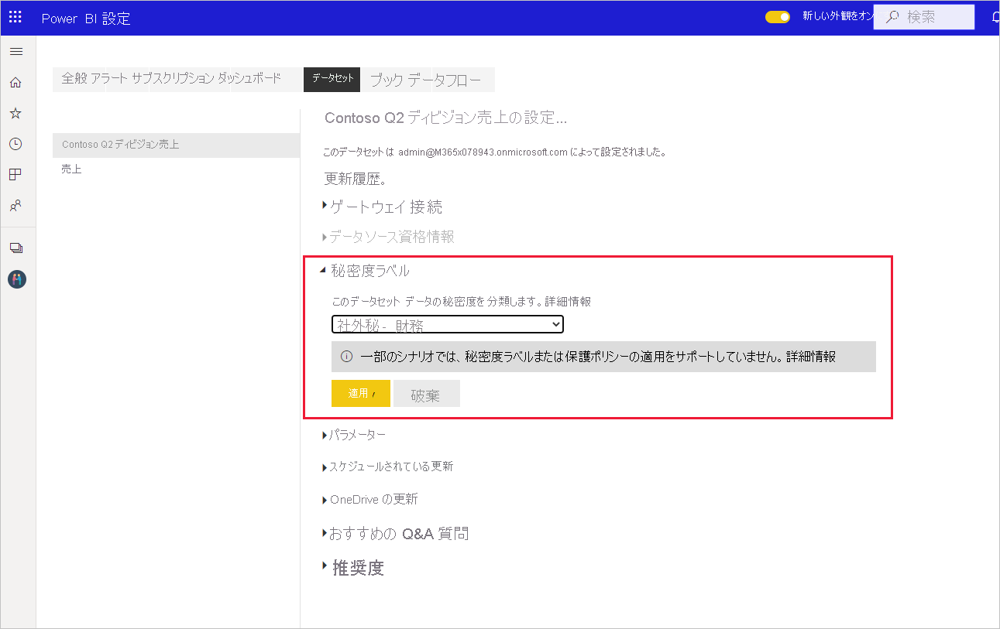
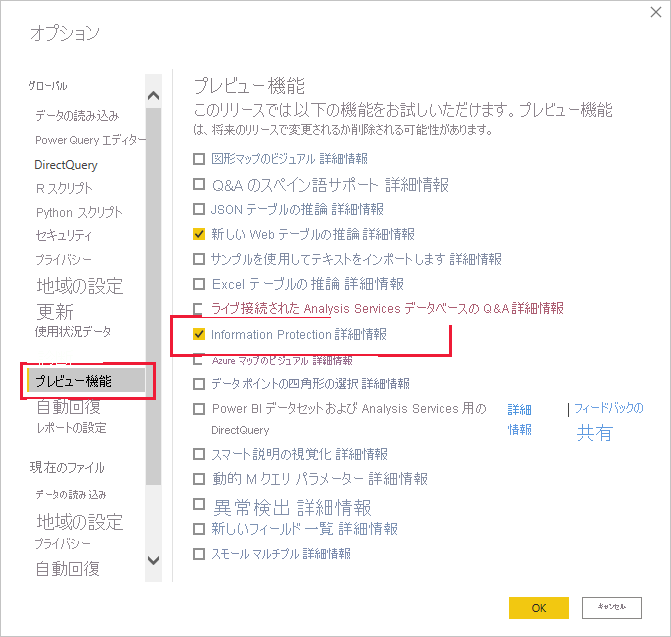
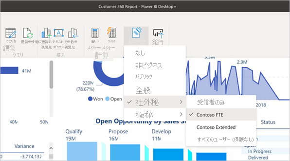

# Power BI で秘密度ラベルを適用する方法

レポート、ダッシュボード、データセット、データフロー、.pbix ファイルに対して Microsoft Information Protection の秘密度ラベルを使用すると、無許可のデータ アクセスや漏洩から機密コンテンツを保護できます。 秘密度ラベルを使用してデータに正しくラベルを付けると、承認されたユーザーのみがデータにアクセスできるようになります。 この記事では、Power BI サービスと Power BI Desktop で秘密度ラベルを適用する方法について説明します。

秘密度ラベルの詳細については、「[Power BI における秘密度ラベル](service-security-sensitivity-label-overview.md)」を参照してください。

## Power BI サービスで秘密度ラベルを適用する

Power BI サービスでは、レポート、ダッシュボード、データセット、データフローに対して秘密度ラベルを適用できます。

Power BI サービスで秘密度ラベルを適用できるようにするには:
* ユーザーは、[Power BI Pro ライセンス](./service-admin-purchasing-power-bi-pro.md)と、ラベルを適用するコンテンツに対する編集アクセス許可を、持っている必要があります。
* 組織で秘密度ラベルが有効にされている必要があります。 それについて確認したい場合は、Power BI 管理者に問い合わせてください。
* 「[Power BI で秘密度ラベルを有効にする](./service-security-enable-data-sensitivity-labels.md)」で説明されているように、ユーザーは秘密度ラベルを適用するためのアクセス許可を持つセキュリティ グループに属している必要があります。
* すべての[ライセンスとその他の要件](./service-security-enable-data-sensitivity-labels.md#licensing-and-requirements)を満たしている必要があります。

テナントでデータ保護が有効になっていると、ダッシュボード、レポート、データセット、データフローのリスト ビューの秘密度列に秘密度ラベルが表示されます。

**レポートまたはダッシュボードの秘密度ラベルを適用または変更するには**
1. **[その他のオプション (…)]** をクリックします。
1. **[設定]** を選択します。
1. 横にある設定ウィンドウで適切な秘密度ラベルを選択します。
1. 設定を保存します。

次の画像は、レポートでの手順を図示したものです。

**データセットまたはデータフローの秘密度ラベルを適用または変更するには**

1. **[その他のオプション (…)]** をクリックします。
1. **[設定]** を選択します。
1. データセットまたはデータフローのどちらか関係のあるタブを選択します。
1. 秘密度ラベルのセクションを展開し、適切な秘密度ラベルを選択します。
1. 設定を適用します。

次の 2 つの画像は、データセットでの手順を図示したものです。

**[その他のオプション (…)]** を選択し、 **[設定]** を選択します。

データセットの設定タブで、秘密度ラベルのセクションを開き、目的の秘密度ラベルを選択して、 **[適用]** をクリックします。

## Power BI Desktop で秘密度ラベルを適用する (プレビュー)

>[!NOTE]
>ユーザーが Power BI Desktop の Information Protection プレビュー機能にオプトインしてから最初の 48 時間は、**秘密度ラベルが適用された .pbix ファイルに関する問題が発生することがあります (サービスへの .pbix の発行や、サービスからの .pbix のダウンロードなど)** 。 このような問題は想定されるものであり、48 時間以内に自動的に解決されます。

Power BI Desktop で秘密度ラベルを使用するには:
* [Power BI Pro ライセンス](./service-admin-purchasing-power-bi-pro.md)が必要です。
* 組織で秘密度ラベルが有効にされている必要があります。 それについて確認したい場合は、Power BI 管理者に問い合わせてください。
* 「[Power BI で秘密度ラベルを有効にする](./service-security-enable-data-sensitivity-labels.md)」で説明されているように、ユーザーは秘密度ラベルを適用するためのアクセス許可を持つセキュリティ グループに属している必要があります。
* すべての[ライセンスとその他の要件](./service-security-enable-data-sensitivity-labels.md#licensing-and-requirements)を満たしている必要があります。
* Power BI Desktop で Information Protection プレビュー機能のスイッチをオンにする必要があります。 [ホーム] タブに [秘密度] ボタンが表示されている場合、プレビュー機能はオンになっています。 ボタンが表示されない場合は、 **[ファイル] > [オプションと設定] > [オプション] > [プレビュー機能]** に移動し、 **[Information Protection]** の横にあるチェック ボックスをオンにします。

    

    Information Protection のプレビュー オプションが表示されない場合は、Information Protection プレビュー機能が組織に対してブロックされている可能性があります。 この場合は、Power BI 管理者に問い合わせてください。

    >[!NOTE]
    >Information Protection プレビュー機能を有効にした後、秘密度ラベルを使い始めるには、Desktop を再起動する必要があります。
* サインインしている必要があります。

作業中のファイルに秘密度ラベルを適用するには、[ホーム] タブの [秘密度] ボタンをクリックし、表示されるメニューから目的のラベルを選択します。

>[!NOTE]
> プレビュー機能で秘密度ラベル機能をオンにしても、[秘密度] ボタンが表示されない場合は、適切なライセンスを持っていないこと、または秘密度ラベルを適用するためのアクセス許可を持つセキュリティ グループに属していないことを、示している可能性があります。「[Power BI で秘密度ラベルを有効にする](./service-security-enable-data-sensitivity-labels.md)」の説明を参照してください。

ラベルを適用すると、ステータス バーにそれが表示されます。

### サービスとの間で .pbix ファイルをアップロードまたはダウンロードするときの秘密度ラベル
* Desktop から Power BI サービスに .pbix ファイルを発行するとき、または **[データを取得]** を使用して .pbix ファイルを直接 Power BI サービスにアップロードするときは、サービスで作成されるレポートとデータセットの両方に .pbix ファイルのラベルが適用されます。 発行またはアップロードされた .pbix ファイルによって既存のアセット (つまり、.pbix ファイルと同じ名前を持つアセット) が置き換えられる場合は、.pbix ファイルのラベルでそれらのアセットのラベルが上書きされます。
* Power BI サービスで ".pbix へのダウンロード" を使用するとき、ダウンロードされるレポートとデータセットの両方にラベルがあり、それらのラベルが異なる場合、2 つのうちで制限が厳しい方のラベルが .pbix ファイルに適用されます。

## 秘密度ラベルを削除する

### サービス
レポート、ダッシュボード、データセット、またはデータフローから秘密度ラベルを削除するには、[Power BI サービスでラベルを適用するときに使用するのと同じ手順](#apply-sensitivity-labels-in-the-power-bi-service)に従いますが、データの秘密度の分類を求められたら、 **[(なし)]** を選択します。

### デスクトップ
ラベルと共に保存された .pbix ファイルからの秘密度ラベルの削除は、現在 Desktop ではサポートされていません。 そのような場合は、ファイルを Power BI サービスに発行し、サービスでその後のレポートおよびデータセットからラベルを削除することをお勧めします。

## 考慮事項と制限事項

Power BI における秘密度ラベルの制限一覧については、「[Power BI における秘密度ラベル](service-security-sensitivity-label-overview.md#limitations)」を参照してください。

## 次の手順

この記事では、Power BI で秘密度ラベルを適用する方法を説明しました。 次の記事では、Power BI におけるデータ保護の詳細について説明しています。 

* [Power BI の秘密度ラベルの概要](./service-security-sensitivity-label-overview.md)
* [Power BI で秘密度ラベルを有効にする](./service-security-enable-data-sensitivity-labels.md)
* [Power BI 内で Microsoft Cloud App Security の制御を使用する](./service-security-using-microsoft-cloud-app-security-controls.md)