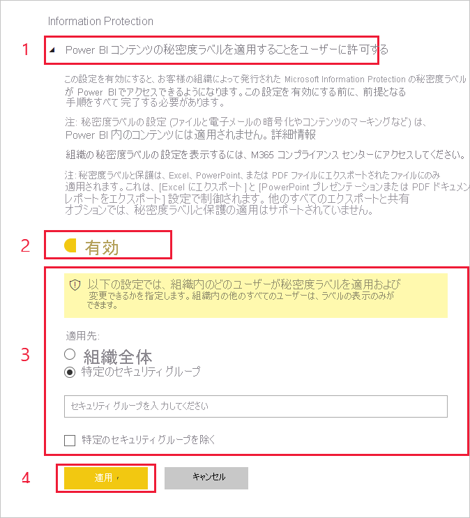

# Power BI で秘密度ラベルを有効にする

[Microsoft Information Protection 秘密度ラベル](/microsoft-365/compliance/sensitivity-labels)を Power BI で使用するには、テナント上で有効にする必要があります。 この記事では、Power BI 管理者がそれを行う方法について説明します。 Power BI の秘密度ラベルの概要については、「[Power BI における秘密度ラベル](service-security-sensitivity-label-overview.md)」を参照してください。 Power BI で秘密度ラベルを適用する方法の詳細については、「[秘密度ラベルを適用する](./service-security-apply-data-sensitivity-labels.md)」を参照してください。 

秘密度ラベルが有効になっているとき:

* 組織内で指定されたユーザーおよびセキュリティ グループは、Power BI のコンテンツを分類して[秘密度ラベルを適用](./service-security-apply-data-sensitivity-labels.md)することができます。 Power BI サービスの場合、これはレポート、ダッシュボード、データセット、データフローを意味します。 Power BI Desktop の場合は、.pbix ファイルを意味します。
* サービスを使用すると、組織のすべてのメンバーがそれらのラベルを表示できます。 Desktop を使用すると、組織内でラベルを公開されているメンバーだけがラベルを表示できます。

秘密度ラベルを有効にするには、Azure Information Protection ライセンスが必要です。 詳細については、「[ライセンスと要件](#licensing-and-requirements)」を参照してください。

>[!NOTE]
>ユーザーが Information Protection プレビュー機能にオプトインしてから最初の 48 時間は、**秘密度ラベルが適用された .pbix ファイルに関する問題が発生することがあります (サービスへの .pbix の発行や、サービスからの .pbix のダウンロードなど)** 。 このような問題は想定されるものであり、48 時間以内に自動的に解決されます。

## ライセンスと要件

* Power BI 内で Microsoft Information Protection の秘密度ラベルを適用または表示するには、Azure Information Protection Premium P1 または Premium P2 ライセンスが必要です。 Azure Information Protection は、スタンドアロンとして、またはいずれかの Microsoft ライセンス スイートを介して購入できます。 詳細については、「[Azure Information Protection の価格](https://azure.microsoft.com/pricing/details/information-protection/)」を参照してください。

    >[!NOTE]
    > 組織で Azure Information Protection 秘密度ラベルを使用している場合、ラベルを Power BI で使用するには、Microsoft Information Protection 統合ラベル付けプラットフォームに移行する必要があります。 [秘密度ラベルの移行の詳細を確認してください](/azure/information-protection/configure-policy-migrate-labels)。

* Power BI のコンテンツとファイルにラベルを適用できるようにするには、ユーザーは前述のいずれかの Azure Information Protection ライセンスに加えて、Power BI Pro または Premium Per User (PPU) ライセンスも持っている必要があります。

* Office アプリには[秘密度レベルの表示や適用を行う Office 独自のライセンス要件があります]( https://docs.microsoft.com/microsoft-365/compliance/get-started-with-sensitivity-labels#subscription-and-licensing-requirements-for-sensitivity-labels )。

* テナントで秘密度ラベルを有効にする前に、関連するユーザーやグループに対して秘密度ラベルが定義され、公開されていることを確認します。 詳細については、「[機密ラベルとそのポリシーを作成して構成する](/microsoft-365/compliance/create-sensitivity-labels)」を参照してください。

* Desktop で秘密度ラベルを使用するには、Desktop December 2020 リリース以降が必要です。

    >[!NOTE]
    > December 2020 より前のバージョンの Desktop を使用して保護された .pbix ファイルを開こうとすると失敗し、Desktop のバージョンのアップグレードを求めるメッセージが表示されます。

## 秘密度ラベルを有効にする

サービスと Desktop の両方で秘密度ラベルを使用するには、先にテナントでそれを有効にする必要があります。 このセクションでは、テナントの設定でそれらを有効にする方法について説明します。 Desktop に関するその他の考慮事項については、後の「[組織全体で Desktop の秘密度ラベルを無効にする](#disable-sensitivity-labels-in-desktop-across-your-org)」を参照してください。 

テナントで秘密度ラベルを有効にするには、Power BI **管理ポータル** に移動し、 **[テナント設定]** ペインを開き、 **[Information Protection]** セクションを見つけます。

![[Information Protection] セクションを探す](media/service-security-enable-data-sensitivity-labels/enable-data-sensitivity-labels-01.png)

**[Information Protection]** セクションで、次の手順を実行します。
1. **[Power BI コンテンツの秘密度ラベルを適用することをユーザーに許可する]** を開きます。
1. トグルを有効にします。
1. Power BI 資産の秘密度ラベルを適用および変更できるユーザーを定義します。 既定では、組織内のすべてのユーザーが秘密度ラベルを適用できます。 ただし、特定のユーザーまたはセキュリティ グループに対してのみ秘密度ラベルの設定を有効にすることができます。 組織全体または特定のセキュリティ グループのどちらかを選択すると、ユーザーまたはセキュリティ グループの特定のサブセットを除外できます。
   
   * 組織全体に対して秘密度ラベルが有効になっている場合、通常、例外はセキュリティ グループです。
   * 特定のユーザーまたはセキュリティ グループに対してのみ秘密度ラベルが有効になっている場合、通常、例外は特定のユーザーです。  
    この方法を使用すると、特定のユーザーが Power BI 内で秘密度ラベルを適用するためのアクセス許可を持つグループに属している場合でも、適用できないようにすることが可能です。

1. **[適用]** を押します。

> [!IMPORTANT]
> 資産に対する "*作成*" および "*編集*" アクセス許可を持ち、このセクション内で設定した関連するセキュリティ グループに属している Power BI Pro ユーザーのみが秘密度ラベルを設定および編集できるようになります。 このグループに属していないユーザーは、ラベルを設定および編集することはできません。  

## 組織全体で Desktop の秘密度ラベルを無効にする

組織で .pbix ファイルに秘密度ラベルが **使用されない** ようにする必要がある場合、Power BI 管理者は、グループ ポリシーを作成して、ユーザーが .pbix ファイルを分類および保護したり、既に保護が適用されているファイルを開いたりするのを、Power BI でブロックすることができます。 このようなポリシーを作成するには:

1. [レジストリ エディター](https://support.microsoft.com/windows/how-to-open-registry-editor-in-windows-10-deab38e6-91d6-e0aa-4b7c-8878d9e07b11)を開きます。

1. キー **HKEY_CURRENT_USER\SOFTWARE\Policies\Microsoft\Microsoft Power BI Desktop** を見つけます。

1. **EnableInformationProtection** という値名を見つけて、**false** に設定します。

Power BI Desktop での秘密度ラベルの使用に関するその他の制限事項と考慮事項については、[秘密度ラベルの概要](./service-security-sensitivity-label-overview.md#limitations)に関するページを参照してください。

## トラブルシューティング

Power BI では、Microsoft Information Protection 秘密度ラベルを使用します。 そのため、機密ラベルを有効にしようとしてエラー メッセージが表示された場合は、次のいずれかが原因として考えられます。

* Azure Information Protection [ライセンス](#licensing-and-requirements)を持っていない。
* 秘密度ラベルが Power BI でサポートされている Microsoft Information Protection バージョンに[移行](#enable-sensitivity-labels)されていない。
* Microsoft Information Protection 秘密度ラベルが[組織内で定義](#enable-sensitivity-labels)されていない。

## 考慮事項と制限事項

Power BI における秘密度ラベルの制限一覧については、「[Power BI における秘密度ラベル](service-security-sensitivity-label-overview.md#limitations)」を参照してください。

## 次の手順

この記事では、Power BI 内で秘密度ラベルを有効にする方法を説明しました。 次の記事では、Power BI におけるデータ保護の詳細について説明しています。 

* [Power BI の秘密度ラベルの概要](service-security-sensitivity-label-overview.md)
* [Power BI で秘密度ラベルを適用する方法](./service-security-apply-data-sensitivity-labels.md)
* [Power BI 内で Microsoft Cloud App Security の制御を使用する](service-security-using-microsoft-cloud-app-security-controls.md)
* [保護メトリック レポート](service-security-data-protection-metrics-report.md)