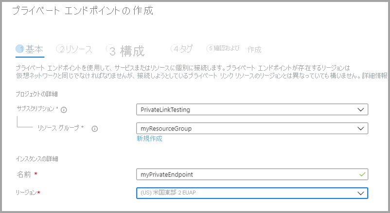
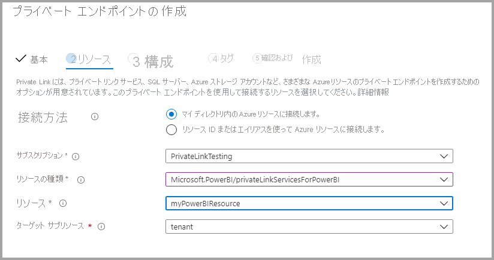
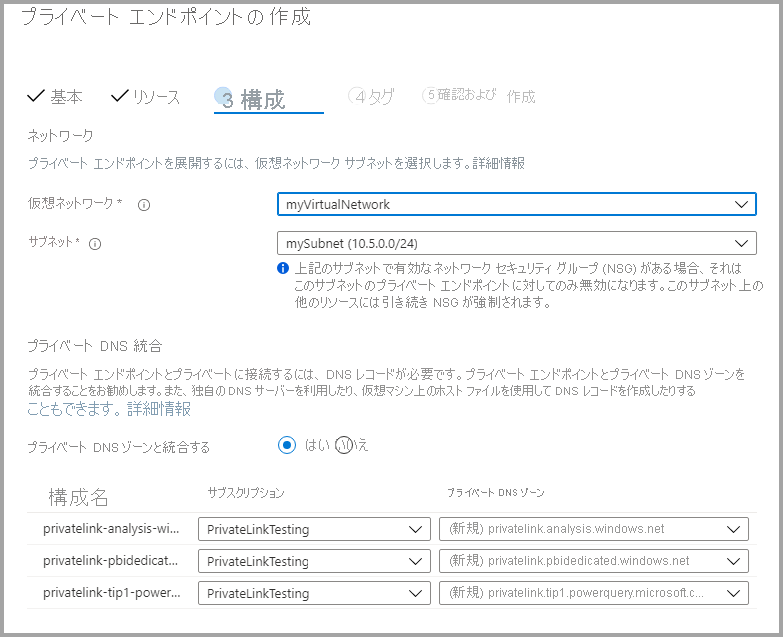

# <a name="private-links-for-accessing-power-bi"></a>Power BI にアクセスするためのプライベート リンク

Azure ネットワークは Azure Private Links 機能を備えています。これは Power BI が Azure Networking Private エンドポイント経由で安全なアクセスを提供することを可能にします。 Azure Private Link およびプライベート エンドポイントを使用すると、Microsoft のバックボーン ネットワーク インフラストラクチャを使用してデータ トラフィックがプライベートに送信されるため、データはインターネットを経由しません。 

プライベート リンクを使用すると、Power BI ユーザーが Power BI サービス内のリソースにアクセスするとき、Microsoft プライベート ネットワーク バックボーンが使用されるようになります。

[Azure Private Link](https://azure.microsoft.com/services/private-link/) に関するページで詳細をご確認ください。

## <a name="understanding-private-links"></a>プライベート リンクについて

プライベート リンクを使用すると、組織の Power BI 成果物 (レポートやワークスペースなど) "*に*" 送信されるトラフィックが組織の構成済みのプライベート リンクのネットワーク パスを常に経由することが保証されます。 ご利用の Power BI 成果物へのユーザー トラフィックは、確立されたプライベート リンクからのものである必要があります。構成されたネットワーク パスからのものではないすべての要求を拒否するように Power BI を構成することができます。 

クラウド内またはオンプレミスにかかわらず、Power BI から外部データ ソースへのトラフィックのセキュリティ保護は、プライベート リンクによって保証されるものでは "*ありません*"。 代わりに、ご利用のデータ ソースをさらにセキュリティで保護するためのファイアウォール規則と仮想ネットワークを構成する必要があります。 

### <a name="power-bi-and-private-links-integration"></a>Power BI とプライベート リンクの統合

Power BI 用の Azure Private Endpoint は、Azure Private Link を利用して、Power BI サービスにプライベートにかつ安全に接続するためのネットワーク インターフェイスです。   

プライベート エンドポイントの統合により、サービスとしてのプラットフォーム (PaaS) サービスを、顧客の仮想およびオンプレミスのネットワークからプライベートにデプロイおよびアクセスすることができます。なおサービスは顧客のネットワークの外部でも実行されます。 プライベート エンドポイントとは、クライアントが特定のサービスへの接続を開始できるようにするが、そのサービスが顧客ネットワークへの接続を開始することは許可しない一方向のテクノロジです。 このプライベート エンドポイント統合パターンでは、顧客のネットワーク ポリシー構成とは無関係にサービスが動作するため、管理の分離を実現することができます。 マルチテナント サービスの場合、このプライベート エンドポイント モデルには、同じサービス内でホストされている他の顧客のリソースにアクセスできないようにするためにリンク識別子が用意されています。 プライベート エンドポイントを使用する場合、統合を使用してサービスからアクセスできる他の PaaS サービス リソースのセットは限られています。  

Power BI サービスによって実装されるのは、サービス エンドポイントではなく、プライベート エンドポイントです。  

Power BI でプライベート リンクを使用すると、次のような利点があります。

1. プライベート リンクを使用すると、トラフィックが Azure バックボーン経由で Azure クラウドベースのリソース用のプライベート エンドポイントに流れるようになります。 

2. オンプレミスのアクセスなど、Azure 以外をベースにしたインフラストラクチャからのネットワーク トラフィック分離の場合、顧客の ExpressRoute または仮想プライベート ネットワーク (VPN) が構成されている必要があります。  

## <a name="using-secure-private-links-to-access-power-bi"></a>セキュリティで保護されたプライベート リンクを使用して Power BI にアクセスする

Power BI では、組織が Power BI にプライベート アクセスできるようにするエンドポイントを構成して使用することができます。 プライベート リンクを構成するには、Power BI 管理者であり、Azure で、Virtual Machines (VM) や Virtual Network (V-Net) などのリソースを作成して構成するためのアクセス許可を持っている必要があります。 

プライベート リンクから Power BI に安全にアクセスできるようにする手順は、次のとおりです。

1. [Power BI のプライベート リンクを有効にする](#enable-private-links-for-power-bi)
2. [Azure portal で Power BI リソースを作成する](#create-a-power-bi-resource-in-the-azure-portal)
3. [仮想ネットワークの作成](#create-a-virtual-network)
4. [仮想マシン (VM) の作成](#create-a-virtual-machine-vm)
5. [プライベート エンドポイントを作成する](#create-a-private-endpoint)
6. [リモート デスクトップ (RDP) を使用して VM に接続](#connect-to-a-vm-using-remote-desktop-rdp)
7. [仮想マシンから Power BI にプライベート アクセスする](#access-power-bi-privately-from-the-vm)
8. [Power BI のパブリック アクセスを無効にする](#disable-public-access-for-power-bi)

以下のセクションでは、各手順について詳細に説明します。

## <a name="enable-private-links-for-power-bi"></a>Power BI のプライベート リンクを有効にする

開始するには、app.powerbi.com で管理者として Power BI にログインし、管理ポータルに移動します。 **[テナント設定]** を選択して **[高度なネットワーク]** までスクロールし、次の図に示すように、ラジオ ボタンをトグルして **[Azure Private Link]** をオンにします。 

テナントのプライベート リンクを構成するには、約 15 分かかります。これには、Power BI サービスとプライベート通信するために、テナント用の個別の FQDN を構成することが含まれます。

![[Azure Private Link] をオンにする](media/service-security-private-links/service-private-links-01.png)

完了したら、次の手順に進むことができます。

## <a name="create-a-power-bi-resource-in-the-azure-portal"></a>Azure portal で Power BI リソースを作成する

次に、[Azure portal](https://portal.azure.com) にサインインし、**Azure テンプレート** を使用して Power BI リソースを作成します。 ARM テンプレート例のパラメーターを、次の表に示すとおりに置き換えて Power BI リソースを作成します。


|**パラメーター**  |**Value**  |
|---------|---------|
|```<resource-name>```    | myPowerBIResource         |
|```<tenant-object-id>```     | 52d40f65-ad6d-48c3-906f-1ccf598612d4         |

ARM テンプレートを作成する 

```
{
  "$schema": "http://schema.management.azure.com/schemas/2015-01-01/deploymentTemplate.json#",
  "contentVersion": "1.0.0.0",
  "parameters": {},
  "resources": [
      {
          "type":"Microsoft.PowerBI/privateLinkServicesForPowerBI",
          "apiVersion": "2020-06-01",
          "name" : "<resource-name>",
          "location": "global",
          "properties" : 
          {
               "tenantId": "<tenant-object-id>"
          }
      }
  ]
}
```

表示されたダイアログで、チェックボックスをオンにして使用条件に同意し、 **[購入]** を選択します。


## <a name="create-a-virtual-network"></a>仮想ネットワークの作成

次の手順では、仮想ネットワークとサブネットを作成します。 次の表のサンプル パラメーターを自身の値に置き換えて、仮想ネットワークとサブネットを作成します。

| パラメーター |   値| 
|---------|---------|
| ```<resource-group-name>```   | myResourceGroup |
| ```<virtual-network-name>```  | myVirtualNetwork |
| ```<region-name>```   | 米国中部  |
| ```<IPv4-address-space>```    | 10.1.0.0/16 |
| ```<subnet-name>```   | mySubnet |
| ```<subnet-address-range>```  | 10.1.0.0/24 |

1. 画面の左上で、 **[リソースの作成] > [ネットワーク] > [仮想ネットワーク]** の順に選択するか、検索ボックスで **Virtual network** を検索します。
2. **[仮想ネットワークの作成]** の **[基本]** タブで次の情報を入力または選択します。

    |設定 | 値 |
    |-------------------|---------|
    |**プロジェクトの詳細**|
    |サブスクリプション | Azure サブスクリプションを選択する |
    |リソース グループ |   **[新規作成]** を選択し、「```<resource-group-name>```」と入力して **[OK]** を選択するか、パラメーターに基づいて既存の ```<resource-group-name>``` を選択します。 |
    |**インスタンスの詳細** |
    | 名前  | 「```<virtual-network-name>```」と入力します |
    |リージョン | ```<region-name>``` を選択 |
    
    次の図は、 **[基本]** タブを示しています。
    
    ![仮想ネットワークの作成、[基本] タブ](media/service-security-private-links/service-private-links-03.png)


3. 次に、 **[IP アドレス]** タブを選択するか、フォームの下部にある **[次へ: IP アドレス] ボタン** を選択します。 [IP アドレス] タブで、次の情報を入力します。

    |設定 | 値 |
    |-------------------|---------|
    |IPv4 アドレス空間 |「```<IPv4-address-space>```」と入力します |
    
    ![仮想ネットワークの作成、[IP アドレス] タブ](media/service-security-private-links/service-private-links-04.png)
    

4. **[サブネット名]** で語 "*既定値*" を選択し、 **[サブネットの編集]** で次の情報を入力します。

    |設定 | 値 |
    |-------------------|---------|
    | サブネット名 |「```<subnet-name>```」と入力します |
    | サブネットのアドレス範囲 | 「```<subnet-address-range>```」と入力します |
    
    
    ![仮想ネットワークの作成、[サブネットの編集] タブ](media/service-security-private-links/service-private-links-05.png)

5. **[保存]** を選択し、 **[確認と作成]** タブを選択するか、 **[確認と作成]** ボタンを選択します。 

6. そのうえで **[Create]\(作成\)** を選択します。

これらの手順を完了したら、次のセクションで説明するように、仮想マシン (VM) を作成できます。

## <a name="create-a-virtual-machine-vm"></a>仮想マシン (VM) の作成


次の手順では、仮想ネットワークと、仮想マシン (VM) をホストするサブネットを作成します。

1. Azure portal の画面の左上で、 **[リソースの作成] > [コンピューティング] > [仮想マシン]** の順に選択します。

2. **[仮想マシンの作成 - 基本]** で、次の情報を入力または選択します。

    |設定 | 値 |
    |-------------------|---------|
    |**プロジェクトの詳細**||
    |サブスクリプション | Azure サブスクリプションを選択する |
    |リソース グループ |   前のセクションで作成した **[myResourceGroup]** を選択します。 |
    |**インスタンスの詳細** ||
    |名前 | 「**myVm**」と入力します |
    |リージョン | **[米国中部]** を選択します。 |
    |可用性のオプション| 既定値 **[インフラストラクチャ冗長は必要ありません]** のままにします |
    |Image | **[Windows 10 Pro]** を選択します |
    |サイズ | 既定値 **[Standard DS1 v2]** のままにします |
    |管理者アカウント ||
    |ユーザー名 |任意のユーザー名を入力します |
    |Password | 任意のパスワードを入力します。 パスワードは 12 文字以上で、[定義された複雑さの要件](/azure/virtual-machines/windows/faq#what-are-the-password-requirements-when-creating-a-vm)を満たす必要があります |
    |パスワードの確認 | パスワードを再入力します |
    |受信ポートの規則 ||
    |パブリック受信ポート | 既定値 **[なし]** のままにします |
    |コスト削減 ||
    |Windows ライセンスを既にお持ちの場合 |  既定値 **[なし]** のままにします |

3. 次に、 **[次のステップ: ディスク]** を選択します
4. **[仮想マシンの作成 - Disk]** で、既定値のままにし、 **[Next: Networking]\(次へ : ネットワーク\)** を選択します。
5. **[仮想マシンの作成 - ネットワーク]** で、次の情報を選択します。

    |設定 | 値 |
    |-------------------|---------|
    |仮想ネットワーク|   既定値 **[MyVirtualNetwork]** のままにします|
    |アドレス空間| 既定値 **[10.1.0.0/24]** のままにします|
    |Subnet |既定値 **[mySubnet (10.1.0.0/24)]** のままにします|
    |パブリック IP| 既定値 **[(新規) myVm-ip]** のままにします|
    |パブリック受信ポート|  **[Allow selected]\(選択した項目を許可する\)** を選択します|
    |受信ポートの選択|  **[RDP]** を選択します|

6. **[Review + create]\(レビュー + 作成\)** を選択します。 **[確認および作成]** ページが表示され、Azure によって構成が検証されます。
7. "**証に成功しました**" というメッセージが表示されたら、 **[作成]** を選択します。


## <a name="create-a-private-endpoint"></a>プライベート エンドポイントの作成

次の手順 (このセクションで説明します) では、Power BI のプライベート エンドポイントを作成します。

1. Azure portal 画面の左上で、 **[リソースの作成] > [ネットワーク] > [プライベート リンク センター (プレビュー)]** を選択します。
2. **[プライベート リンク センター - 概要]** の **[サービスへのプライベート接続を構築する]** オプションで、 **[プライベート エンドポイントの作成]** を選択します。
3. **[プライベート エンドポイントの作成 (プレビュー) - 基本]** ウィンドウで、次の詳細を入力または選択します。

    |設定 | 値 |
    |-------------------|---------|
    |**プロジェクトの詳細** ||
    |サブスクリプション|  Azure サブスクリプションを選択する|
    |リソース グループ|    **[myResourceGroup]** を選択します。 これは前のセクションで作成しました|
    |**インスタンスの詳細** ||
    |名前|  「*myPrivateEndpoint*」と入力します。 この名前が使用済みの場合は、一意の名前を作成します|
    |リージョン|    **[米国中部]** を選択します。|
    
    次の図は、 **[プライベート エンドポイントの作成 - 基本]** ウィンドウを示しています。
    
    

4. この情報の作成が完了したら、 **[次へ: リソース]** を選択し、 **[プライベート エンドポイントの作成 - リソース]** ページで、次の情報を入力または選択します。

    |設定 | 値 |
    |-------------------|---------|
    |接続方法| [マイ ディレクトリ内の Azure リソースに接続します] を選択します|
    |サブスクリプション|  サブスクリプションを選択します|
    |リソースの種類| **[Microsoft.PowerBI/privateLinkServicesForPowerBI]** を選択します |
    |リソース|  myPowerBIResource|
    |ターゲット サブリソース|   Tenant|
    
    次の図は、 **[プライベート エンドポイントの作成 - リソース]** ウィンドウを示しています。
    
    

5. この情報を正しく入力したら、 **[次へ: 構成]** を選択し、 **[プライベート エンドポイントの作成 (プレビュー) - 構成]** で次の情報を入力または選択します。

    |設定 | 値 |
    |-------------------|---------|
    |**ネットワーク** ||
    |仮想ネットワーク|   *[myVirtualNetwork]* を選択する |
    |Subnet |*mySubnet* の選択 |
    |**プライベート DNS 統合** ||
    |プライベート DNS ゾーンとの統合|   **[はい]** を選択します |
    |プライベート DNS ゾーン   |選択 <br> " *(新規)privatelink.analysis.windows.net*" <br> " *(新規)privatelink.pbidedicated.windows.net*" <br> " *(新規)privatelink.tip1.powerquery.microsoft.com*" |
    
    次の図は、 **[プライベート エンドポイントの作成 - 構成]** ウィンドウを示しています。
    
    
    
    次に、 **[確認と作成]** を選択します。これにより、 **[確認と作成]** ページが表示され、Azure によって構成が検証されます。 "**証に成功しました**" というメッセージが表示されたら、 **[作成]** を選択します。

## <a name="connect-to-a-vm-using-remote-desktop-rdp"></a>リモート デスクトップ (RDP) を使用して VM に接続

**myVM** という名前の仮想マシンを作成したら、次の手順を使用してインターネットからそれに接続します。

1. ポータルの検索バーに、「*myVm*」と入力します。
2. **[接続]** を選択します。 **[接続]** ボタンを選択すると、 **[仮想マシンに接続する]** が開きます。
3. **[RDP ファイルのダウンロード]** を選択します。 リモート デスクトップ プロトコル ( .rdp) ファイルが作成され、お使いのコンピューターにダウンロードされます。
4. ダウンロードされた rdp ファイルを開きます。
5. メッセージが表示されたら、 **[Connect]** を選択します。
6. 前の手順で VM の作成時に指定したユーザー名とパスワードを入力します。
7. **[OK]** を選択します。
8. サインイン処理中に証明書の警告が表示される場合があります。 証明書の警告を受信する場合は、 **[はい]** または **[続行]** を選択します。

## <a name="access-power-bi-privately-from-the-vm"></a>VM から Power BI にプライベート アクセスする

次の手順は、以下の手順を使用して、前の手順で作成した仮想マシンから Power BI にプライベート アクセスします。 

1. myVM のリモート デスクトップで、PowerShell を開きます。
2. 「nslookup 52d40f65ad6d48c3906f1ccf598612d4-api.privatelink.analysis.windows.net」と入力します。
3. 次のようなメッセージが返されます。

    ```
    Server:  UnKnown
    Address:  168.63.129.16
    
    Non-authoritative answer:
    Name:    52d40f65ad6d48c3906f1ccf598612d4-api.privatelink.analysis.windows.net
    Address:  10.1.0.4
    ```

4. ブラウザーを開き、app.powerbi.com に移動して、Power BI にプライベート アクセスします。

## <a name="disable-public-access-for-power-bi"></a>Power BI のパブリック アクセスを無効にする

最後に、Power BI のパブリック アクセスを無効にする必要があります。 

app.powerbi.com に管理者としてログインし、**管理ポータル** に移動します。 **[テナント設定]** を選択して **[高度なネットワーク]** セクションまでスクロールします。 次の図に示すように、 **[パブリック インターネット アクセスのブロック]** セクションでトグル ボタンを有効にします。 組織によるパブリック インターネットから Power BI へのアクセスがシステムによって無効にされるまで約 15 分かかります。

以上で終了です。これらの手順に従うと、組織の Power BI は、プライベート リンクからのみアクセスでき、パブリック インターネットからアクセスすることはできません。 

## <a name="considerations-and-limitations"></a>考慮事項と制限事項

Power BI でプライベート リンクを使用する際に留意する必要がある考慮事項がいくつかあります。

* プライベート リンク環境を使用する場合、外部の画像またはテーマを使用することはできません。カスタム ビジュアルに影響を与える可能性があります
* プライベート リンク環境を使用する場合、[PDF にエクスポート] などのエクスポート サービス、レポートから Excel へのエクスポート、その他のエクスポート サービスは機能しません
* プライベート リンク環境では、SQL Server Reporting Services レポート (一般に RDL ファイルと呼ばれ、*.rdl 形式のファイル) はレンダリングされません
* インターネット アクセスが無効になっていて、データセットまたはデータフローが Power BI データセットまたはデータフローにデータ ソースとして接続している場合、接続は失敗します
* Private Links が有効になっているとき、使用状況メトリックは機能 "*しません*"。
* Power BI で **[パブリック インターネット アクセスのブロック]** を有効にすると、[Web に公開] は動作しません (淡色表示になります)


## <a name="next-steps"></a>次の手順

- [組織内の Power BI を管理する](service-admin-administering-power-bi-in-your-organization.md)  
- [Power BI 管理者の役割について](service-admin-role.md)  
- [組織内の Power BI を監査する](service-admin-auditing.md)  

他にわからないことがある場合は、 [Power BI コミュニティで質問してみてください](https://community.powerbi.com/)。
