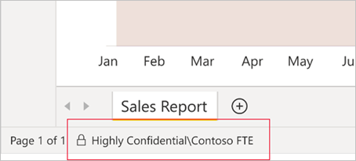
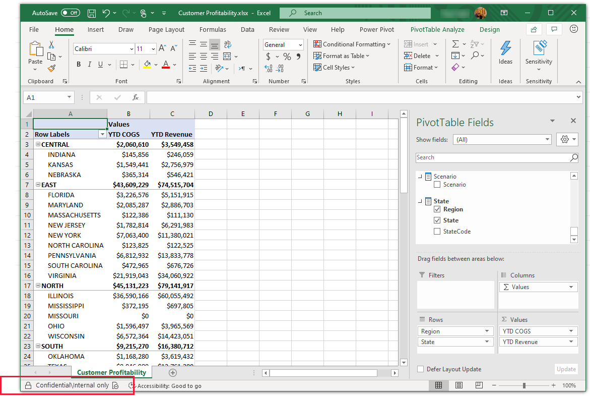

# Power BI における秘密度ラベル

この記事では、Power BI の Microsoft Information Protection 秘密度ラベルの機能について説明します。

ライセンス要件や前提条件など、テナントで秘密度ラベルを有効にする方法については、「[Power BI 内でデータの秘密度ラベルを有効にする](service-security-enable-data-sensitivity-labels.md)」を参照してください。

秘密度ラベルを Power BI のコンテンツとファイルに適用する方法については、「[Power BI で秘密度ラベルを適用する方法](./service-security-apply-data-sensitivity-labels.md)」を参照してください。

>[!NOTE]
>Power BI Desktop での秘密度ラベルのサポートは、現在プレビューの段階です。

## はじめに

Microsoft Information Protection 秘密度ラベルを使用すると、生産性や共同作業の能力を損なうことなく Power BI で重要なコンテンツを分類できます。 Power BI Desktop (プレビュー) と Power BI サービスの両方で適用することができ、最初にコンテンツの開発を開始する瞬間から、ライブ接続を介して Excel からアクセスされるときまで、機密データを保護できます。 秘密度ラベルは、Desktop とサービスの間で .pbix ファイル形式のコンテンツを移動するときに保持されます。

Power BI サービスでは、秘密度ラベルをデータセット、レポート、ダッシュボード、データフローに適用できます。 Excel、PowerPoint、PDF、または .pbix ファイルへのエクスポート、または他のサポートされているエクスポート シナリオ ([Excel で分析] や Excel でのライブ接続ピボットテーブルなど) を介して、ラベルが適用されたデータを Power BI から移動するときは、Power BI により、エクスポートされるファイルにラベルが自動的に適用され、ラベルのファイル暗号化設定に従って保護されます。 このようにして、Power BI の外部でも機密データの保護を維持できます。

さらに、Power BI Desktop で秘密度ラベルを .pbix ファイルに適用すると、Power BI サービスに発行される前であっても、データとコンテンツを Power BI の外部で安全に共有できます (たとえば、組織内のユーザーだけが、共有されている、またはメールに添付されている機密の .pbix ファイルを開くことができます)。 詳細については、「[秘密度ラベルを使用して暗号化を適用してコンテンツへのアクセスを制限する](/microsoft-365/compliance/encryption-sensitivity-labels)」を参照してください。

レポート、ダッシュボード、データセット、およびデータフローに対する秘密度ラベルは、Power BI サービスの多くの場所から表示できます。 レポートとダッシュボードの秘密度ラベルは、Power BI iOS および Android モバイル アプリと埋め込みビジュアルにも表示されます。 Desktop では、ステータス バーに秘密度ラベルが表示されます。

Power BI 管理者は Power BI 管理ポータルの[保護メトリック レポート](service-security-data-protection-metrics-report.md)を使用すると、Power BI テナントの機密データを完全に把握できます。 さらに、Power BI 監査ログには、ラベルの適用、削除、変更などのアクティビティに関する秘密度ラベル情報と、レポートやダッシュボードの表示などのアクティビティに関する秘密度ラベル情報が含まれているため、Power BI およびセキュリティ管理者は、監視、調査、およびセキュリティ アラートの目的で、機密性の高いデータの使用状況を把握できます。

## 重要な考慮事項

Power BI サービスの場合、秘密度ラベルを適用しても、コンテンツへのアクセスに影響は **ありません**。 サービスでのコンテンツへのアクセスは、Power BI のアクセス許可によってのみ管理されます。 ラベルが表示されている間、関連する暗号化設定 ([Microsoft 365 セキュリティ センター](https://security.microsoft.com/)または [Microsoft 365 コンプライアンス センター](https://compliance.microsoft.com/)で構成します) は適用されません。 これらは、Excel、PowerPoint、または PDF へのエクスポートや、.pbix へのダウンロードなど、サポートされているエクスポート パスを介してサービスから持ち出されるデータにのみ適用されます。

Power BI Desktop (プレビュー) の場合、暗号化が設定されている秘密度ラベルにより、コンテンツへのアクセスに影響が **あります**。 ユーザーが .pbix ファイルでの秘密度ラベルの暗号化設定に従って十分な[アクセス許可](#power-bi-desktop-preview)を持っていない場合、ファイルを開くことはできません。 さらに、Desktop では、作業内容を保存するときに、追加した秘密度ラベルと、それに関連付けられている暗号化設定が、保存される .pbix ファイルに適用されます。

サポートされていないエクスポート パスでは、秘密度ラベルとファイルの暗号化は **適用されません**。 Power BI 管理者は、サポートされていないエクスポート パスからのエクスポートをブロックすることができます。

>[!NOTE]
> レポートへのアクセスが許可されているユーザーには、[行レベル セキュリティ (RLS)](./service-admin-rls.md) によってアクセスが制限されない限り、基になるデータセット全体へのアクセスが許可されます。 レポート作成者は、秘密度ラベルを使用してレポートを分類し、およびラベルを付けることができます。 秘密度ラベルに保護の設定がある場合、Excel、PowerPoint、PDF へのエクスポート、.pbix へのダウンロード、 **[保存]** (Desktop) など、サポートされているエクスポート パスを介して Power BI からレポート データが持ち出されるときに、Power BI によってこれらの保護設定が適用されます。 承認されたユーザーのみが保護されたファイルを開くことができます。

### サポートされているエクスポート パス
Power BI サービスから持ち出されるデータへの、秘密度ラベルとそれに関連する保護の適用は、現在、次のエクスポート パスについてサポートされています。
* Excel、PDF ファイル (サービスのみ)、PowerPoint へのエクスポート。
* Power BI サービスの [Excel で分析]。これにより、Power BI データセットへのライブ接続を使用して Excel ファイルのダウンロードがトリガーされます。
* M365 E3 以降を使用しているユーザーの場合は、Power BI データセットへのライブ接続を使用した Excel のピボットテーブル。
* .pbix へのダウンロード (サービス)

>[!NOTE]
>Power BI サービスで **[.pbix のダウンロード]** を使用すると、ダウンロードされたレポートとそのデータセットでラベルが異なる場合、より制限の厳しいラベルが .pbix ファイルに適用されます。 

## Power BI での秘密度ラベルの動作

Power BI のコンテンツとファイルへの秘密度ラベルの適用は、そのリソースへのタグの適用と似ており、次のような利点があります。
* **カスタマイズ可能** - 個人用、公開、一般、社外秘、極秘など、組織内にあるさまざまなレベルの機密コンテンツのカテゴリを作成できます。
* **クリア テキスト** - ラベルはクリア テキストであるため、ユーザーは秘密度ラベルのガイドラインに従ってコンテンツの取り扱い方を簡単に理解できます。
* **永続的** - コンテンツに適用した秘密度ラベルは、そのコンテンツが Excel、PowerPoint、PDF ファイルにエクスポートされたり、.pbix にダウンロードされたり、保存されたり (Desktop で) しても付随しており、ポリシーを適用して徹底するための基礎になります。

Power BI の秘密度ラベルのしくみを簡単に説明した例を次に示します。 次の図は、Power BI サービスのレポートに秘密度ラベルを適用する方法、レポートのデータを Excel ファイルにエクスポートする方法、最後にエクスポートされたファイルで秘密度ラベルとその保護がどのように保持されるかを示しています。

コンテンツに適用する秘密度ラベルは、Power BI 全体で使用および共有される場合、コンテンツと共に保持され、ローミングされます。 このラベルを使用して、使用状況レポートを生成し、実際の機密コンテンツのアクティビティ データを確認できます。

## Power BI Desktop での秘密度ラベル (プレビュー)

秘密度ラベルは Power BI Desktop でも適用できます。 これにより、最初にコンテンツの開発を始める時点からデータを保護することができます。 Desktop で作業内容を保存すると、適用した秘密度ラベルとそれに関連するすべての暗号化設定が、結果として生成される .pbix ファイルに適用されます。 ラベルに暗号化が設定されている場合、ファイルは移動先や伝送方法に関係なく保護されています。 [必要な RMS アクセス許可](#power-bi-desktop-preview)を持っている場合にのみ、それを開くことができます。

>[!NOTE]
>* このプレビュー リリースでは、いくつかの制限が適用される場合があります。 「[制限事項](#limitations)」を参照してください。

Desktop で秘密度ラベルを適用した場合、サービスに作業内容を発行すると、またはその作業の .pbix ファイルをサービスにアップロードすると、データと共にラベルがサービスに転送されます。 サービスでは、ファイルで取得されるデータセットとレポートの両方にラベルが適用されます。 データセットとレポートに既に秘密度ラベルがある場合、それらのラベルは Desktop からのラベルによって上書きされます。
 
以前にサービスに発行されたことがない .pbix ファイルをアップロードし、その名前がサービスに既に存在するレポートまたはデータセットと同じである場合、アップロードは、ラベルを変更するために必要な RMS アクセス許可がアップローダーにある場合にのみ成功します。

同じことが、逆方向にも当てはまります。サービスで .pbix にダウンロードしてから、.pbix を Desktop に読み込むと、サービスでのラベルがダウンロードされた .pbix ファイルに適用され、そこから Desktop に読み込まれます。 サービス内のレポートとデータセットでラベルが異なる場合は、2 つのうち制限の厳しい方が、ダウンロードされる .pbix ファイルに適用されます。

Desktop でラベルを適用すると、ステータス バーにそれが表示されます。

[Power BI のコンテンツとファイルに秘密度ラベルを適用する方法については、こちらを参照してください](./service-security-apply-data-sensitivity-labels.md)。

## 新しいコンテンツの作成時の秘密度ラベルの継承

Power BI サービスで新しいレポートとダッシュボードが作成されると、以前に親データセットまたはレポートに適用されていた秘密度ラベルが自動的に継承されます。 たとえば、秘密度ラベルが "極秘" であるデータセットに基づいて作成された新しいレポートにも、"極秘" ラベルが自動的に付けられます。

次の図は、データセットに基づいて構築された新しいレポートに、そのデータセットの秘密度ラベルが自動的に適用される方法を示しています。

>[!NOTE]
>何らかの理由で秘密度ラベルを新しいレポートまたはダッシュボードに適用できない場合、Power BI では新しい項目の作成はブロック **されません**。

## データ ソースからの秘密度ラベルの継承 (プレビュー)

サポートされているデータ ソース内の秘密度ラベル付きのデータに接続する Power BI のデータセットが、それらのラベルを継承できるようになります。これにより、そのデータは、分類されセキュリティで保護されたまま、Power BI に取り込まれます。 現時点では、Azure Synapse Analytics (旧称 SQL Data Warehouse) と Azure SQL Database がサポートされています。 データ ソースからの継承のしくみと、組織で有効にする方法については、「[データ ソースからの秘密度ラベルの継承](service-security-sensitivity-label-inheritance-from-data-sources.md)」を参照してください。

## エクスポートされたデータの秘密度ラベルと保護

データが Power BI から Excel、PDF ファイル (サービスのみ)、または PowerPoint ファイルにエクスポートされるとき、Power BI によってエクスポートされるファイルに秘密度ラベルが自動的に適用され、ラベルのファイル暗号化設定に従って保護されます。 このように、機密データがどこにあっても保護された状態が維持されます。

Power BI からファイルをエクスポートするユーザーには、秘密度ラベルの設定に従ってそのファイルにアクセスして編集するアクセス許可が付与されます。ファイルの所有者アクセス許可は付与されません。

>[!NOTE]
>Power BI サービスで **[.pbix のダウンロード]** を使用すると、ダウンロードされたレポートとそのデータセットでラベルが異なる場合、より制限の厳しいラベルが .pbix ファイルに適用されます。 

データが .csv ファイルまたは他のサポートされていないエクスポート パスにエクスポートされるときは、秘密度ラベルと保護は適用されません。

エクスポート後のファイルに秘密度ラベルと保護を適用するとき、ファイルにコンテンツのマーキングが追加されることはありません。 ただし、コンテンツのマーキングを適用するようにラベルが構成されている場合は、ファイルを Office デスクトップ アプリで開いたとき、Azure Information Protection 統合ラベル付けクライアントによって自動的にマーキングが適用されます。 デスクトップ、モバイル、または Web アプリに対して組み込みのラベル付けを使用する場合、コンテンツのマーキングが自動的に適用されることはありません。 「[Office アプリがコンテンツのマーキングと暗号化を適用するとき](/microsoft-365/compliance/sensitivity-labels-office-apps#when-office-apps-apply-content-marking-and-encryption)」を参照してください。

データがファイルにエクスポートされるときにラベルを適用できない場合は、エクスポートに失敗します。 ラベルを適用できなかったためにエクスポートに失敗したかどうかを確認するには、タイトル バーの中央にあるレポートまたはダッシュボードの名前をクリックし、情報ドロップダウンが開いたら、"秘密度ラベルを読み込めません" と表示されているかどうかを確認します。 これは、一時的なシステムの問題の結果、または適用されたラベルが公開されていないか、セキュリティ管理者によって削除された場合に発生する可能性があります。

## [Excel で分析] の秘密度ラベル継承

Power BI データセットにライブ接続しながら Excel でピボットテーブルを作成するとき (この作業は [[Excel で分析]](../collaborate-share/service-analyze-in-excel.md) または [[Excel]](https://support.microsoft.com/office/create-a-pivottable-from-power-bi-datasets-31444a04-9c38-4dd7-9a45-22848c666884?ui=en-US&rs=en-US&ad=US) を利用し、Power BI から可能です)、関連付けられている保護と共に、データセットの秘密度ラベルが継承され、お使いの Excel ファイルに適用されます。 データセット上のラベルが後に変更され、制限が厳しくなった場合、データ更新時、リンクされている Excel ファイルで適用されているラベルが自動的に更新されます。

 
手動で設定された Excel の機密ラベルがデータセットの秘密度ラベルによって自動的に上書きされることはありません。 バナーから、データセットに秘密度ラベルがあることが通知され、それを適用することが推奨されます。

>[!NOTE]
>データセットの秘密度ラベルの制限が Excel ファイルの秘密度ラベルより制限が緩い場合、ラベルは継承されず、更新もされません。 Excel ファイルで制限の緩い秘密度ラベルが継承されることは決してありません。

## 埋め込みレポートとダッシュボードでの秘密度ラベルの永続化

Power BI レポート、ダッシュボード、およびビジュアルは、Microsoft Teams や SharePoint などのビジネス アプリケーション、または組織の Web サイトに埋め込むことができます。 秘密度ラベルが適用されているビジュアル、レポート、またはダッシュボードを埋め込むと、秘密度ラベルが埋め込みビューに表示され、データが Excel にエクスポートされるときにラベルとその保護が維持されます。

次の埋め込みシナリオがサポートされています。
* [組織向けの埋め込み](../developer/embedded/embed-sample-for-your-organization.md)
* Microsoft 365 アプリ (例: [Teams](../collaborate-share/service-embed-report-microsoft-teams.md) や [SharePoint](../collaborate-share/service-embed-report-spo.md))
* [セキュリティで保護された URL の埋め込み](../collaborate-share/service-embed-secure.md) (Power BI サービスからの埋め込み) 

## 配置パイプラインでの秘密度ラベル
配置パイプラインでは秘密度ラベルがサポートされています。 コンテンツがステージからステージに配置されるときに秘密度ラベルが処理される方法の詳細については、[配置パイプラインのドキュメント](../create-reports/deployment-pipelines-process.md#item-properties-copied-during-deployment)を参照してください。

## Power BI モバイル アプリの秘密度ラベル

秘密度ラベルは、Power BI モバイル アプリのレポートとダッシュボードで表示できます。 レポートまたはダッシュボードの名前の近くにあるアイコンは、秘密度ラベルがあることを示します。また、ラベルの種類とその説明は、レポートまたはダッシュボードの情報ボックスに表示されます。

## サポートされているクラウド
秘密度ラベルはグローバル (パブリック) クラウド内のテナントでのみサポートされており、国内クラウドなどのクラウド内のテナントではサポートされていません。

## ライセンスと要件

「[ライセンスと要件](service-security-enable-data-sensitivity-labels.md#licensing-and-requirements)」を参照してください。

## 秘密度ラベルの作成と管理

秘密度ラベルは、[Microsoft 365 セキュリティ センター](https://security.microsoft.com/)または [Microsoft 365 コンプライアンス センター](https://compliance.microsoft.com/)内で作成および管理します。

これらのセンターのどちらかで秘密度ラベルにアクセスするには、 **[分類] > [秘密度ラベル]** に移動します。 これらの秘密度ラベルは、Azure Information Protection、Office アプリ、Office 365 サービスなど、複数の Microsoft サービスで使用できます。

>[!Important]
> 組織で Azure Information Protection の秘密度ラベルが使用されている場合、Power BI でラベルを使用するには、それらを前述のサービスのいずれかに[移行](/azure/information-protection/configure-policy-migrate-labels)する必要があります。

## 制限事項

### 全般

* Power BI 内で親ラベルを適用することをユーザーに許可することはお勧めしません (ラベルにサブラベルがある場合にのみ、ラベルは親ラベルと見なされます)。 親ラベルをコンテンツに適用する場合、そのコンテンツからファイル (Excel、PowerPoint、PDF) にデータをエクスポートすると失敗します。 「[サブラベル (ラベルのグループ化)](/microsoft-365/compliance/sensitivity-labels#sublabels-grouping-labels)」を参照してください。

* データの秘密度ラベルは、テンプレート アプリではサポートされていません。 テンプレート アプリの作成者によって設定された秘密度ラベルは、アプリが抽出されてインストールされると削除されます。また、アプリ コンシューマーによってインストールされたテンプレート アプリの成果物に追加された秘密度ラベルは、アプリが更新されると失われます (リセットされて、なくなります)。

* Power BI サービスでは、ラベル管理センターから削除されたラベルがデータセットに含まれる場合、データをエクスポートまたはダウンロードすることはできません。 [Excel で分析] では、警告が発行され、データは秘密度ラベルなしで .odc ファイルにエクスポートされます。 Desktop では、.pbix ファイルにそのような無効なラベルが含まれている場合、ファイルを保存することはできません。

* Power BI では、[転送不可](/microsoft-365/compliance/encryption-sensitivity-labels#let-users-assign-permissions)、[ユーザー定義](/microsoft-365/compliance/encryption-sensitivity-labels#let-users-assign-permissions)、[HYOK](/azure/information-protection/configure-adrms-restrictions) 保護の種類の秘密度ラベルはサポートされていません。 転送不可とユーザー定義の保護の種類では、[Microsoft 365 セキュリティ センター](https://security.microsoft.com/)または [Microsoft 365 コンプライアンス センター](https://compliance.microsoft.com/)で定義されているラベルが参照されます。

### Power BI サービス

* 秘密度ラベルは、ダッシュボード、レポート、データセット、およびデータフローにのみ適用できます。 現在のところ、[ページ分割されたレポート](../paginated-reports/report-builder-power-bi.md)とブックでは使用できません。

* Power BI 資産の秘密度ラベルは、ワークスペースの一覧、系列、お気に入り、最近使用、アプリ ビューでのみ表示されます。現在、ラベルは "自分と共有" では表示されません。 ただし、Power BI 資産に適用されているラベルは、表示されない場合でも、Excel、PowerPoint、および PDF ファイルにエクスポートされたデータに常に保持されることに注意してください。

### Power BI Desktop (プレビュー)

* 保護された .pbix ファイルを開いたり発行したりできるのは、ファイルの RMS 所有者であるユーザー (最初にラベルをファイルに適用したユーザー)、または関連するラベルについての [**フル コントロール** **または** エクスポート](/microsoft-365/compliance/encryption-sensitivity-labels)の使用権限を持つユーザーのみです。 RMS 所有者はフル コントロールを持っており、ロックアウトすることはできません。[詳細についてはこちらを参照してください](/azure/information-protection/configure-usage-rights#rights-management-issuer-and-rights-management-owner)

* .pbix ファイルに適用されているラベルが、Microsoft 365 Security Center または Microsoft 365 コンプライアンス センターでユーザーに公開されていない場合、ユーザーは Desktop でファイルを保存できません。

* Power BI Desktop ユーザーの場合、オフラインにした後など、インターネット接続が失われたときに作業内容の保存で問題が発生する可能性があります。 インターネットに接続していない場合、秘密度ラベルや Rights Management に関連する一部の操作が正しく完了しないことがあります。 そのような場合は、オンラインに戻して、もう一度保存することをお勧めします。

* 大規模なモデルを作成し、結果として保護された .pbix ファイルのサイズが非常に大きい (2 GB を超える) 場合、保存したり開いたりするときにクラッシュする可能性があります。 これを回避するには、.pbix ファイルから保護を削除し、ファイルを Power BI サービスに発行した後で再び適用することを検討します。

    一般に、暗号化が適用される秘密度ラベルを使用してファイルを保護する場合は、ページファイル暗号化、NTFS 暗号化、BitLocker、マルウェア対策など、別の暗号化方法も使用することをお勧めします。

* 一時ファイルは暗号化されません。

* **[データを取得]** を使用すると、保護されたファイルがローカル環境にある場合にのみアップロードできます。 SharePoint Online や OneDrive for Business などのオンライン サービスから、保護されたファイルをアップロードすることはできません。 保護されたファイルの場合は、ローカル デバイスからアップロードするか、最初に Power BI Desktop でファイルのラベルを削除してから、いずれかのオンライン サービスを使用してアップロードすることができます。

* **[PDF にエクスポート]** では、秘密度ラベルはサポートされていません。 秘密度ラベルが設定されているファイルを PDF にエクスポートした場合、PDF にラベルは設定されず、保護は適用されません。

* Power BI Desktop の Information Protection では、**B2B** および **マルチテナントのシナリオ** はサポートされていません。

* サービスのラベル付きデータセットまたはレポートを、ラベル付けされていない .pbix ファイルで上書きした場合、サービスのラベルは保持されます。

## 次の手順

この記事では、Power BI におけるデータ保護の概要について説明しました。 次の記事では、Power BI におけるデータ保護の詳細について説明しています。 

* [Power BI で秘密度ラベルを有効にする](service-security-enable-data-sensitivity-labels.md)
* [Power BI で秘密度ラベルを適用する方法](service-security-apply-data-sensitivity-labels.md)
* [Power BI 内で Microsoft Cloud App Security の制御を使用する](service-security-using-microsoft-cloud-app-security-controls.md)
* [保護メトリック レポート](service-security-data-protection-metrics-report.md)