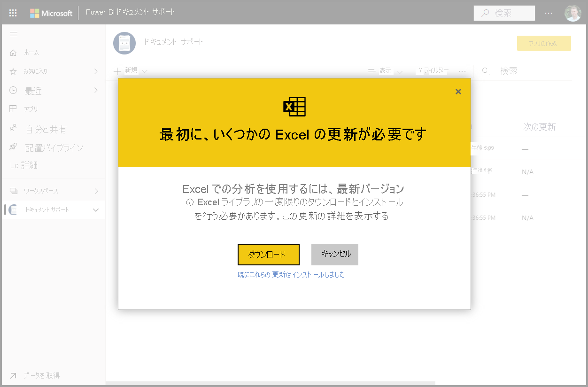
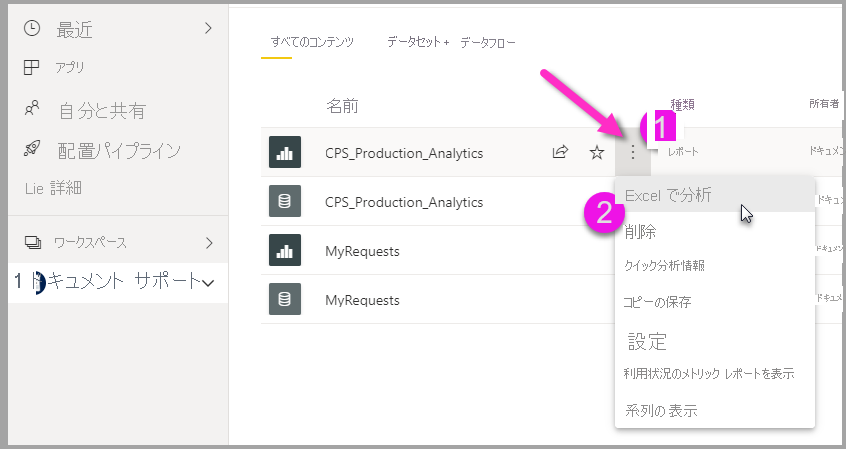
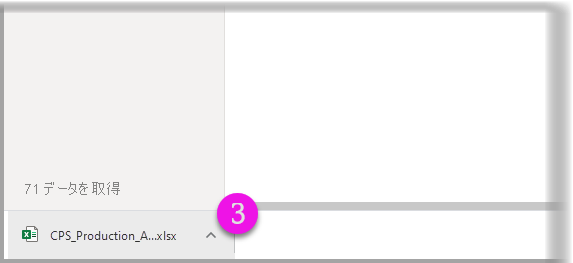

# [Excel で分析]
**[Excel で分析]** を使用すると、Power BI データセットを Excel に取り込み、ピボットテーブル、グラフ、スライサー、およびその他の Excel 機能を使用してデータセットを表示および操作できます。 **[Excel で分析]** を使用するには、まず Power BI から機能をダウンロードしてインストールし、Excel で使用する 1 つ以上のデータセットを選択する必要があります。 

![[Excel で分析]](media/service-analyze-in-excel/analyze-excel-00a.png)

この記事では、[Excel で分析] をインストールして使用する方法を示し、その制限事項について説明した後、次の手順をいくつか提供します。 ここでは次の内容について学習します。

* [[Excel で分析] をインストールする](#install-analyze-in-excel)
* [Power BI データに接続する](#connect-to-power-bi-data)
* [Excel を使用してデータを分析する](#use-excel-to-analyze-the-data)
* [ブックの保存と共有](#saving-and-sharing-your-new-workbook)
* [必要条件](#requirements)

それではさっそくインストール プロセスを開始しましょう。

## [Excel で分析] をインストールする

Power BI サービスで提供されるリンクから **[Excel で分析]** をインストールする必要があります。 Power BI によってお使いのコンピューター上にある Excel のバージョンが検出され、適切なバージョン (32 ビットまたは 64 ビット) が自動的にダウンロードされます。 Power BI サービスがブラウザーで実行されます。 次のリンクを使用して Power BI にサインインできます。

* [Power BI へのサインイン](https://app.powerbi.com)

サインインして Power BI サービスがブラウザーで実行されたら、右上隅にある **[その他のオプション]** 項目 ([...]) を選択してから、 **[ダウンロード] > [Excel で分析の更新プログラム]** の順に選択します。 このメニュー項目は、[Excel で分析] の更新プログラムの新規インストールに適用されます。

![Power BI ホームから [Excel で分析] をダウンロードする](media/service-analyze-in-excel/analyze-excel-02.png)

または、Power BI サービス内で分析するデータセットに移動し、データセット、レポート、またはその他の Power BI 項目に対する **[その他のオプション]** 項目を選択できます。 次の画像に示すように、表示されたメニューから **[Excel で分析]** オプションを選択します。

どちらの方法でも、Power BI によって [Excel で分析] がインストール済みであるかどうかが検出され、インストールしていない場合はダウンロードするように求められます。 

[ダウンロード] を選択すると、Power BI によってインストール済みの Excel のバージョンが検出され、適切なバージョンの [Excel で分析] インストーラーがダウンロードされます。 ブラウザーの下部、またはお使いのブラウザーでダウンロードの進行状況が表示される場所に、ダウンロード状態が表示されます。 

ダウンロードが完了したら、インストーラー (.msi) を実行して [Excel で分析] をインストールします。 インストール プロセスの名前は [Excel で分析] とは異なります。名前は、次の画像に示すように **[Microsoft Analysis Services OLE DB プロバイダー]** になるか、または似たような名前になります。

完了したら、Power BI サービス (またはデータセットなどの他の Power BI データ要素) でレポートを選択し、Excel で分析する準備が整います。

## Power BI データに接続する

Power BI サービスで、Excel で分析するデータセットまたはレポートに移動し、次の操作を行います。

1. **[その他のオプション]** メニューを選択します。

1. 表示されるメニュー項目から **[Excel で分析]** を選択します。

    次の画像はレポートの選択を示しています。

    
    
    >[!NOTE]
    >[レポート] メニューから [Excel で分析] を選択すると、Excel に取り込まれるのは、レポートの基になるデータセットです。

    そうすると、Power BI サービスによって、 **[Excel で分析]** で使用するために設計 (および構造化) されたデータセットのファイルが作成され、ブラウザーでのダウンロード プロセスが開始されます。
    
    

    ファイル名は、派生元のデータセット (またはレポート、またはその他のデータ ソース) と一致します。 したがって、レポートが "*四半期ごとのレポート*" という名前だった場合、ダウンロードされたファイルは "**四半期ごとのレポート.xlsx**" になります。

    >[!Note]
    >Excel で分析では、ODC ファイルではなく Excel ファイルがダウンロードされるようになりました。 これにより、Power BI からエクスポートされたデータを保護できます。 ダウンロードされた Excel ファイルでは、Excel で分析に対して選択されているデータセットの機密ラベルが継承されます。

3. Excel ファイルを開きます。

    >[!NOTE]
    >ファイルを初めて開くとき、[保護ビュー](https://support.microsoft.com/en-gb/office/what-is-protected-view-d6f09ac7-e6b9-4495-8e43-2bbcdbcb6653?ui=en-us&rs=en-gb&ad=gb)と[信頼済みドキュメント](https://support.microsoft.com/en-us/office/trusted-documents-cf872bd8-47ec-4c02-baa5-1fdba1a11b53)の設定に応じて、**編集を有効にする**こと、さらに**コンテンツを有効にする**ことが必要な場合があります。
    >
    >
    >
    >

Excel を使用してピボットテーブルを使用した Power BI を分析する場合、Power BI によって秘密度ラベル継承が Excel に拡張されます。 Excel でピボットテーブルを作成すると、Power BI データセットに適用される秘密度ラベルが Excel ファイルに自動的に適用されます。 

データセット上のラベルがその後に変更されて制限がより厳しくなった場合、Excel でのデータ更新時に、Excel ファイルに適用されているラベルが自動的に更新されます。 データセットが変更されて制限が緩くなった場合は、ラベルの継承や更新は発生しません。

手動で設定された Excel の秘密度ラベルが、データセットのラベルによって自動的に上書きされることはありません。 Excel ファイルに秘密度ラベルが手動で設定されている場合、ラベルをアップグレードするための推奨事項を含むポリシー ヒントが表示されます。 

詳細については、「[Power BI で秘密度ラベルを適用する方法](../admin/service-security-apply-data-sensitivity-labels.md)」をご覧ください。

## Excel を使用してデータを分析する

編集とコンテンツを有効にすると、Excel に Power BI データセットから空の**ピボットテーブル**と**フィールド**の一覧が表示され、分析する準備が整います。

Excel ファイルには、Power BI 内のユーザーのデータセットに接続する MSOLAP 接続が含まれています。 データの分析または処理操作を行うと、Excel は Power BI のデータセットをクエリし、結果を Excel に返します データセットが DirectQuery を使用してライブ データ ソースに接続している場合、Power BI はデータ ソースをクエリし、結果を Excel に返します

これで Power BI のデータへの接続が確立されたので、Excel でローカルのデータセットに対して作業する場合と同じように、ピボットテーブルやグラフを作成したり、データセットを分析したりできます。

**[Excel で分析]** は、次のデータ ソースに接続するデータセットとレポートに対して特に役立ちます。

* "*Analysis Services 表形式*" または "*多次元*" のデータベース
* Power BI Desktop ファイル、または Data Analysis Expressions (DAX) を使用して作成されたモデル メジャーを持つデータ モデルを含む Excel ブック。

> [!IMPORTANT]
> **[Excel で分析]** を使用すると、すべての詳細レベルのデータが、データセットへのアクセス許可を持つすべてのユーザーに公開されます。

[Excel で分析] の使用を開始する際はいくつかの点を考慮する必要があり、調整を行うために 1、2 個の追加手順が必要になる場合があります。 以下のセクションで、これらの可能性について説明します。 

### Power BI へのサインイン
ブラウザーで Power BI にサインインしていても、Excel で新しい Excel ファイルを初めて開くときには、Power BI アカウントを使用して Power BI にサインインするよう求められる場合があります。 これにより、Excel から Power BI への接続を認証します。

### 複数の Power BI アカウントを持つユーザー
一部のユーザーは複数の Power BI アカウントを持っています。 そのような場合は、1 つのアカウントを使用して Power BI にサインインしている可能性がありますが、他のアカウントから [Excel で分析] で使用されているデータセットにアクセスすることができます。 このような場合、[Excel で分析] ブックで使用されているデータセットにアクセスしようとすると、**Forbidden** エラーやサインインの失敗が生じることがあります。

このような場合は、[Excel で分析] によってアクセスされているデータセットへのアクセス権限を持つ Power BI アカウントを使用して、もう一度サインインする機会が提供されます。 また、Excel の上部のリボンで自分の名前を選択して、現在サインインしているアカウントを特定することもできます。 サインアウトし、もう一方のアカウントでもう一度サインインします。

## 新しいブックの保存と共有

他のブックと同様に、Power BI データセットを使用して作成した Excel ブックを **[保存]** できます。 ただし、Power BI に発行またはインポートできるのは、テーブルにデータがあるか、データ モデルを持つブックのみであるため、ブックをもう一度 Power BI に発行またはインポートすることはできません。 新しいブックは、単に Power BI 内のデータセットに接続されているだけなので、Power BI に発行またはインポートすると堂々巡りになってしまいます。

ブックを保存すると、組織内の他の Power BI ユーザーと共有できます。 

ブックを共有したユーザーがそれを開くと、ブックを最後に保存したときの状態でピボットテーブルとデータが表示されますが、これはデータの最新バージョンではない可能性があります。 最新のデータを入手するには、ユーザーは **[データ]** リボンの **[更新]** をクリックする必要があります。 また、ブックは Power BI のデータセットに接続しているため、ブックの更新を試みるユーザーは、この方法を使用して初めて更新を試みたときに、Power BI にサインインして Excel 更新プログラムをインストールする必要があります。

ユーザーはデータセットを更新する必要がある一方で、Excel Online では外部接続の更新がサポートされていないため、ユーザー自身のコンピューター上のデスクトップ版 Excel を使用してブックを開くことをお勧めします。

> [!NOTE]
> Power BI テナントの管理者は、*Power BI 管理ポータル*を使って、Analysis Services (AS) データベースに格納されているオンプレミスのデータセットでの **[Excel で分析]** の使用を無効にできます。 このようにすると、 **[Excel で分析]** は AS データベースに対しては無効になりますが、他のデータセットについては引き続き使用できます。

## Excel から Power BI データセットにアクセスするその他の方法
特定の Office SKU を持つユーザーは、Excel の **[データの取得]** 機能を使用して、Excel 内から Power BI データセットに接続することもできます。 使用する SKU でこの機能がサポートされていない場合、 **[データの取得]** メニュー オプションは表示されません。

次の画像に示すように、 **[データ]** リボン メニューから、 **[データの取得] > [Power BI データセットから]** を選択します。

![[データの取得] メニューの使用](media/service-analyze-in-excel/analyze-excel-10.png)

表示されるペインでは、アクセスできるデータセットを参照したり、データセットが認定または昇格されているかどうかを確認したり、それらのデータセットにデータ保護ラベルが適用されているかどうかを確認したりできます。 

このように Excel にデータを取り込む方法の詳細については、「[Power BI データセットからピボットテーブルを作成する](https://support.office.com/article/31444a04-9c38-4dd7-9a45-22848c666884)」をご覧ください。

また、Excel の**データ型**ギャラリーで、**おすすめのテーブル**にアクセスすることもできます。 おすすめのテーブルとそれらにアクセスする方法の詳細については、「[Excel で Power BI のおすすめのテーブルにアクセスする (プレビュー)](service-excel-featured-tables.md)」をご覧ください。

## 必要条件
**[Excel で分析]** を使用するには、次のいくつかの要件があります。

* **[Excel で分析]** は、Microsoft Excel 2010 SP1 以降でサポートされています。

* Excel のピボット テーブルは、数値フィールドのドラッグ アンド ドロップでの集計をサポートしていません。 Power BI でのデータセットには、*メジャーを事前定義する必要があります*。 メジャーの作成方法については[こちら](../transform-model/desktop-measures.md)をご覧ください。
* 一部の組織では、グループ ポリシーの規則により、必要な **[Excel で分析]** 更新プログラムを Excel にインストールできないことがあります。 更新プログラムをインストールできない場合は、管理者に問い合わせてください。
* **[Excel で分析]** では、Power BI Premium にデータセットがあるか、またはユーザーが Power BI Pro ライセンスを持っている必要があります。 Power BI ライセンスの種類間での機能の違いについては、「[Power BI 料金](https://powerbi.microsoft.com/pricing/)」の「_Power BI 機能の比較_」セクションを参照してください。
* 基になるデータセットに対するアクセス許可が与えられている場合、ユーザーは [Excel で分析] を使用してデータセットに接続できます。  データセットが含まれるワークスペースで Member ロールを与える、データセットが使用されるレポートやダッシュボードを共有する、データセットが含まれるワークスペースかアプリでデータセットの Build アクセス許可を与えるなど、ユーザーにはいくつかの方法でこのアクセス許可を与えることができます。 データセットの Build アクセス許可については[こちら](../connect-data/service-datasets-build-permissions.md)をご覧ください。
* ゲスト ユーザーは、別のテナントから送信された (別のテナントに由来する) データセットに対して、 **[Excel で分析]** を使用することはできません。 
* **[Excel で分析]** は Power BI サービスの機能であり、Power BI Report Server と Power BI Embedded では使用できません。 
* **[Excel で分析]** は、Microsoft Windows を実行しているコンピューターでのみサポートされます。

**[Excel で分析]** 機能をアンインストールする必要がある場合は、Windows コンピューターの **[プログラムの追加と削除]** システム設定を使用して実行できます。

## トラブルシューティング
”Excel で分析” の使用中に、予期しない結果が出る場合や、機能が期待どおりに動作しない場合があります。 [このページでは、[Excel で分析] の使用中に発生する一般的な問題の解決方法を説明します](desktop-troubleshooting-analyze-in-excel.md)。

## 次のステップ

次の記事にも興味をもたれるかもしれません。

* [Power BI Desktop でレポート間のドリルスルーを使用する](../create-reports/desktop-cross-report-drill-through.md)
* [Power BI Desktop でスライサーを使用する](../visuals/power-bi-visualization-slicers.md)
* [Excel で分析のトラブルシューティング](desktop-troubleshooting-analyze-in-excel.md)
* [Excel で Power BI のおすすめのテーブルにアクセスする (プレビュー)](service-excel-featured-tables.md)。
* [Power BI で秘密度ラベルを適用する方法](../admin/service-security-apply-data-sensitivity-labels.md)
