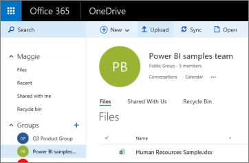
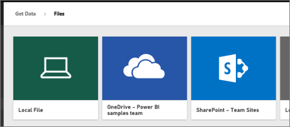

# Power BI ワークスペースの OneDrive に保存されているファイルに接続する
[Power BI でワークスペースを作成する](service-create-workspaces.md)ときは、Microsoft 365 グループおよび関連付けられた OneDrive for Business も作成します。 この記事では、その OneDrive for Business に Excel、CSV、Power BI Desktop のファイルを格納して更新する方法について説明します。 これらの更新プログラムは、ファイルに基づいて Power BI レポートとダッシュボードに自動的に反映されます。

> [!NOTE]
> 新しいワークスペース エクスペリエンスでは、Power BI ワークスペースと Microsoft 365 グループ間の関係が変わります。 新しいワークスペースのいずれかを作成するたびに Microsoft 365 グループが自動的に作成されることはありません。 新しいワークスペースの作成については、[こちら](service-create-the-new-workspaces.md)を参照してください

ワークスペースへのファイルの追加は、次の 2 つの手順で行います。 

1. まず、ワークスペースの [OneDrive for Business にファイルをアップロード](#1-upload-files-to-the-onedrive-for-business-for-your-workspace)します。
2. 次に、[アップロードしたファイルに Power BI から接続](#2-import-excel-files-as-datasets-or-as-excel-online-workbooks)します。

> [!NOTE]
> ワークスペースは、[Power BI Pro](../fundamentals/service-features-license-type.md) ライセンスでのみ利用できます。
> 

## 1 ワークスペースの OneDrive for Business にファイルをアップロードする
1. Power BI サービスで、[ワークスペース] の横にある矢印を選択し、目的のワークスペース名の隣にある省略記号 ( **…** ) を選択します。 
   
   
2. **[ファイル]** を選択し、Microsoft 365 のワークスペースの OneDrive for Business を開きます。
   
   > [!NOTE]
   > ワークスペース メニューに **[ファイル]** が表示されない場合は、 **[メンバー]** を選択してワークスペースの OneDrive for Business を開きます。 そこで、 **[ファイル]** を選びます。 Microsoft 365 により、アプリのグループ ワークスペース ファイル用の OneDrive ストレージの場所が設定されます。 この処理には時間がかかる場合があります。
   > 
   > 
3. ここで、ワークスペースの OneDrive for Business にファイルをアップロードすることができます。 **[アップロード]** を選び、ファイルに移動します。
   
   

## 2 Excel ファイルをデータセットまたは Excel Online のブックとしてインポートする
ファイルがワークスペースの OneDrive for Business に保存されたので、選択肢ができました。 次の操作を実行できます。 

* [Excel ブックからデータセットとしてデータをインポートします](../connect-data/service-get-data-from-files.md)。 次に、そのデータを使用して Web ブラウザーやモバイル デバイスで表示できるレポートとダッシュボードを作成します。
* または、[Power BI で Excel ブック全体に接続](../connect-data/service-excel-workbook-files.md)し、Excel Online で表示されるのと同じようにブックを表示します。

### ワークスペースへのインポートまたはファイルへの接続
1. Power BI で、ワークスペースに切り替えると、ワークスペース名が左上に表示されます。 
2. ナビ ペインの下部にある **[データの取得]** を選択します。 
   
   ![[データの取得] ボタンのスクリーンショット。ナビゲーション ウィンドウに表示されています。](media/service-connect-to-files-in-app-workspace-onedrive-for-business/power-bi-app-get-data-button.png)
3. **[ファイル]** ボックスで、 **[取得]** を選択します。
   
   ![[ファイル] ダイアログのスクリーンショット。[取得] ボタンが表示されています。](media/service-connect-to-files-in-app-workspace-onedrive-for-business/pbi_getfiles.png)
4. **[OneDrive]**  -  *[<ワークスペース名>]* を選択します。
   
    
5. 必要なファイルを選び、**接続**します。
   
    この時点で、[Excel ブックからデータをインポートする](../connect-data/service-get-data-from-files.md)か、[Excel ブック全体に接続する](../connect-data/service-excel-workbook-files.md)かどうかを決定します。
6. **[インポート]** または **[接続]** を選びます。
   
    ![[OneDrive for Business] ダイアログのスクリーンショット。Excel からインポートしたり、Excel に接続したりできます。](media/service-connect-to-files-in-app-workspace-onedrive-for-business/pbi_importexceldataorwholecrop.png)
7. **[インポート]** を選択した場合、 **[データセット]** タブにブックが表示されます。 
   
    ![[データセット] タブが表示されている、Power BI のワークスペースのスクリーンショット。](media/service-connect-to-files-in-app-workspace-onedrive-for-business/power-bi-app-excel-file-import.png)
   
    **[接続]** を選択した場合、 **[ブック]** タブにブックが表示されます。
   
    ![[ブック] タブが表示されている、Power BI のワークスペースのスクリーンショット。](media/service-connect-to-files-in-app-workspace-onedrive-for-business/power-bi-app-excel-file-connect.png)

## 次の手順
* [Power BI でアプリとワークスペースを作成する](../collaborate-share/service-create-distribute-apps.md)
* [Excel ブックからデータをインポートする](../connect-data/service-get-data-from-files.md)
* [Excel ブック全体に接続する](../connect-data/service-excel-workbook-files.md)
* 他にわからないことがある場合は、 [Power BI コミュニティを利用してください](https://community.powerbi.com/)。
* フィードバックがある場合は、 「[Power BI Ideas](https://ideas.powerbi.com/forums/265200-power-bi)」 (Power BI に関するヒント) を参照してください。
