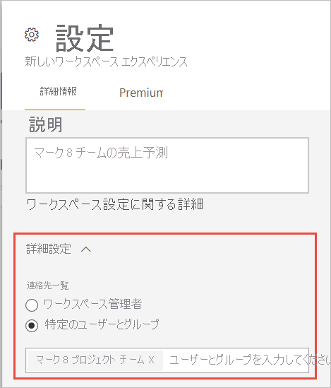
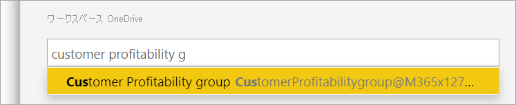

# Power BI で新しいワークスペースを作成する

この記事では "*クラシック*" ワークスペースではなく、"*新しいワークスペース*" のいずれかを作成する方法について説明します。 どちらの種類のワークスペースも、同僚と共同作業を行う場所です。 そこで、ダッシュボード、レポート、およびページ分割されたレポートのコレクションを作成します。 必要に応じて、そのコレクションを "*アプリ*" にバンドルし、より広範な対象ユーザーに配布することもできます。 詳細については、[新しいワークスペース](service-new-workspaces.md)に関する記事を参照してください。

:::image type="content" source="media/service-create-the-new-workspaces/power-bi-new-workspaces.png" alt-text="Power BI の新しいワークスペースの 1 つを示すスクリーンショット。":::

クラシック ワークスペースを移行する場合、 詳細については、「[Power BI でクラシック ワークスペースを新しいワークスペースにアップグレードする](service-upgrade-workspaces.md)」を参照してください。

## 新しいワークスペースのいずれかを作成する

1. **[ワークスペース]**  >  **[ワークスペースの作成]** を選択します。
   
     ![[ワークスペースの作成] のスクリーンショット。](media/service-create-the-new-workspaces/power-bi-workspace-create.png)

2. ワークスペースに一意の名前を付けます。 名前が使用できない場合は、一意の名前になるように編集します。
   
    ワークスペースからアプリを作成する場合、その名前とアイコンは既定でワークスペースと同じになります。 両方ともアプリの作成時に変更することができます。
   
1. ワークスペースに対しては次のオプション設定があります。 詳細については、この記事で後述する「[ワークスペースの設定](#workspace-settings)」のセクションを参照してください。

    - **ワークスペースのイメージ** をアップロードします。 .png または .jpg 形式のファイルを使用できます。 ファイル サイズは 45 KB 未満にする必要があります。 
    - Microsoft 365 グループ ファイルの保存場所を使用するために、[ワークスペースの OneDrive を指定します](#set-a-workspace-onedrive)。    
    - [連絡先リストを追加します](#create-a-contact-list)。これは、ワークスペースに関する情報の問い合わせ先であるユーザーの名前です。 既定では、ワークスペース管理者が連絡先になります。
    - このワークスペースで[共同作成者にアプリの更新を許可します](#allow-contributors-to-update-the-app)
    - [Premium 容量にワークスペースを割り当てます](#premium-capacity-settings)。
    - ワークスペースを Azure Data Lake Gen2 ストレージ アカウント (プレビュー) に接続します。 この機能については、「[Azure Data Lake Gen 2 を使用するようにデータフロー ストレージを構成する](../transform-model/dataflows/dataflows-azure-data-lake-storage-integration.md#connecting-to-an-azure-data-lake-gen-2-at-a-workspace-level)」を参照してください。

1. **[保存]** を選択します。

    Power BI でワークスペースが作成され、開きます。 自分が所属するワークスペースの一覧が表示されます。

## ワークスペースの設定

これらのワークスペースの設定を表示するには、 **[設定]** ペインの **[詳細設定]** を展開します。

### 連絡先リストを作成する

ワークスペースで発生している問題に関する通知を受け取るユーザーを指定できます。 既定では、ワークスペース管理者として指定された任意のユーザーまたはグループに通知されますが、"*連絡先リスト*" に他のユーザーを追加することができます。 連絡先リストのユーザーまたはグループはユーザー インターフェイス (UI) に一覧表示され、ユーザーがワークスペースに関連するヘルプを取得するのに役立ちます。

1. **[連絡先リスト]** の設定にアクセスするには、次の 2 つの方法があります。

    最初に作成するときに **[ワークスペースの作成]** ウィンドウで。

    ナビ ペインで、 **[ワークスペース]** の横にある矢印を選択し、ワークスペース名の横にある **[その他のオプション]** (...) を選択して、 **[ワークスペースの設定]** を選択します。 **[設定]** ウィンドウが開きます。

    

2. **[詳細設定]** 、 **[連絡先リスト]** で、既定の **[ワークスペース管理者]** のままにするか、または **[特定のユーザーやグループ]** の独自のリストを追加します。 

    

3. **[保存]** を選択します。

### ワークスペース OneDrive を設定する

ワークスペース OneDrive 機能を使用すると、OneDrive 共有ライブラリをワークスペース ユーザーが使用できる Microsoft 365 グループを構成できます。 最初に Power BI の "*外部*" で OneDrive にグループを作成します。 OneDrive 共有ライブラリを作成する方法については、[こちら](https://support.microsoft.com/office/create-a-new-shared-library-from-onedrive-for-work-or-school-345c8599-05d8-4bf8-9355-2b5cfabe04d0)を参照してください。

ワークスペースへのアクセス権を持つユーザーまたはグループと、Microsoft 365 グループ メンバーシップを持つユーザーまたはグループとの間で、Power BI によるアクセス許可の同期は行われません。 ベスト プラクティスは、ファイル ストレージを構成したのと同じ Microsoft 365 グループに、[ワークスペースへのアクセス権](service-give-access-new-workspaces.md)を付与することです。 次に、Microsoft 365 グループのメンバーシップを管理して、ワークスペースへのアクセスを管理します。

1. **[ワークスペース OneDrive]** の設定に次の 2 つの方法のいずれかでアクセスします。

    最初に作成するときに **[ワークスペースの作成]** ウィンドウで。

    ナビ ペインで、 **[ワークスペース]** の横にある矢印を選択し、ワークスペース名の横にある **[その他のオプション]** (...) を選択して、 **[ワークスペースの設定]** を選択します。 **[設定]** ウィンドウが開きます。

    

2. **[詳細設定]**  >  **[ワークスペース OneDrive]** で、前に作成した Microsoft 365 グループの名前を入力します。 URL ではなく、名前のみを入力してください。 Power BI によって、グループの OneDrive が自動的に取得されます。

    

3. **[保存]** を選択します。

**ワークスペースの OneDrive の場所にアクセスする**

OneDrive の場所を構成した後、Power BI サービスの他のデータ ソースにアクセスするのと同じ方法で、そこにアクセスできます。

1. ナビ ペインで、 **[データの取得]** を選択して、 **[ファイル]** ボックスで **[取得]** を選択します。

    ![[データの取得] でのファイル取得のスクリーンショット。](media/service-create-the-new-workspaces/power-bi-get-data-files.png)

1.  **[SharePoint - チーム サイト]** を選択します。

    ![[SharePoint - チーム サイト] でのデータ取得のスクリーンショット。](media/service-create-the-new-workspaces/workspace-get-data-sharepoint-team-sites.png)

1. 前の手順で作成した共有ライブラリの URL を入力するか、 **[接続]** を選択して利用可能なコンテンツを表示します。

    :::image type="content" source="media/service-create-the-new-workspaces/workspace-sharepoint-site-url.png" alt-text="前の手順で作成した共有ライブラリの URL を入力するか、[接続] を選択するかのスクリーンショット。":::

1. Power BI ファイルが保存されているフォルダーに移動します。

    :::image type="content" source="media/service-create-the-new-workspaces/sharepoint-team-sites-content.png" alt-text="[SharePoint - チーム サイト] でのフォルダーのスクリーンショット。":::

### 共同作成者にアプリの更新を許可する

新しいワークスペース エクスペリエンスから "*アプリ*" を作成して発行できます。 関連付けられた "*アプリ*" のコンテンツのほか、ダッシュボード、レポート、データセットのコレクションを各ワークスペースに保存し、組織内の他のユーザーに配布できます。 [新しいワークスペースからのアプリの発行](service-create-distribute-apps.md)の詳細に関する記事を参照してください。

既定では、ワークスペース用のアプリの発行と更新を実行できるのは、ワークスペースの管理者とメンバーだけです。 ワークスペース管理者は、 **[共同作成者にこのワークスペースのアプリの更新を許可する]** 設定を使用して、ワークスペース共同作成者ロールを持つユーザーにワークスペース用のアプリを更新する機能を委任できます。 詳細については、[新しいワークスペースのさまざまなロール](service-new-workspaces.md#roles-in-the-new-workspaces)の説明を参照してください。

1. **[共同作成者にアプリの更新を許可する]** の設定に次の 2 つの方法のいずれかでアクセスします。

    最初に作成するときに **[ワークスペースの作成]** ウィンドウで。

    ナビ ペインで、 **[ワークスペース]** の横にある矢印を選択し、ワークスペース名の横にある **[その他のオプション]** (...) を選択して、 **[ワークスペースの設定]** を選択します。 **[設定]** ウィンドウが開きます。

    
2. **[詳細設定]** で、 **[セキュリティ設定]** を展開します。 **[共同作成者にこのワークスペースのアプリの更新を許可する]** を選択します。 

有効にすると、共同作成者は次のことができます。
* 名前、アイコン、説明、サポート サイト、色などのアプリのメタデータを更新する。
* アプリに含まれる項目を追加または削除する (レポートやデータセットの追加など)。
* アプリが開いたときのアプリのナビゲーションや既定の項目を変更する。

ただし、共同作成者は次のことができません。
* アプリを初めて発行する
* アプリへのアクセス権を所有するユーザーを変更する

## Premium 容量の設定

**[設定]** ペインの **[Premium]** タブで、Premium 容量に関連する設定を選択できます。

1. **[Premium 容量]** を **[オン]** に設定します。

    ![[Premium 容量] が [オン] のスクリーンショット。](media/service-create-the-new-workspaces/power-bi-workspace-premium.png)

1. Premium 容量または **[Premium Per User]** を選択します。 Premium Per User の詳細については、[こちら](../admin/service-premium-per-user-faq.md)を参照してください。

    :::image type="content" source="media/service-create-the-new-workspaces/power-bi-workspace-premium-per-user.png" alt-text="Premium または Premium Per User を選択するスクリーンショット。":::

1. **[Default storage limit]\(既定のストレージ上限\)** を選択します。 大規模なデータセットの有効化の詳細については、[こちら](../admin/service-premium-large-models.md#enable-large-datasets)を参照してください。

## 次の手順
* [Power BI での新しいワークスペース エクスペリエンスの作業の整理](service-new-workspaces.md)に関する記事を参考してください
* [クラシック ワークスペースを作成する](service-create-workspaces.md)
* [Power BI で新しいワークスペースからアプリを発行する](service-create-distribute-apps.md)
* わからないことがある場合は、 [Power BI コミュニティで質問してみてください](https://community.powerbi.com/)。
