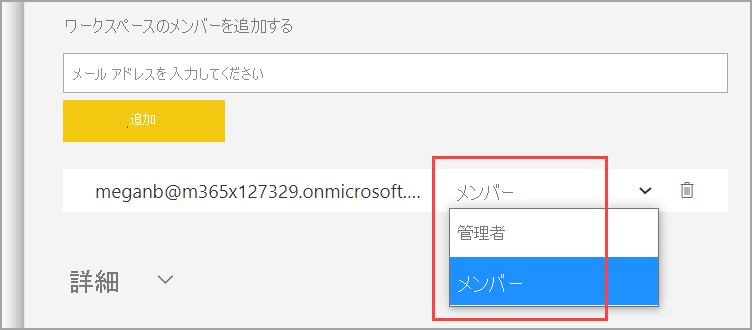
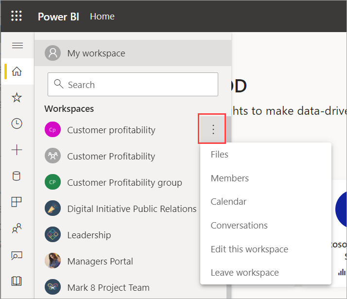
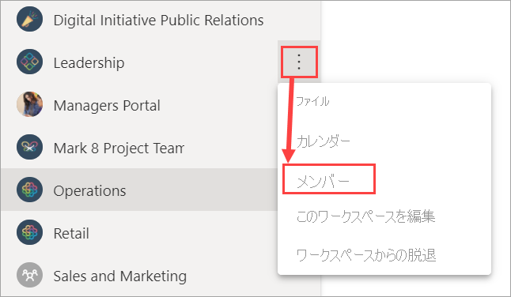
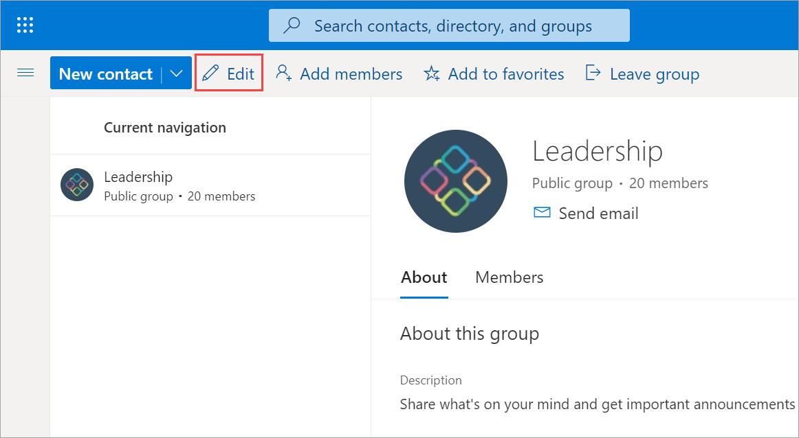
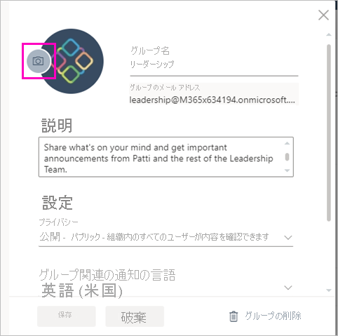

# Power BI でクラシック ワークスペースを作成する

Power BI では、"*ワークスペース*" を作成することができます。このワークスペースは、同僚と共同でダッシュボード、レポート、およびページ分割されたレポートのコレクションを作成して調整するための場所です。  この記事では、クラシック ワークスペースについて説明します。 Power BI には、新しいワークスペース エクスペリエンスもあり、これが既定になりました。 この 2 つの比較については、「[新しいワークスペースとクラシック ワークスペースの違い](service-new-workspaces.md#new-and-classic-workspace-differences)」を参照してください。 

クラシック ワークスペースを移行する場合、 詳細については、「[Power BI でクラシック ワークスペースを新しいワークスペースにアップグレードする](service-upgrade-workspaces.md)」を参照してください。

クラシック ワークスペースを作成するときは、基になる、関連付けられている Microsoft 365 グループを作成します。 ワークスペースの管理はすべて Microsoft 365 で行われます。 こうしたワークスペースには、メンバーまたは管理者として、同僚を追加することができます。 ワークスペースでは、より広範な対象ユーザーに発行する予定のダッシュボード、レポート、およびその他の記事で、全員が共同作業を行うことできます。 ワークスペースに追加するすべてのユーザーに、Power BI Pro のライセンスが必要となります。

## Microsoft 365 グループに基づいてクラシック ワークスペースを作成する

ワークスペースは Microsoft 365 グループに基づいて作成します。

1. **[ワークスペース]**  >  **[ワークスペースの作成]** を選択します。 
   
     ![[ワークスペースの作成] のスクリーンショット。](media/service-create-the-new-workspaces/power-bi-workspace-create.png)  

    ここには、同僚と共同作業をするコンテンツを配置します。

2. **[You're creating an upgraded workspace]** \(アップグレードされたワークスペースを作成しています\) バナーで **[クラシックに戻す]** をクリックします。 

    ![[クラシックに戻す] のワークスペース オプションのスクリーンショット。](media/service-create-workspaces/power-bi-revert-classic-workspace.png)

    > [!NOTE]
    > このバナーが表示されない場合は、Power BI 管理者がクラシック ワークスペースを作成する機能をブロックしています。 代わりに、[いずれかの新しいワークスペースを作成する](service-create-the-new-workspaces.md)ことができます。

3. ワークスペースの名前を付けます。 対応する **ワークスペース ID** が使用できない場合は、一意の ID になるように編集します。
   
    

    ワークスペースからアプリを作成する場合、その名前とアイコンは既定でワークスペースと同じになります。 両方ともアプリの作成時に変更することができます。

3. 他にもいくつかのオプションを設定できます。 **[パブリック]** を選択すると、組織内のすべてのユーザーがワークスペースの内容を表示できます。 **[プライベート]** の場合、ワークスペースのメンバーしかその内容を表示できません。
   
     ![[プライベート] または [パブリック] の設定のスクリーンショット。](media/service-create-workspaces/power-bi-apps-create-workspace-private-public.png)
   
    グループを作成した後は、公開/非公開を変更することはできません。

4. メンバーが **編集** 可能かどうか、**表示専用** のアクセス許可を持つかどうかも選択できます。

     

5. ワークスペースへのアクセス許可を与えるユーザーの電子メール アドレスを追加して、 **[追加]** を選択します。 追加できるのは個別ユーザーのみで、グループのエイリアスは追加できません。

     コンテンツを編集するワークスペースにのみ、ユーザーを追加してください。 コンテンツを表示するだけのユーザーの場合は、ワークスペースには追加しないでください。 アプリを発行するときに追加してください。

6. ユーザーごとにメンバーか管理者かを判断します。
   
     
   
    管理者は、他のメンバーの追加を含め、ワークスペース自体を編集できます。 メンバーは、表示専用のアクセス許可を持っていないかぎり、ワークスぺースのコンテンツを編集できます。 管理者とメンバーの両方がアプリを発行できます。

7. **[保存]** を選択します。

Power BI でワークスペースが作成され、開きます。 メンバーであるワークスペースの一覧が表示されます。 管理者は、**[その他のオプション]** (...) を選択して、前の画面に戻り、新しいメンバーの追加やアクセス許可の変更などの変更を加えることができます。

最初に作成するとき、場合によっては、ワークスペースが Microsoft 365 に反映されるまで 1 時間程度待つ必要があります。

### Microsoft 365 ワークスペースに画像を追加する (省略可能)
既定では、Power BI は、アプリの頭文字を使用した色付きの小さな丸をアプリに作成します。 画像を使用してカスタマイズすることもできます。 画像を追加するには、Exchange Online ライセンスが必要です。

1. **[ワークスペース]** を選択し、ワークスペースの名前の横にある **その他のオプション** (...) を選択して、 **[メンバー]** を選択します。 
   
     
   
    ワークスペースの Microsoft 365 Outlook アカウントが、新しいブラウザー ウィンドウで開きます。
2. **[編集]** 鉛筆を選択します。
   
     
3. カメラ画像を選択し、使用する画像を検索します。
   
     

     画像には、.png、.jpg、.bmp のいずれかのファイルを使用できます。 ファイルのサイズは、最大で 3 MB にすることができます。 

4. **[OK]** を選択し、 **[保存]** を選択します。
   
    Microsoft 365 Outlook のウィンドウで、色付きの丸がその画像に置き換えられます。
   
     
   
    数分後に、Power BI のアプリでも画像が表示されます。

## ワークスペースにコンテンツを追加する

ワークスペースを作成したら、次はコンテンツを追加します。 これはマイ ワークスペースにコンテンツを追加する場合と似ていますが、ワークスペース内の他のユーザーが表示だけでなく編集もできる点が異なります。 大きな違いは、作業が完了したら、[アプリとしてコンテンツを発行](service-create-distribute-apps.md)できることです。

ワークスペースのコンテンツ リストでコンテンツを表示すると、ワークスペースの名前が所有者としてリストされます。

## アプリを配布する

組織内の大勢の対象ユーザーに公式コンテンツを配布する場合は、ワークスペースからアプリを発行できます。  ワークスペースのコンテンツが用意できたら、発行するダッシュボードやレポートを選択し、それを "*アプリ*" として発行します。 各ワークスペースから 1 つのアプリを作成できます。 詳細については、[ワークスペースからのアプリの発行](service-create-distribute-apps.md)に関するページを参照してください。

## アプリか組織のコンテンツ パックか

アプリは、非推奨とされる組織のコンテンツ パックが進化したものです。 コンテンツ パックをアプリにまだアップグレードしていない場合は、今がそのよい機会です。 クラシック ワークスペースを移行する場合、 詳細については、「[Power BI でクラシック ワークスペースを新しいワークスペースにアップグレードする](service-upgrade-workspaces.md)」を参照してください。

### アプリと組織のコンテンツ パックの比較

* ビジネス ユーザーがコンテンツ パックをインストールすると、グループ化された ID が失われ、他のダッシュボードやレポートと混在した単なるダッシュボードとレポートの一覧になります。 一方、アプリではインストール後もグループ化および ID が維持されます。 このグループ化により、ビジネス ユーザーは時間が経っても簡単にアクセスすることができます。
* 任意のワークスペースから複数のコンテンツ パックを作成できますが、アプリとそのワークスペースの間には 1 対 1 の関係があります。 
* 新しいワークスペースでは、コンテンツパックを使用することも作成することもできません。

## 次の手順

- [Power BI にアプリをインストールし、使用する](service-create-distribute-apps.md)
- [新しいワークスペースを作成する](service-create-the-new-workspaces.md)
- [Power BI でクラシック ワークスペースを新しいワークスペースにアップグレードする](service-upgrade-workspaces.md)
- わからないことがある場合は、 [Power BI コミュニティで質問してみてください](https://community.powerbi.com/)。
