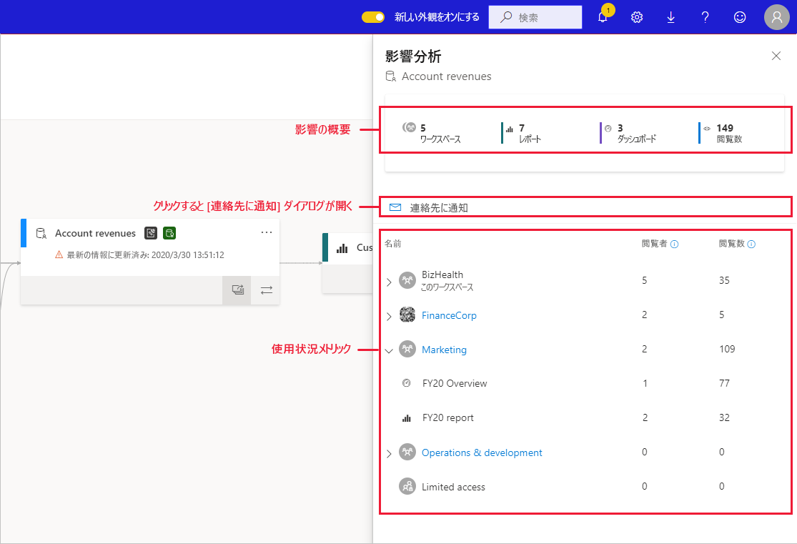

# データセットの影響分析

データセットに変更を加える場合や、変更を検討している場合は、そのデータセットに依存するダウンストリームのレポートとダッシュボードへのそれらの変更による影響を評価できるようにすることが重要です。 **データセットの影響分析**では、この評価に役立つ情報が提供されます。
* 変更による影響を受ける可能性があるワークスペース、レポート、ダッシュボードの数が示され、影響を受けるレポートとダッシュボードが配置されているワークスペースに簡単に移動して、さらに調査することができます。
* 影響を受ける可能性がある項目について、ユニーク訪問者の数とビューの数が表示されます。 これは、ダウンストリーム項目の変更による全体的な影響を確認するのに役立ちます。 たとえば、閲覧者が 3 人のレポートに対する変更の影響を調査するよりも、ユニーク閲覧者が 20,000 人のレポートに対する変更の影響を調査することの方がおそらく重要です。
* 加えられた変更または検討している変更について、関連するユーザーに簡単に通知することができます。

データセットの影響分析は、[データ系列ビュー](service-data-lineage.md)内から簡単に起動できます。

## 共有データセットの識別

データセットの影響分析は、共有と非共有の両方のデータセットに対して実行できます。 しかし、これは、ワークスペース間で共有されるデータセットで特に便利です。すべての依存関係がデータセット自体と同じワークスペースにある、非共有データセットの場合より、ダウンストリームの依存関係を明確に把握することの方がはるかに複雑であるためです。

系列ビューでは、データセットのカードの左上隅に表示されるアイコンによって、共有データセットと非共有データセットの違いを確認できます。

## データセットの影響分析を実行する

影響分析は、共有されているかどうかに関係なく、ワークスペース内の任意のデータセットに対して実行することができます。 系列ビューに表示されていても、実際には別のワークスペースに配置されている外部データセットに対して影響分析を実行することはできません。 外部データセットに対して影響分析を実行するには、ソース ワークスペースに移動する必要があります。

データセットの影響分析を実行するには、データセット カードの影響分析ボタンをクリックします。

影響分析作業パネルが開きます。

* **影響の概要**には、影響を受ける可能性があるワークスペース、レポート、ダッシュボードの数、データセットに接続されているすべてのダウンストリーム レポートとダッシュボードのビューの合計数が表示されます。
* **連絡先に通知**リンクでは、ダイアログが開き、そこで影響を受けるワークスペースの連絡先リストに加えたデータセットの変更に関するメッセージを作成し送信することができます。 
* **使用状況の内訳**では、ワークスペースごとに、そこに含まれる影響を受ける可能性があるレポートとダッシュボードのビューの合計数と、レポートとダッシュボードごとに、以下の閲覧者とビューの合計数が表示されます。
   * 閲覧者:レポートまたはダッシュボードを表示した個別のユーザーの数。
   * Views:レポートまたはダッシュボードのビューの数

使用状況メトリックは、現在の日付を除く、過去 30 日間に関連します。 この数には、関連するアプリ経由での使用が含まれます。 メトリックは、テナント全体のデータセットの使用を把握し、データセットに対する変更によって受ける可能性がある影響を評価するのに役立ちます。

## 連絡先に通知

データセットに変更を加えた場合、または変更を検討している場合は、関連するユーザーに連絡し、それについて通知することができます。 連絡先に通知すると、影響を受けるすべてのワークスペースの[連絡先一覧](../collaborate-share/service-create-the-new-workspaces.md#create-a-contact-list)にメールが送信されます。 メールには送信元の名前が表示されるので、連絡先でそれを確認し、新しいメール スレッドで返信することができます。 

1. 影響分析作業ウィンドウの **[Notify contacts]\(連絡先に通知\)** をクリックします。 [Notify contacts]\(連絡先に通知\) ダイアログが表示されます。

   ![[Notify contacts]\(連絡先に通知\) ダイアログ](media/service-dataset-impact-analysis/notify-contacts-dialog.png)

1. テキスト ボックスに、変更に関する詳細を入力します。
1. メッセージの準備ができたら、 **[送信]** をクリックします。

> [!NOTE]
> 影響分析を実行するデータセットがクラシック ワークスペースに配置されている場合、[Notify contacts]\(連絡先に通知\) は使用できません。

## プライバシー

データセットに対して影響分析を実行するには、それに対する書き込み権限が必要です。 影響分析作業ウィンドウには、アクセスできるワークスペース、レポート、およびダッシュボードの実際の名前のみが表示されます。 アクセスできない項目は、**制限付きアクセス**として一覧表示されます。 これは、一部の項目名に個人情報が含まれている可能性があるためです。

一部のワークスペースにアクセスできない場合でも、これらのワークスペースの使用状況の概要メトリックが表示され、連絡先に通知のメッセージはこれらのワークスペースの連絡先一覧に到達します。

## Power BI Desktop からの影響分析

Power BI Desktop でデータセットに変更を加えてから、Power BI サービスに再発行すると、その変更の影響を受ける可能性があるワークスペース、レポート、ダッシュボードの数がメッセージに表示され、現在発行されているデータセットを、変更したものに置き換えるかどうかを確認するよう求められます。 また、メッセージでは、Power BI サービスの完全なデータセットの影響分析へのリンクも提供され、そこで、詳細を確認し、変更のリスクを軽減するための措置を取ることができます。

> [!NOTE]
> メッセージに表示される情報は、潜在的な影響のみを示すものであり、必ずしも何かが破損したことを示しているわけではありません。 多くの場合、データセットの変更はダウンストリームのレポートやダッシュボードに悪影響しませんが、このメッセージが表示されることで、潜在的な影響について明確にすることができます。
>
>メッセージには、複数のワークスペースに影響を受けるレポートとダッシュボードが含まれている場合にのみ、ワークスペースの数が表示されます。

## 制限事項

* 現在、クラシックおよび個人用ワークスペースでは使用状況メトリックはサポートされていません。

## 次の手順

* [ワークスペース全体のデータセットの概要 (プレビュー)](../connect-data/service-datasets-across-workspaces.md)
* [Data lineage (データ系列)](service-data-lineage.md)

