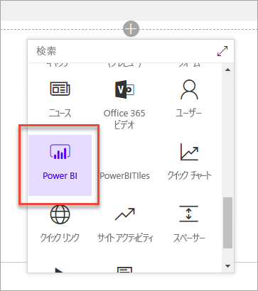
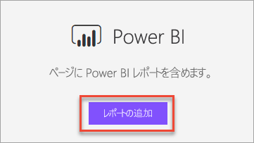
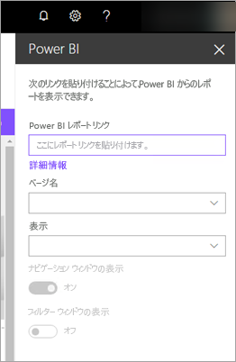
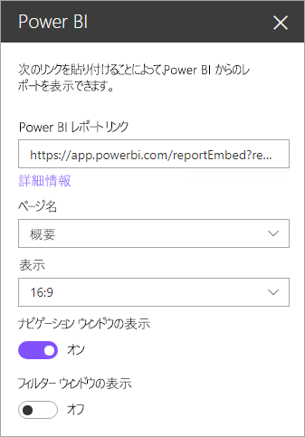

# SharePoint Online にレポート Web パーツを埋め込む

Power BI の新しい SharePoint Online 用レポート Web パーツでは、対話型の Power BI レポートを SharePoint Online のページに簡単に埋め込むことができます。

新しい **[SharePoint Online に埋め込む]** オプションを使うと、埋め込まれたレポートは完全に安全なので、簡単にセキュリティで保護された内部ポータルを作成できます。

## 要件

**[SharePoint Online に埋め込む]** レポートが機能するためには、次が必要です。

* Power BI Pro ライセンス、または Power BI ライセンスがある [Power BI Premium 容量 (EM または P SKU)](../admin/service-premium-what-is.md)。
* SharePoint Online の Power BI Web パーツには、[最新式のページ](https://support.office.com/article/Allow-or-prevent-creation-of-modern-site-pages-by-end-users-c41d9cc8-c5c0-46b4-8b87-ea66abc6e63b)が必要です。
* 埋め込みレポートを使用するには、ユーザーは Power BI サービスにサインインし、自分の Power BI ライセンスをアクティベートする必要があります。

## レポートを埋め込む
SharePoint Online にレポートを埋め込むには、レポートの URL を取得し、SharePoint Online の Power BI Web パーツでその URL を使う必要があります。

### レポートの URL を取得する

1. Power BI 内でレポートを表示します。

2. **[その他のオプション (...)]** ドロップダウン メニューで、 **[埋め込む]**  >  **[SharePoint Online]** の順に選択します。

    ![[その他のオプション] メニュー、SharePoint Online](media/service-embed-report-spo/power-bi-more-options-sharepoint-online.png)

3. ダイアログからレポートの URL をコピーします。

    

### Power BI レポートを SharePoint Online のページに追加する

1. SharePoint Online で目的のページを開き、 **[編集]** を選びます。

    

    または、SharePoint Online で **[+ 新規]** を選んで、最新式のサイト ページを新しく作成します。

    

2. **+** ドロップダウンを選び、その後 **[Power BI]** Web パーツを選びます。

    

3. **[レポートの追加]** を選びます。

      

4. 前にコピーしたレポートの URL を **[Power BI report link]\(Power BI のレポート リンク\)** ペインにコピーします。 レポートは自動的に読み込まれます。

    

5. SharePoint Online のユーザーに変更が表示されるようにするには、 **[発行]** を選びます。

    

## レポートへのアクセスを許可する

SharePoint Online にレポートを埋め込んだだけで、レポートを表示するアクセス許可が自動的にユーザーに与えられることはありません。Power BI で表示アクセス許可を設定する必要があります。

> [!IMPORTANT]
> Power BI サービスでレポートを表示できるユーザーを確認し、一覧に含まれないユーザーにアクセスを許可します。

Power BI でレポートへのアクセスを許可するには 2 つの方法があります。 1 番目の方法は、Microsoft 365 グループを使用して SharePoint Online のチーム サイトを構築している場合、**Power BI サービス内のワークスペース**および **SharePoint ページ**のメンバーとしてユーザーを指定することです。 詳細については、[ワークスペースを管理する](service-manage-app-workspace-in-power-bi-and-office-365.md)方法に関するページを参照してください。

2 番目の方法は、アプリ内にレポートを埋め込んでユーザーと直接に共有することです。  

1. 作成者は (Pro ユーザーである必要があります)、ワークスペースにレポートを作成します。 "*Power BI 無料ユーザー*" と共有するには、ワークスペースを "*Premium ワークスペース*" として設定する必要があります。

2. 作成者は、アプリを発行し、インストールします。 作成者は、アプリをインストールして、SharePoint Online に埋め込むために使用されるレポートの URL にアクセスできるようにする必要があります。

3. すべてのエンド ユーザーも、アプリをインストールする必要があります。 [Power BI 管理ポータル](../admin/service-admin-portal.md)で有効にできる **[アプリを自動的にインストールします]** 機能を使用して、エンド ユーザーにアプリがプレインストールされるようにすることもできます。

   

4. 作成者は、アプリを開いて、レポートに移動します。

5. 作成者は、アプリによってインストールされたレポートから埋め込みレポート URL をコピーします。 ワークスペースから元のレポートの URL を使用しないでください。

6. SharePoint Online で新しいチーム サイトを作成します。

7. 前にコピーしたレポートの URL を、Power BI Web パーツに追加します。

8. SharePoint Online ページや作成した Power BI アプリでデータを使用するすべてのエンド ユーザーおよびグループを追加します。

    > [!NOTE]
    > **ユーザーまたはグループは、SharePoint ページ上のレポートを見るには、SharePoint Online ページと、Power BI アプリ内のレポートの両方に、アクセスできる必要があります。**

これで、エンド ユーザーは、SharePoint Online でチーム サイトに移動し、ページのレポートを見ることができるようになります。

## 多要素認証

Power BI 環境で多要素認証を使ったサインインが必要な場合は、ID 確認のためにセキュリティ デバイスでのサインインを求められることがあります。 これは、ユーザーが多要素認証を使わずに SharePoint Online にサインインしているのに、Power BI 環境でアカウントの検証にセキュリティ デバイスが必要とされる場合に発生します。

> [!NOTE]
> Power BI では Azure Active Directory 2.0 での多要素認証はまだサポートされていません。ユーザーにエラー メッセージが表示されます。 ユーザーがセキュリティ デバイスを使って SharePoint Online に再度サインインした場合、レポートを表示できることがあります。

## Web パーツの設定

SharePoint Online 用の Power BI Web パーツに対して調整できる設定について以下に示します。

| プロパティ | Description |
| --- | --- |
| ページ名 |Web パーツの既定のページを設定します。 ドロップダウンから値を選びます。 ドロップダウンにページが表示されない場合は、レポートが 1 ページであるか、または貼り付けた URL にページ名が含まれています。 特定のページを選ぶには、URL からレポート セクションを削除します。 |
| 表示 |レポートを SharePoint Online のページ内に収める方法を調整します。 |
| ナビ ペインの表示 |ページ ナビ ペインの表示と非表示を切り替えます。 |
| フィルター ウィンドウの表示 |フィルター ウィンドウの表示と非表示を切り替えます。 |

## 読み込まれないレポート

レポートが Power BI Web パーツに読み込まれない場合、次のメッセージが表示されることがあります。

![[このコンテンツは使用できません] メッセージ](media/service-embed-report-spo/powerbi-sharepoint-report-not-found.png)

このメッセージには 2 つの一般的な理由があります。

1. レポートへのアクセス許可がありません。
2. レポートが削除されました。

問題を解決するには、SharePoint Online ページの所有者に連絡してください。

## ライセンス

ユーザーが SharePoint 内でレポートを閲覧するには、**Power BI Pro ライセンス**を所有しているか、またはレポートのコンテンツが **[ Power BI Premium 容量 (EM または P SKU)](../admin/service-admin-premium-purchase.md)** 内のワークスペースに置かれている必要があります。

## 既知の問題と制限事項

* エラー: "エラーが発生しました。ログアウトしてから再度ログインして、このページに再びアクセスしてください。 関連付け ID: 未定義、http の応答の状態: 400、サーバー エラー コード 10001、メッセージ: 更新トークンが見つかりません"
  
  このエラーが返された場合は、以下のトラブルシューティング手順のいずれかをお試しください。
  
  1. SharePoint からサインアウトし、再度サインインします。 再度サインインする前に、必ずすべてのブラウザー ウィンドウを閉じてください。

  2. ユーザー アカウントに多要素認証 (MFA) が必要な場合は、MFA デバイス (電話アプリやスマート カードなど) を使用して SharePoint にサインインしてください。
  
  3. Azure B2B ゲスト ユーザー アカウントはサポートされていません。 ユーザーにはパーツを読み込み中であることを示す Power BI のロゴが表示されますが、レポートは表示されません。

* Power BI は、SharePoint Online と同じローカライズされた言語をサポートしていません。 そのため、埋め込みのレポートが適切にローカライズされていない可能性があります。

* この問題は Internet Explorer 10 を使用する場合に発生する可能性があります。 <!--You can look at the [browsers support for Power BI](../consumer/end-user-browsers.md) and for [Microsoft 365](https://products.office.com/office-system-requirements#Browsers-section). -->

* Power BI Web パーツは、[国内クラウド](https://powerbi.microsoft.com/clouds/)では利用できません。

* 従来の SharePoint はこの Web パーツではサポートされていません。

* [URL フィルター](service-url-filters.md)は SPO Web パーツではサポートされていません。

## 次の手順

* [エンドユーザーによる最新式のサイト ページの作成を許可または禁止する](https://support.office.com/article/Allow-or-prevent-creation-of-modern-site-pages-by-end-users-c41d9cc8-c5c0-46b4-8b87-ea66abc6e63b)  
* [Power BI でのアプリの作成および配布](service-create-distribute-apps.md)  
* [同僚や他のユーザーとダッシュボードやレポートを共有する](service-share-dashboards.md)  
* [Power BI Premium とは何ですか?](../admin/service-premium-what-is.md)
* [セキュリティで保護されたポータルまたは Web サイトにレポートを埋め込む](service-embed-secure.md)

他にわからないことがある場合は、 [Power BI コミュニティで質問してみてください](https://community.powerbi.com/)。
