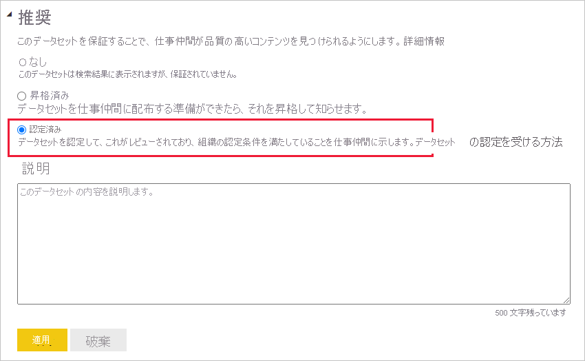
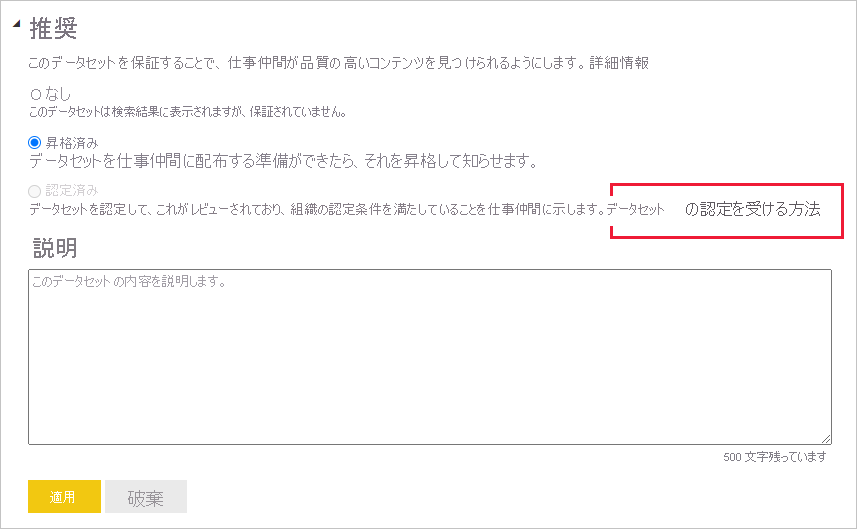
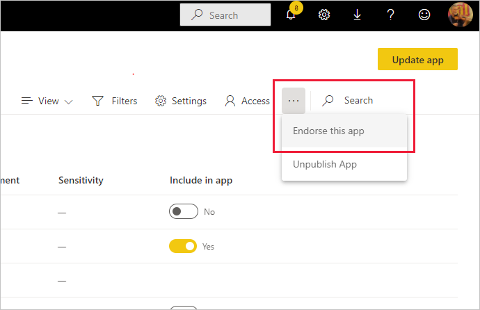

# コンテンツを承認する

Power BI には、有用で質の高いコンテンツを承認してその可視性を向上させるために、2 つの方法が用意されています。 **昇格** と **認定** です。

* **昇格** : 昇格は、有用で他のユーザーが使用するのに値すると思われるコンテンツを強調表示する方法です。 これにより、組織内でコンテンツの共同作業での使用と拡散が促進されます。

    コンテンツの所有者と、コンテンツが配置されているワークスペースに対する書き込みアクセス許可を持つメンバーは、コンテンツが共有に十分適していると考えた場合に、それを昇格させることができます。

* **認定** : 認定は、コンテンツが組織の品質基準を満たしており、信頼でき、優先され、組織全体で使用できる状態にあると見なせることを意味します。

    承認されたレビュー担当者だけがコンテンツを認定できます。 自分のコンテンツを認定済みにしたいコンテンツの所有者が、それを自分で認定することを許可されていない場合は、組織のガイドラインに従ってコンテンツの認定を受ける必要があります。

現在、次のものを承認できます。
* データセット
* データフロー (プレビュー)
* レポート (プレビュー)
* アプリ (プレビュー)

この記事では、[コンテンツの昇格](#promote-content)、[コンテンツの認定](#certify-content) (承認されたレビュー担当者である場合)、[認定の要求](#request-content-certification) (承認されていない場合) を行う方法について説明します。

承認の詳細については、「[承認: Power BI コンテンツの昇格と認定](service-endorsement-overview.md)」を参照してください。

## コンテンツの昇格

コンテンツを昇格させるには、昇格させるコンテンツが配置されているワークスペースに対する書き込みアクセス許可が必要です。

>[!NOTE]
>例として、データセットの承認ダイアログを次に示します。 その他のコンテンツの種類のダイアログは、ほぼ同じで、同じラジオ ボタンのオプションがあります。 

1. 昇格させるコンテンツの[設定](#how-to-get-to-content-settings)に移動します。

1. 承認セクションを展開し、 **[昇格しました]** を選択します。 データセットを昇格させる場合は、データセットの簡単な説明を入力します。

    ![[昇格しました]、[適用] の順に選択する](media/service-endorse-content/power-bi-promote-content.png)

1. **[適用]** を選びます。

## コンテンツの認定

コンテンツの認定は大きな責任を伴い、承認されたユーザーだけがコンテンツを認定できます。 その他のユーザーは、[コンテンツ認定の要求](#request-content-certification)ができます。 このセクションでは、コンテンツを認定する方法について説明します。

>[!NOTE]
>例として、データセットの承認ダイアログを次に示します。 その他のコンテンツの種類のダイアログは、ほぼ同じで、同じラジオ ボタンのオプションがあります。 

1. 認定するコンテンツが配置されているワークスペースに対する書き込みアクセス許可を取得します。 そのようなアクセス許可は、コンテンツの所有者に、またはワークスペースの管理者アクセス許可を持つ任意のユーザーに要求できます。

1. コンテンツを慎重に確認し、組織の認定基準を満たしているかどうかを判断します。

1. コンテンツを認定すると決めた場合は、それが置かれているワークスペースに移動し、認定するコンテンツの[設定](#how-to-get-to-content-settings)を開きます。

1. 承認セクションを展開し、 **[認定済み]** を選択します。 

    

1. **[適用]** を選択します。

## コンテンツ認定の要求

コンテンツを認定したいが、それを行うことを許可されていない場合は、次の手順に従ってください。

>[!NOTE]
>例として、データセットの承認ダイアログを次に示します。 その他のコンテンツの種類のダイアログは、ほぼ同じで、同じラジオ ボタンのオプションがあります。 

1. 認定を受けたいコンテンツがあるワークスペースに移動し、そのコンテンツの[設定](#how-to-get-to-content-settings)を開きます。

1. 承認セクションを展開します。 コンテンツを認定することを許可されていないため、 **[認定済み]** ボタンはグレー表示されています。 コンテンツの認定を受ける方法についてのリンクをクリックします。

    
    
    >[!NOTE]
    >上記のリンクをクリックしても、この注意にリダイレクトされた場合は、Power BI 管理者が情報を使用可能にしていないことを意味します。 この場合は、Power BI 管理者に直接問い合わせてください。

## コンテンツの設定にアクセスする方法

承認ダイアログには、承認するコンテンツの設定を使用してアクセスします。 次の手順に従って、各コンテンツの種類の設定にアクセスします。

* **データセット** : リスト ビューで、承認するデータセットをポイントし、 **[その他のオプション] (...)** をクリックして、表示されたメニューから **[設定]** を選択します。
* **データフロー** (プレビュー): リスト ビューで、承認するデータフローをポイントし、 **[その他のオプション] (...)** をクリックして、表示されたメニューから **[設定]** を選択します。

* **レポート** (プレビュー): リスト ビューで、承認するレポートをポイントし、 **[その他のオプション] (...)** をクリックして、表示されたメニューから **[設定]** を選択します。 または、レポートが開いている場合は、 **[ファイル] > [設定]** を選択します。

* **アプリ** (プレビュー): アプリ ワークスペースにアクセスし、メニュー バーの **[その他のオプション] (...)** をクリックして、 **[Endorse this app]\(このアプリを承認する\)** を選択します。

    

## 次のステップ

* [コンテンツの承認の詳細については、こちらをご覧ください](service-endorsement-overview.md)
* [コンテンツの認定を有効にする](../admin/service-admin-setup-certification.md) (Power BI 管理者)
* わからないことがある場合は、 [Power BI コミュニティで質問してみてください](https://community.powerbi.com/)。
