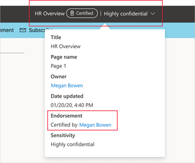
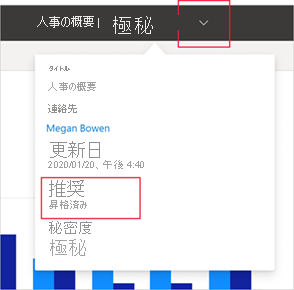

# 承認 - Power BI コンテンツの昇格と認定

## 承認の概要

多くの場合、組織には、Power BI ユーザーが共有および再利用できる Power BI コンテンツが大量に存在し、信頼できる優先コンテンツを識別することは困難な場合があります。 承認は、必要な質の高いコンテンツをユーザーが簡単に見つけられるようにする方法です。 承認されたコンテンツには、Power BI 内と、ユーザーが Power BI コンテンツを検索するその他の場所 (Excel など) の両方で、明確なラベルが付けられます。 また、一部の検索で優先されるほか、一部のリストを並べ替えるために使用できます。

承認には、**昇格** と **認定** の 2 種類があります。

* **昇格**: 昇格によってユーザーは、有用で価値があり、他のユーザーが使用できる状態にあると考えるコンテンツを強調表示できるようになります。 これにより、組織内で共同作業するためのコンテンツの拡散が促進されます。

    コンテンツの所有者、またはコンテンツが配置されているワークスペースに対する書き込みアクセス許可を持つメンバーは、コンテンツが共有に十分適していると考えた場合に、それを簡単に昇格させることができます。

* **認定**: 認定は、コンテンツが組織の品質基準を満たしており、組織全体で使用できる状態にある信頼できる優先コンテンツと見なせることを意味します。

    選択されたレビュー担当者のグループ (Power BI 管理者によって定義される) だけが、コンテンツを認定することを許可されます。 自分のコンテンツを認定済みにしたいコンテンツの所有者が、それを自分で認定することを許可されていない場合は、組織のガイドラインに従ってコンテンツの認定を受ける必要があります。

    **認定を使用できるのは、Power BI 管理者が組織に対してそれを有効にし、構成した場合のみです**。

次の図は、レポート作成の基になるデータセットを検索しているときに、承認されたコンテンツ (昇格されたものと認定されたもの) が、どのように明確に識別されるかを示しています。

## 承認できるコンテンツの種類
現在、次の承認が Power BI によってサポートされています。
* データセット
* データフロー (プレビュー)
* レポート (プレビュー)
* アプリ (プレビュー)

## 承認されたコンテンツの識別

Power BI 内と、Power BI コンテンツを検索できる Excel などの場所の両方で、リスト、カード、およびその他の場所において、承認されたコンテンツにはバッジとアイコンが付いています。 次のバッジとアイコンによって、承認されたコンテンツが識別されます。

|バッジ|アイコン|
|---------|---------|
|||
|||
|||

さらに、レポートまたはアプリ内では、ヘッダーによって承認の状態を確認できます。
* 認定は、ヘッダーとヘッダーのドロップダウンの両方に示され、だれが認定を行ったかも確認できます。

    

* 昇格は、ヘッダーのドロップダウンにのみ表示されます。
 
    

## アプリとレポートのどちらを承認するかの決定

承認は、ユーザーが検索、使用、および場合によって再共有することができるコンテンツ項目 (アプリ、レポート、データセット、データフロー) を対象に使用することを目的としています。

広範囲のユーザーとデータを共有する場合は、Power BI のベスト プラクティスは、アプリを使用してそのデータを共有することです。 このベスト プラクティスに従う場合は、ユーザーがそのアプリを簡単に見つけられるようにすることをお勧めします。 このような場合は、アプリを承認する必要があります。 

ただし、レポートを直接共有することが便利な場合は、レポート自体を承認します。 

レポートとアプリのどちらを共有しているかにかかわらず、基になるデータセットがクリーンで共有できる状態にある場合は、データセットも承認することをお勧めします。 データフローにも同じことが当てはまります。  

## 次のステップ

* [Power BI コンテンツの昇格または認定](service-endorse-content.md)
* [組織での認定を有効にする](../admin/service-admin-setup-certification.md) (Power BI 管理者)
* わからないことがある場合は、 [Power BI コミュニティで質問してみてください](https://community.powerbi.com/)。