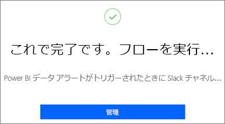
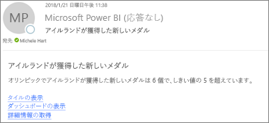
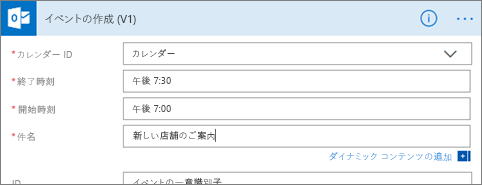
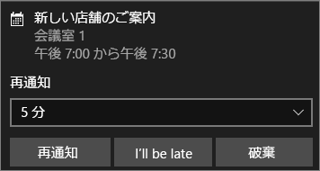

# データ アラートを Power Automate と統合する

Power BI をお気に入りのアプリやサービスと統合するには、[Power Automate](/power-automate/getting-started) を使用します。 Power Automate を使用すると、自動化されたワークフローを作成して、通知の取得、ファイルの同期、データの収集などを行うことができます。 この記事では、Power BI データ アラートに基づく電子メールの生成を自動化します。

## 前提条件
この記事では、フローをテンプレートから作成する方法とゼロから作成する方法について説明します。 この手順を行うには、[Power BI でデータ アラートを作成](../create-reports/service-set-data-alerts.md)し、[Power Automate にサインアップ](https://flow.microsoft.com/#home-signup)してください。 無料!

## テンプレートからフローを作成する
このタスクでは、テンプレートを使用して、Power BI データ アラート (通知) によってトリガーされるシンプルなフローを作成します。

1. Power Automate にサインインします (flow.microsoft.com)。
2. **[テンプレート]** を選択し、 **[Power BI]**  >  **[Power BI データ アラートがトリガーされたときに対象ユーザーにメールを送信する]** の順に検索します。
   
    :::image type="content" source="media/service-flow-integration/power-automate-templates.png" alt-text="Power Automate の [Power BI データ アラートがトリガーされたときに対象ユーザーにメールを送信する] テンプレートのスクリーンショット。":::

### フローの作成
このテンプレートには、1 つのトリガー (Power BI データ アラート) と、1 つのアクション (電子メールを送信する) が含まれています。 Power Automate でフィールドを選択すると、含めることができる動的なコンテンツが表示されます。  この例では、メッセージの本文にタイル値とタイル URL を含めます。

1. **[続行]** をクリックします。

    :::image type="content" source="media/service-flow-integration/power-automate-power-bi-mail.png" alt-text="Power Automate で Power BI からのメールの送信を示すスクリーンショット。":::

1. **[アラート ID]** ボックスで、Power BI データ アラートを選択します。 アラートの作成方法については、「[Data alerts in Power BI](../create-reports/service-set-data-alerts.md)」(Power BI のデータ アラート) を参照してください。
   
    :::image type="content" source="media/service-flow-integration/power-automate-select-alert-id.png" alt-text="[アラート ID] ボックスでのアラートの選択を示すスクリーンショット。":::
2. 有効な電子メール アドレスを 1 つまたは複数入力します。

3. Power Automate により、 **[件名]** と **[本文]** が自動的に生成されます。これはそのまま使用することも変更することもできます。 本文のテキストは、HTML を使用して書式設定されます。

    :::image type="content" source="media/service-flow-integration/power-automate-autogenerated-email.png" alt-text="Power Automate によって自動生成された電子メール テキストのスクリーンショット。":::

1. メッセージが完成したら、 **[次のステップ]** または **[保存]** を選択します。  フローが作成され、評価されます。  Power Automate でエラーが検出されると、通知が表示されます。
2. エラーが検出された場合、**[フローの編集]** を選択して修正するか、**[完了]** を選択して新しいフローを実行します。
   
   
5. データ アラートがトリガーされると、指定したアドレスに Power Automate から電子メールが送信されます。  
   
   

## ゼロからフローを作成する
このタスクでは、Power BI データ アラート (通知) によってトリガーされるシンプルなフローをゼロから作成します。

1. Power Automate にサインインします (flow.microsoft.com)。
2. **[作成]**  >  **[自動フロー]** の順に選択します。

    :::image type="content" source="media/service-flow-integration/power-automate-create-automated-flow.png" alt-text="Power Automate の [作成] > [自動フロー] のスクリーンショット。":::   
3. **[自動フローの作成]** で、フローに名前を付けます。
1. **[フローのトリガーを選択してください]** で、 **[Power BI]** を検索します。
1. **[Power BI - データドリブン アラートがトリガーされたとき]**  >  **[作成]** の順に選択します。

    :::image type="content" source="media/service-flow-integration/power-automate-build-automated-flow.png" alt-text="[自動フローの作成] のスクリーンショット。":::

### フローを構築する
1. **[アラート ID]** ボックスで、アラートの名前を選択します。 アラートの作成方法については、「[Data alerts in Power BI](../create-reports/service-set-data-alerts.md)」(Power BI のデータ アラート) を参照してください。

    :::image type="content" source="media/service-flow-integration/power-automate-select-alert-id-scratch.png" alt-text="アラートの名前の選択を示すスクリーンショット。":::   

2. **[新しいステップ]** を選択します。
   
3. **[アクションの選択]** で、 **[Outlook]**  >  **[イベントの作成]** の順に検索します。

    :::image type="content" source="media/service-flow-integration/power-automate-choose-action-create-event.png" alt-text="[アクションの選択] > [イベントの作成] のスクリーンショット。":::   
4. イベント フィールドに入力します。 Power Automate でフィールドを選択すると、含めることができる動的なコンテンツが表示されます。
   
   
5. 完了したら、**[フローの作成]** を選択します。  Power Automate によってフローが保存され、評価されます。 エラーがない場合、**[完了]** を選択してこのフローを実行します。  新しいフローが **[自分のフロー]** ページに追加されます。
   
   
6. Power BI データ アラートでフローがトリガーされると、次のような Outlook イベント通知を受け取ります。
   
    

## 次の手順
* [Power Automate の概要](/power-automate/getting-started/)
* [Power BI サービスでデータ アラートを設定する](../create-reports/service-set-data-alerts.md)
* [iPhone でデータ アラートを設定する](../consumer/mobile/mobile-set-data-alerts-in-the-mobile-apps.md)
* その他の質問 [Power BI コミュニティを利用してください](https://community.powerbi.com/)。
