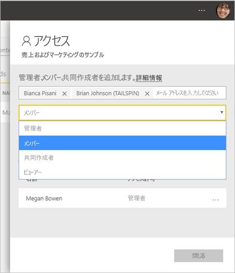

# Power BI で新しいワークスペースへのアクセス権をユーザーに付与する

Power BI で[新しいワークスペースのいずれかを作成](service-create-the-new-workspaces.md)した後、またはワークスペースの管理者ロールを持っている場合は、他のユーザーを別のロールに追加することで、アクセス権を付与することができます。 ユーザーがアクセスできるようにする必要があります。 ワークスペースの作成者は、自動的に管理者になります。 さまざまなロールの説明については、「[新しいワークスペースのロール](service-new-workspaces.md#roles-in-the-new-workspaces)」を参照してください。

> [!NOTE]
> ワークスペースでコンテンツを参照する Power BI Pro ユーザーに対して行レベル セキュリティ (RLS) を適用するには、ユーザーにビューアー ロールを割り当てます。

## ワークスペースへのアクセスを許可する

1. あなたはワークスペースの管理者ロールを持っているので、ワークスペース コンテンツ リスト ページに **[アクセス]** が表示されます。

    

1. セキュリティ グループ、配布リスト、Microsoft 365 グループ、または個人を、これらのワークスペースに管理者、メンバー、共同作成者、またはビューアーとして追加します。 

    

9. **[追加]**  >  **[閉じる]** の順に選択します。

## 次の手順
* [Power BI での新しいワークスペース エクスペリエンスの作業の整理](service-new-workspaces.md)に関する記事を参考してください
* [新しいワークスペースを作成する](service-create-the-new-workspaces.md)
* [Power BI で新しいワークスペースからアプリを発行する](service-create-distribute-apps.md)
* わからないことがある場合は、 [Power BI コミュニティで質問してみてください](https://community.powerbi.com/)。
