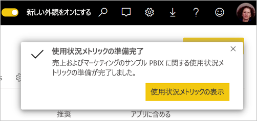
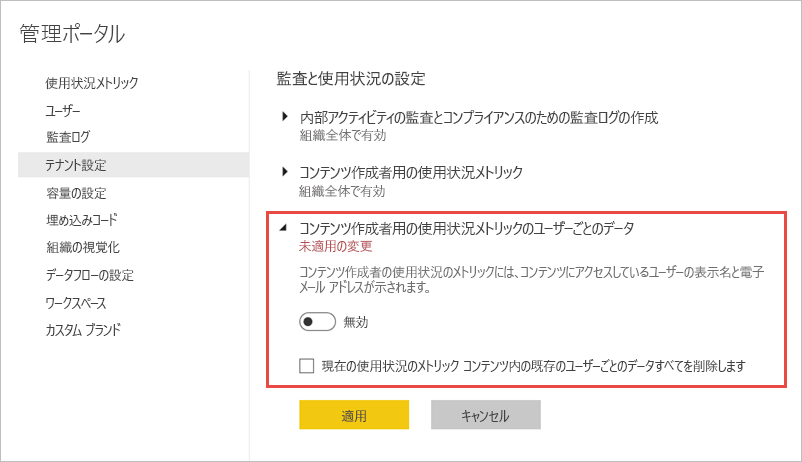
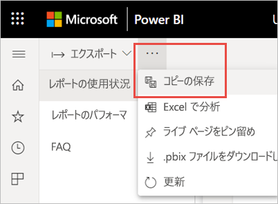
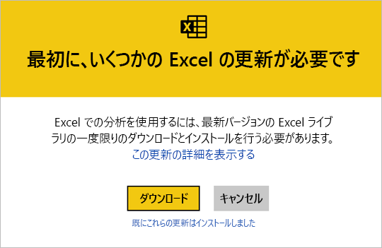
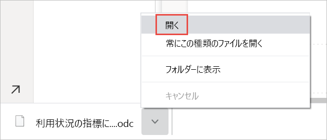
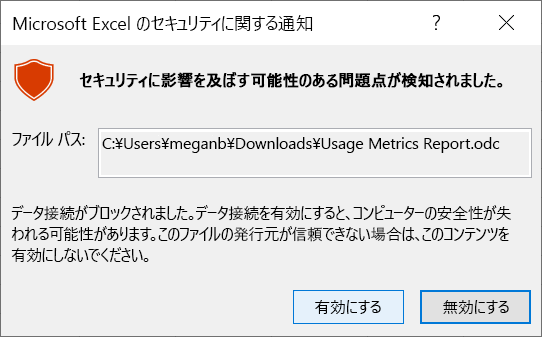
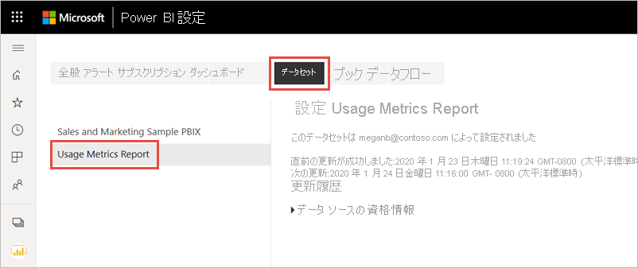
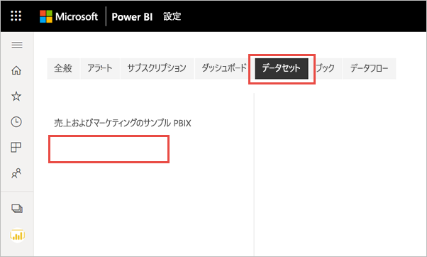

# 新しいワークスペース エクスペリエンスで使用状況メトリックを監視する (プレビュー)

コンテンツの利用状況を知ることで、効果を証明し、労力に優先順を付けることができます。 使用状況メトリックから、組織の大きなセグメントによってレポートの 1 つが毎日使用されていることがわかる場合があります。 作成したダッシュボードを誰も表示していないことがわかる場合もあります。 このような情報は、仕事に労力を正しく使う上で非常に重要です。

最新のワークスペースでレポートを作成した場合は、強化された使用状況メトリックに関するレポートにアクセスできます。 これにより、組織全体でこれらのレポートを使用しているユーザーと、それらをどのように使用しているかを知ることができます。 また、大まかなパフォーマンス上の問題を特定することもできます。 最新のワークスペース エクスペリエンスの強化された利用状況レポートによって、「[Power BI のダッシュボードとレポートの利用状況の指標を監視する](service-usage-metrics.md)」に記載されている既存の利用状況の指標に関するレポートは置き換えられます。

> [!NOTE]
> 利用状況の指標レポートは、Power BI サービス内でのみ実行できます。 しかしながら、利用状況の指標レポートを保存するか、ダッシュボードにピン留めすると、モバイル デバイスでそのレポートを開き、操作できます。

## 前提条件

- 利用状況の指標データにアクセスし、実行するには、Power BI Pro または Premium Per User (PPU) のライセンスが必要です。 ただし、利用状況の指標機能では、割り当てられているライセンスに関係なく、すべてのユーザーの利用状況情報が取得されます。
- レポート用の強化された利用状況の指標にアクセスするには、そのレポートが最新のワークスペース内にあり、またそのレポートに対する編集アクセス権を持っている必要があります。
- Power BI 管理者が、コンテンツ作成者に向けて利用状況の指標を有効にしている必要があります。 Power BI 管理者は、利用状況の指標でのユーザーごとのデータ収集を有効にしている場合もあります。 [管理ポータル内でこれらのオプションを有効にする](../admin/service-admin-portal.md#control-usage-metrics)方法をご覧ください。

## 強化された利用状況の指標に関するレポートの作成と表示

管理者、メンバー、または共同作成者のアクセス許可を持つユーザーのみが、強化された利用状況の指標に関するレポートを表示できます。 閲覧者のアクセス許可では不十分です。 レポートが存在している最新のワークスペースにおいて共同作成者以上であれば、以下の手順を使用して強化された利用状況の指標を表示することができます。

1. 利用状況の指標を分析したいレポートが含まれているワークスペースを開きます。
2. ワークスペースのコンテンツ リストのいずれかから、レポートのコンテキスト メニューを開き、 **[利用状況のメトリック レポートを表示]** を選択します。 または、レポートを開き、コマンド バーのコンテキスト メニューを開いて、 **[利用状況の指標]** を選択します。

    

1. これを初めて実行すると、Power BI によって利用状況指標レポートが作成され、準備できると知らされます。

    

1. 結果を参照するには、 **[使用状況メトリックの表示]** を選択します。
2. これを初めて実行する場合は、Power BI によって古い利用状況の指標に関するレポートが開かれる場合があります。 強化された利用状況の指標に関するレポートを表示するには、右上隅の [新しい使用状況レポートをオフにする] スイッチを **[オン]** に切り替えます。

    

    > [!NOTE]
    > レポートが最新のワークスペースに存在する場合にのみ、新しい利用状況レポートのスイッチが表示されます。 従来のワークスペースでは、強化された利用状況の指標に関するレポートは利用できません。

## 強化された利用状況の指標に関するレポートについて

この強化された使用状況メトリックに関するレポートを表示すると、Power BI によって構築済みのレポートが生成されます。 これには、過去 30 日間のそのコンテンツの使用状況メトリックが含まれています。 このレポートは、おなじみの Power BI レポートに似ています。 アクセス手段 (Web やモバイル アプリなど) に関係なく、エンド ユーザーがアクセス権を受け取った方法に基づいてスライスできます。 レポートが変更されるにつれて、その使用状況メトリックに関するレポートも変わります。 これは毎日新しいデータで更新されます。

> [!NOTE]
> 利用状況の指標に関するレポートは、[最近]、[ワークスペース]、[お気に入り]、またはその他のコンテンツ リストには表示されません。 これらはアプリに追加できません。 利用状況の指標レポートからダッシュボードにタイルをピン留めすると、そのダッシュボードはアプリに追加できません。

### 利用状況の指標に関するレポートのデータセット

強化された使用状況メトリックに関するレポートを初めて起動すると、Power BI により、使用状況メトリックに関するレポート データセットが自動的に作成されます。 強化された使用状況メトリックに関するレポートは、そのデータセットに依存します。 その後、このデータセットは Power BI によって毎日更新されます。 更新スケジュールを変更することはできませんが、利用状況の指標データを更新するために Power BI によって使用される資格情報を更新することはできます。 資格情報の有効期限が切れた場合、またはこのデータセットが存在するワークスペースから使用状況メトリックに関するレポートを最初に起動したユーザーを削除した場合に、スケジュールされた更新の再開が必要になることがあります。

> [!NOTE]
> 使用状況メトリックのデータセットはまだプレビュー段階ですが、カスタム レポートに影響するマイナー変更がある場合があります。  

### 利用状況の指標に関するレポートの各ページ

強化された利用状況の指標に関するレポートには、次のレポート ページが含まれています。

- **[レポートの使用状況]**    レポートの表示回数とレポートの閲覧者数に関する情報が表示されます (日付別でのレポートを表示したユーザー数など)。
- **[Report performance]\(レポートのパフォーマンス\)**    使用方法とブラウザーの種類によって分類された、標準的なレポート起動時間を示します。
- **[FAQ]**     よくあるご質問に対する回答が表示されます (「"閲覧者" や "表示" とは何ですか」など)。

### どの指標が報告されるでしょうか。

| **ページ** | **メトリック** | **説明** |
| --- | --- | --- |
| レポートの使用 | レポートの表示/レポートを開く | レポートの表示は、他のユーザーがレポートを開くたびに記録され、レポートに対する固有のランディングを表します。 これにより、"レポートはどのくらいの頻度でアクセスされていますか" という質問への答えが得られます。 このレポートの表示の定義は、以前の使用状況メトリックに関するレポートとは異なります。 レポート ページを変更しても、別のレポートの表示とは見なされなくなりました。 代わりに、レポート ページを変更すると、次のメトリックであるレポート ページの表示がカウントされます。 共有やピン留めなどのアクティビティは、使用状況メトリックでは考慮されなくなりました。 |
| レポートの使用 | レポート ページの表示 | レポート ページの表示は、ユーザーがレポート ページを表示するたびに記録されます。 これは、すべてのページの合計表示回数を表します。 これにより、"レポート ページはどのくらいの頻度でアクセスされていますか" という質問への答えが得られます。 したがって、レポート ページを変更すると、レポート ページの表示がカウントされます。 重要な詳細情報については、「[考慮事項と制限事項](#considerations-and-limitations)」を参照してください。 |
| レポートの使用 | 重複しない閲覧者数 | 閲覧者とは、期間中に少なくとも 1 回そのレポートを開いたユーザーのことです (AAD ユーザー アカウントに基づきます)。 |
| レポートの使用 | 表示傾向 | 表示傾向には、時間の経過に伴う表示回数の変化が反映されます。 選択した期間の前半部分が、後半部分と比較されます。 |
| レポートの使用 | 日付スライサー | [レポートの使用状況] ページ上で期間を変更することができます (週単位または隔週の傾向を計算する場合など)。 [レポートの使用状況] ページの左下隅で、選択したレポートの利用状況データを取得できる最も古い日付と最も新しい日付を確認できます。 |
| レポートの使用 | 順位 | 順位は、表示回数に基づき、組織内の他のすべてのレポートと比較したレポートの使用頻度を示します。 ランク 1 は、組織内のすべてのレポートの中で、そのレポートの表示回数が最も多いことを意味します。   |
| レポートの使用 | 1 日あたりのレポートの表示回数 | 1 日あたりのレポートの表示の合計数。 レポート レベルでカウントされますが、レポート ページの表示は考慮されません。 |
| レポートの使用 | 1 日あたりのレポートの閲覧者数 | レポートを表示した重複しないユーザーの合計数です (AAD ユーザー アカウントに基づきます)。 |
| レポートの使用 | 配布方法 | ユーザーがレポートへのアクセス権を取得した方法です (ワークスペースのメンバーである、レポートが共有されている、アプリをインストールした、など)。 |
| レポートの使用 | プラットフォーム スライサー | Power BI サービス (powerbi.com)、Power BI Embedded、モバイル デバイスのどれを介してレポートがアクセスされたか。 |
| レポートの使用 | ユーザーとレポートの表示回数 | レポートを開いたユーザーの一覧を、表示回数順に並べ替えて表示します。 |
| レポートの使用 | ページ | レポートに複数のページがある場合、表示したページごとにレポートをスライスします。 "Blank (空)" は、新しいページがスライサー リストに表示されてから 24 時間以内にレポート ページが追加されたか、または削除されていることを意味します。 "Blank" とはそのような状況を表現します。 |
| レポートのパフォーマンス | 標準起動時間 | 標準的なレポート起動時間は、そのレポートを開くのにかかった時間の 50 番目のパーセンタイルに相当します。 つまり、レポートを開くアクションの 50% がこの時間内に完了するということです。 [Report performance]\(レポートのパフォーマンス\) ページには、使用方法とブラウザーの種類によって分類された標準的なレポート起動時間も表示されます。 ここでは、レポートの初期読み込みと最初に表示されるページのパフォーマンスを測定します。 測定は、レポートが要求されると開始され、最後の視覚エフェクトのレンダリングが完了すると終了します。 スライス、フィルター、またはページの変更などのレポートの操作は、パフォーマンスのメトリックには含まれません。  |
| レポートのパフォーマンス | 起動時間の傾向 | 起動時間の傾向には、レポートを開くパフォーマンスについての時間の経過に伴う変化が反映されます。 選択した期間の前半におけるレポートの起動時間が、後半の起動時間と比較されます。 |
| レポートのパフォーマンス | 日付スライサー | [Report performance]\(レポートのパフォーマンス\) ページ上で期間を変更することができます (週単位または隔週の傾向を計算する場合など)。 [Report performance]\(レポートのパフォーマンス\) ページの左下隅で、選択したレポートの利用状況データを取得できる最も古い日付と最も新しい日付を確認できます。 |
| レポートのパフォーマンス | 日次パフォーマンス | 個別の日付ごとに計算された、レポートを開くアクションの 10%、50%、および 90% のパフォーマンスです。 |
| レポートのパフォーマンス | 7 日間のパフォーマンス | 過去 7 日間の 1 日ごとに計算された、レポートを開くアクションの 10%、50%、および 90% のパフォーマンスです。 |
| レポートのパフォーマンス | 使用方法 | ユーザーがレポートを開いた方法です (Power BI サービス (powerbi.com)、Power BI Embedded、またはモバイル デバイス経由など)。 |
| レポートのパフォーマンス | ブラウザー | ユーザーがレポートを開くために使用したブラウザーです (Firefox、Microsoft Edge、Chrome など)。 |

### 表示と閲覧者のメトリックの作業例

次のように、3 人のユーザーがアクセスする 4 つのレポートがあるとします。

| **[レポート名]** | **使用パターン** |
| --- | --- |
| KPI レポート | <ul><li>ユーザー A がレポートのページ 1 を開きます。 |
| 人事レポート | <ul><li>ユーザー A がレポートのページ 1 を開いてから、ページ 2、ページ 3、ページ 4 を表示します。 次に、ページ 1 をもう一度表示します。 |
| 財務レポート | <ul><li>ユーザー A がレポートのページ 1 を開いてから、ページ 2 を表示します。</li><li>ユーザー B がレポートのページ 1 を開きます。</li><li>ユーザー C がレポートのページ 1 を開いてから、ページ 3 を表示します。</li></ul> |
| 売上レポート | <ul><li>ユーザー A がレポートのページ 1 を開いてから、ページ 2 を表示します。</li><li>ユーザー C がレポートのページ 2 を開きます (たとえば、ブックマーク経由で)。</li><li>その日のうちに、ユーザー C がレポートのページ 1 を開きます。 </li></ul> |

すべてのクライアント テレメトリが Power BI に到達すると想定すると、結果として得られるメトリックは次のようになります。

| **[レポート名]** | **レポートの表示** | **レポート ページの表示** | **閲覧者** |
| --- | --- | --- | --- |
| KPI レポート | 1 | 1 | 1 |
| 人事レポート | 1 | 5 | 1 | 
| 財務レポート | 3 | 5 | 3 |
| 売上レポート | 3 | 4 | 2 |

## 利用状況の指標に関するレポートの資格情報を更新する

[利用状況の指標に関するレポート] データセットを引き継いで資格情報を更新するには、次の手順を実行します。

1. [利用状況の指標に関するレポート] データセットを更新したいレポートが含まれているワークスペースを開きます。
2. 上部の黒いヘッダー バーで、**設定** アイコンを選択し、 **[設定]** を選択します。

    ![[設定] を選択する](media/service-modern-usage-metrics/power-bi-settings-settings.png)

3. **[データセット]** タブに切り替えます。

1. [利用状況の指標に関するレポート] データセットを選択します。 

    
    
    データセットの現在の所有者ではない場合は、データ ソースの資格情報を更新する前に所有権を引き継ぐ必要があります。 
    
5. **[引き継ぎ]** ボタンを選択した後、 **[データセットの設定の引き継ぎ]** ダイアログ ボックスで、もう一度 **[引き継ぎ]** を選択します。

1. **[データ ソースの資格情報]** の下で、 **[資格情報の編集]** を選択します。

    

2. **[Configure Usage Metrics Report]\(利用状況の指標に関するレポートの構成\)** ダイアログ ボックスで、 **[サインイン]** を選択します。

    ![[サインイン] を選択する](media/service-modern-usage-metrics/power-bi-modern-usage-metrics-configure.png)

1. サインイン シーケンスを完了し、データ ソースの更新が成功したことを示す通知を確認します。

    > [!NOTE]
    > [利用状況の指標に関するレポート] データセットには、過去 30 日間の利用状況データが含まれています。 新しい利用状況データをインポートするには、最大で 24 時間かかることがあります。 Power BI のユーザー インターフェイスを使って手動更新をトリガーすることはできません。

## 利用状況の指標に関するレポートを無効にする

使用状況メトリック レポートは、Power BI または全体管理者が、オンまたはオフにすることができる機能です。 管理者は、使用状況指標にアクセスできるユーザーを細かく制御できます。既定では、組織内のすべてのユーザーに対してオンになっています。 これらの設定の詳細については、管理ポータル記事内の[利用状況の指標の制御](../admin/service-admin-portal.md#control-usage-metrics)に関するページを参照してください。

> [!NOTE]
> Power BI テナントの管理者だけが、管理ポータルを参照し、設定を編集することができます。

## 利用状況の指標に関するレポートからユーザー情報を除外する

既定では、使用状況メトリックではユーザーごとのデータが有効になっています。 これは、ユーザー名やメール アドレスなどのコンテンツ コンシューマー アカウント情報が、使用状況メトリック レポートに含まれることを意味します。 管理者は、Power BI 管理ポータルのテナント設定で、ユーザー情報を特定する露出を制限できます。 組織全体または指定されたセキュリティ グループのユーザーごとのデータを有効にすることができます。

ユーザー情報が除外されている場合、ユーザーは使用状況レポートで "名前なしユーザー _[unique_id]_ " として参照されます。ここで _[unique_id]_ は、個別のユーザー カウント メジャーをサポートするために割り当てられた、意味のない一意の識別子です。

1. 管理ポータルの **[テナントの設定]** タブで、 **[監査と使用状況の設定]** の下にある **[コンテンツ作成者用の使用状況メトリックのユーザーごとのデータ]** を展開し、 **[無効]** を選択します。 これにより、すべてのユーザーのユーザー アカウント情報が非表示になります。

2. **[現在の使用状況のメトリック コンテンツ内の既存のユーザーごとのデータすべてを削除します]** を実行するかどうかを決定します。 **[適用]** を選択します。

    

管理者は、組織全体の利用状況の指標を無効にする際に、[既存のすべての使用状況メトリック コンテンツを削除します] オプションを使用して、利用状況の指標に関するレポートを使って構築された既存のレポートとダッシュボード タイルをすべて削除することができます。 このオプションで、組織の全ユーザーを対象に、既に利用している場合でも、使用状況指標データの全アクセスが削除されます。 削除した利用状況の指標コンテンツは元に戻せません。

> [!NOTE]
> 管理ポータルを表示して [コンテンツ作成者用の使用状況メトリックのユーザーごとのデータ] 設定を構成できるのは、Power BI テナントの管理者のみです。

## 利用状況の指標に関するレポートをカスタマイズする

レポートのデータを詳しく調べたり、基になるデータセットに対して独自のレポートを作成したりするには、いくつかのオプションがあります。

- **Power BI サービスで [レポートのコピーを作成します](#create-a-copy-of-the-usage-report)。**   **[コピーの保存]** を使用して、利用状況の指標に関するレポートの個別のインスタンスを作成します。これは、特定のニーズに合わせてカスタマイズできます。
- **新しいレポートを使用して [データセットに接続します](#create-a-new-usage-report-in-power-bi-desktop)。**   上記の「[利用状況の指標に関するレポートのデータセット](#usage-metrics-report-dataset)」セクションで説明したように、すべてのワークスペースについて、データセットの名前は [利用状況の指標に関するレポート] になります。 Power BI Desktop を使用して、基になるデータセットに基づくカスタムの利用状況の指標に関するレポートを作成することができます。
- **[[Excel で分析] を使用します](#analyze-usage-data-in-excel)。**   また、Microsoft Excel のピボットテーブル、グラフ、およびスライサーの各機能で Power BI の使用状況データを分析することもできます。 [[Excel で分析]](service-analyze-in-excel.md) 機能に関する詳細をご覧ください。

### 利用状況レポートのコピーを作成する

読み取り専用の事前構築済み利用状況レポートのコピーを作成すると、Power BI によってそのレポートの編集可能なインスタンスが作成されます。 一見すると同じに見えます。 しかしながら、編集ビューでレポートを開くことができ、新しい視覚効果、フィルター、ページの追加や、既存の視覚効果の変更または削除などの操作が可能になります。 Power BI により、新しいレポートが現在のワークスペースに保存されます。

1. 新しい利用状況の指標に関するレポートで、 **[その他のオプション]** メニュー (...) を選択してから、 **[コピーの保存]** を選択します。

    

2. **[レポートの保存]** ダイアログ ボックスで、名前を入力してから **[保存]** を選択します。

    Power BI によって、編集可能な Power BI レポートが作成されて現在のワークスペースに保存され、レポートのコピーが開かれます。 

3. **[その他のオプション]** メニュー (...) を選択してから、 **[編集]** を選択して編集ビューに切り替えます。 

    たとえば、フィルターの変更、新しいページの追加、新しい視覚化の構築、フォントや色の書式設定などを行うことができます。

1. 新しいレポートが現在のワークスペース内の [レポート] タブに保存され、[最近] のコンテンツ リストに追加されます。

    ![[レポート] タブの新しいレポート](media/service-modern-usage-metrics/power-bi-modern-usage-metrics-new-report.png)
    
> [!NOTE]
> 使用状況メトリック レポートのコピーを保存すると、通常の Power BI レポートと同様に処理されます。 閲覧者ロールのユーザーを含め、ワークスペースの表示アクセス許可を持つすべてのユーザーが、このファイルにアクセスできます。

### Power BI Desktop で新しい利用状況レポートを作成する

[利用状況の指標に関するレポート] データセットに基づいて、Power BI Desktop で新しい利用状況レポートを作成できます。 [利用状況の指標に関するレポート] データセットへの接続を確立して独自のレポートを作成するには、Power BI Desktop で Power BI サービスにサインインしている必要があります。 

1. Power BI Desktop を開きます。

2. Power BI サービスにサインインしていない場合は、 **[ファイル]** メニューで **[サインイン]** を選択します。

1. [利用状況の指標に関するレポート] データセットに接続するには、 **[ホーム]** リボンで **[データの取得]** を選択します。

4. 左側のペインで **[Power Platform]** を選択した後、 **[Power BI データセット]**  >  **[接続]** の順に選択します。

    ![[データの取得] > [Power Platform]](media/service-modern-usage-metrics/power-bi-desktop-get-data.png)

1. 目的のデータセットまでスクロールするか、検索ボックスに "*利用状況の指標に関するレポート*" と入力します。 

6. [ワークスペース] 列で正しいデータセットを選択していることを確認し、 **[作成]** を選択します。 

    ![[利用状況の指標に関するレポート] データセットを選択する](media/service-modern-usage-metrics/power-bi-desktop-select-usage-metrics.png)

7. Power BI Desktop で [フィールド] の一覧を確認します。これを使用すると、選択したデータセットのテーブル、列、およびメジャーにアクセスできます。

    ![[利用状況の指標に関するレポート] のフィールドの一覧を確認する](media/service-modern-usage-metrics/power-bi-desktop-fields-list.png)

1. これで、カスタムの利用状況レポートを作成して共有できるようになりました。これらはすべて同じ [利用状況の指標に関するレポート] データセットに基づいています。

### Excel で利用状況データを分析する

Excel で利用状況データに接続する場合、定義済みのメジャーを使用するピボットテーブルを作成できます。 Excel のピボットテーブルでは、Power BI データセットに接続したときに、数値フィールドのドラッグ アンド ドロップでの集計がサポートされないことに注意してください。

1. まず、まだの場合は[利用状況の指標に関するレポートのコピーを作成](#create-a-copy-of-the-usage-report)してください。 

2. 新しい利用状況の指標に関するレポートを開き、 **[その他のオプション]** メニュー (...) を選択して、 **[Excel で分析]** を選択します。

    

1. **[最初に、いくつかの Excel の更新が必要です]** ダイアログ ボックスが表示された場合は、 **[ダウンロード]** を選択して Power BI 接続に関する最新の更新プログラムをインストールします。 または、 **[既にこれらの更新はインストールしました]** を選択します。

    

    > [!NOTE]
    > 一部の組織では、グループ ポリシーの規則により、必要な [Excel で分析] 更新プログラムを Excel にインストールできないことがあります。 更新プログラムをインストールできない場合は、管理者に問い合わせてください。

1. Usage Metrics report.odc ファイルに対して実行する操作を確認するブラウザーのダイアログで、 **[開く]** を選択します。

    

1. Power BI によって Excel が起動されます。 .odc ファイルのファイル名とパスを確認した後、 **[有効化]** を選択します。

    

1. これで Excel が開かれ、空のピボットテーブルが表示されたので、[行]、[列]、[フィルター]、[値] の各ボックスにフィールドをドラッグして、利用状況データに対するカスタム ビューを作成することができます。

    

## 国内クラウドの使用状況指標

Power BI は別個の国内クラウドで利用できます。 これらのクラウドは、グローバル バージョンの Power BI と同じレベルのセキュリティ、プライバシー、コンプライアンス、透明性を提供します。また、サービス提供、データの保存、アクセス、制御に関するその地域の規制に対応する独自のモデルと組み合わせて使用できます。 現在、最新の使用状況メトリックは次の各国のクラウドで利用できます。 

- 米国政府機関向けコミュニティ クラウド
- US Government Community Cloud High
- 米国国防総省
- 中国

詳しくは、[国内クラウド](https://powerbi.microsoft.com/clouds/)に関するページをご覧ください。

## 考慮事項と制限事項

強化された利用状況の指標に関するレポートをその前のバージョンと比較した場合、違いが生じる可能性があることを理解することが重要です。 特に、レポートの表示のメトリックは、Power BI サービスから収集されたアクティビティ データに基づいています。 以前のバージョンの使用状況メトリックに関するレポートは、クライアント テレメトリのみに依存していました。これはサービスから収集された使用状況メトリックと常に一致するとは限りません。 さらに、強化された使用状況メトリックに関するレポートでは、"レポートの表示" の定義が異なっています。 レポートの表示とは、レポートを開く 1 つのイベントのことであり、誰かがレポートを開くたびにサービスに記録されます。 レポート ページを変更しても、別のレポートの表示とは見なされなくなりました。 レポート ページの表示のメトリックが追加されました。これにより、すべてのページの表示が明確にカウントされます。

> [!NOTE]
> 強化された使用状況メトリックに関するレポートは、Power BI サービスから収集されたアクティビティ データに依存しています。そのため、レポートの表示のメトリックは、監査ログとアクティビティ ログのアクティビティの集計数と一致するようになりました。 ネットワーク接続の不整合、アド ブロッカー、またはその他のクライアント側の問題が原因で発生するアクティビティ数の過不足によって、閲覧者数とレポートの表示回数のずれが生じることはなくなりました。 ただし、レポート ページの表示は、引き続きクライアント テレメトリに依存しており、影響を受ける可能性があります。

上記のような以前の利用状況の指標に関するレポートとその強化バージョンの相違点に加えて、プレビュー リリースに関する次の制限事項に注意してください。

- ダッシュボードの使用状況メトリックは、引き続き以前のバージョンの使用状況メトリックに関するレポートに依存しており、最新の使用状況メトリックではまだ使用できません。
- 強化された利用状況の指標に関するレポートは、最新のワークスペース内のレポートに対してのみ使用できます。 従来のワークスペース内のレポートに対しては、以前のバージョンの利用状況の指標に関するレポートのみがサポートされます。
- パフォーマンス データとレポート ページの表示のメトリックは、Power BI にデータを送信するクライアントまたはデバイスに依存します。 組織によって設定されたネットワーク待機時間、アド ブロッカー、ファイアウォール、およびネットワーク ルールによっては、このデータが Power BI に到達しない場合があります。 そのため、パフォーマンスとレポート ページの表示データには、すべての表示またはすべてのユーザーが含まれているとは限りません。
- 一部の種類の表示はパフォーマンス測定に含まれません。 たとえば、ユーザーがメール メッセージに記載されているレポートへのリンクを選択した場合、レポートの表示はレポートの使用状況に含まれますが、パフォーマンスのメトリックには影響しません。
- ページ分割されたレポートでは、レポートのパフォーマンスの指標は使用できません。 [レポートの使用状況] ページの [ページ] タブ、および [Report performance]\(レポートのパフォーマンス\) ページのグラフでは、これらの種類のレポートに対するデータは表示されません。
- 入れ子になったグループを使用している場合、ユーザー マスクは想定どおりに機能しません。 組織によって Power BI 管理ポータルのテナント設定の [コンテンツ作成者用の使用状況メトリックのユーザーごとのデータ] が無効にされている場合は、最上位レベルのメンバーだけがマスクされています。 サブグループのメンバーは引き続き表示されます。
- [利用状況の指標に関するレポート] データセットの初期化には数分かかる場合があります。その場合、更新が完了するまで Power BI のユーザー インターフェイスは待機しないため、空白の利用状況の指標に関するレポートが表示されます。 [利用状況の指標に関するレポート] データセットの設定で更新履歴を確認し、更新操作が成功したことを確認してください。
- [利用状況の指標に関するレポート] データセットの初期化は、更新中に発生したタイムアウトが原因で失敗する場合があります。 この問題を解決するには、以下のトラブルシューティングに関するセクションを参照してください。
- 使用状況メトリック レポートの共有は無効になっています。 ユーザーにレポートへの読み取りアクセス権を付与するには、まずワークスペースへのアクセス権を付与する必要があります。
- 場合によっては、パフォーマンス データが欠落していることがあります。 これは、ユーザーがレポートを開いて、読み込みが完了する前にレポートを操作した場合、またはレポートの読み込み中にエラーが発生した場合に発生することがあります。 
- 所属する組織が[プライベート リンク](../admin/service-security-private-links.md)を使用している場合、最新の使用状況メトリック レポートには部分的なデータが含まれます ([レポートの表示] のみ)。 クライアント情報をプライベート リンク経由で転送する場合に現在適用される制限により、プライベート リンクを介して [レポートページの表示] やパフォーマンスのデータをキャプチャすることはできません。 

## よく寄せられる質問

前述の考慮事項と制限事項に加えて、利用状況の指標に関する以下の質問と回答がユーザーや管理者に役立つ場合があります。

**質問:** レポートの表示回数よりもレポート ページの表示回数が少ないのはなぜですか。少なくとも同じになるのではないでしょうか。 
**回答:** レポートの表示は、レポートを最初に開いたときに生成されるサーバー テレメトリに依存します。 レポートを一度開くと、そのページ定義がにユーザー デバイスに既に読み込まれています。 レポート ページの表示は、Power BI に到達するユーザー デバイスからの使用状況情報に依存します。 「[考慮事項と制限事項](#considerations-and-limitations)」で説明されているように、これはブロックされることがあります。

**質問:** レポートで利用状況の指標を実行できません。
**回答:** 利用状況の指標が表示されるのは、自分が所有しているレポートか、編集アクセス許可を持っているレポートのみです。

**質問:** 既存の利用状況の指標に関するレポートの右上隅に [新しい使用状況レポートをオンにする] 切り替えが表示されないのはなぜですか。
**回答:** 強化された利用状況の指標に関するレポートは、最新のワークスペース内のレポートに対してのみ使用できます。

**質問:** レポートの対象となる期間はどれくらいですか。
**回答:** 利用状況レポートは、過去 30 日間のアクティビティ データに基づいています (当日のアクティビティは除外されます)。 [レポートの使用状況] ページの日付スライサーを使用して、この期間を狭めることができます (先週のデータのみを分析する場合など)。

**質問:** 最新のアクティビティ データが表示されるのはいつですか。
**回答:** 利用状況レポートには、UTC タイム ゾーンに基づく最後の完全な 1 日までのアクティビティ データが表示されます。 レポートに表示されるデータは、データセットの更新時間にも依存します。 データセットは Power BI によって 1 日に 1 回更新されます。

**質問:** データが最新の状態ではないようです。
**回答:** 新しいアクティビティ データが利用状況レポートに表示されるまでに、最大で 24 時間かかる場合があることに注意してください。

**質問:** 利用状況データのデータ ソースは何ですか。
**回答:** [利用状況の指標に関するレポート] データセットでは、カスタムの利用状況の指標データ コネクタを使用して、Power BI 内部の利用状況の指標ストアからデータがインポートされます。 [利用状況の指標に関するレポート] データセットの設定ページで、利用状況の指標データ コネクタの資格情報を更新できます。

**質問:** データに接続するにはどうすればよいですか。 または、既定のレポートを変更するにはどうすればよいですか。
**回答:** 読み取り専用の事前構築済み利用状況レポートのコピーを作成できます。 レポートのコピーは同じ [利用状況の指標に関するレポート] データセットに接続され、レポートの詳細を編集できます。

**質問:** "閲覧者" や "表示" とは何ですか。
**回答:** 閲覧者とは、期間中に少なくとも 1 回そのレポートを開いたユーザーのことです。 表示とは、レポートを開くイベントのことです。 誰かがレポートを開くたびに、レポートの表示が 1 回記録されます。
1 回の表示の定義が以前の利用状況の指標に関するレポートとは異なっていることに注意してください。 レポート ページを変更しても、別の表示とは見なされなくなりました。

**質問:** "表示傾向" はどのように計算されますか。
**回答:** 表示傾向には、時間の経過に伴う表示回数の変化が反映されます。 選択した期間の前半部分が、後半部分と比較されます。 [レポートの使用状況] ページの日付スライサーを使用して、期間を変更することができます (週単位または隔週の傾向を計算する場合など)。

**質問:** "配布" と "プラットフォーム" は何を意味していますか。
**回答:** 配布は、閲覧者がレポートへのアクセスを取得した方法を示します。つまり、直接共有された、ワークスペースへのアクセスを使用した、アプリを使用した、などです。
プラットフォームは、閲覧者がレポートを開くために使用したテクノロジを示します。つまり、PowerBI.com 経由、モバイル経由、または Embedded 経由などです。

**質問:** レポートの順位付けはどのように行われますか。
**回答:** 順位は、表示回数に基づき、組織内の他のすべてのレポートと比較したレポートの使用頻度を示します。 ランク 1 は、組織内のすべてのレポートの中で、そのレポートの表示回数が最も多いことを意味します。

**質問:** "名前なしのユーザー" とは何ですか。
**回答:** 組織では、利用状況レポートからユーザー情報を除外するように決定することができます。 除外されている場合、ユーザーは利用状況レポートで [名前なし] として参照されます。

**質問:** "標準的なレポート起動時間" とは何ですか。
**回答:** 標準的なレポート起動時間は、そのレポートを開くのにかかった時間の 50 番目のパーセンタイルに相当します。 つまり、レポートを開くアクションの 50% がこの時間内に完了するということです。 [Report performance]\(レポートのパフォーマンス\) ページには、使用方法とブラウザーの種類によって分類された標準的なレポート起動時間も表示されます。

**質問:** "起動時間の傾向" はどのように計算されますか。
**回答:** 起動時間の傾向には、レポートを開くパフォーマンスについての時間の経過に伴う変化が反映されます。 選択した期間の前半におけるレポートの起動時間が、後半の起動時間と比較されます。 [Report performance]\(レポートのパフォーマンス\) ページの日付スライサーを使用して、期間を変更することができます (週単位または隔週の傾向を計算する場合など)。

**質問:** 以前のバージョンの利用状況の指標に関するレポートには 4 つのレポートがありますが、強化されたバージョンには 3 つしか表示されません。
**回答:** 強化された利用状況の指標に関するレポートには、過去 30 日以内に開かれたレポートのみが含まれますが、以前のバージョンでは過去 90 日間が対象となります。 強化された利用状況の指標に関するレポートにレポートが含まれていない場合は、30 日以上使用されていない可能性があります。

## 更新の問題のトラブルシューティング

データの整合性や更新に関する問題が疑われる場合は、既存の [利用状況の指標に関するレポート] データセットを削除することが理にかなっている場合があります。 次に、[使用状況メトリックの表示] をもう一度実行して、新しいデータセットとそれに関連付けられた強化された利用状況の指標に関するレポートを生成できます。

> [!NOTE]
> Power Automate を使用すると、レポートの使用状況モデルにデータの再読み込みを強制できる更新を実行できます。 このオプションを使用しても、更新に関するすべての問題が解決できない場合があります。たとえば、古いバージョンがワークスペースでスタックしている場合などです。

次の手順に従ってデータセットを削除してから、新しいデータ更新レポートを作成します。 

### データセットを削除する

1. [利用状況の指標に関するレポート] データセットをリセットしたいレポートが含まれているワークスペースを開きます。

2. 上部の黒いヘッダー バーで、**設定** アイコンを選択し、 **[設定]** を選択します。

    ![[設定] を選択する](media/service-modern-usage-metrics/power-bi-settings-settings.png)

3. **[データセット]** タブに切り替え、[利用状況の指標に関するレポート] データセットを選択します。 

    

5. ブラウザーのアドレス バーに表示される URL から、ワークスペースとデータセットの ID をコピーします。

    

1. ブラウザーで [https://docs.microsoft.com/rest/api/power-bi/datasets/deletedatasetingroup](/rest/api/power-bi/datasets/deletedatasetingroup) に移動し、 **[使ってみる]** ボタンを選択します。

    ![データセットの削除の [使ってみる]](media/service-modern-usage-metrics/power-bi-delete-dataset-try-it.png)

    > [!NOTE]
   > この **[使ってみる]** ボタンは、API エンドポイントが異なるため、GCC のお客様には適用されません。

1. Power BI にサインインし、 **[groupId]** テキスト ボックスにワークスペース ID を貼り付け、 **[datasetId]** テキスト ボックスにデータセット ID を貼り付けてから、 **[実行]** を選択します。 

    

1. **[実行]** ボタンの下に、サービスから応答コード **200** が返されることを確認します。 このコードは、データセットとそれに関連付けられた利用状況の指標に関するレポートが正常に削除されたことを示しています。

    

### 新しい利用状況の指標に関するレポートを作成する

1. Power BI サービスに戻ると、データセットが消えていることがわかります。

    

2. [レポート] の一覧に利用状況の指標に関するレポートがまだ表示されている場合は、ブラウザーを更新してください。

3. [新しい利用状況の指標に関するレポートを作成します](#create--view-an-improved-usage-metrics-report)。

## 次の手順

[管理ポータルでの Power BI の管理](../admin/service-admin-portal.md)

他にわからないことがある場合は、 [Power BI コミュニティを利用してください](https://community.powerbi.com/)。
