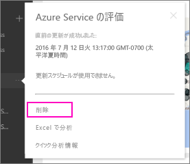

# Power BI の組織のコンテンツ パックへの接続を削除する

> [!NOTE]
> 組織のコンテンツパックは非推奨とされます。 コンテンツ パックをアプリにまだアップグレードしていない場合は、今がそのよい機会です。 タイムラインについては、こちらの [Power BI 管理者がクラシック ワークスペースをアップグレードできることについてのお知らせ](https://powerbi.microsoft.com/blog/announcing-power-bi-admins-can-upgrade-classic-workspaces-and-roadmap-update/)に関するブログ記事のワークスペース アップグレード ロードマップに関するセクションを参照してください。
> 

同僚がコンテンツ パックを作成しました。 それを AppSource で見つけて、Power BI ワークスペースに追加しました。 それが必要なくなった場合、  どのように削除できますか。

コンテンツ パックを削除するには、そのデータセットを削除します。  

* ナビ ペインで、データセットの右側にある省略記号を選択し、 **[削除] \> [はい]** の順に選択します。  
  
  

データセットを削除すると、関連するすべてのレポートとダッシュボードも削除されます。 ただし、コンテンツ パックへの接続を削除しても、コンテンツ パックは組織の AppSource から削除されません。  いつでも AppSource に戻って、目的のコンテンツ パックをワークスペースに再び追加できます。 コンテンツの作成者である場合にのみ、[AppSource からコンテンツ パックを削除](service-organizational-content-pack-manage-update-delete.md)できます。

## 次のステップ
* [組織のコンテンツ パックの概要](service-organizational-content-pack-introduction.md) 
* [Power BI でのアプリの作成および配布](service-create-distribute-apps.md) 
* [Power BI サービスのデザイナー向けの基本的な概念](../fundamentals/service-basic-concepts.md)  
* 他にわからないことがある場合は、 [Power BI コミュニティを利用してください](https://community.powerbi.com/)。
