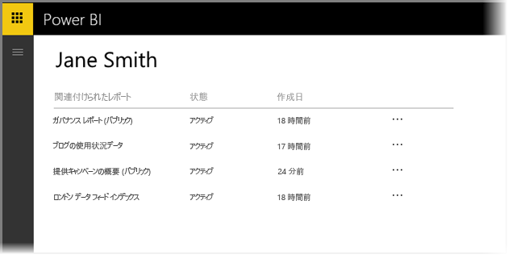
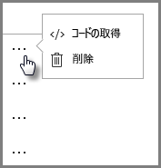

# Power BI から Web への公開

Power BI の **[Web に公開]** オプションを使用して、対話型の Power BI のコンテンツをブログ記事、Web サイト、メールやソーシャル メディアに簡単に埋め込むことができます。 また、発行したビジュアルを簡単に編集、更新、共有停止することもできます。

> [!WARNING]
> **[Web に公開]** を使用すると、ご自身が公開したレポートまたはビジュアルをインターネット上のすべてのユーザーが表示できます。 表示に認証は必要ありません。 これには、レポートで集計される詳細レベルのデータの表示が含まれます。 レポートを公開する前に、データや視覚エフェクトを公開しても問題がないかご確認ください。 秘密情報や機密情報を公開しないでください。 不確かな場合は、発行する前に組織のポリシーを確認します。

>[!Note]
>内部ポータルまたは Web サイトにコンテンツを安全に埋め込むことができます。 [[埋め込む]](service-embed-secure.md) オプションまたは [[SharePoint Online に埋め込む]](service-embed-report-spo.md) オプションを使用します。 これらのオプションにより、ユーザーが内部データを表示するときに、アクセス許可とデータ セキュリティがすべて適用されます。

## [Web に公開] を使用して埋め込みコードを作成する

**[Web に公開]** は個人用またはグループ用ワークスペースで編集可能なレポートで使用できます。  共有しているレポート、またはデータをセキュリティで保護するために行レベルでセキュリティ保護されているレポートでは使用できません。 **[Web に公開]** がサポートされないケースの全一覧については、以下の「 [**制限事項**](#limitations)」のセクションを参照してください。 **[Web に公開]** を使用する前に、前述の「 **警告** 」をご確認ください。

次の手順では、 **Publish to Web** を使用する方法について説明します。

1. 編集ができるワークスペースでレポートを開き、 **[その他のオプション] (...)**   >  **[埋め込む]**  >  **[Web に公開 (パブリック)]** を選択します。

   ![[その他のオプション] の [Web に公開]](media/service-publish-to-web/power-bi-more-options-publish-web.png)
   
2. Power BI 管理者によって埋め込みコードの作成が許可されていない場合は、その管理者に連絡することが必要になる場合があります。

   
   
   組織内の、[Web への公開] を有効にできるユーザーを見つける方法については、この記事の後半にある「[Power BI 管理者を見つける](#find-your-power-bi-administrator)」を参照してください。

3. ダイアログの内容を確認し、 **[埋め込みコードの作成]** を選択します。

   

4. ここに示す警告を確認し、一般向け Web サイトにデータを埋め込んでも問題がないことを確認します。 問題がなければ、 **[公開]** を選びます。

   

5. リンクを含むダイアログが表示されます。 リンクを選択して電子メールで送信するか、HTML をコピーします。 このリンクは iFrame などのコードに埋め込むことも、Web ページまたはブログに直接貼り付けることもできます。

   

6. 前にレポートの埋め込みコードを作成していて **[Web に公開]** を選択した場合、手順 2 - 4 内のダイアログ ボックスは表示されません。 代わりに、次の **[埋め込みコード]** ダイアログが表示されます。

   ![[埋め込みコード] ダイアログ ボックス](media/service-publish-to-web/publish_to_web5.png)

   各レポートに 1 つだけ埋め込みコードを作成できます。

ダイアログで変更を行った場合は、更新された URL または iFrame をコピーして、更新された設定がページで使用されるようにしてください。

### 表示モードのヒント

ブログ投稿内にコンテンツを埋め込む場合、通常は特定の画面サイズに収める必要があります。  高さと幅は、必要に応じて iFrame タグで調整できます。 ただし、レポートが iFrame の特定の領域に収まるようにする必要があるため、レポートを編集するときに、適切な表示モードを設定します。

以下の表では、表示モードとそれが埋め込まれた場合にどのように表示されるかについての指針を示します。

| 表示モード | 埋め込まれた場合の表示方法 |
| --- | --- |
|  |**[ページに合わせる]** では、レポートのページの高さと幅が使用されます。 ページを 16:9 や 4:3 などの " *動的な* " 比率に設定した場合、コンテンツは iFrame に収まるよう拡大縮小されます。 **[ページに合わせる]** を使用して iFrame に埋め込んだ場合、" *レターボックス処理* " が行われることがあり、iFrame に合わせてコンテンツが拡大縮小された後、iFrame の領域にグレーの背景が表示されます。 レターボックス処理を最小限に抑えるには、iFrame の高さと幅を適切に設定します。 |
|  |**[実際のサイズ]** では、レポートのサイズはレポート ページで設定したサイズに保たれます。 その結果、iFrame にスクロール バーが表示される場合があります。 スクロール バーが表示されないように iFrame の高さと幅を設定します。 |
|  |**[幅に合わせる]** では、コンテンツが iFrame の水平方向の領域全体に表示されることが保証されます。 この場合にも境界線は表示されますが、水平方向の表示スペース全体が使用されるよう、コンテンツは拡大縮小されます。 |

### iFrame の高さと幅に関するヒント

**[Web に公開]** の埋め込みコードは次の例のようになります。

 
幅と高さを手動で編集して、埋め込み先のページにどのように収めるかを細かく調整できます。

より完全に収めるには、iFrame の高さに 56 ピクセルを追加してみて、現在のサイズの下部バーが収まるようにできます。 レポート ページで動的なサイズを使用している場合、レターボックス処理なしで完全に収めることができるサイズを次の表にいくつか示します。

| 比率 | サイズ | ディメンション (幅 x 高さ) |
| --- | --- | --- |
| 16:9 |小 |640 x 416 ピクセル |
| 16:9 |中 |800 x 506 ピクセル |
| 16:9 |大 |960 x 596 ピクセル |
| 4:3 |小 |640 x 536 ピクセル |
| 4:3 |中 |800 x 656 ピクセル |
| 4:3 |大 |960 x 776 ピクセル |

## 埋め込みコードの管理

**[Web に公開]** 埋め込みコードを作成したら、コードを Power BI の **[設定]** メニューで管理できます。 埋め込みコードの管理には、コードの埋め込み先ビジュアルやレポートを削除できる (埋め込みコードを使用できなくする) ことや、埋め込みコードを入手することが含まれます。

1. **Publish to web** 埋め込みコードを管理するには、 **[設定]** の歯車を開き、 **[埋め込みコードの管理]** を選びます。

   

2. 埋め込みコードが表示されます。

   

3. 埋め込みコードは取得または削除できます。 それを削除した場合は、そのレポートまたはビジュアルへのリンクが無効になります。

   

4. **[削除]** を選択した場合、確認が求められます。

   

## レポートへの更新とデータ更新

**[Web に公開]** 埋め込みコードを作成して共有した後は、行われた変更を反映してレポートが更新されます。 埋め込みコードのリンクはすぐにアクティブになります。 そのリンクを開いたすべてのユーザーがそれを参照できます。 データは、取得された時点から 1 時間はキャッシュに格納されます。 頻繁に更新する必要があるデータの場合は、[Web に公開] を使用しないことをお勧めします。 詳しくは、この記事で後述する「 [**機能方法**](#howitworks)」をご覧ください。 

### データ更新

データ更新は、埋め込まれたレポートまたはビジュアルに自動的に反映されます。 Power BI サービスでインポート データ モデルのデータが更新されると、サービスによってデータ キャッシュがクリアされ、データが迅速に更新されます。 自動更新を無効にするには、レポートが使用しているデータセットのスケジュールの **[更新しない]** を選択します。  

### 使用率が高い

レポートが短時間に大量のクエリを受信すると、使用率が高くなる場合があります。 使用率が高い場合、ユーザーは、使用率が高い期間が経過するまで、レポートを表示したり、操作したりすることはできません。 

レポートに対してプレースホルダー画像を設定することをお勧めします。 使用率が高くなった場合、ユーザーにはプレースホルダー画像が表示されます。 

使用率が高くなるのを防ぐには、レポートで生成できる個別のクエリの数とデータ更新の頻度を制限します。

## Power BI ビジュアル

**[Web に公開]** では、Power BI ビジュアルがサポートされています。 **[Web に公開]** を使用した場合、公開済みのビジュアルを共有しているユーザーは、Power BI ビジュアルを有効にしなくてもレポートを表示できます。

## 埋め込みコードの状態列について

>[!Note]
>公開した埋め込みコードを頻繁に確認してください。 パブリックに使用する必要がなくなったものは削除します。

**[埋め込みコードの管理]** ページには、状態列があります。 埋め込みコードは、既定で **アクティブ** ですが、以下に示す状態のいずれかである場合もあります。

| 状態 | 説明 |
| --- | --- |
| **アクティブ** |レポートは、インターネット ユーザーが表示および対話的に操作できます。 |
| **ブロック** |レポートの内容が [Power BI サービス条項](https://powerbi.microsoft.com/terms-of-service)に違反しています。 Microsoft によってブロックされています。 内容が間違ってブロックされたと思われる場合は、サポートにお問い合わせください。 |
| **サポートされていません** |レポートのデータセットで行レベルのセキュリティを使用しているか、別のサポートされていない構成を使用しています。 詳細なリストについては、「 [**制限事項**](#limitations)」を参照してください。 |
| **侵害** |埋め込みコードは定義されたテナント ポリシー外です。 通常、この状態は埋め込みコードが作成されてから、埋め込みコードを所有するユーザーを除外するために、 **[Web に公開]** のテナント設定が変更された場合に発生します。 テナント設定が無効になっているか、ユーザーが埋め込みコードを作成できなくなった場合、既存の埋め込みコードの状態は **[侵害]** となります。 詳細については、この記事の「[Power BI 管理者を見つける](#find-your-power-bi-administrator)」セクションを参照してください。 |

## [Web に公開] コンテンツに関する問題を報告する

Web サイトまたはブログに埋め込まれた **[Web に公開]** コンテンツに関する問題を報告するには、 **[Web に公開]** レポートの下部にあるバーの **[フラグ]** アイコンを選択します。

問題について説明するメールを Microsoft に送信するよう求められます。 Microsoft は [Power BI サービス契約](https://powerbi.microsoft.com/terms-of-service)に基づいてコンテンツを評価し、適切な措置を講じます。

## ライセンス

**[Web に公開]** を使用するには、Microsoft Power BI ユーザーである必要があります。 レポートの閲覧者は、Power BI のユーザーである必要はありません。

## 機能方法 (技術的な詳細)

**[Web に公開]** を使用して埋め込みコードを作成すると、インターネット ユーザーがレポートを表示できるようになります。 公開されるため、閲覧者は今後ソーシャル メディアを通してレポートを簡単に共有できます。 ユーザーは、直接パブリック URL を開くか、Web ページまたはブログに埋め込まれた URL を表示することによって、レポートを表示します。 そのようにすると、Power BI によってレポートの定義と、レポートを表示するために必要なクエリの結果がキャッシュされます。 このキャッシュにより、数十万のユーザーがパフォーマンスに影響せずに同時にレポートを表示できるようになります。

データは、取得された時点から 1 時間はキャッシュに格納されます。 レポート定義を更新する (たとえば、その表示モードを変更する場合)、またはレポート データを更新する場合、ユーザーが表示するレポートのバージョンに変更が反映されるまで、しばらくかかる場合があります。 インポート データ モデルに対してデータ更新が行われると、キャッシュされたデータがサービスによってクリアされ、新しいデータが取得されます。 ほとんどの場合、データの更新はデータのインポートとほぼ同時に行われます。 ただし、個別のクエリの数が多いレポートの場合は、更新に時間がかかることがあります。 各要素とデータ値は個別にキャッシュされるため、データの更新が行われると、ユーザーに表示される値には現在の値と以前の値が混在します。 したがって、作業を前もって計画的に行い、設定に問題がないことを十分に確認してから、 **Web に公開** される埋め込みコードを作成するようお勧めします。 データを更新する場合は、更新の数を最小限に抑え、ピーク時間外に実行します。 頻繁に更新する必要があるデータの場合は、[Web に公開] を使用しないことをお勧めします。

## Power BI 管理者を見つける

Power BI 管理ポータルには、Web に発行できるユーザーを制御する設定があります。 管理ポータルで[テナントの [Web に公開] 設定](../admin/service-admin-portal.md#publish-to-web)を変更するには、組織の [Power BI 管理者](../admin/service-admin-role.md)と連携する必要があります。

Power BI にサインアップしたより小規模の組織または個人の場合は、まだ Power BI 管理者が存在しない可能性があります。 [管理者の引き継ぎプロセス](/azure/active-directory/users-groups-roles/domains-admin-takeover)に従ってください。 Power BI 管理者が設定されたら、埋め込みコードの作成を有効にすることができます。

通常、確立された組織には、既に Power BI 管理者が存在します。 次のいずれかのロールを持つユーザーは、Power BI 管理者として操作を行うことができます。

- グローバル管理者
- Azure Active Directory で Power BI サービス管理者ロールを持つユーザー

組織内の[これらの担当者のいずれかを見つけて](/office365/admin/admin-overview/admin-overview#who-has-admin-permissions-in-my-business)、管理ポータルで[テナントの [Web に公開] 設定](../admin/service-admin-portal.md#publish-to-web)を更新するよう依頼する必要があります。

## 制限事項

**[Web への公開]** は、Power BI サービス内のほとんどのデータ ソースとレポートに対してサポートされています。 ただし、次の種類のレポートは現在サポートされていないか、 **[Web に公開]** では使用できません。

- 行レベルのセキュリティを使用するレポート。
- ライブ接続データ ソースを使うレポート (Analysis Services 表形式でホストされたオンプレミスの Analysis Service 多次元、Azure Analysis Services など)。
- レポートとは別のワークスペースに格納されている、[共有データセット](../connect-data/service-datasets-across-workspaces.md)を使用するレポート。
- [共有データセットと認定済みデータセット](../connect-data/service-datasets-share.md)。
- 直接共有されているか、組織のコンテンツ パックを経由して共有されているレポート
- 編集メンバーではないワークスペース内のレポート。
- 現時点では、 **[Web に公開]** レポートで "R" および Python ビジュアルはサポートされていません。
- Web に公開されたレポートのビジュアルからのデータのエクスポート。
- ArcGIS Maps for Power BI のビジュアル
- Power BI の視覚エフェクトに関する Q&A
- レポート レベルの DAX メジャーを含むレポート
- シングル サインオン データ クエリ モデル
- セキュリティで保護された秘密または機密情報
- **[埋め込む]** オプションを使って提供される自動認証機能は、Power BI JavaScript API では動作しません。 Power BI JavaScript API の場合は、[ユーザー所有データ](../developer/embedded/embed-sample-for-your-organization.md)の方法を使って埋め込みを行います。

## 次の手順

- [SharePoint Online レポート Web パーツ](service-embed-report-spo.md) 

- [セキュリティで保護されたポータルまたは Web サイトにレポートを埋め込む](service-embed-secure.md)

他にわからないことがある場合は、 [Power BI コミュニティを利用してください](https://community.powerbi.com/)。
