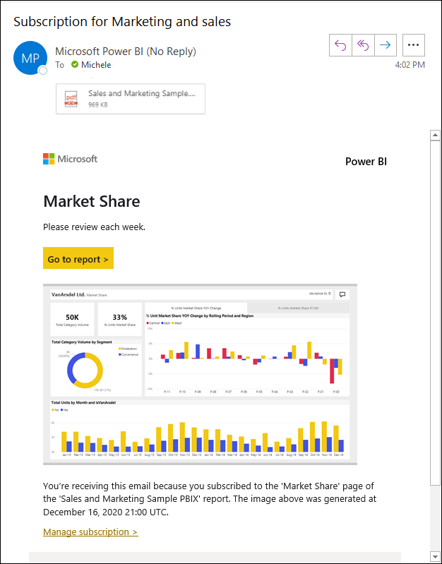

# Power BI サービスのレポートやダッシュボードを他のユーザーにサブスクライブさせる

レポート ページ、ダッシュボード、およびページ分割されたレポートを同僚や他のユーザーにサブスクライブさせるための基本的なプロセスは、自分でサブスクライブする場合と同じです。 これを行う方法については、「[Power BI サービスでレポートまたはダッシュボードをサブスクライブする](../consumer/end-user-subscribe.md)」の記事で説明されています。 "*この*" 記事では、他のユーザーにサブスクライブさせる場合に知っておくべきことについて説明します。

Power BI 電子メール サブスクリプションでは、次のことができます。

- レポートの画像と共にメールを送信し、サービス内のレポートにリンクします。
- Power BI コンテンツが Premium 容量でホストされている場合は、テナントの外部のユーザーに電子メールを送信します。  管理者は、外部ユーザーに電子メール サブスクリプションを送信できるユーザーを制御できます。 「管理ポータルでの Power BI の管理」の「[組織に外部ユーザーを招待する](../admin/service-admin-portal.md#invite-external-users-to-your-organization)」を参照してください。

"*ページ分割されたレポート*" のサブスクライブについては、若干異なる点もあります。 詳細については、「[Subscribe yourself and others to a paginated report in the Power BI service](../consumer/paginated-reports-subscriptions.md)」(Power BI サービスのページ分割されたレポートを自分および他のユーザーがサブスクライブする) を参照してください。

## 必要条件

他のユーザーのサブスクリプションを作成するには、次のものが必要です。

- ダッシュボードまたはレポートの編集権限。
- Power BI Pro ライセンス。

レポートまたはダッシュボードが Premium 容量でホストされていない場合、他のユーザーにサブスクライブさせることはできますが、それらのユーザーが Power BI Pro ライセンスを持っている必要があります。

## Power BI の管理者とサブスクリプション

### サブスクリプションの操作は管理者が制御する

Power BI の管理者は、サブスクリプションを制御することができます。 次のリンクは、管理ポータルの関連セクションを指したものです。

- 組織のすべてのメンバーに対して[電子メール サブスクリプションを有効にする](../admin/service-admin-portal.md#email-subscriptions)。
- 特定のユーザーが外部ユーザーに電子メール サブスクリプションを送信できるようにする。 「[組織に外部ユーザーを招待する](../admin/service-admin-portal.md#invite-external-users-to-your-organization)」を参照してください。

### サブスクリプションの操作は管理者が監査する

Power BI 管理者は、Power BI 監査ログを使用して、サブスクリプションに関する詳細を表示できます。 詳細情報は次のとおりです。

- Created By
- [作成日付]
- 登録済みコンテンツ
- Recipients
- 頻度
- [変更者]
- 更新日

詳細については、「Power BI でユーザー アクティビティを追跡する」の「[監査ログとアクティビティ ログで使用可能な操作](../admin/service-admin-auditing.md#operations-available-in-the-audit-and-activity-logs)」を参照してください。

## 他のユーザーにサブスクライブさせる場合の考慮事項

一般的な考慮事項については、「Power BI サービスでレポートまたはダッシュボードをサブスクライブする」の「[考慮事項とトラブルシューティング](../consumer/end-user-subscribe.md#considerations-and-troubleshooting)」を参照してください。

### 全般

- サブスクリプションを作成する際には、同じドメインの他のメール アドレスをサブスクリプションに追加することもできます。 レポートまたはダッシュボードが [Premium または Premium-Per-User 容量](../admin/service-premium-what-is.md)でホストされている場合は、グループのエイリアスでサブスクライブすることができます (それらがご使用のドメイン内にあるかどうかにかかわらず)。 個々の電子メール アドレスでサブスクライブする必要はありません。 このエイリアスは現在の Active Directory に基づいています。
- 1 つのレポートまたはダッシュボードのサブスクライバーの数には制限があります。 サブスクライバーが 200 を超えると、配信に関する問題が発生する可能性があります。 数を減らすには、代わりにグループ電子メール エイリアスを使用します。 各電子メール エイリアスは、1 つのサブスクライバーとしてカウントされます。
- Power BI のコンテンツへのリンクを含めるかどうかや、サブスクライブするコンテンツへのアクセスをユーザーに許可するかどうかは、必要に応じて選択できます。 リンクを含めるようにする場合は、最適なエクスペリエンスを得るために、すべてのユーザーがコンテンツへのアクセス権を持っていることを確認してください。 登録済みのユーザーは、アクセス許可に基づくデータを含むレポートの添付ファイルを受信します。
- 既存のサブスクリプションを編集するとき、レポートまたはダッシュボードへのアクセスを可能にするオプションは、常に有効として表示されます。  このオプションをオフにしてサブスクリプションを保存すると、その状態が保存されます。 ただし、レポートを再度編集すると、既定ではこのオプションが再度オンになります。
- ページ分割された Power BI レポート メールのサブスクリプションについては、データセットで行レベルのセキュリティ (RLS) が使用されている場合、自分と他のユーザーのサブスクリプションを作成できます。 これらのサブスクリプションは、ご利用のセキュリティ コンテキストを使用して実行されます。
- いずれの場合も、レポートまたはダッシュボードごとに最大 24 個のサブスクリプションを作成でき、サブスクリプションごとに一意の受信者、時刻、および頻度を指定できます。 ダッシュボードまたはレポートのサブスクリプションが **[データ更新後]** に設定されている場合は、スケジュールされている最初の更新が実行されるまで、メールは送信されません。
- サブスクリプションをテストする場合や、必要に応じてオンデマンドで実行する場合は、サブスクリプションの **[今すぐ実行]** を選択します。 電子メールは、そのサブスクリプションのすべてのユーザーに送信されます。 このアクションを行っても、レポートまたはダッシュボードごとに設けられている 1 日あたり 24 回のスケジュールされたサブスクリプション実行の制限にはカウントされません。 これにより基になるデータセットのデータ更新がトリガーされることはありません。
- 現時点では、自分以外のユーザーがサブスクライブしているときに、ライブ接続データセットを使用したレポートおよびダッシュボードのメール サブスクリプションがサポートされていません (ページ分割されたレポートを除く)。 ページ分割されたレポートのサブスクライブの詳細については、[こちら](../consumer/paginated-reports-subscriptions.md)を参照してください。
- まれに、電子メール サブスクリプションが受信者に配信されるのに 15 分以上かかる場合があります。 これが発生した場合、データ更新と電子メール サブスクリプションを別のタイミングで実行し、確実にタイムリーに配信されるようにすることをお勧めします。 問題が解決しない場合は、Power BI サポートにお問い合わせください。
- 所属組織が Azure Active Directory 内の特定の設定を構成することで、Power BI でメール サブスクリプションを使用するための機能が制限される場合があります。 これらの制限には、リソースにアクセスするときの多要素認証や IP 範囲の制限が含まれますが、その限りではありません。
- Analysis Services へのライブ接続を含むレポートがあり、データ更新後にサブスクリプションが実行するように設定したとします。 これは、Power BI サービスが Analysis Services インスタンスをポーリングして、オンプレミス モデルの変更を最初に検出したときに実行されます。  Power BI は、Analysis Services データ モデルの変更を 1 時間ごとにチェックして、サブスクリプションをいつ送信するかを決定します。

### 外部ユーザー

- 外部ユーザーをレポートまたはダッシュボードに登録すると、サブスクリプション ペインで **[保存して閉じる]** を選択した直後、そのユーザーに共有通知が届きます。 この通知は外部ユーザーにのみ送信され、内部ユーザーには送信されません。レポートまたはダッシュボードを表示するための招待リンクを外部ユーザーが要求するためです。 
- テナントの外部の同僚とダッシュボードを共有する場合は、ダッシュボードが Premium のワークスペースまたはアプリに置かれて "*いない限り*"、その同僚のサブスクリプションを作成することはできません。 そのため、たとえば、`aaron@contoso.com` は `anyone@fabrikam.com` と "*共有*" はできますが、`anyone@fabrikam.com` を "*サブスクライブ*" できず、共有コンテンツもサブスクライブできません。

### トラブルシューティング

サブスクリプションの電子メールが送られてこない場合は、次の要因について確認してください。

- お使いのユーザー プリンシパル名 (UPN) で電子メールを受信できることを確認します。
- Power BI Pro ライセンスを持っていても、Microsoft Exchange ライセンスを持っていないことがあります。 持っていない場合、お使いの Azure Active Directory アカウントで電子メールまたは連絡用電子メール アドレスが指定されていない可能性があります。 その場合、サブスクリプションは送信されているように見えますが、手元に届くことはありません。  Power BI 管理者がメール アドレスを割り当てる場合、次回サインインしたとき、Power BI によって更新が同期され、サブスクリプションにそのメール アドレスが使用されます。
- 連絡用メール アドレスがあるがプライマリがない場合、それを使用して Power BI によってサブスクリプションが配信されます。

## 次のステップ

- [Power BI サービスでレポートまたはダッシュボードをサブスクライブする](../consumer/end-user-subscribe.md)
- [Power BI サービスでのページ分割されたレポート: ](../consumer/paginated-reports-subscriptions.md)自分や他のユーザーをサブスクライブする
- 他にわからないことがある場合は、 [Power BI コミュニティで質問してみてください](https://community.powerbi.com/)。
