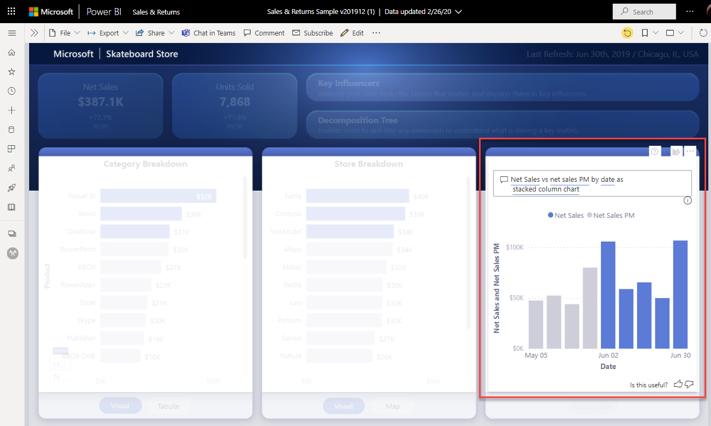

# Power BI サービスから直接、Microsoft Teams でチャットする

Power BI サービスから直接、Power BI のダッシュボード、レポート、ビジュアルについて Microsoft Teams とチャットできます。 Power BI サービスでレポートやダッシュボードを表示しているときに会話をすばやく開始するには、 **[Teams でのチャット]** 機能を使用します。

## 要件

Power BI の **[Teams でのチャット]** 機能を使用するには、Power BI 管理者が Power BI 管理ポータルで **[Teams で共有]** テナント設定を無効にしていないことを確認します。 この設定により、組織は **[Teams でのチャット]** ボタンに非表示にすることができます。 詳細については、[Power BI 管理ポータル](../admin/service-admin-portal.md#share-to-teams)に関する記事を参照してください。

Power BI と Microsoft Teams がどのように連携するかの背景とその他の要件については、「[Microsoft Teams と Power BI で共同作業する](service-collaborate-microsoft-teams.md)」を参照してください。

## Microsoft Teams で Power BI コンテンツについてチャットする

次の手順に従って、Power BI サービスでレポート、ダッシュボード、ビジュアルへのリンクを共有し、Microsoft Teams のチャネルとチャットについてチャットします。

1. 次のいずれかのオプションを選択します。

   * ダッシュボードまたはレポートのアクション バーの **[Teams でのチャット]** :

       ![アクション バーの [Teams で共有] ボタンのスクリーンショット。](media/service-share-report-teams/service-teams-share-to-teams-action-bar-button.png)
    
   * 1 つのビジュアルのコンテキスト メニューの **[Teams でのチャット]** :
    
      ![視覚化のコンテキスト メニューの [Teams で共有] ボタンのスクリーンショット。](media/service-share-report-teams/service-teams-share-to-teams-visual-context-menu.png)

1. **[Microsoft Teams で共有]** ダイアログ ボックスで、リンクの送信先のチームまたはチャネルを選択します。 必要に応じて、メッセージを入力できます。 先に Microsoft Teams へのサインインを求められる場合があります。

    ![情報とメッセージが表示された [Microsoft Teams で共有] ダイアログ ボックスのスクリーンショット。](media/service-share-report-teams/service-teams-share-to-teams-dialog.png)

1. **[共有]** を選択して、リンクを送信します。
    
1. リンクが既存の会話に追加されるか、新しいチャットが開始されます。

    

1. リンクを選択し、Power BI サービスで項目を開きます。

1. 特定の視覚化のコンテキスト メニューを使用した場合、レポートが開くとその視覚化が強調表示されます。

    

## 既知の問題と制限事項

- Power BI のライセンスまたはレポートへのアクセス許可を持たないユーザーには、"コンテンツは利用できません" というメッセージが表示されます。
- ブラウザーで厳格なプライバシー設定を使用している場合は、 **[Teams でのチャット]** ボタンが機能しないことがあります。 **[問題が発生した場合新しいウィンドウで開いてみてください]** オプションを、ダイアログ ボックスが正しく開かない場合は使用してください。
- **[Teams でのチャット]** には、リンク プレビューは含まれていません。
- リンク プレビューと **[Teams でのチャット]** では、項目を表示するためのアクセス許可がユーザーに付与されません。 アクセス許可は個別に管理する必要があります。
- レポートの作成者が視覚化の **[その他]** オプションを **[オフ]** に設定している場合、視覚化のコンテキスト メニューの **[Teams でのチャット]** ボタンは使用できません。
- その他の問題については、Microsoft Teams での共同作業に関する記事の「[既知の問題と制限事項](service-collaborate-microsoft-teams.md#known-issues-and-limitations)」セクションを参照してください。

## 次の手順

- [Microsoft Teams と Power BI で共同作業する](service-collaborate-microsoft-teams.md)

他にわからないことがある場合は、 [Power BI コミュニティで質問してみてください](https://community.powerbi.com/)。
