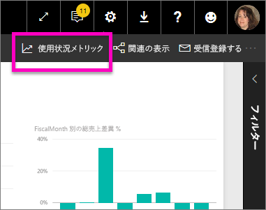
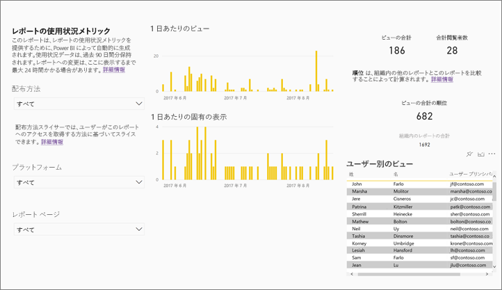
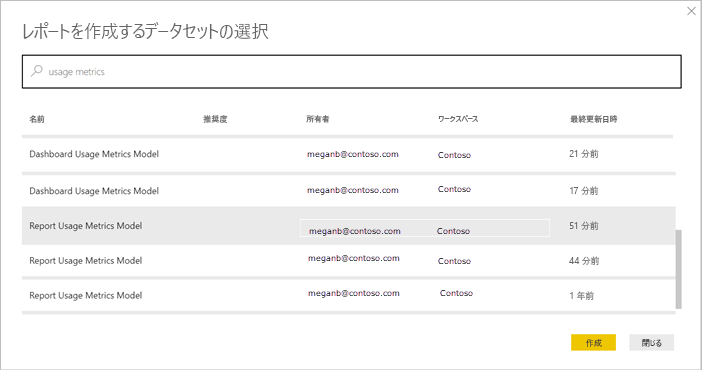
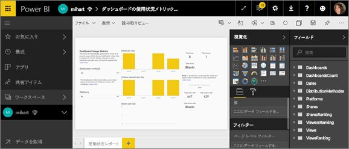
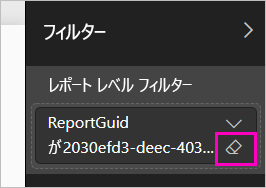

# クラシック ワークスペースで使用状況メトリックを監視する

ダッシュボードとレポートの効果を理解するために使用状況メトリックが役立ちます。 ダッシュボード利用状況の指標またはレポート利用状況の指標を実行すると、そのダッシュボードやレポートが組織全体でどのように利用されているか、だれに利用されているか、何の目的で利用されているかがわかります。 この記事では、[クラシック ワークスペース](service-create-workspaces.md)の使用状況メトリックに関するレポートについて説明します。 レポートがいずれかの新しいワークスペースに存在する場合は、「[新しいワークスペース エクスペリエンスで使用状況メトリックを監視する](service-modern-usage-metrics.md)」を参照してください。  

利用状況の指標レポートは読み取り専用です。 ただし、利用状況の指標レポートをコピーすることはできます。 コピーすると、編集可能な標準の Power BI レポートが作成されます。 ワークスペース内のすべてのダッシュボードまたはすべてのレポートの利用状況の指標を含む、基になるデータセットに基づく独自のレポートを Power BI Desktop 内で作成することもできます。 まず、コピーしたレポートには、選択したダッシュボードまたはレポートのみに関する指標が示されます。 既定のフィルターを削除し、選択したワークスペースの利用状況の指標をすべて含む、基になるデータセットにアクセスすることができます。 管理者から許可されている場合、特定のユーザーの名前を表示することもできます。

> [!NOTE]
> 利用状況の指標は、SharePoint Online に埋め込まれているレポートの利用状況を記録します。 ただし、利用状況の指標では、"ユーザー所有資格情報" または "アプリ所有資格情報" フローを介して埋め込まれたダッシュボードとレポートは記録されません。 利用状況の指標では、[Web への公開](service-publish-to-web.md)を介して埋め込まれるレポートの利用状況も記録されません。

## 利用状況の指標が重要である理由

コンテンツの利用状況を知ることで、効果を証明し、労力に優先順を付けることができます。 利用状況の指標からは、たとえば、組織の大部分がレポートの 1 つを毎日利用しており、作成したダッシュボードがまったく閲覧されていないことなどがわかります。 このような情報は、仕事に労力を正しく使う上で非常に重要です。

利用状況の指標レポートは、Power BI サービス内でのみ実行できます。 しかしながら、利用状況の指標レポートを保存するか、ダッシュボードにピン留めすると、モバイル デバイスでそのレポートを開き、操作できます。

## 前提条件

- 利用状況の指標データにアクセスし、実行するには、Power BI Pro ライセンスが必要です。 ただし、利用状況の指標機能では、割り当てられているライセンスに関係なく、すべてのユーザーの利用状況情報が取得されます。
- 特定のダッシュボードまたはレポートの利用状況の指標にアクセスするには、そのダッシュボードまたはレポートに対する編集アクセス権が必要です。
- Power BI 管理者が、コンテンツ作成者に対して利用状況の指標を有効にしている必要があります。 Power BI 管理者は、利用状況の指標内のユーザーごとのデータの収集を有効にしている場合もあります。 [管理ポータル内でこれらのオプションを有効にする](../admin/service-admin-portal.md#control-usage-metrics)方法をご覧ください。 

## 利用状況の指標レポートを表示する

1. ダッシュボードまたはレポートを含んでいるワークスペースで起動します。
2. ワークスペース コンテンツの一覧から、またはダッシュボードまたはレポート自体から、 **[利用状況の指標]** アイコン  を選択します。

    

    
3. これを初めて実行すると、Power BI によって利用状況指標レポートが作成され、準備できると知らされます。

    
4. 結果を参照するには、 **[使用状況メトリックの表示]** を選択します。

    Power BI のダッシュボードやレポートを展開したり、保守管理したりするとき、利用状況の指標は強力なツールとなります。 レポートの中で最も役に立つページはどれか、削除するべきページはどれかわかりますか。 **レポート ページ** 別にスライスすると見つかります。ダッシュボードにモバイル レイアウトを構築するかどうか迷っていますか。 **プラットフォーム** でスライスすると、モバイル アプリまた Web ブラウザーを使ってコンテンツにアクセスしているユーザーの数がわかります。

5. 必要であれば、視覚エフェクトをポイントしてピン アイコンを選び、ダッシュボードに視覚エフェクトを追加します。 または、上部のメニュー バーから **[ライブ ページをピン留めする]** を選び、ページ全体をダッシュボードに追加します。 ダッシュボードからは、さらに簡単に使用状況メトリックを監視したり、他のユーザーと共有したりできます。

    > [!NOTE]
    > 利用状況の指標レポートからダッシュボードにタイルをピン留めすると、そのダッシュボードはアプリに追加できません。

### ダッシュボードの利用状況の指標レポート

### レポートの利用状況の指標レポート

## 利用状況の指標レポートについて

**[利用状況の指標]** またはダッシュボードやレポートの横にあるアイコン  を選択すると、Power BI によって過去 90 日間のそのコンテンツの利用状況の指標が含まれる事前に作成されたレポートが生成されます。  このレポートは、おなじみの Power BI レポートに似ています。 アクセス手段 (Web やモバイル アプリなど) に関係なく、エンド ユーザーがアクセス権を受け取った方法に基づいてスライスできます。 ダッシュボードやレポートが変わると利用状況指標レポートも変わります。新しいデータで毎日更新されます。  

利用状況の指標レポートは、 **[最近]** 、 **[ワークスペース]** 、 **[お気に入り]** 、その他のコンテンツ一覧には表示されません。 これらはアプリに追加できません。 利用状況の指標レポートからダッシュボードにタイルをピン留めすると、そのダッシュボードはアプリに追加できません。

レポート データを詳しく調べる、または基になるデータセットに対して独自のレポートを作成するには、2 つのオプションがあります。 

- Power BI サービス内でレポートのコピーを作成します。 詳細については、この記事で後述する「[利用状況の指標レポートのコピーを保存する](#save-a-copy-of-the-usage-metrics-report)」を参照してください。
- Power BI Desktop からデータセットに接続します。 すべてのワークスペースについて、データセットの名前は "Report Usage Metrics Model" になります。 詳細については、[発行されたデータセットへの接続の確立](../connect-data/desktop-report-lifecycle-datasets.md#establish-a-power-bi-service-live-connection-to-the-published-dataset)に関するページを参照してください。

    

## どの指標が報告されるでしょうか。

| 指標 | ダッシュボード | レポート | Description |
| --- | --- | --- | --- |
| Distribution method slicer (配布メソッド スライサー) |はい |はい |どのようにユーザーがコンテンツにアクセスしたか。 3 つの使用可能な方法があります。ユーザーは[ワークスペース](../consumer/end-user-experience.md)のメンバーになることによって、コンテンツを[共有する](service-share-dashboards.md)ことによって、またはコンテンツ パック/アプリをインストールすることによって、ダッシュボードまたはレポートにアクセスすることができます。  アプリを介した表示は、"コンテンツ パック" としてカウントされます。 |
| Platforms slicer (プラットフォーム スライサー) |はい |はい |ダッシュボードまたはレポートに Power BI サービス (powerbi.com) またはモバイル デバイスを使用してアクセスしましたか。 モバイルには、すべての iOS、Android、および Windows アプリが含まれています。 |
| レポート ページ スライサー |いいえ |はい |レポートに複数のページがある場合、表示したページごとにレポートをスライスします。 "Blank (空)" は、レポート ページが最近 (新しいページの実際の名前がスライサー リストに表示されてから 24 時間以内に) 追加されたか、または削除されていることを意味します。 "Blank" とはそのような状況を表現します。 |
| Views per day (1 日あたりの表示) |はい |はい |1 日の表示の合計数 ‐ 表示はユーザーによるレポート ページまたはダッシュボードの読み込みとして定義されます。 |
| Unique viewers per day (1 日あたりの固有の表示) |はい |はい |ダッシュボードまたはレポートを表示した *異なる* ユーザーの数 (AAD ユーザー アカウントに基づく)。 |
| Views per user (ユーザーあたりの表示) |はい |はい |過去 90 日間の表示数をユーザー別に分類したもの。 |
| 1 日あたりの共有 |はい |いいえ |ダッシュボードが別のユーザーまたはグループと共有された回数。 |
| Total views (総表示数) |はい |はい |過去 90 日間の表示の数。 |
| Total viewers (閲覧者合計) |はい |はい |過去 90 日間の固有の閲覧者の数。 |
| Total shares (合計共有数) |はい |いいえ |過去 90 日以内にダッシュボードまたはレポートが共有された回数。 |
| Total in organization (組織内の合計) |はい |はい |過去 90 日間、組織全体で少なくとも 1 回表示されたすべてのダッシュボードまたはレポートの数。  順位付けの計算に使用します。 |
| 順位:ビューの合計 |はい |はい |過去 90 日間の組織内のすべてのダッシュボードまたはレポートの合計表示回数。これにより、このダッシュボードまたはレポートがランク付けされます。 |
| 順位:合計共有数 |はい |いいえ |過去 90 日間の組織内のすべてのダッシュボードの合計共有回数。これにより、このダッシュボードまたはレポートがランク付けされます。 |

## 利用状況の指標レポートのコピーを保存する

**[名前を付けて保存]** を使用して、利用状況の指標レポートを、特定のニーズに合わせてカスタマイズ可能な通常の Power BI レポートに変換します。 Power BI Desktop を使用して、基になるデータセットに基づいたカスタムの利用状況の指標レポートを作成することもできます。 詳細については、[発行されたデータセットへの接続の確立](../connect-data/desktop-report-lifecycle-datasets.md#establish-a-power-bi-service-live-connection-to-the-published-dataset)に関するページを参照してください。

また、基礎データセットには、ワークスペースのすべてのダッシュボードまたはレポートの利用状況詳細が含まれます。 これにより、可能性がさらに広がります。 たとえば、使用状況に基づき、ワークスペース内のダッシュボードを比較するレポートを作成できます。 あるいは、自分の Power BI アプリに利用状況の指標ダッシュボードを作成できます。そのアプリ内で配信されているすべてのコンテンツを対象に利用状況を集計します。  この記事で後述する、フィルターの削除方法と、「[すべてのワークスペース利用状況の指標を表示する](#see-all-workspace-usage-metrics)」を参照してください。

### 利用状況レポートのコピーを作成する

読み取り専用の事前に作成された利用状況レポートのコピーを作成するときに、Power BI によってレポートの編集可能なコピーが作成されます。 一見すると同じに見えます。 しかしながら、編集ビューでレポートを開くことができ、新しい視覚効果、フィルター、ページの追加や、既存の視覚効果の変更または削除などの操作が可能になります。 Power BI により、新しいレポートが現在のワークスペースに保存されます。

1. 既に構築されていた利用状況指標レポートで、 **[ファイル] > [名前を付けて保存]** の順に選択します。 Power BI により、編集可能な Power BI レポートが作成され、現在のワークスペースに保存されます。

    
2. 編集ビューでレポートを開き、[他の Power BI レポートと同様に操作します](../create-reports/service-interact-with-a-report-in-editing-view.md)。 たとえば、新しいページの追加、新しい視覚化の構築、フィルターの追加、フォントや色の書式設定などを行うことができます。

    
3. 新しいレポートが現在のワークスペース内の **[レポート]** タブに保存され、 **[最近]** コンテンツの一覧に追加されます。

    ![[レポート] タブ](media/service-usage-metrics/power-bi-new-report.png)

## "*すべての*" ワークスペース利用状況の指標を表示する

ワークスペース内のすべてのダッシュボードまたはすべてのレポートの指標を表示するには、フィルターを削除する必要があります。 既定では、レポートにはフィルターが適用され、その作成に使用したダッシュボードまたはレポートのみの指標が表示されます。

1. **[レポートの編集]** を選び、編集ビューで新しい編集可能レポートを開きます。

    ![[レポートの編集] の選択](media/service-usage-metrics/power-bi-editing-view.png)
2. [フィルター] ペインで、 **[レポート レベル フィルター]** バケットを見つけ、**ReportGuid** の横の消しゴムを選択してフィルターを削除します。

    

    これで、自分のレポートにワークスペース全体の指標が表示されます。

## 利用状況の指標の Power BI 管理者制御

使用状況メトリック レポートは、全体管理者または Power BI 管理者がオンまたはオフにすることができる機能です。 管理者は、利用状況の指標にアクセスできるユーザーを細かく制御できます。既定では、組織内のすべてのユーザーに対して **オン** になっています。

> [!NOTE]
> Power BI テナントの管理者だけが、管理ポータルを参照し、設定を編集することができます。 

既定では、ユーザーごとのデータは利用状況の指標に対して有効であり、コンテンツ コンシューマーのアカウント情報は指標レポートに含まれます。 管理者が一部またはすべてのユーザーに対してこの情報を公開しない場合は、指定したセキュリティ グループまたは組織全体に対してこの機能を無効にすることができます。 アカウント情報は、 *[名前なし]* としてレポートに表示されます。

組織全体の利用状況の指標を無効にすると、管理者は **[既存のすべての使用状況メトリック コンテンツを削除します]** オプションを利用し、利用状況の指標レポートを利用して構築された既存のレポートとダッシュボード タイルをすべて削除できます。 このオプションで、組織のユーザーを対象に、既に利用している場合でも、使用状況メトリック データのアクセスが削除されます。 削除した利用状況の指標コンテンツは元に戻せません。

これらの設定の詳細については、管理ポータル記事内の[利用状況の指標の制御](../admin/service-admin-portal.md#control-usage-metrics)に関するページを参照してください。 

## 国内クラウドの使用状況指標

Power BI は別個の国内クラウドで利用できます。 これらのクラウドは、グローバル バージョンの Power BI と同じレベルのセキュリティ、プライバシー、コンプライアンス、透明性を提供します。また、サービス提供、データの保存、アクセス、制御に関するその地域の規制に対応する独自のモデルと組み合わせて使用できます。 この各国規制に応じた独自モデルにより、国内クラウドで使用状況メトリックは使用できません。 詳しくは、[国内クラウド](https://powerbi.microsoft.com/clouds/)に関するページをご覧ください。

## 考慮事項と制限事項

### 監査ログと利用状況の指標の違い

利用状況の指標と監査ログを比較したときに違いが生じる可能性があること、またその理由について理解することが重要です。 "*監査ログ*" は Power BI サービスからのデータを使用して収集され、"*利用状況の指標*" はクライアント上で収集されます。 次の違いのために、監査ログ内のアクティビティの集計カウントが使用状況メトリックと一致しない場合があります。

* 一貫性のないネットワーク接続やアド ブロッカー、またはクライアントからのイベントの送信を妨害する可能性があるその他の問題が原因で、使用状況メトリックがアクティビティを少なくカウントする場合があります。
* この記事で前述したように、特定の種類のビューは利用状況の指標に含まれません。
* Power BI サービスに要求を送り返すことなくクライアントが更新を行う状況では、利用状況の指標がアクティビティを多くカウントする場合があります。
* 使用状況メトリック レポートの共有は無効になっています。 ユーザーにレポートへの読み取りアクセス権を付与するには、まずワークスペースへのアクセス権を付与する必要があります。

### REST API と使用状況メトリックの違い

Power BI の[レポート REST API](/rest/api/power-bi/reports) および[管理 REST API](/rest/api/power-bi/admin) では Power BI サービス データも使用されます。 前のセクションで説明した理由により、API のレポート数は、使用状況メトリックのレポート数とは異なる場合があります。 API から派生したレポート数は、クライアントの問題の影響を受けないため、正確であると見なされます。

### クラシックの使用状況メトリックは、プライベート リンクでサポートされていません 

所属する組織が[プライベート リンク](../admin/service-security-private-links.md)を使用している場合、クラシックの使用状況メトリック レポートにデータは含まれません。 現在、プライベート リンク経由でクライアント情報を転送する場合は制限があります。 

### その他の注意事項

ワークスペース内のコンテンツは、そのワークスペース内から少なくとも 1 回は表示する必要があります。 そのワークスペース自体から一度もコンテンツが表示されないと、"利用状況の指標に関するレポート" のアプリケーション ビューからデータが関連付けられません。 このレポートに使用されるデータの処理のブロックを解除するには、ご利用のワークスペースから少なくとも 1 回はコンテンツを表示してください。

## よく寄せられる質問

利用状況の指標と監査ログの間の潜在的な違いに加えて、利用状況の指標に関する以下の質問と回答がユーザーや管理者に役立つ場合があります。

**質問:**  ダッシュボードまたはレポートで利用状況の指標を実行できません。

**回答:**  利用状況の指標が表示されるのは、自分が所有するコンテンツか編集アクセス許可が与えられているコンテンツのみです。

**質問:**  利用状況の指標は、埋め込みのダッシュボードやレポートからビューを取り込みますか。

**回答:**  現在、利用状況の指標では、埋め込まれたダッシュボード、レポート、[Web への公開](service-publish-to-web.md)フローに関する利用状況の取り込みはサポートされていません。 これらについては、既存の Web 分析プラットフォームを使って、ホストしているアプリまたはポータルの利用状況を追跡することをお勧めします。

**質問:**  コンテンツに関係なく利用状況の指標をまったく実行できません。

**回答 1:**  管理者は組織に対してこの機能をオフにすることができます。  管理者に問い合わせ、これに該当していないかを確認してください。

**回答 2:**  利用状況の指標は Power BI Pro の機能です。

**質問:**  データが最新の状態ではないようです。 たとえば、配布方法が表示されない、レポート ページがないなど。

**回答:**  データを更新するには、最大で 24 時間かかります。

**質問:**  ワークスペースにレポートが 4 つありますが、利用状況の指標レポートに 3 とだけ表示されます。

**回答:**  利用状況指標レポートには、過去 90 日間にアクセスされたレポート (またはダッシュボード) のみが含まれます。  レポート (またはダッシュボード) が表示されない場合、90 日より長く使用されていなかった可能性があります。

## 次の手順

[管理ポータルでの Power BI の管理](../admin/service-admin-portal.md)

他にわからないことがある場合は、 [Power BI コミュニティを利用してください](https://community.powerbi.com/)。