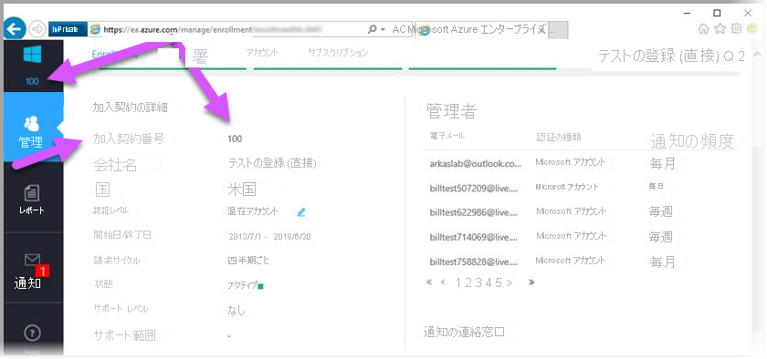
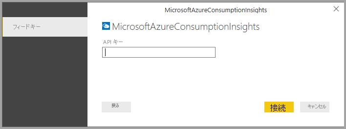
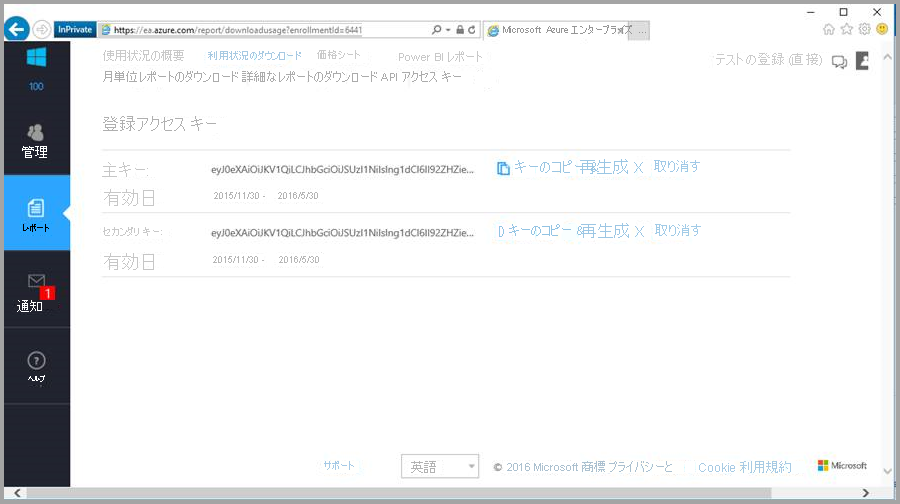
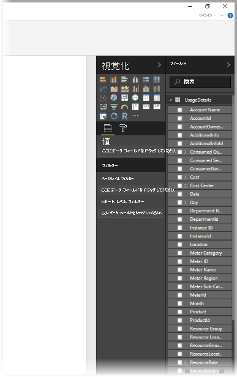
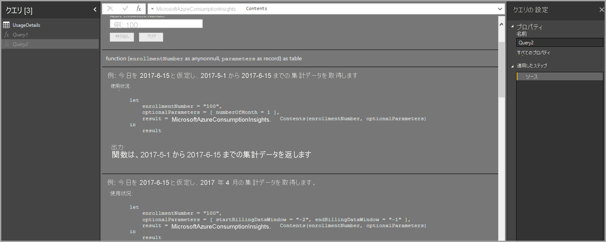
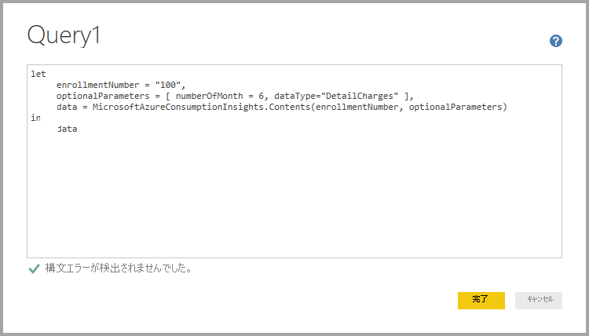
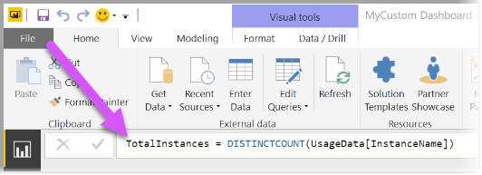

# Power BI Desktop で Azure Consumption Insights データに接続する

Power BI Desktop を使用すると、Azure に接続し、組織の Azure サービスの使用状況に関する詳細なデータを取得することができます。 このデータを使用して、カスタム レポートとカスタム メジャーを作成し、Azure の使用状況の把握と分析をさらに適切に行うことができます。

> [!NOTE]
> Microsoft Azure Consumption Insights (ベータ) のサポートは制限されています。 新しい機能については、[Power BI 用の Azure Cost Management コネクタ](desktop-connect-azure-cost-management.md)に関する記事を参照してください。

## Azure Consumption Insights に接続する

Azure Consumption Insights を使用すると、Azure Enterprise Agreement 請求先アカウントに接続できます。

このセクションでは、移行する必要があるデータを Azure Enterprise Connector を使用して取得する方法について説明します。 また、**ACI** (Azure Consumption Insights) API で使用可能な "*使用状況の詳細列*" のマッピングについても説明します。

**Azure Consumption Insights** コネクタを正常に使用するには、Azure portal のエンタープライズ機能にアクセスする必要があります。

**Power BI Desktop** で **Azure Consumption Insights** コネクタを使用するには: 

1. **[ホーム]** リボンで **[データの取得]** を選択します。

1. 左側のカテゴリから **[オンライン サービス]** を選択します。  

1. **[Microsoft Azure Consumption Insights (ベータ)]** を選択します。 

1. **[接続]** を選択します。

   

   表示されるダイアログで、ご自分の **Azure の登録番号**を入力します。

   

   * 登録番号は、次の画像に示されている場所で、[Azure Enterprise Portal](https://ea.azure.com) から取得できます。

  

   このコネクタ バージョンでサポートされるのは、 https://ea.azure.com からのエンタープライズ登録のみです。 現在、中国での登録はサポートされていません。

   次に、接続するための*アクセス キー*を指定します。

   

   * 登録用のアクセス キーは [Azure Enterprise Portal](https://ea.azure.com) で確認できます。

  

ご利用の "*アクセス キー*" を指定して **[接続]** を選択すると、 **[ナビゲーター]** ウィンドウが開き、使用可能な次の 9 つのテーブルが表示されます。

| テーブル        | Description |
|------------- | -------------------------------------------------------------|
| **Budgets** | 既存の予算目標に対する実際のコストや使用状況を確認できる予算の詳細。 |
| **MarketPlace** | 使用状況に基づく Azure Marketplace の料金。 |
| **PriceSheets** | 登録用のメーターによって適用されるレート。 |
| **RICharges** | 過去 24 か月の間の、ご利用の予約インスタンスに関連付けられている料金。 |
| **RIRecommendations_Single** | ご利用の 1 つのサブスクリプション上での過去 7 日、30 日、または 60 日の間の使用状況の傾向に基づく、予約インスタンス購入の推奨事項。 |
| **RIRecommendations_Shared** | すべてのサブスクリプション上での過去 7 日、30 日、または 60 日の間の使用状況の傾向に基づく、予約インスタンス購入の推奨事項。 |
| **RIUsage** | 過去 1 か月の間の既存の予約インスタンスの消費に関する詳細。 |
| **Summaries** | 残高、新規購入、Azure Marketplace サービス料金、調整、および超過料金についての月単位の概要。 |
| **UsageDetails** | 消費量の内訳と見積もり登録料金。 |

テーブルの横にあるチェック ボックスをオンにすれば、プレビューを表示できます。 1 つ以上のテーブルを選択するには、名前の横のチェック ボックスをオンにしてから **[読み込み]** を選択します。

> [!NOTE]
> *Summary* と *PriceSheet* テーブルを使用できるのは、登録レベルの API キーの場合のみです。 また、これらのテーブル内のデータには、既定で *Usage* と *PriceSheet* の現在の月のデータが含まれます。 *Summary* と *MarketPlace* テーブルは現在の月に制限されません。
>
>

**[読み込み]** を選択すると、**Power BI Desktop** にデータが読み込まれます。

選択したデータが読み込まれると、選択したテーブルとフィールドが **[フィールド]** ウィンドウに表示されます。

## Azure Consumption Insights の使用
**Azure Consumption Insights** コネクタを使用するには、Azure portal のエンタープライズ機能にアクセスします。

**Azure Consumption Insights** コネクタを使用して正常にデータを読み込んだら、**クエリ エディター**を使用して独自のカスタム メジャーと列を作成することができます。 また、**Power BI サービス**で共有できるビジュアル、レポート、およびダッシュボードを作成できます。

空のクエリを使用すると、Azure カスタム クエリ コレクションのサンプルを取得できます。 これを取得するには、次の 2 つの方法があります。 

**Power BI Desktop** の場合: 

1. **[ホーム]** リボンを選択します 
2. **[データの取得]**  >  **[空のクエリ]** を選択します 

または、**クエリ エディター**の場合: 

1. 左側の **[クエリ]** ウィンドウを右クリックします 
2. 表示されるメニューから **[新しいクエリ] > [空のクエリ]** の順に選択します

**数式バー**の場合は、次のように入力します。

    = MicrosoftAzureConsumptionInsights.Contents

次の図は、表示されるサンプル コレクションを示しています。

レポートを操作する場合やクエリを作成する場合は、次の操作を行うことができます。

* 現在の日付を起点として月数を定義するには、*numberOfMonth* を使用します。
  * 1 から 36 の範囲の値を使用します。 現在の日付を起点として、インポートする月数を表します。 12 か月以内のデータを取得することをお勧めします。 このように制限することにより、Power BI のクエリ インポートの制約とデータ ボリュームのしきい値が回避されます。
* 過去の期間の月数を定義するには、*startBillingDataWindow* と *endBillingDataWindow* を使用します。
* "*numberOfMonth*" は、"*startBillingDataWindow*" または "*endBillingDataWindow*" と併用しないでください

## Azure Enterprise Connector から移行する

一部の顧客は、"*Azure Enterprise Connector (ベータ)* " を使用してビジュアルを作成しています。 これは、最終的に、**Azure Consumption Insights** コネクタに置き換えられます。 新しいコネクタには、次のような機能と拡張機能が用意されています。

* *残高集計*および *Marketplace での購入*で使用可能な追加のデータ ソース
* *startBillingDataWindow* や *endBillingDataWindow* などの、新しい拡張パラメーター
* パフォーマンスと応答性の向上

次の手順では、**Azure Consumption Insights** コネクタへの移行方法について説明します。 これらの手順では、カスタム ダッシュボードまたはレポートの作成時に行った作業が保持されます。

### 手順 1:新しいコネクタを使用して Azure に接続する
最初の手順では、この記事の前の方で詳細を説明した **Azure Consumption Insights** コネクタを使用します。 この手順では、**Power BI Desktop** の **[ホーム]** リボンから **[データの取得]、[空のクエリ]** の順に選択します。

### 手順 2:詳細エディターでクエリを作成する
**クエリ エディター**で、 **[ホーム]** リボンの **[クエリ]** セクションから **[詳細エディター]** を選択します。 表示された **[詳細エディター]** ウィンドウで、次のクエリを入力します。

    let    
        enrollmentNumber = "100",
        optionalParameters = [ numberOfMonth = 6, dataType="DetailCharges" ],
        data = MicrosoftAzureConsumptionInsights.Contents(enrollmentNumber, optionalParameters)   
    in     
        data

"*EnrollmentNumber*" の値を登録番号に置き換える必要があります。 ご利用の番号は、[Azure Enterprise Portal](https://ea.azure.com) から取得できます。 "*numberOfMonth*" パラメーターは、現在の日付を起点とした過去のデータの月数を示します。 現在の月にはゼロ (0) を使用します。

**[詳細エディター]** ウィンドウで **[完了]** を選択すると、プレビューが更新され、指定した月の範囲のデータがテーブルに表示されます。 **[閉じて適用]** を選択して戻ります。

### 手順 3:メジャーとカスタム列を新しいレポートに移動する
次に、新しい詳細テーブルに、作成したカスタム列またはメジャーを移動する必要があります。 この手順を以下に示します。

1. メモ帳 (または他のテキスト エディター) を開きます。
2. 移動するメジャーを選択し、 *[数値]* フィールドからテキストをコピーして、メモ帳に配置します。

   
3. *Query1* を元の詳細テーブルの名前に変更します。
4. 新しいテーブル メジャーとカスタム列を作成するには、ご利用のテーブルを右クリックし、 **[新しいメジャー]** を選択します。 次に、格納されているご自分のメジャーと列を最後まですべて、切り取って貼り付けます。

### 手順 4.リレーションシップを持っていたテーブルを再リンクする
多くのダッシュボードには、日付テーブルやカスタム プロジェクトで使用されるテーブルなど、検索またはフィルタリングに使用されるテーブルが追加されています。 これらのリレーションシップを再確立することで、未解決のほとんどの問題が解決されます。 その方法を次に示します。

- **Power BI Desktop** の **[モデリング]** タブで、 **[リレーションシップの管理]** を選択し、モデル内のリレーションシップを管理できるウィンドウを表示します。 必要に応じて、テーブルを再リンクします。

    

### 手順 5.ビジュアルを確認し、必要に応じてフィールドの書式設定を調整する
この時点で、元のビジュアル、テーブル、およびドリルダウンのほとんどは予期したとおりに動作するはずです。 ただし、外観を正確に書式設定するには、若干の調整が必要になる場合があります。 ダッシュボードとビジュアルをそれぞれ調べて、予期したとおりに確実に表示されるようにするには少し時間がかかります。

## Azure Consumption Insights (ACI) API を使用して使用量データを取得する
Azure では [**Azure Consumption Insights (ACI) API**](https://azure.microsoft.com/blog/announcing-general-availability-of-consumption-and-charge-apis-for-enterprise-azure-customers/) も提供されます。 ACI API を使用して、Azure の使用量情報の収集、レポート作成、および視覚化に関する独自のカスタム ソリューションを作成することができます。

### ポータル、コネクタ、および API 間での名前と使用状況の詳細のマッピング
Azure portal の列および詳細の名前と、API およびコネクタでの名前は、必ずしも同じであるわけではありませんが、よく似ています。 わかりやすくするために、次の表にマッピングを示します。 また、列が古いものであるかどうかも示します。 詳細と、用語の定義については、[Azure 課金データ辞書](https://docs.microsoft.com/azure/billing/billing-enterprise-api-usage-detail)に関するページを参照してください。

| ACI コネクタ / ContentPack ColumnName | ACI API の列名 | EA の列名 | 古い / 旧バージョンとの互換性のために存在する |
| --- | --- | --- | --- |
| AccountName |accountName |アカウント名 |いいえ |
| AccountId |accountId | |はい |
| AccountOwnerId |accountOwnerEmail |AccountOwnerId |いいえ |
| AdditionalInfo |additionalInfo |AdditionalInfo |いいえ |
| AdditionalInfold | | |はい |
| Consumed Quantity |consumedQuantity |Consumed Quantity |いいえ |
| Consumed Service |consumedService |Consumed Service |いいえ |
| ConsumedServiceId |consumedServiceId | |はい |
| コスト |cost |ExtendedCost |いいえ |
| Cost Center |costCenter |Cost Center |いいえ |
| Date |日付 |Date |いいえ |
| 日 | |日 |いいえ |
| DepartmentName |departmentName |Department Name |いいえ |
| DepartmentID |departmentId | |はい |
| Instance ID | | |はい |
| InstanceId |instanceId |Instance ID |いいえ |
| 場所 | | |はい |
| Meter Category |meterCategory |Meter Category |いいえ |
| Meter ID | | |はい |
| Meter Name |meterName |Meter Name |いいえ |
| Meter Region |meterRegion |Meter Region |いいえ |
| Meter Sub-Category |meterSubCategory |Meter Sub-Category |いいえ |
| MeterId |meterId |Meter ID |いいえ |
| 月 | |月 |いいえ |
| Product |製品 |Product |いいえ |
| ProductId |productId | |はい |
| リソース グループ |resourceGroup |リソース グループ |いいえ |
| Resource Location |resourceLocation |Resource Location |いいえ |
| ResourceGroupId | | |はい |
| ResourceLocationId |resourceLocationId | |はい |
| ResourceRate |resourceRate |ResourceRate |いいえ |
| ServiceAdministratorId |serviceAdministratorId |ServiceAdministratorId |いいえ |
| ServiceInfo1 |serviceInfo1 |ServiceInfo1 |いいえ |
| ServiceInfo1Id | | |はい |
| ServiceInfo2 |serviceInfo2 |ServiceInfo2 |いいえ |
| ServiceInfo2Id | | |はい |
| Store Service Identifier |storeServiceIdentifier |Store Service Identifier |いいえ |
| StoreServiceIdentifierId | | |はい |
| サブスクリプション名 |subscriptionName |サブスクリプション名 |いいえ |
| タグ |tags |タグ |いいえ |
| TagsId | | |はい |
| Unit Of Measure |unitOfMeasure |Unit Of Measure |いいえ |
| 年 | |年 |いいえ |
| SubscriptionId |subscriptionId |SubscriptionId |はい |
| SubscriptionGuid |subscriptionGuid |SubscriptionGuid |いいえ |

## 次の手順

Power BI Desktop を使用すれば、さまざまな種類のデータ ソースに接続できます。 詳細については、次の記事を参照してください。

* [Power BI Desktop で Azure Cost Management データに接続する](desktop-connect-azure-cost-management.md)
* [Power BI Desktop とは何ですか?](../fundamentals/desktop-what-is-desktop.md)
* [Power BI Desktop のデータ ソース](desktop-data-sources.md)
* [Power BI Desktop でのデータの整形と結合](desktop-shape-and-combine-data.md)
* [Power BI Desktop で Excel ブックに接続する](desktop-connect-excel.md)   
* [Power BI Desktop にデータを直接入力する](desktop-enter-data-directly-into-desktop.md)   
