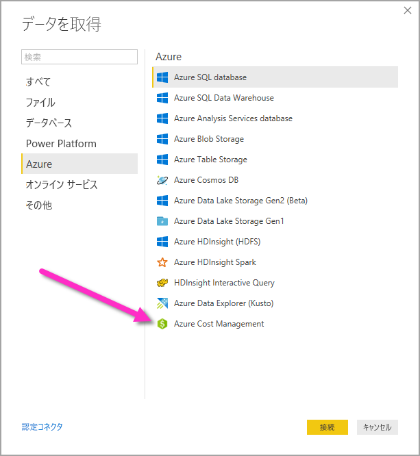
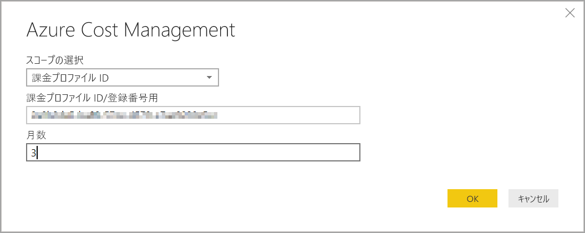
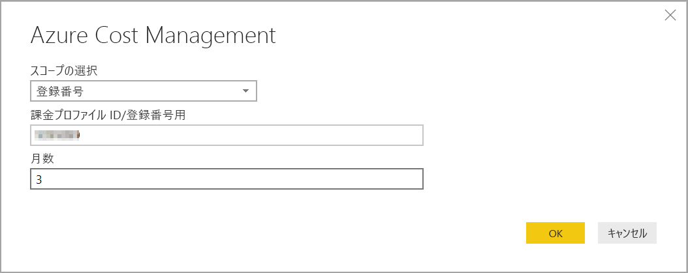
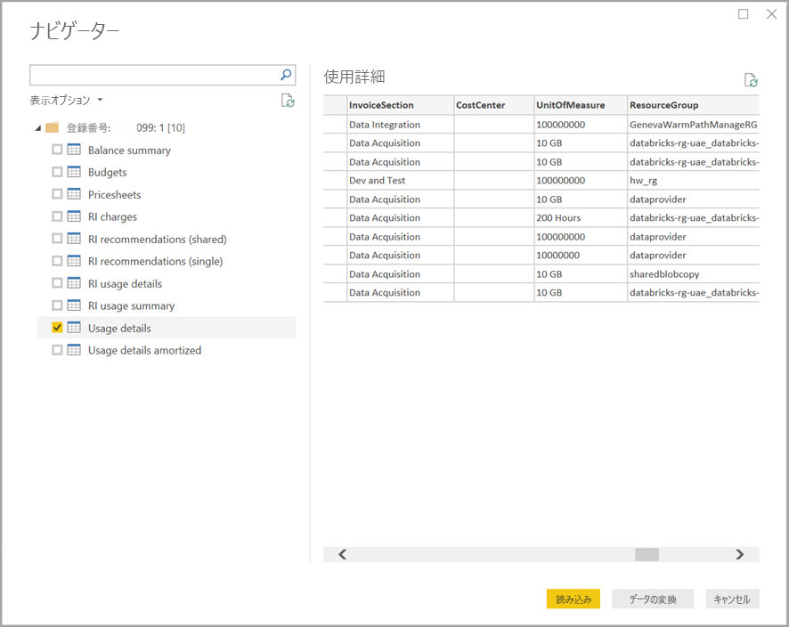

# Power BI Desktop で Azure Cost Management コネクタを使用してビジュアルとレポートを作成する

Power BI Desktop 用の Azure Cost Management コネクタを使用すると、強力でカスタマイズされた視覚化とレポートを作成し、Azure のコストの理解を深めることができます。 現在、Azure Cost Management コネクタは、[Microsoft 顧客契約](https://azure.microsoft.com/pricing/purchase-options/microsoft-customer-agreement/)または [Enterprise Agreement (EA)](https://azure.microsoft.com/pricing/enterprise-agreement/) を結んでいるお客様をサポートしています。  

Azure Cost Management コネクタは、Azure での認証に OAuth 2.0 を使用して、コネクタを利用するユーザーを識別します。 このプロセスで生成されるトークンは、特定の期間、有効です。 Power BI は、次回のログインのためにトークンを保持します。 OAuth 2.0 は、これらのアクセス許可の安全な処理を保証するためにバックグラウンドで実行されるプロセスのための標準です。 接続する場合、Enterprise Agreement の場合は [Enterprise Administrator](https://docs.microsoft.com/azure/billing/billing-understand-ea-roles) アカウントを使用し、Microsoft 顧客契約の場合は[課金アカウント所有者](https://docs.microsoft.com/azure/billing/billing-understand-mca-roles)を使用する必要があります。 

> [!NOTE]
> このコネクタは、以前にリリースされていた [Azure Consumption Insights および Azure Cost Management (ベータ)](desktop-connect-azure-consumption-insights.md) コネクタに置き換わるものです。 前のコネクタで作成されたレポートはすべて、このコネクタを使用して再作成する必要があります。

## Azure Cost Management を使用して接続する

Power BI Desktop で **Azure Cost Management コネクタ**を使用するには、次の手順を実行します。

1.  **[ホーム]** リボンで **[データの取得]** を選択します。
2.  データ カテゴリの一覧から **[Azure]** を選択します。
3.  **[Azure Cost Management]** を選択します。

    

4. 表示されるダイアログに、**Microsoft 顧客契約**の場合は**課金プロファイル ID** を、**Enterprise Agreement (EA)** の場合は**加入契約番号**を入力します。 

## Microsoft 顧客契約アカウントに接続する 

**Microsoft 顧客契約アカウント**を使用して接続するには、Azure portal から**課金プロファイル ID** を取得できます。

1.  [Azure portal](https://portal.azure.com/) で、 **[コストの管理と請求]** に移動します。
2.  ご自分の課金プロファイルを選択します。 
3.  メニューの **[設定]** でサイドバーの **[プロパティ]** を選択します。
4.  **[課金プロファイル]** で **[ID]** をコピーします。 
5.  **[範囲の選択]** については **[課金プロファイル ID]** を選択し、前の手順の課金プロファイル ID を貼り付けます。 
6.  月数を入力し、 **[OK]** を選択します。

    

7.  プロンプトが表示されたら、Azure ユーザー アカウントとパスワードを使用してサインインします。 

## Enterprise Agreement アカウントに接続する

Enterprise Agreement (EA) アカウントを使用して接続するには、Azure portal から登録 ID を取得します。

1.  [Azure portal](https://portal.azure.com/) で、 **[コストの管理と請求]** に移動します。
2.  ご自分の請求先アカウントを選択します。
3.  **[概要]** メニューで、 **[請求先アカウント ID]** をコピーします。
4.  **[範囲の選択]** については **[加入契約番号]** を選択し、前の手順の課金プロファイル ID を貼り付けます。 
5.  月数を入力し、 **[OK]** を選択します。

    

6.  プロンプトが表示されたら、Azure ユーザー アカウントとパスワードを使用してサインインします。 

## コネクタ経由で使用できるデータ

正常に認証されると、 **[ナビゲーター]** ウィンドウが開き、次の使用できるデータ テーブルが表示されます。

| **テーブル** | **説明** |
| --- | --- |
| **Balance summary (残高の概要)** | Enterprise Agreement (EA) の残高の概要。 |
| **Billing events** | 新しい請求書やクレジットでの購入などのイベント ログ。Microsoft 顧客契約のみ。 |
| **Budgets** | 既存の予算目標に対する実際のコストや使用状況を確認できる予算の詳細。 |
| **Charges** | Azure の使用状況、マーケットプレイスの料金、および別請求の料金についての月レベルの概要。 Microsoft 顧客契約のみ。 |
| **Credit lots** | 指定された課金プロファイルの Azure クレジット ロット購入の詳細。 Microsoft 顧客契約のみ。 |
| **Pricesheets** | 指定された課金プロファイルまたは EA の登録に適用されるメーター レート。 |
| **RI charges** | 過去 24 か月の間の、ご利用の予約インスタンスに関連付けられている料金。 |
| **RI recommendations (shared)** | ご利用のすべてのサブスクリプション上での過去 7 日、30 日、または 60 日の間の使用状況の傾向に基づく、予約インスタンス購入の推奨事項。 |
| **RI recommendations (single)** | ご利用の 1 つのサブスクリプション上での過去 7 日、30 日、または 60 日の間の使用状況の傾向に基づく、予約インスタンス購入の推奨事項。 |
| **RI usage details (RI 使用状況の詳細)** | 過去 1 か月の間の既存の予約インスタンスの消費に関する詳細。 |
| **RI usage summary (RI 使用状況の概要)** | Azure の予約の使用率 (日単位)。 |
| **Usage details** | EA 登録に対する指定した課金プロファイルの消費量と見積もり料金の内訳。 |
| **Usage details amortized (償却された使用量の詳細)** | EA 登録に対する指定した課金プロファイルの消費量と見積もられた償却済み料金の内訳。 |

テーブルを選択すると、プレビュー ダイアログが表示されます。 1 つまたは複数のテーブルを選択するには、名前の横にあるボックスをオンにして **[読み込み]** を選択します。

**[読み込み]** を選択すると、Power BI Desktop にデータが読み込まれます。 

選択したデータが読み込まれると、データ テーブルとフィールドは **[フィールド]** ウィンドウに表示されます。

## 次の手順

Power BI Desktop を使用すれば、さまざまな種類のデータ ソースに接続できます。 詳細については、次の記事を参照してください。

* [Power BI Desktop とは何ですか?](../fundamentals/desktop-what-is-desktop.md)
* [Power BI Desktop のデータ ソース](desktop-data-sources.md)
* [Power BI Desktop でのデータの整形と結合](desktop-shape-and-combine-data.md)
* [Power BI Desktop で Excel ブックに接続する](desktop-connect-excel.md)   
* [Power BI Desktop にデータを直接入力する](desktop-enter-data-directly-into-desktop.md)   
