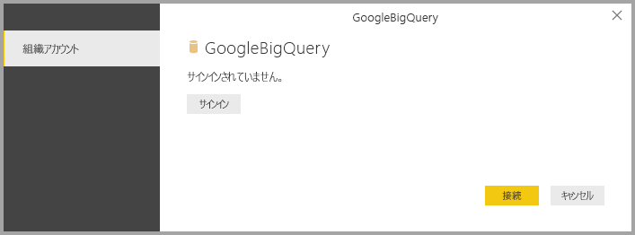
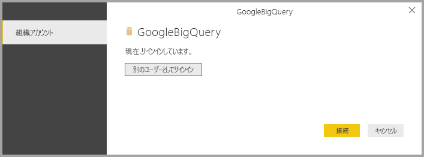
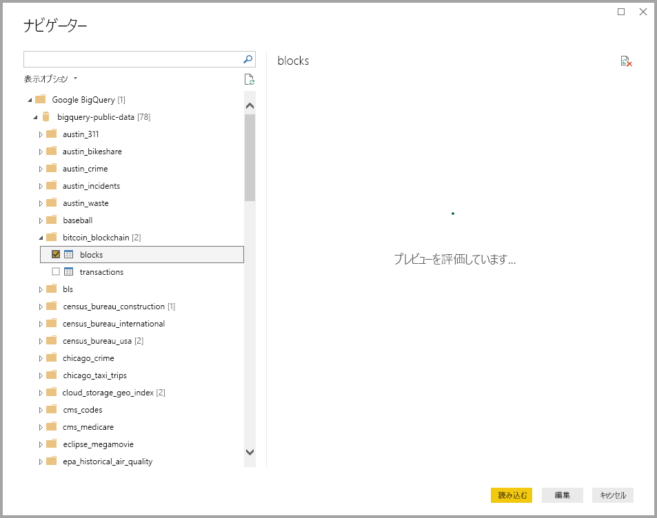

# <a name="connect-to-a-google-bigquery-database-in-power-bi-desktop"></a>Power BI Desktop で Google BigQuery データベースに接続する
Power BI Desktop では、Google **BigQuery** データベースに接続し、Power BI Desktop の他のデータ ソースの場合と同様に基になっているデータを使用できます。

## <a name="connect-to-google-bigquery"></a>Google BigQuery への接続
Google **BigQuery** データベースに接続するには、Power BI Desktop の **[ホーム]** リボンで **[データを取得]** を選択します。 左側のカテゴリから **[データベース]** を選ぶと、 **[Google BigQuery]** が表示されます。

![Google BigQuery の [データを取得] ダイアログ](media/desktop-connect-bigquery/connect_bigquery_01.png)

表示される **Google BigQuery** ウィンドウで、Google BigQuery アカウントにサインインして、 **[接続]** を選択します。



サインインすると、認証されたことを示す次のウィンドウが表示されます。 



接続が正常に行われたら、 **[ナビゲーター]** ウィンドウが開き、サーバー上で使用可能なデータが表示されます。その中から 1 つまたは複数の要素を選択し、**Power BI Desktop** にインポートして使用することができます。



## <a name="considerations-and-limitations"></a>考慮事項と制限事項
Google **BigQuery** コネクタには、いくつかの制限事項と考慮事項があるので注意してください。

* Google BigQuery コネクタは、Power BI Desktop と Power BI サービスにあります。 Power BI サービスでは、Power BI から Google BigQuery へのクラウド間接続を使用して、コネクタにアクセスできます。

* Power BI は、Google BigQuery の **請求書作成プロジェクト** で使用できます。 Power BI は既定で、ユーザに返されたリストの最初のプロジェクトを使用します。 

  Power BI で使用する場合の請求書作成プロジェクトの動作をカスタマイズするには、Source ステップの基となる M で次のオプションを指定します。これは、Power BI Desktop の **Power Query エディター** を使用してカスタマイズできます。

  ```
  Source = GoogleBigQuery.Database([BillingProject="Include-Billing-Project-Id-Here"])
  ```

  2020 年 9 月のリリース以降、[Google BigQuery Storage API](https://cloud.google.com/bigquery/docs/reference/storage) のサポートが有効になりました。 この機能は既定で有効になっており、"UseStorageApi" という名称のオプションのブール型引数で制御されます。 きめ細かいアクセス許可を使用すると、この機能に問題が発生する場合があります。 このシナリオでは、次のエラー メッセージが表示されることがあります。

  `ERROR [HY000] [Microsoft][BigQuery] (131) Unable to authenticate with Google BigQuery Storage API. Check your account permissions`

  この問題を解決するには、Storage API のユーザー アクセス許可を調整します。 以下のストレージ API アクセス許可を割り当てます。

  - `bigquery.readsessions.create` -BigQuery Storage API を介して新しい読み取りセッションを作成します。
  - `bigquery.readsessions.getData` -BigQuery Storage API を介して読み取りセッションからデータを読み取ります。
  - `bigquery.readsessions.update` -BigQuery Storage API を介して読み取りセッションを更新します。

  通常、これらのアクセス許可は BigQuery.User ロールで提供されます。 詳細については、[Google BigQuery の事前定義ロールと権限](https://cloud.google.com/bigquery/docs/access-control)に関するページを参照してください。
  
  上記の手順で問題が解決されない場合、あるいは Storage API のサポートを無効にする場合、クエリを次のように変更します。
  ```
  Source = GoogleBigQuery.Database([UseStorageApi=false])
  ```
  あるいは、課金プロジェクトを既に使用している場合、クエリを次のように変更します。
  ```
  Source = GoogleBigQuery.Database([BillingProject="Include-Billing-Project-Id-Here", UseStorageApi=false])
  ```

## <a name="next-steps"></a>次のステップ
Power BI Desktop を使用して接続できるデータの種類は他にもあります。 データ ソースの詳細については、次のリソースを参照してください。

* [Power BI Desktop とは何ですか?](../fundamentals/desktop-what-is-desktop.md)
* [Power BI Desktop のデータ ソース](desktop-data-sources.md)
* [Power BI Desktop でのデータの整形と結合](desktop-shape-and-combine-data.md)
* [Power BI Desktop で Excel ブックに接続する](desktop-connect-excel.md)   
* [Power BI Desktop にデータを直接入力する](desktop-enter-data-directly-into-desktop.md)   
