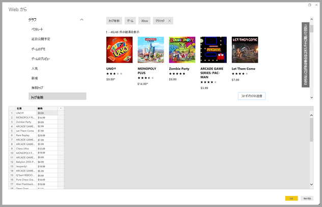
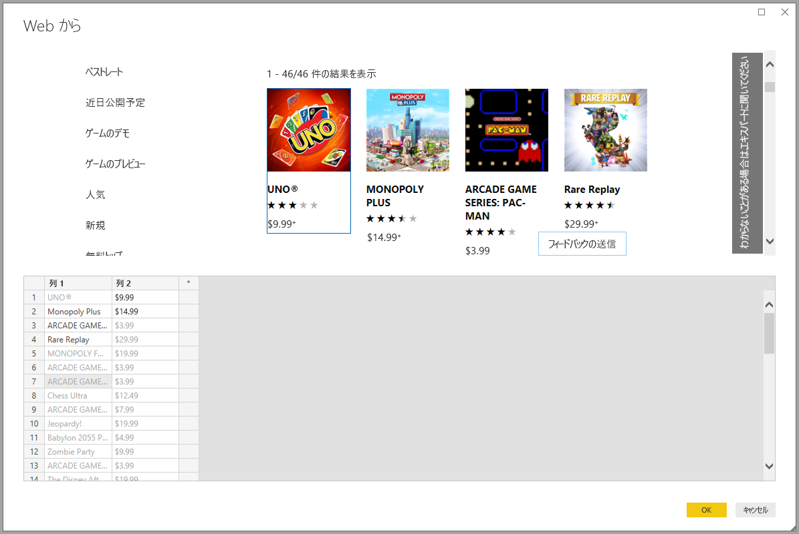

# <a name="get-webpage-data-by-providing-examples"></a>例を提供して Web ページ データを取得する

Web ページからのデータ取得を利用すると、ユーザーは Web ページからデータを簡単に抽出し、そのデータを *Power BI Desktop* にインポートすることができます。 ただし、多くの場合、Web ページ上のデータは、抽出が容易な整理されたテーブル形式ではありません。 データが構造化されていて、一貫性がある場合でも、そのようなページからデータを取得することは困難です。

解決策はあります。 "*例を指定して Web からデータを取得する*" 機能を使用すると、基本的には、コネクタ ダイアログで 1 つ以上の例を指定して、抽出するデータを Power BI Desktop に示すことができます。 Power BI Desktop により、ページ上で例と一致する他のデータが収集されます。 この解決策を利用すると、テーブルで見つかったデータ*だけでなく*、その他のテーブル以外のデータなど、Web ページからあらゆる種類のデータを抽出できます。



画像の価格はあくまでも例です。

## <a name="using-get-data-from-web-by-example"></a>[Get Data from Web by example]\(例を指定して Web からデータを取得する\) の使用

**[ホーム]** リボン メニューで **[データを取得]** を選択します。 表示されるダイアログ ボックスで、左のペインのカテゴリから **[その他]** を選択し、 **[Web]** を選択します。 **[接続]** を選択して続行します。

![[データを取得] から [Web] を選択する](media/desktop-connect-to-web-by-example/web-by-example_03.png)

**[Web から]** で、データを抽出する Web ページの URL を入力します。 この記事では、Microsoft Store の Web ページを使用し、このコネクタのしくみを紹介します。

この記事に従って操作する場合は、この記事で使用している [Microsoft Store の URL](https://www.microsoft.com/store/top-paid/games/xbox?category=classics) を利用できます。

```http
https://www.microsoft.com/store/top-paid/games/xbox?category=classics
```


**[OK]** を選択すると、 **[ナビゲーター]** ダイアログ ボックスが表示され、Web ページから自動検出されたテーブルが表示されます。 次の図に示されているケースでは、テーブルが見つかりませんでした。 例を提供するには、 **[例を使用してテーブルを追加]** を選択します。

![[ナビゲーター] ウィンドウ](media/desktop-connect-to-web-by-example/web-by-example_05.png)

**[例を使用してテーブルを追加]** を選択すると、Web ページのコンテンツをプレビューできる対話型ウィンドウが表示されます。 抽出するデータのサンプル値を入力します。

この例では、ページ上のゲームごとに*名前*と*価格*を抽出します。 ページから各列の例をいくつか指定することで、それを行うことができます。 例を入力すると、*Power Query* により、スマート データ抽出アルゴリズムを使用して、入力した例のパターンに適合するデータが抽出されます。



> [!NOTE]
> 値の候補に含まれるのは、長さが 128 文字以下の値のみです。

Web ページから抽出されたデータに問題がなければ、 **[OK]** を選択して Power Query エディターに移動します。 さらに変換を適用したり、このデータを他のデータと結合するといった、データの整形を行ったりすることができます。


そこからは、ビジュアルを作成したり、Power BI Desktop レポートを作成するときに Web ページのデータを使用したりすることができます。

## <a name="next-steps"></a>次のステップ

Power BI Desktop を使用して接続できるデータの種類は他にもあります。 データ ソースの詳細については、次のリソースを参照してください。

* [Power BI Desktop で例から列を追加する](../create-reports/desktop-add-column-from-example.md)
* [Power BI Desktop から Web ページに接続する](desktop-connect-to-web.md)
* [Power BI Desktop のデータ ソース](desktop-data-sources.md)
* [Power BI Desktop でのデータの整形と結合](desktop-shape-and-combine-data.md)
* [Power BI Desktop で Excel ブックに接続する](desktop-connect-excel.md)
* [Power BI Desktop で CSV ファイルに接続する](desktop-connect-csv.md)
* [Power BI Desktop にデータを直接入力する](desktop-enter-data-directly-into-desktop.md)
