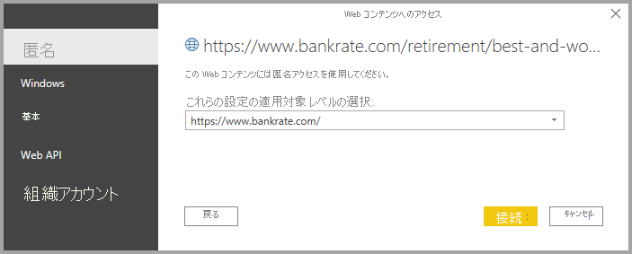

# Power BI Desktop から Web ページに接続する

Web ページに接続し、そのデータを Power BI Desktop にインポートして、ご自分のビジュアルやご自分のデータ モデルで使用できます。

Power BI Desktop で、 **[ホーム]** リボンから **[データの取得]、[Web]** の順に選択します。

![[Web] の選択を示す、Power BI Desktop のスクリーンショット。](media/desktop-connect-to-web/connect-to-web-01.png)

ダイアログが表示され、データをインポートする Web ページの URL の指定を要求されます。

![[URL] フィールドを示す、[Web] ダイアログのスクリーンショット。](media/desktop-connect-to-web/connect-to-web-02.png)

URL を入力するか貼り付けて、 **[OK]** をクリックします。 Power BI Desktop によって、Web コンテンツへのアクセス方法を指定するように求められます。

Power BI Desktop によって、Web ページへの接続が行われ、ページで利用可能なデータが **[ナビゲーター]** ウィンドウに表示されます。 ページ全体のテーブルなど、利用可能なデータ要素の 1 つを選択すると、 **[ナビゲーター]** ウィンドウの右側にデータのプレビューが表示されます。

![選択されたテーブルのデータのプレビューを示す、[ナビゲーター] ダイアログのスクリーンショット。](media/desktop-connect-to-web/connect-to-web-04.png)

Power BI Desktop にデータをインポートする前に、 **[データの変換]** ボタンを選択し、 **[クエリ エディター]** を起動します。ここでは、その Web ページのデータを調整したり、変換したりすることができます。 または、 **[読み込み]** ボタンを選択して、左側のウィンドウで選択したすべてのデータ要素をインポートできます。

**[読み込み]** を選択すると、選択した項目がインポートされて、Power BI Desktop の [レポート] ビューの右側の **[フィールド]** ウィンドウで使用できるようになります。

![選択されたテーブルの一覧を示す、[フィールド] ペインのスクリーンショット。](media/desktop-connect-to-web/connect-to-web-05.png)

Web ページへの接続と Power BI Desktop へのデータの取り込みは以上です。

この後は、これらのフィールドをレポート キャンバスにドラッグして、必要なすべての表示を作成できます。 他のデータと同じように Web ページのデータを使用することもできます。データを調整したり、データとモデルの他のデータ ソースとの間にリレーションシップを作成したり、必要な Power BI レポートを作成するための処理を行ったりできます。

Web ページへの接続の詳細については、「[Power BI Desktop 概要ガイド](../fundamentals/desktop-getting-started.md)」を参照してください。

## 証明書失効の確認

Power BI によって、Web 接続に対するセキュリティが適用され、データが保護されます。 Fiddler を使用した Web 要求のキャプチャなど、一部のシナリオでは、Web 接続が正常に機能しないことがあります。 このようなシナリオを有効にするには、Power BI Desktop の **[証明書失効の確認を有効にします]** オプションをオフにして、Power BI Desktop を再起動します。 

このオプションを変更するには、 **[ファイル] > [オプション]** の順に選択し、左側のペインで **[セキュリティ]** を選択します。 次の図は、チェックボックスを示しています。 このチェックボックスをオフにすると、Web 接続のセキュリティが低下します。 

## 次のステップ
Power BI Desktop を使用して接続できるデータの種類は他にもあります。 データ ソースの詳細については、次のリソースを参照してください。

* [Power BI Desktop のデータ ソース](desktop-data-sources.md)
* [Power BI Desktop でのデータの整形と結合](desktop-shape-and-combine-data.md)
* [Power BI Desktop で Excel ブックに接続する](desktop-connect-excel.md)   
* [Power BI Desktop で CSV ファイルに接続する](desktop-connect-csv.md)   
* [Power BI Desktop にデータを直接入力する](desktop-enter-data-directly-into-desktop.md)   
