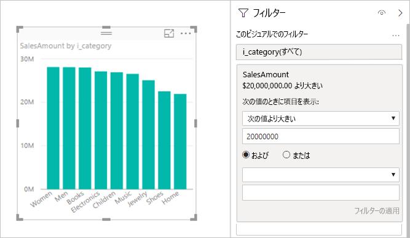
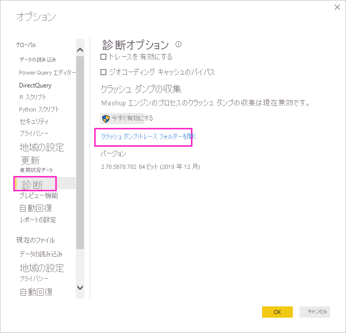
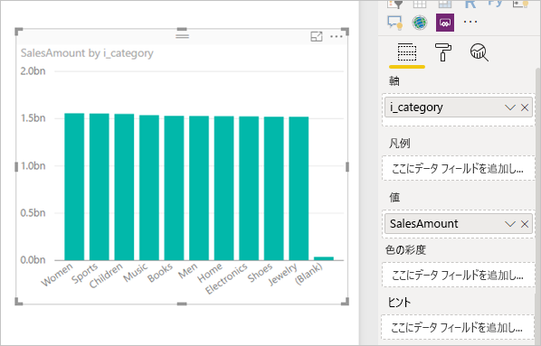

# <a name="about-using-directquery-in-power-bi"></a>Power BI での DirectQuery の使用について

*Power BI Desktop* または *Power BI サービス* を使用すると、あらゆる種類のデータ ソースにさまざまな方法で接続できます。 Power BI にデータを "*インポート*" したり (最もよく使われるデータ取得方法)、元のソース リポジトリ内のデータに直接接続したり (*DirectQuery* と呼ばれています) できます。 この記事では DirectQuery の機能について説明します。

* DirectQuery のさまざまな接続オプション
* インポートではなく DirectQuery の使用を検討する必要があるときのためのガイダンス
* DirectQuery を使用する欠点
* DirectQuery を使用する場合のベスト プラクティス

インポートと DirectQuery を使用する場合は次のベスト プラクティスに従います。

* 可能な場合は常に、Power BI にデータをインポートする必要があります。 インポートでは、Power BI のハイ パフォーマンスのクエリ エンジンが活用され、高い対話性とあらゆる機能を備えたエクスペリエンスが提供されます。
* データのインポートによって目的を達成できない場合は、DirectQuery の使用を検討してください。 たとえば、頻繁に変更されるデータの最新の状態をレポートに反映する必要がある場合は、DirectQuery が最適である可能性があります。 ただし、DirectQuery を使うのが適しているのは、基になるデータ ソースが一般的な集計クエリに対する対話型クエリを 5 秒未満で提供でき、生成されるクエリの負荷を処理できる場合のみです。 さらに、DirectQuery の使用に関する制限事項の一覧を慎重に検討する必要があります。

インポートと DirectQuery に対して Power BI から提供される機能のセットは、時間の経過に伴って進化します。 変更には、インポートしたデータを使用するときの柔軟性の向上 (インポートを使用できるケースの増加など) や、DirectQuery を使用するときのいくつかの欠点の除去などが含まれます。 機能強化に関係なく、DirectQuery を使うときは、基になるデータ ソースのパフォーマンスが常に大きな考慮事項になります。 基になるデータ ソースが遅い場合、そのソースで DirectQuery を使用することは実行不可能なままとなります。

この記事では、Power BI での DirectQuery の使用について説明します。*SQL Server Analysis Services* については説明しません。 DirectQuery は、SQL Server Analysis Services の機能でもあります。 この記事で説明する詳細の多くは、その機能に適用されます。 また、重要な相違点もあります。 SQL Server Analysis Services での DirectQuery の使用については、「[SQL Server 2016 Analysis Services での DirectQuery](https://download.microsoft.com/download/F/6/F/F6FBC1FC-F956-49A1-80CD-2941C3B6E417/DirectQuery%20in%20Analysis%20Services%20-%20Whitepaper.pdf)」をご覧ください。

この記事では、Power BI Desktop でレポートが作成される、DirectQuery の推奨されるワークフローについて注目すると共に、Power BI サービスでの直接接続についても説明します。

## <a name="power-bi-connectivity-modes"></a>Power BI の接続モード

Power BI は、次のような多様なデータ ソースに接続します。

* オンライン サービス (Salesforce、Dynamics 365、その他)
* データベース (SQL Server、Access、Amazon Redshift、その他)
* 単純なファイル (Excel、JSON、その他)
* その他のデータ ソース (Spark、Web サイト、Microsoft Exchange、その他)

これらのソースについて、Power BI にデータをインポートできます。 一部については、DirectQuery を使って接続することもできます。 DirectQuery をサポートしているソースの概要については、「[DirectQuery でサポートされるデータ ソース](power-bi-data-sources.md)」を参照してください。 今後、主に優れた対話型クエリ パフォーマンスを提供できるソースという観点から、DirectQuery に対応するソースが増えるものと思われます。

SQL Server Analysis Services は特殊なケースです。 SQL Server Analysis Services に接続するときは、データのインポートまたは "*ライブ接続*" の使用を選択できます。 ライブ接続を使用することは、DirectQuery に似ています。 データはインポートされず、ビジュアルを更新するために基になるデータソースに対して常にクエリが行われます。 ライブ接続は他にも多くの点で異なっているため、異なる用語 ("*ライブ接続*" か "*DirectQuery*") が使用されています。

データに接続するためのオプションには、次の 3 つがあります: *インポート*、*DirectQuery*、*ライブ接続*。

### <a name="import-connections"></a>インポートの接続

インポートでは、Power BI Desktop で **[データの取得]** を使用して SQL Server などのデータ ソースに接続する場合、その接続の動作は次のようになります。

* 最初の [データの取得] エクスペリエンスの間は、選択した各テーブル セットによって、一連のデータを返すクエリが定義されます。 データを読み込む前にこれらのクエリを編集し、フィルターの適用、データの集計、異なるテーブルの結合などを行うことができます。
* 読み込みでは、クエリによって定義されているすべてのデータが Power BI のキャッシュにインポートされます。
* Power BI Desktop で視覚エフェクトを作成するときに、インポートされたデータのクエリが行われます。 Power BI ストアを使用すると、クエリが確実に速くなります。 視覚エフェクトへの変更はすべて、すぐに反映されます。
* 基のデータに対する変更は、どの視覚エフェクトにも反映されません。 データを再インポートするには、"*更新*" を行う必要があります。
* レポートを *.pbix* ファイルとして Power BI サービスに発行すると、データセットが作成されて、Power BI サービスにアップロードされます。 インポートされたデータは、そのデータセットに含まれます。 その後は、そのデータの更新のスケジュールを設定できます (たとえば、毎日データを再インポート)。 元のデータ ソースの場所によっては、オンプレミス データ ゲートウェイの構成が必要になる場合があります。
* 既存のレポートを Power BI サービスで開くと、または新しいレポートを作成すると、インポートされたデータのクエリが再び行われて、対話性が保証されます。
* 視覚エフェクトまたはレポート ページ全体を、ダッシュボード タイルとしてピン留めできます。 基になるデータセットが更新されるたびに、タイルは自動的に更新されます。

### <a name="directquery-connections"></a>DirectQuery の接続

DirectQuery では、Power BI Desktop で **[データの取得]** を使用してデータ ソースに接続した場合、その接続の動作は次のようになります。

* 最初の [データの取得] エクスペリエンスの間に、ソースが選択されます。 リレーショナル ソースの場合、一連のテーブルが選択され、それぞれにおいて一連のデータを論理的に返すクエリが定義されます。 SAP BW などの多次元ソースでは、ソースのみが選択されます。
* ただし、読み込み時には、データは Power BI ストアにインポートされません。 代わりに、Power BI Desktop での視覚エフェクトの作成時に、クエリが基になるデータ ソースに送信されて、必要なデータが取得されます。 視覚エフェクトの更新にかかる時間は、基になるデータ ソースのパフォーマンスによって異なります。
* 基のデータに対する変更はいずれも、既存の視覚エフェクトにすぐには反映されません。 引き続き更新する必要があります。 視覚エフェクトごとに必要なクエリが再送信され、必要に応じてビジュアルが更新されます。
* レポートを Power BI サービスに発行すると、インポートと同じように、Power BI サービスにデータセットが作成されます。 ただし、そのデータセットに "*データは含まれません*"。
* Power BI サービスで既存のレポートを開くか、新しいレポートを作成すると、基になるデータ ソースのクエリが再び行われて、必要なデータが取得されます。 インポート モードでのデータ更新と同様に、元のデータ ソースの場所によっては、オンプレミス データ ゲートウェイの構成が必要になる場合があります。
* 視覚エフェクトまたはレポート ページ全体を、ダッシュボード タイルとしてピン留めできます。 ダッシュボードが確実にすばやく開くように、タイルはスケジュール (たとえば、1 時間ごと) に従って自動的に更新されます。 この更新頻度は、データの変更頻度や、最新のデータを表示する重要性を反映するように、制御できます。 したがって、ダッシュボードを開くと、タイルに反映されるのは最終更新時のデータであり、必ずしも基になるソースに対して行われた最新の変更ではありません。 開いているダッシュボードを更新して確実に最新の状態に保つことができます。

### <a name="live-connections"></a>ライブ接続

SQL Server Analysis Services に接続するときは、選択したデータ モデルからデータをインポートするか、またはデータ モデルにライブ接続するかを選択できます。 インポートを使用する場合は、その外部 SQL Server Analysis Services ソースに対するクエリを定義します。データは普通にインポートされます。 ライブ接続を使用する場合は、クエリは定義されず、外部モデル全体が、フィールド一覧に表示されます。

前の段落で説明した状況は、データをインポートするオプションがないことを除けば、次のソースへの接続にも当てはまります。

* Power BI データセット (たとえば、新しいレポートを作成するために、前に作成してサービスに発行した Power BI データセットに接続する場合)。
* Microsoft Dataverse。

Power BI サービスに発行するときの SQL Server Analysis Services に対するレポートの動作は、次の点で DirectQuery レポートに似ています。

* Power BI サービスで既存のレポートを開くか、新しいレポートを作成すると、基になる SQL Server Analysis Services ソースのクエリが実行されます (オンプレミス データ ゲートウェイが必要な場合があります)。
* ダッシュボードのタイルは、スケジュール (たとえば、1 時間ごと) に従って自動的に更新されます。

また、重要な相違点もあります。 たとえば、ライブ接続の場合、レポートを開いているユーザーの ID は、常に基になる SQL Server Analysis Services ソースに渡されます。

これらの比較は本題ではないので、これ以降は DirectQuery のみに注目します。

## <a name="when-is-directquery-useful"></a>DirectQuery が役に立つ状況

次の表では、DirectQuery による接続が特に役立つシナリオについて説明します。 これには、データを元のソースに残しておくのがよいと思われる場合が含まれます。 指定したシナリオが Power BI で使用できるかどうかについても説明します。

| 制限事項 | 説明 |
| --- | --- |
| データが頻繁に変更され、ほぼリアルタイムでのレポート作成が必要である |インポートされたデータを含むモデルは、1 時間に最大で 1 回更新できます (Power BI Pro または Power BI Premium サブスクリプションでは、より頻繁に更新されます)。 データが継続的に変更されていて、レポートで最新データを表示する必要がある場合、スケジュールされた更新でのインポートを使うのは、それらのニーズを満たしていないことがあります。 Power BI にデータを直接ストリーミングすることができますが、この場合はサポートされるデータ量に制限があることに注意してください。 <br/> <br/> 一方、DirectQuery を使った場合は、レポートまたはダッシュボードを開くか更新すると、ソースの最新データが常に表示されます。 さらに、ダッシュボードのタイルはさらに頻繁に更新できます (最高で 15 分ごと)。 |
| データが非常に大きい |データが非常に大きい場合、すべてをインポートすることは不可能です。 これに対し、DirectQuery を使用すると、適切にクエリが行われるので、大量のデータ転送は必要ありません。 <br/> <br/> ただし、「[DirectQuery を使用する影響](#implications-of-using-directquery)」で説明するように、大量のデータでは、基になるソースに対するクエリのパフォーマンスが遅くなりすぎる可能性もあります 完全な詳細データを必ずインポートすることが必要なわけではありません。 代わりに、インポート中にデータを事前に集計することができます。 "*クエリ エディター*" を使用すると、インポート中の事前集計が簡単になります。 極端な例では、各視覚エフェクトに必要な集計データだけをインポートすることができます。 大規模なデータへのアプローチとしては DirectQuery が最も簡単ですが、基になるソースが遅すぎる場合は集計データのインポートが解決策となる可能性があります。 |
| 基になるソースでセキュリティ規則が定義されている |データをインポートするとき、Power BI は、現在のユーザーの資格情報 (Power BI Desktop から)、または更新スケジュールの構成の一部として定義される資格情報 (Power BI サービスから) を使用して、データ ソースに接続します。 "*インポート*" モードのデータを使ったそのようなレポートを発行および共有するときは、同じデータの表示を許可されているユーザーとだけ共有するか、またはデータセットの一部として行レベル セキュリティを定義することにご注意ください。 <br/> <br/> DirectQuery を使用すると、レポート ビューアーの資格情報を基になるソースに渡し、セキュリティ規則をそこに適用することができます。 シングル サインオンは、SQL Azure データソースでサポートされています。また、データ ゲートウェイを介してオンプレミスの SQL server でもサポートされています。 これについては、「[Power BI のゲートウェイ用シングル サインオン (SSO) の概要](service-gateway-sso-overview.md)」で詳しく説明されています。 |
| データ主権の制限が適用される |組織によっては、データ主権に関するポリシーが設けられている場合あります。つまり、データを組織外に持ち出すことができません。 インポートに基づくソリューションでは、明らかに問題があります。 これに対し、DirectQuery では、データは基になるソースに残っています。 <br/> <br/> ただし、DirectQuery でも、視覚エフェクト レベルでデータのキャッシュがいくつか Power BI サービスに保持されます。これは、タイルのスケジュールされた更新によるものです。 |
| 基になるデータ ソースがメジャーを含む OLAP ソースである |SAP HANA や SAP Business Warehouse などの基になるデータ ソースに "*メジャー*" が含まれている場合、データをインポートすると他の問題が発生します。 つまり、インポートされるデータは、クエリによって定義された特定のレベルで集計されたものです (たとえば、**Class**、**Year**、**City** によるメジャー **TotalSales**)。 その場合、**Year** 別の **TotalSales** など、より高いレベルの集計データを要求する視覚エフェクトが構築された場合、集計値がさらに集計されます。 この集計は、**Sum** や **Min** などの加法メジャーの場合は問題ありませんが、**Average** や **DistinctCount** などの非加法メジャーでは問題になります。 <br/> <br/> 特定の視覚エフェクトでの必要に応じて、ソースから直接正しい集計データを簡単に取得できるようにするには、DirectQuery のように、視覚エフェクトごとにクエリを送信する必要があります。 <br/> <br/> SAP Business Warehouse (BW) に接続するときは、DirectQuery を選ぶと、このようなメジャーの処理に対応できます。 SAP BW の詳細については、[DirectQuery と SAP BW](desktop-directquery-sap-bw.md) に関するページを参照してください。 <br/> <br/> ただし、現在、SAP HANA に対する DirectQuery ではそれがリレーショナル ソースと同じように扱われ、インポートと同様の動作になります。 このアプローチの詳細については、[DirectQuery と SAP HANA](desktop-directquery-sap-hana.md)に関するページを参照してください。 |

まとめると、Power BI における DirectQuery の現在の機能を考えた場合、次のシナリオで利点が得られます。

* データが頻繁に変更され、ほぼリアルタイムでのレポート作成が必要である。
* 事前集計の必要がない、非常に大きなデータを処理する。
* データ主権の制限が適用される。
* ソースが、SAP BW など、メジャーを含む多次元ソースである。

上記の一覧の詳細は Power BI の使用にのみ関連します。 代わりに、外部の SQL Server Analysis Services または Azure Analysis Services モデルを使用してデータをインポートすることが可能です。 次に、Power BI を使用してそのモデルに接続します。 このアプローチの場合は追加の構成が必要となりますが、より高い柔軟性が得られます。 より大量のデータをインポートできます。 データを更新できる頻度に制限はありません。

## <a name="implications-of-using-directquery"></a>DirectQuery を使用する影響

DirectQuery を使用すると、このセクションで詳述するような悪影響が発生する可能性があります。 これらの制限の一部は、使われているソースにより若干異なります。 必要に応じて制限について説明し、大幅に異なるソースについては別の記事で説明します。

### <a name="performance-and-load-on-the-underlying-source"></a>基になるソースでのパフォーマンスと負荷

DirectQuery を使う場合、全体的なエクスペリエンスは基になるデータ ソースのパフォーマンスに大きく依存します。 たとえばスライサーの値を変更した後で、各視覚エフェクトを更新するのに数秒かかる場合 (通常は 5 秒未満)、エクスペリエンスは妥当だと考えられます。 このエクスペリエンスは、Power BI にデータをインポートするときの即時応答と比較すると、遅く感じられる可能性があります。 ソースのパフォーマンスの低下により、個々の視覚エフェクトの時間が数十秒を超えると、エクスペリエンスは非常に悪くなります。 クエリがタイムアウトする場合もあります。

基になるソースのパフォーマンスと共に、ソースに課される負荷に注意してください。 負荷はパフォーマンスに影響します。 共有レポートを開く各ユーザー、および更新される各ダッシュボード タイルからは、視覚エフェクトあたり少なくとも 1 つのクエリが基になるソースに送信されます。 このため、ソースはこのようなクエリ負荷を処理しながら、適切なパフォーマンスを維持できることが必要です。

### <a name="security-implications-when-combining-data-sources"></a>データ ソースを組み合わせるときのセキュリティ上の影響

[複合モデル](../transform-model/desktop-composite-models.md)機能を使用して、データをインポートする場合と同様に、DirectQuery モデルで複数のデータ ソースを使用できます。 複数のデータ ソースを使用する場合は、基になるデータ ソース間でデータがどのようにやり取りされるのかと、それがもたらす[セキュリティへの影響](../transform-model/desktop-composite-models.md#security-implications)を理解することが重要です。

### <a name="limited-data-transformations"></a>データ変換の制限

同様に、クエリ エディターで適用できるデータ変換にも制限があります。 インポートしたデータの場合は、高度な変換のセットを簡単に適用して、データをクリーンアップおよび再形成してから、それを使用して JSON ドキュメントの解析や、列形式から行形式へのデータのピボットなどの視覚エフェクトを作成できます。 これらの変換は DirectQuery では大きく制限されます。

最初に、SAP Business Warehouse などの OLAP ソースに接続するときに、変換をまったく定義できず、外部のモデルがそのままソースから取得されます。 SQL Server のようなリレーショナル ソースの場合は、クエリごとに変換のセットを定義できますが、パフォーマンス上の理由からその変換も制限されます。

そのような変換は、データ更新時に 1 回ではなく、基になるソースに対するすべてのクエリで適用する必要があるため、1 つのネイティブ クエリに無理なく組み込むことができる変換に制限されます。 複雑すぎる変換を使用すると、エラーが発生し、変換を削除するか、モデルをインポートに切り替える必要があります。

さらに、 **[データの取得]** ダイアログまたはクエリ エディターで作成したクエリが、視覚エフェクトに必要なデータを取得するために生成されて送信されるクエリ内のサブセレクトで使われます。 このようなコンテキストで有効なクエリをクエリ エディターで定義する必要があります。 具体的には、共通テーブル式を使うクエリや、ストアド プロシージャを呼び出すクエリを使うことはできません。

### <a name="modeling-limitations"></a>モデリングの制限事項

このコンテキストでの "*モデリング*" という用語は、レポート作成の一環としての生データの調整や補強を意味します。 たとえば、次のようになります。

* テーブル間のリレーションシップの定義
* 新しい計算の追加 (計算列とメジャー)
* 列やメジャーの名前変更や非表示
* 階層の定義
* 列の書式、既定の概要作成、並べ替え順序の定義
* 値のグループ化またはクラスタリング

DirectQuery を使うと、これらのモデル強化の多くを行うことができ、後での使用の改善に関しては確かに生データが強化される原則があります。 ただし、DirectQuery では、いくつかのモデリング機能が使用できないか、制限されます。 制限事項は、一般にパフォーマンスの問題を回避するために適用されます。 すべての DirectQuery ソースに共通する制限のセットを次に一覧表示します。 「[次の手順](#next-steps)」で説明されているように、個々のソースには追加の制限が適用される場合があります。

* **組み込みの日付階層がない:** データをインポートするときは、すべての日付/日時列で組み込みの日付階層も既定で使用できます。 たとえば、**OrderDate** 列を含む受注テーブルをインポートし、視覚エフェクトで **OrderDate** を使用する場合、適切なレベル (年、月、日) を選択して使用できます。 DirectQuery を使用する場合、この組み込み日付階層は使用できません。 多くのデータ ウェアハウスで一般的であるように、基になるソースに利用可能な **日付** テーブルがある場合は、DAX タイム インテリジェンス関数を通常どおり使用できます。
* **秒精度までの日付/時刻サポート:** データセットで時間列を使用するとき、Power BI では、基礎ソースにクエリを発行するとき、その詳細レベルは秒までになります。 クエリは、ミリ秒の間、DirectQuery ソースに送信されません。 ご利用のソース列から時間のこの部分を削除します。
* **計算列での制限事項:** 計算列は集計関数を使用しない行内に制限されます。たとえば、同じテーブルの他の列の値だけを参照できます。 さらに、許可される、`LEFT()`などの DAX スカラー関数は、基になるソースにプッシュできる関数に限定されます。 その関数は、ソースの正確な機能によって異なります。 計算列の DAX を作成するとき、サポートされない関数はオートコンプリートにリストされず、使用するとエラーが発生します。
* **親子 DAX 関数がサポートされない:** DirectQuery モードになっている場合、アカウントのグラフや従業員の階層などの親子構造を一般に処理する `DAX PATH()` 関数ファミリを使用することはできません。
* **計算テーブルがサポートされない:** DirectQuery モードでは、DAX 式を使って計算テーブルを定義する機能はサポートされません。
* **リレーションシップのフィルター:** 双方向のフィルター処理の詳細については、[双方向のクロスフィルター](https://download.microsoft.com/download/2/7/8/2782DF95-3E0D-40CD-BFC8-749A2882E109/Bidirectional%20cross-filtering%20in%20Analysis%20Services%202016%20and%20Power%20BI.docx)に関する記事を参照してください。 このホワイトペーパーでは、SQL Server Analysis Services のコンテキストでの例が示されています。 基本的なポイントは、Power BI にも同様に適用されます。
* **クラスタリングがない:** DirectQuery を使用した場合、クラスタリング機能を使用して自動的にグループを検索することはできません。

### <a name="reporting-limitations"></a>レポート作成の制限事項

ほとんどすべてのレポート機能は、DirectQuery モデルでもサポートされます。 そのため、基になるソースが適切なレベルのパフォーマンスを提供する限り、同じ視覚エフェクトのセットを使うことができます。 レポートを発行した後、Power BI サービスで提供されている他の機能の一部には何らかの重要な制限があります。

* **クイック分析情報がサポートされない:** Power BI のクイック分析情報では、興味がある可能性のある情報を検出するために一連の高度なアルゴリズムを適用しながら、データセットのさまざまなサブセットが検索されます。 非常にハイ パフォーマンスのクエリを必要とするため、この機能は DirectQuery を使用するデータセットでは利用することはできません。
* **Q&A はサポートされていません:** Power BI の Q&A を使うと、直感的な自然言語の機能を使ってデータを調査し、チャートやグラフの形式で質問に対する回答を受け取ることができます。 ただし、現時点では、DirectQuery を使用するデータセットではサポートされていません。
* **Excel で分析を使うとパフォーマンスが低下する可能性がある:** データセットで [Excel で分析] 機能を使って自分のデータを調べることができます。 このアプローチを使用すると、Excel でピボットテーブルとピボットグラフを作成できます。 DirectQuery を使うデータセットでもこの機能はサポートされますが、一般にパフォーマンスは Power BI で視覚エフェクトを作成する場合より遅くなります。したがって Excel の使用が重要なシナリオの場合、DirectQuery の使用を判断する際にこのことを考慮する必要があります。
* **テキスト列の最大長:** DirectQuery を使用するデータセットのテキスト列に含まれるデータの最大長は 32,764 文字です。 これを超えるテキストで報告すると、エラーが発生します。

### <a name="security"></a>Security

この記事で前述したように、DirectQuery のレポートは、Power BI サービスに発行された後、常に同じ固定の資格情報を使用して基になるデータ ソースに接続されます。 この動作は DirectQuery に適用されるものであり、SQL Server Analysis Services へのライブ接続では異なります。 DirectQuery レポートを発行したら直ちに、使用されるユーザーの資格情報を構成する必要があります。 資格情報を構成するまで、Power BI サービスでレポートを開くとエラーになります。

ユーザーの資格情報が指定されたら、"*レポートを開くユーザーに関係なく*" これらの資格情報が使われます。 このように、それはインポートされたデータとまったく同様です。 レポートの一部として行レベルのセキュリティが定義されていない限り、すべてのユーザーに同じデータが表示されます。 基になるソースでセキュリティ ルールが定義されている場合、レポートの共有に同じ注意を払う必要があります。

また、Power BI Desktop から SQL Server に DirectQuery 接続を行う場合、"代替資格情報" はサポートされません。 現在の Windows 資格情報またはデータベースの資格情報を使用できます。

### <a name="behavior-in-the-power-bi-service"></a>Power BI サービスでの動作

このセクションでは、Power BI サービスでの DirectQuery レポートの動作について説明します。これにより、レポートとダッシュボードを共有するユーザーの数、レポートの複雑さ、および行レベル セキュリティがレポートで定義されているかどうかに応じて、バックエンド データ ソースで発生する負荷の大きさを説明します。

#### <a name="reports--opening-interacting-with-editing"></a>レポート - 表示、操作、編集

レポートを開くと、現在表示されているページ上のすべての視覚エフェクトが更新されます。 各視覚エフェクトでは、通常、基になるデータ ソースに対して少なくとも 1 回クエリを実行する必要があります。 視覚エフェクトによっては、複数回のクエリが必要になる場合があります。 たとえば、視覚エフェクトには、2 つの異なるファクト テーブルの集計値が表示されたり、より複雑なメジャーが含まれたり、Count Distinct のような非加法メジャーの合計が含まれたりします。 新しいページに移動すると、それらの視覚エフェクトが更新されます。 更新すると、新しいクエリのセットが基になるソースに送信されます。

レポートでのすべてのユーザー操作により、視覚エフェクトが更新される可能性があります。 たとえば、スライサーで別の値が選択されると、影響を受けるすべての視覚エフェクトを更新するために新しいクエリ セットを送信する必要があります。 視覚エフェクトをクリックして他の視覚エフェクトをクロス強調表示したり、フィルターを変更したりする場合も同様です。

同様に、新しいレポートを編集する場合も、パスの各手順でクエリを送信して最終的な視覚エフェクトを生成する必要があります。

結果のキャッシュがいくつかあります。 まったく同じ結果が最近取得されている場合は視覚エフェクトがすぐに更新されます。 行レベルのセキュリティが定義されている場合、このようなキャッシュはユーザー間で共有されません。

#### <a name="dashboard-refresh"></a>ダッシュボードの更新

個々の視覚エフェクトまたはページ全体を、タイルとしてダッシュボードにピン留めできます。 DirectQuery データセットに基づくタイルは、スケジュールに従って自動的に更新されます。 タイルからバックエンド データ ソースにクエリが送信されます。 既定ではデータセットの更新は、1 時間ごとに更新されますが、データセットの設定の一部として、毎週から 15 分間隔の範囲で構成することができます。

行レベル セキュリティがモデルで定義されていない場合は、各タイルは 1 回で更新され、その結果がすべてのユーザー間で共有されます。 それ以外の場合、大きな相乗効果が発生する可能性があります。 各タイルからは、ユーザーごとに個別のクエリが、基になるソースに送信される必要があります。

10 個のタイルを含み、100 人のユーザーによって共有されるダッシュボードが、行レベル セキュリティを設定された DirectQuery を使うデータセットに作成され、15 分ごとに更新するように構成されている場合、15 分ごとに少なくとも 1000 個のクエリがバックエンド ソースに送信されます。

行レベル セキュリティの使用および更新スケジュールの構成については、慎重に検討してください。

#### <a name="time-outs"></a>タイムアウト

Power BI サービス内の個々のクエリには、4 分のタイムアウトが適用されます。 これよりも時間がかかるクエリは失敗します。 前に説明したように、対話形式に近いクエリ パフォーマンスを提供するソースに対しては、DirectQuery を使用することをお勧めします。 この制限は過度に長い実行時間による問題を回避するためのものです。

### <a name="other-implications"></a>その他の影響

DirectQuery の使用に伴うその他の一般的な影響は次のとおりです。

* **データが変更されている場合は、更新して最新データが確実に表示されるようにする必要がある:** キャッシュを使っている場合、視覚エフェクトに常に最新データが表示される保証はありません。 たとえば、視覚エフェクトに前日のトランザクションが表示されている可能性があります。 スライサーが変更されているため、過去 2 日間のトランザクションを表示するように、それは更新される場合があります。 このトランザクションには、最近新たに到着したトランザクションが含まれている可能性があります。 スライサーを元の値に戻すと、以前に取得されたキャッシュの値が再び表示されます。

  **[更新]** を選択すると、いずれのキャッシュもクリアされ、ページ上のすべての視覚エフェクトが更新されて最新のデータが表示されます。

* **データが変化している場合、視覚エフェクト間の一貫性が保証されない:** 異なる視覚エフェクトは、同じページ上でも別のページ上でも、異なるタイミングで更新される可能性があります。 基になるソースのデータが変化している場合、各視覚エフェクトにまったく同じ時点のデータが表示される保証はありません。 実際、詳細情報と合計を取得する場合のように単一の視覚エフェクトに対して複数のクエリが必要であると、1 つの視覚エフェクト内であっても整合性は保証されません。 この一貫性を保証するには、基になるデータ ソースでのスナップショット分離のようなコストの高い機能の使用と併せて、いずれかの視覚エフェクトが更新されるときは常にすべての視覚エフェクトを更新するオーバーヘッドが必要になります。

  **[更新]** を再度選択してページ上のすべての視覚エフェクトを更新することで、この問題を大幅に軽減できます。 インポート モードを使用している場合でも、複数のテーブルからデータをインポートするときは整合性の保証に関する同様の問題があります。

* **メタデータの変更を反映するには Power BI Desktop での更新が必要である:** レポートを発行した後の **[更新]** では、レポートの視覚エフェクトが更新されます。 基になるソースのスキーマに対する変更は、フィールド リストで使用可能なフィールドの変更には自動的に適用されません。 基になるソースからテーブルまたは列を削除した場合、更新時にクエリが失敗する可能性があります。 Power BI Desktop でレポートを開き、 **[更新]** を選択すると、モデルのフィールドが更新されて変更が反映されます。

* **クエリで返される行が 100 万行に制限される:** 基になるソースに対する 1 回のクエリで返される行の数には、100 万行という固定の制限があります。 一般に、この制限による実際的な影響はなく、視覚エフェクト自体でこれだけ多くのポイントは表示されません。 ただし、Power BI で送信されるクエリが完全に最適化されておらず、制限を超える中間結果が要求される場合、この制限が発生する可能性があります。 また、視覚エフェクトの作成中に、より適切な最終状態への過程でも、発生することがあります。 たとえば、顧客が 100 万を超える場合、フィルターが適用されるまで、**Customer** や **TotalSalesQuantity** を含めるとこの制限に達します。

  返されるエラーは次のようになります。"外部データ ソースに対するクエリの結果セットが、許可されている最大サイズの '1000000' 行を超えています。"

* **インポート モードから DirectQuery モードに変更できない:** DirectQuery モードからインポート モードを使うようにモデルを切り替えることは可能ですが、必要なすべてのデータをインポートする必要があります。 また、主に DirectQuery モードでサポートされていない機能セットであるため、元に戻すこともできません。 SAP BW などの多次元ソースに対する DirectQuery モデルは、外部メジャーの処理が異なるため、DirectQuery からインポートに切り替えることもできません。

## <a name="directquery-in-the-power-bi-service"></a>Power BI サービスでの DirectQuery

すべてのソースは Power BI Desktop からサポートされます。 一部のソースは、Power BI サービス内から直接使用することもできます。 たとえば、ビジネス ユーザーは Power BI を使って Salesforce 内の自分のデータに接続し、Power BI Desktop を使わずにダッシュボードをすぐに取得することができます。

サービスで直接利用できる DirectQuery 対応のソースは次の 2 つだけです。

* Spark
* Azure SQL Data Warehouse

ただし、この 2 つのソースに対して DirectQuery を使用する場合は、Power BI Desktop 内で始めることをお勧めします。 この理由は、最初に Power BI サービスで接続が確立されたときに、多くの重要な制限が適用されることにあります。 Power BI サービスで開始する場合、最初は簡単ですが、結果のレポートをさらに強化することには制限があります たとえば、計算の作成、多くの分析機能の使用、さらに基になるスキーマの変更を反映するためのメタデータの更新などは不可能です。

## <a name="guidance-for-using-directquery-successfully"></a>DirectQuery を正常に使用するためのガイダンス

DirectQuery を使用する場合は、このセクションで提供する確実に成功する方法についての概要的なガイダンスを参考にしてください。 このセクションのガイダンスは、これまでに説明してきた DirectQuery を使用したときの影響から得られたものです。

### <a name="back-end-data-source-performance"></a>バックエンド データ ソースのパフォーマンス

シンプルな視覚エフェクトが適切な時間内に更新されることを検証します。 妥当な対話型エクスペリエンスのためには、更新時間が 5 秒以内である必要があります。 視覚エフェクトで 30 秒以上かかる場合は、レポートを発行した後でさらに問題が発生する可能性が高くなります。 これらの問題によって、ソリューションが動作しなくなる可能性があります。

クエリが遅い場合は、基になるソースに送信されるクエリを調べて、そのクエリ パフォーマンスの理由を明らかにします。 この記事では、可能性のある基になるソースの完全なセットを対象にした広範なデータベース最適化ベスト プラクティスについては説明しません。 この記事では、ほとんどの状況に適用される標準的なデータベース プラクティスについて説明します。

* 通常、整数型の列に基づくリレーションシップの方が、他のデータ型の列での結合よりパフォーマンスがよくなります。
* 適切なインデックスを作成する必要があります。 インデックスを作成することは、一般に、列ストア インデックスをサポートする、SQL Server などのソースでそれらを使用することを意味します。
* ソースで必要なすべての統計を更新する必要があります

### <a name="model-design-guidance"></a>モデルの設計のガイダンス

モデルを定義するときは、次のガイダンスに従うことを検討してください。

* **クエリ エディターで複雑なクエリを作成しない。** クエリ エディターでは、複雑なクエリが単一の SQL クエリに変換されます。 そのテーブルに送信されたすべてのクエリのサブセレクトに単一のクエリが表示されます。 そのクエリが複雑な場合、送信されるクエリでパフォーマンスの問題が発生する可能性があります。 一連の手順に対する実際の SQL クエリは、クエリ エディターで最後のステップを選択し、コンテキスト メニューから **[ネイティブ クエリを表示]** を選択することによって取得できます。
* **メジャーを単純に保つ。** 少なくとも最初は、メジャーをシンプルな集計に制限することをお勧めします。 その後、そのメジャーで動作に問題がなければさらに複雑なメジャーを定義してもかまいませんが、それぞれのパフォーマンスに注意するようにします。
* **計算列ではリレーションシップを使用しない。** このガイダンスは、自分が複数列の結合を行う必要があるデータベースに関連しています。 現在、Power BI では、FK/PK として複数列に基づくリレーションシップは許可されません。 一般的な回避策は、計算列を使って列を連結し、その列を基にして結合することです。 この回避策はインポートされたデータの場合は妥当ですが、DirectQuery の場合は、式での結合になります。 その結果として一般にインデックスを使用できず、パフォーマンスの低下につながります。 唯一の回避策は、基になるデータベースで実際に複数の列を 1 つの列に具体化することです。
* **uniqueidentifier の列ではリレーションシップを使用しない。** Power BI では、データ型 `uniqueidentifier` がネイティブにサポートされていません。 `uniqueidentifier` 型の列の間にリレーションシップを定義すると、キャストを含む結合を使用するクエリになります。 このアプローチの場合も、一般にパフォーマンスの低下を招きます。 このケースが特に最適化されるまでの唯一の回避策は、基になるデータベースで代替型の列を具現化することです。
* **リレーションシップの to 列を非表示にする。** リレーションシップの *to* 列は通常、*to* テーブルの主キーです。 この列は非表示とする必要があります。 非表示の場合は、フィールドの一覧に表示されず、視覚エフェクトでは使用できません。 多くの場合、リレーションシップの基になっている列は実際には "*システム列*" です。たとえば、データ ウェアハウス内のサロゲートキーがあります。 このような列を非表示にするのはいずれにしてもよいことです。 列に意味がある場合は、次の例に示すように、主キーと同等になるシンプルな式を含んでいて表示される計算列を導入します。

  ```sql  
      ProductKey_PK   (Destination of a relationship, hidden)
      ProductKey (= [ProductKey_PK],   visible)
      ProductName
      ...
  ```

* **計算列とデータ型の変更の使用をすべて調べる。** これらの機能を使用しても必ずしも危険ではありません。 それらを使用すると、基になるソースに送信されるクエリにはシンプルな列参照ではなく式が含まれるようになります。 これにより、インデックスが使用されなくなる可能性があります。
* **双方向クロス フィルタリングをリレーションシップで使わない。** 双方向のクロス フィルターを使用すると、クエリ ステートメントが正常に実行されない可能性があります。
* **設定 *[参照整合性を想定]* で実験する。** リレーションシップで [参照整合性を想定] を設定すると、`OUTER JOIN` ではなく `INNER JOIN` ステートメントをクエリで使用できるようになります。 このガイダンスに従うと一般的にクエリのパフォーマンスが向上しますが、それはデータ ソースの仕様によって異なります。
* **クエリ エディターで相対データ フィルタリングを使わない。** クエリ エディターでは相対データ フィルタリングを定義できます。 たとえば、日付が過去 14 日間である行をフィルター処理するような場合です。
  
  
  
  ただし、このフィルターは、クエリが作成されたときの固定の日付に基づいたフィルターに変換されます。 この結果は、ネイティブ クエリの表示から確認できます。
  
  
  
  この結果は期待どおりではない可能性があります。 レポート実行時の日付に基づいてフィルターが確実に適用されるようにするには、代わりにレポート内でフィルターをレポート フィルターとして適用します。 現在、このアプローチを実現するには、`DAX DATE()` 関数を使用して過去の日数を計算する計算列を作成してから、その計算列をフィルター内で使用します。

### <a name="report-design-guidance"></a>レポートの設計のガイダンス

DirectQuery 接続を使用してレポートを作成する場合は、次のガイダンスに従います。

* **クエリを減らすオプションの使用を検討する:** Power BI のレポートには、送信するクエリを減らすオプションや、結果的に生成されるクエリの実行に時間がかかる場合、パフォーマンスを低下させる特定の操作を無効にするオプションがあります。 Power BI Desktop でこのようなオプションにアクセスするには、 **[ファイル]**  >  **[オプションと設定]**  >  **[オプション]** の順に進み、 **[クエリを減らす]** を選択します。

   

    **[クエリを減らす]** にあるチェックボックスを選択することで、レポート全体でクロス強調表示を無効にできます。 また、スライサーまたはフィルターの選択に **[適用]** ボタンを表示することもできます。 このアプローチを使用すると、多くのスライサーおよびフィルターを選択してから、それらを適用することができます。 スライサー上の **[適用]** ボタンを選択するまで、クエリは送信されません。 その後、選択を利用してデータが絞り込まれます。

    これらのオプションは、Power BI Desktop でご利用のレポートを操作するときにそれに適用されます。 これらのオプションはまた、お客様のユーザーが Power BI サービスでレポートを使用する場合にも適用されます。

* **フィルターを最初に適用する:** 常に、視覚エフェクト作成の最初の段階で該当するフィルターを適用します。 たとえば、 **[TotalSalesAmount]** と **[ProductName]** をドラッグしてから特定の年でフィルター処理するのではなく、最初に **[Year]** でフィルターを適用します。 視覚エフェクトを作成する各ステップでは、クエリが送信されます。 最初のクエリが完了する前に別の変更を加えることができますが、このアプローチでは、基になるソースに不要な読み込みが残る可能性があります。 最初にフィルターを適用することで、一般にこれらの中間クエリのコストが低下します。 また、最初にフィルターを適用しないと、100 万行の上限に達する可能性があります。
* **ページ上の視覚エフェクトの数を制限する:** ページを開くか、ページ レベルのスライサーまたはフィルターを変更すると、ページ上のすべての視覚エフェクトが更新されます。 並列に送信されるクエリの数にも制限があります。 視覚エフェクトの数が増えると、一部の視覚エフェクトは順番に更新されるようになり、ページ全体の更新にかかる時間が増えます。 このため、1 ページの視覚エフェクトの数を制限し、代わりにシンプルなページを増やすことをお勧めします。
* **視覚エフェクト間の相互作用を無効にすることを検討する:** 既定では、レポート ページ上の 1 つの視覚化を使って、そのページ上の他の視覚化に処理とクロス強調表示を適用できます。 たとえば、円グラフで **1999** を選択すると、縦棒グラフが **1999** のカテゴリの売上を表示するようにクロス強調表示されます。
  
  
  
  DirectQuery でのクロスフィルター処理とクロス強調表示では、基になるソースにクエリを送信する必要があります。 ユーザー選択への応答にかかる時間が不当に長くなる場合は、この相互作用をオフにする必要があります。 この相互作用をオフにすることができます。 この相互作用は、クエリを減らすオプションについて前述したようにレポート全体に対してオフにするか、または個別にオフにします。 詳細については、「[Power BI のレポート内でビジュアルがどのように相互作用するか](../consumer/end-user-interactions.md)」を参照してください。

前述の提案に加えて、次の各レポート機能がパフォーマンスの問題の原因になる可能性があります。

* **メジャー フィルター:** 列の集合またはメジャーを含む視覚エフェクトでは、それらのメジャーにフィルターを含めることができます。 たとえば、次のグラフには **カテゴリ** 別の **SalesAmount** が表示されますが、含められているのは売上が **2000 万** を超えるカテゴリのみです。
  
  
  
  このアプローチを実行すると、基になるソースに 2 つのクエリが送信される可能性があります。
  
  * 最初のクエリでは、**SalesAmount** が 2000 万より大きいという条件を満たすカテゴリが取得されます。
  * 次に、2 番目のクエリでは、`WHERE` 句の条件を満たすカテゴリなど、視覚エフェクトに必要なデータが取得されます。
  
  この例のようにカテゴリの数が数百から数千の場合、このアプローチは一般に問題なく機能します。 カテゴリの数が多くなると、パフォーマンスが低下する可能性があります。 このクエリは、条件を満たすカテゴリが 100 万を超える場合は失敗します。 100 万行の制限については前に説明しました。

* **TopN フィルター:** 何らかのメジャーによってランク付けされた上位または下位 N 個の値のみをフィルター処理する高度なフィルターを定義することができます。 たとえば、フィルターには前の視覚エフェクトの上位 10 個のカテゴリを含めることができます。 このアプローチでも基になるソースに 2 つのクエリが送信されます。 ただし、最初のクエリは基になるソースからすべてのカテゴリを返し、返された結果に基づいて TopN が決定されます。 関係する列のカーディナリティによっては、このアプローチではパフォーマンスの問題が発生したり、100 万行の制限によりクエリが失敗したりする可能性があります。

* **中央値:** 一般に、`Sum` や `Count Distinct` などのカテゴリはいずれも基になるソースにプッシュされます。 ただし、このことは中央値には当てはまりません。この集計は一般に基になるソースによってサポートされていません。 このような場合は、詳細データが基になるソースから取得され、返された結果から中央値が計算されます。 このアプローチは、比較的少数の結果に対して中央値を計算する場合に適しています。 行の上限が 100 万であるため、カーディナリティが大きい場合は、パフォーマンスの問題またはクエリの失敗が発生します。 たとえば、**国の人口の中央値** では問題がなくても、**販売価格の中央値** では問題になることがあります。

* **高度なテキスト フィルター (_contains_ など):** テキスト列をフィルター処理する場合、高度なフィルター処理では *contains* や *begins with* などのフィルターを使用できます。 一部のデータ ソースでは、これらのフィルターにより確実にパフォーマンスが低下します。 具体的には、必要なのが完全な一致である場合、既定の *contains* フィルターは使用しないでください。 結果は同じかもしれませんが、実際のデータによっては、インデックスのためにパフォーマンスが大きく異なる可能性があります。

* **複数選択スライサー:** 既定では、スライサーで可能な選択は 1 つのみです。 フィルターでの複数選択を許可した場合、ユーザーがスライサー内の一連の項目を選択するため、パフォーマンスの問題が発生する可能性があります。 たとえば、関心のある 10 製品をユーザーが選択した場合、新しい選択のたびにクエリがソースに送信されます。 クエリが完了する前にユーザーは次の項目を選択できますが、このアプローチでは基になるソース上で余分な負荷が発生します。

* **ビジュアルで合計をオフにすることを検討する:** 既定では、テーブルとマトリックスには合計と小計が表示されます。 多くの場合、このような合計の値を得るために、基になるソースにクエリを個別送信する必要があります。 このことは *DistinctCount* 集計を使用するときや、SAP BW または SAP HANA で DirectQuery を使用するあらゆるケースで該当します。 このような合計をオフにするには、 **[書式]** ウィンドウを利用します。

### <a name="maximum-number-of-connections-option-for-directquery"></a>DirectQuery の接続の最大数オプション

基になるデータ ソースごとに DirectQuery によって開かれる接続の最大数を設定できます。これにより、各データ ソースに同時に送信されるクエリ数が制御されます。

DirectQuery によって開かれるコンカレント接続の既定最大数は 10 です。 Power BI Desktop では、現在のファイルにおける最大数を変更できます。 **[ファイル]**  >  **[オプションと設定]**  >  **[オプション]** の順に移動します。 左側のウィンドウの **[現在のファイル]** セクションで、 **[DirectQuery]** を選択します。


この設定は、現在のレポートに DirectQuery ソースが少なくとも 1 つあるときにのみ有効になります。 この値はすべての DirectQuery ソースに適用され、同じレポートに追加された新しい DirectQuery ソースに適用されます。

**データ ソースあたりの最大接続数** を増やすと、より多くのクエリ (指定された最大数まで) を基になるデータ ソースに送信できるようになります。 このアプローチは、1 つのページ上に多くの視覚エフェクトがある場合、または多数のユーザーが同時にレポートにアクセスする場合に便利です。 接続の最大数に到達した後は、接続が利用可能になるまで、後続のクエリは待ち行列に入ります。 この上限を増やすと、結果的に、基になるソースの負荷が増えます。そのため、全体的なパフォーマンスの向上はこの設定では保証されません。

レポートが発行されたら、基になるデータ ソースに同時に送信されるクエリの最大数も、固定上限によって決まります。 この上限は、レポートの発行先であるターゲット環境によって異なります。 Power BI、Power BI Premium、Power BI Report Server などのさまざまな環境でそれぞれ異なる上限が課せられる可能性があります。

> [!NOTE]
> DirectQuery の最大接続数の設定は、[拡張メタデータ](desktop-enhanced-dataset-metadata.md)が有効になっているときに、すべての DirectQuery ソースに適用されます。これは、2020 年 10 月以降、Power BI Desktop で作成されたすべてのモデルの既定値です。 

### <a name="diagnosing-performance-issues"></a>パフォーマンスの問題の診断

このセクションでは、パフォーマンスの問題を診断する方法、またはレポートを最適化できるより詳細な情報を取得する方法について説明します。

パフォーマンスの問題の診断は、Power BI サービスではなく Power BI Desktop で始めることをお勧めします。 パフォーマンスの問題は、多くの場合、基になるソースのパフォーマンスに基づいています。 Power BI Desktop のより分離性の高い環境では、問題をより簡単に特定し、診断することができます。 このアプローチでは、Power BI ゲートウェイなどの特定のコンポーネントが最初に削除されます。 パフォーマンスの問題が Power BI Desktop にない場合は、Power BI サービス内のレポートの詳細を調査します。 [パフォーマンス アナライザー](../create-reports/desktop-performance-analyzer.md)は、このプロセス全体で問題を特定するために便利なツールです。

同様に、ページにある多くの視覚エフェクトではなく、最初に個々の視覚エフェクトに問題を分離してみることをお勧めします。

このセクションの前の段落で説明した手順を行ったとします。 この段階で、Power BI Desktop のページには、まだ遅い視覚エフェクトが 1 つあります。 Power BI Desktop から基になるソースに送信されるクエリを特定するには、[パフォーマンス アナライザー](../create-reports/desktop-performance-analyzer.md)を使用します。 基になるデータ ソースから出力される可能性があるトレースおよび診断情報を見ることもできます。 トレースには、クエリがどのように実行され、それをどのように改善できるかに関する有用な詳細も含まれることがあります。

さらに、ソースからのこのようなトレースがない場合であっても、次のセクションで示すように、実行時間に沿って Power BI から送信されるクエリを表示することができます。

#### <a name="determining-the-queries-sent-by-power-bi-desktop"></a>Power BI Desktop によって送信されたクエリの特定

既定では、Power BI Desktop は特定のセッションの間のイベントを *FlightRecorderCurrent.trc* という名前のトレース ファイルに記録します。

一部の DirectQuery ソースでは、このログには基になるデータ ソースに送信されたすべてのクエリが含まれます。 残りの DirectQuery ソースは、今後含められる予定です。 ログにクエリを送信するソースは次のとおりです。

* SQL Server
* Azure SQL データベース
* Azure SQL Data Warehouse
* Oracle
* Teradata
* SAP HANA

トレース ファイルは、現在のユーザーの *AppData* フォルダーにあります。

*\<User>\AppData\Local\Microsoft\Power BI Desktop\AnalysisServicesWorkspaces*

このフォルダーにアクセスするには、Power BI Desktop で **[ファイル]**  >  **[オプションと設定]**  >  **[オプション]** の順に選択し、 **[診断]** を選択します。 次のダイアログが表示されます。



**[診断オプション]** の **[クラッシュ ダンプ/トレース フォルダーを開く]** を選択すると、次のフォルダーが開きます: *\<User>\AppData\Local\Microsoft\Power BI Desktop\Traces*。

そのフォルダーの親フォルダーに移動すると、*AnalysisServicesWorkspaces* を含むフォルダーが表示され、これには Power BI Desktop の開いているインスタンスごとに 1 つのワークスペース フォルダーが含まれます。 これらのフォルダーは整数のサフィックスが付いた名前になっています (例: *AnalysisServicesWorkspace2058279583*)。

このフォルダー内には、 *\\Data* フォルダーがあります。 これには、現在の Power BI セッション用のトレース ファイル *FlightRecorderCurrent.trc* が含まれます。 関連する Power BI Desktop セッションが終了すると、対応するワークスペース フォルダーは削除されます。

トレース ファイルを読み取るには、*SQL Server Profiler* ツールを使用します。 無料ダウンロード [SQL Server Management Studio](/sql/ssms/download-sql-server-management-studio-ssms) の一部として入手できます。

SQL Server Management Studio をダウンロードしてインストールした後、SQL Server Profiler を実行します。


トレース ファイルを開くには、次の手順のようにします。

1. SQL Server Profiler で、 **[ファイル]**  >  **[開く]**  >  **[トレース ファイル]** の順に選択します。

1. 現在開いている Power BI セッションのトレース ファイルへのパスを入力します。次はその例です。*C:\Users\<user>\AppData\Local\Microsoft\Power BI Desktop\AnalysisServicesWorkspaces\AnalysisServicesWorkspace2058279583\Data*。

1. *FlightRecorderCurrent.trc* を開きます。

現在のセッションのすべてのイベントが表示されます。 注釈付きの例を次に示します。イベントのグループが強調表示されています。 各グループには次のイベントが含まれます。

* `Query Begin` および `Query End` イベント。これらは、UI によって生成された DAX クエリの開始と終了を表します (たとえば、視覚エフェクトから、またはフィルター UI 内の値の一覧の作成から)。
* `DirectQuery Begin` および `DirectQuery End` イベントの 1 つまたは複数のペア。これらは、DAX クエリの評価の一部として、基になるデータ ソースに送信されたクエリを表します。

複数の DAX クエリを並列して実行できるので、異なるグループからのイベントが混在している可能性があります。 `ActivityID` の値を使用すれば、同じグループに属しているイベントを特定できます。


必要なその他の列は次のとおりです。

* **TextData:** イベントのテキスト形式の詳細です。 `Query Begin/End` イベントの場合、詳細は DAX クエリです。 `DirectQuery Begin/End` イベントの場合、詳細は基になるソースに送信された SQL クエリです。 現在選択されているイベントの **TextData** は、下部の領域にも表示されます。
* **EndTime:** イベントが完了した時刻です。
* **期間:** DAX クエリまたは SQL クエリの実行にかかった時間です (ミリ秒単位)。
* **エラー:** エラーが発生したかどうかを示します (発生した場合は、イベントも赤で表示されます)。

上の図では、一部の重要ではない列の表示を狭くすることで、他の列がよりわかりやすくなっています。

潜在的なパフォーマンスの問題の診断に役立つトレースをキャプチャする次のアプローチをお勧めします。

* 複数のワークスペース フォルダーで混乱するのを避けるために、1 つの Power BI Desktop セッションを開きます。
* Power BI Desktop で関心のあるアクションのセットを実行します。 追加のアクションをいくつか実行して、目的のイベントがトレース ファイルに確実にフラッシュされるようにします。
* SQL Server Profiler を開き、前述のようにトレースを確認します。 Power BI Desktop を閉じるとトレース ファイルが削除されることに注意してください。 また、Power BI Desktop でのその他のアクションはすぐに表示されません。 新しいイベントを表示するには、トレース ファイル閉じてから再度開く必要があります。
* 個々のセッションを適度な小ささ (数百秒ではなく 10 秒くらいのアクション) にします。 このアプローチを使用すると、トレースファイルをより簡単に解釈できます。 トレース ファイルのサイズにも制限があります。 長いセッションでは前の方のイベントが破棄される可能性があります。

#### <a name="understanding-the-form-of-query-sent-by-power-bi-desktop"></a>Power BI Desktop によって送信されるクエリの形式の概要

Power BI Desktop によって作成および送信されるクエリの一般的な形式では、参照されるテーブルごとにサブセレクトが使用されます。 サブセレクトは、クエリ エディターのクエリによって定義されます。 たとえば、SQL Server に次のような TPC-DS テーブルがあるものとします。


次のクエリを考えてみます。


このクエリは、次の視覚エフェクトになります。



視覚エフェクトを更新すると、次に示す SQL クエリが生成されます。 ご覧のように、`Web Sales`、`Item`、`Date_dim` に対する 3 つのサブセレクトがあり、それぞれから対応するテーブルのすべての列が返されますが、視覚エフェクトで実際に参照されているのは 4 つの列だけです。 網掛けされている、サブセレクトでのこれらのクエリは、まさにクエリ エディターで定義されたクエリの結果です。 現時点で DirectQuery についてサポートされているデータ ソースの場合、この方法でサブセレクトを使っても、パフォーマンスには影響ないことがわかっています。 SQL Server などのデータ ソースでは、他の列への参照は最適化により除外されます。

Power BI でこのパターンが採用されている理由として、使用する SQL クエリをアナリストが直接指定できるということが挙げられます。 それは書き換えられることなく "そのまま" 使用されるのです。


## <a name="next-steps"></a>次のステップ

この記事では、すべてのデータ ソースに共通する DirectQuery の側面について説明しました。 個々のソースに固有の特定の詳細があります。 特定のソースについては、以下の記事をご覧ください。

* [DirectQuery と SAP HANA](desktop-directquery-sap-hana.md)
* [DirectQuery と SAP BW](desktop-directquery-sap-bw.md)

DirectQuery の詳細については、次のリソースをご覧ください。

* [DirectQuery でサポートされるデータ ソース](power-bi-data-sources.md)
