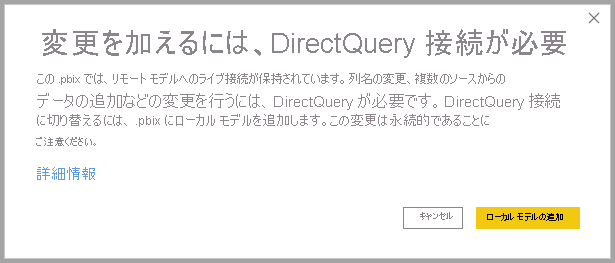
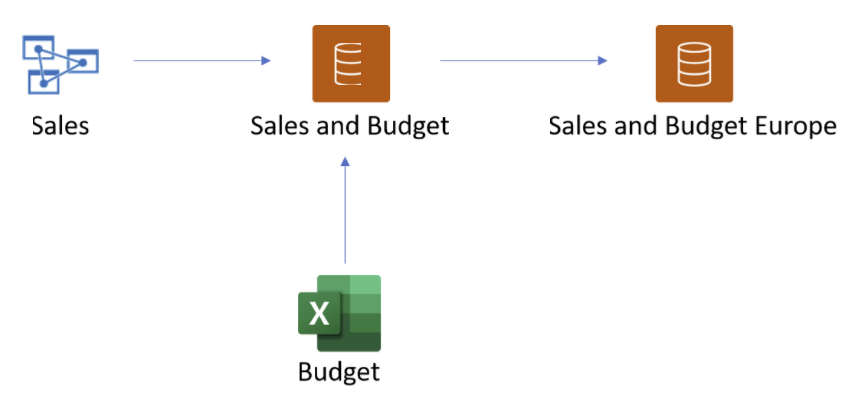
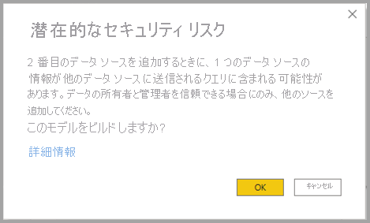
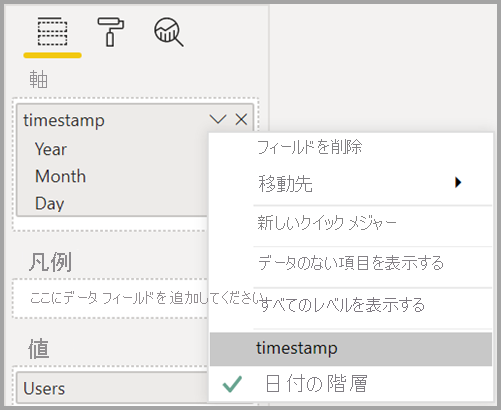

# Power BI データセットおよび Azure Analysis Services 用の DirectQuery を使用する (プレビュー)

**DirectQuery for Power BI datasets and Azure Analysis Services (AAS)** を使用すると、DirectQuery を使用して AAS または Power BI データセットに接続できます。また、必要に応じて、他の DirectQuery およびインポートされたデータと組み合わせることができます。 レポート作成者が、エンタープライズ セマンティック モデルのデータを Excel スプレッドシートなどの所有する他のデータと組み合わせたい場合、またはエンタープライズ セマンティック モデルのメタデータをパーソナル化または強化したい場合、この機能は特に便利です。

## プレビュー機能を有効にする

この機能は現在プレビュー段階であるため、まず有効にする必要があります。 これを行うには、Power BI Desktop で **[ファイル] > [オプションと設定] > [オプション]** に移動し、 **[プレビュー機能]** セクションで **[DirectQuery for Power BI datasets and Analysis Services]** チェックボックスを選択してこのプレビュー機能を有効にします。 変更内容を有効にするために、Power BI Desktop の再起動が必要な場合があります。

## ライブ接続への DirectQuery の使用

DirectQuery for Power BI datasets and Azure Analysis Services を使用するには、レポートにローカル モデルが必要です。 ライブ接続から開始し、ローカル モデルに追加またはアップグレードするか、DirectQuery 接続またはインポートされたデータから開始し、レポートにローカル モデルを自動的に作成することができます。

モデルで使用されている接続を確認するには、Power BI Desktop の右下隅にあるステータス バーを確認します。 Azure Analysis Services ソースにのみ接続している場合は、次の画像のようなメッセージが表示されます。

Power BI データセットに接続している場合は、接続している Power BI データセットを示すメッセージが表示されます。

ライブ接続されているデータセットのフィールドのメタデータをカスタマイズする場合は、ステータス バーで **[Make changes to this model]\(このモデルに変更を加える\)** を選択します。 または、次の画像に示すように、リボンの **[Make changes to this model]\(このモデルに変更を加える\)** ボタンをクリックすることもできます。 **[レポート ビュー]** の **[モデリング]** タブにある **[Make changes to this model]\(このモデルに変更を加える\)** ボタン。[モデル ビュー] の場合、このボタンは **[ホーム]** タブにあります。

![[Make changes to this model]\(このモデルに変更を加える\) ボタン](media/desktop-directquery-datasets-azure-analysis-services/directquery-datasets-02.png)

このボタンを選択すると、ローカル モデルの追加を確認するダイアログが表示されます。 Power BI データセットまたは Azure Analysis Services のフィールドに対して、 **[Add a local model]\(ローカル モデルの追加\)** を選択し、新しい列の作成またはメタデータの変更を有効にします。 次の画像は、表示されるダイアログを示しています。 

Analysis Services ソースにライブ接続している場合、ローカル モデルはありません。 Power BI データセットや Azure Analysis Services などのライブ接続ソースに DirectQuery を使用するには、レポートにローカル モデルを追加する必要があります。 ローカル モデルを含むレポートを Power BI サービスに発行すると、そのローカル モデルのデータセットが適切に発行されます。

## チェーン

データセットと、それらの基となるデータセットとモデルによって、"*チェーン*" が形成されます。 **チェーン** と呼ばれるこのプロセスを使用すると、他の Power BI データセットに基づいてレポートとデータセットを発行できます。これは、以前は不可能だった機能です。

たとえば、同僚が *Sales* という Azure Analysis Services モデルに基づく *Sales and Budget* という Power BI データセットを発行し、それを *Budget* という Excel シートと組み合わせたとします。

同僚が発行した *Sales and Budget* Power BI データセットに基づく *Sales and Budget Europe* という新しいレポート (とデータセット) を発行し、その際にさらに変更または拡張を行う場合は、*Sales* Azure Analysis Services モデルから始まり、*Sales and Budget Europe*  Power BI データセットで終わる、長さが 3 のチェーンにレポートとデータセットを追加することになります。 次の画像は、このチェーン プロセスを視覚化したものです。

前の画像のチェーンの長さは 3 です。このプレビュー期間では、これが最大長です。 長さが 3 を超えるチェーンはサポートされておらず、エラーが発生します。

## セキュリティの警告

**DirectQuery for Power BI datasets and Azure Analysis Services (AAS)** 機能を使用すると、次の画像のようなセキュリティ警告ダイアログが表示されます。

データは、あるデータソースから別のデータソースにプッシュされる場合があります。これは、データ モデルで DirectQuery とインポート ソースを組み合わせる場合と同じセキュリティ警告です。 この動作の詳細については、[Power BI Desktop での複合モデルの使用](../transform-model/desktop-composite-models.md)に関するページを参照してください。

## 推奨される機能とシナリオ

**DirectQuery for Power BI datasets and Azure Analysis Services (AAS)** についてご自分で調べる方法についての提案を次の一覧に示します。

- さまざまなソースからのデータへの接続:インポート (ファイルなど)、Power BI データセット、Azure Analysis Services
- さまざまなデータ ソース間のリレーションシップを作成する
- さまざまなデータ ソースのフィールドを使用するメジャーを作成する
- Azure Analysis Services の Power BI データセットからテーブルの新しい列を作成する
- さまざまなデータ ソースの列を使用する視覚化を作成する

## 考慮事項と制限事項

**DirectQuery for Power BI datasets and Azure Analysis Services (AAS)** を使用する際に注意する必要がある **考慮事項** がいくつかあります。

- データ ソースを更新し、フィールド名またはテーブル名が競合するエラーが発生した場合、Power BI によってエラーが解決されます。

- 別のデータセットに基づく複合モデルで Power BI サービスのレポートを作成するには、すべての資格情報が設定されている必要があります。 資格情報の設定の更新ページでは、資格情報が設定されていても、Azure Analysis Services ソースの場合は次のエラーが表示されます。
    
    
- これは紛らわしく、正しくないので、近日中に対処する予定です。

- RLS ルールは、それらが定義されているソースには適用されますが、モデル内の他のデータセットには適用されません。 レポートに定義されている RLS はリモート ソースに適用されず、リモート ソースに設定された RLS は他のデータ ソースに適用されません。

- このプレビュー リリースでは、表示フォルダー、KPI、日付テーブル、行レベルのセキュリティ、および翻訳はソースからインポートされません。 ローカル モデルで表示フォルダーを作成することはできます。

- 日付の階層を使用すると、予期しない動作が発生する場合があります。 この問題を解決するには、代わりに日付列を使用してください。 視覚化に日付の階層を追加した後、 *[日付の階層]* を使用せずに、フィールド名の下矢印をクリックし、そのフィールドの名前をクリックすると、日付列に切り替えることができます。

    

    日付列と日付の階層の使用の詳細については、こちらの記事を参照してください。

- Azure Analysis Services への DirectQuery 接続があるモデルで AI 機能を使用すると、役に立たないエラー メッセージが表示される場合があります。 

- DirectQuery ソースで ALLSELECTED を使用すると、結果が不完全になります。

- フィルターとリレーションシップ:
    - データ ソースから別の DirectQuery ソースのテーブルに適用されるフィルターは、1 つの列にのみ設定できます

    - DirectQuery ソース内の 2 つのテーブルをソース外のテーブルを使用してフィルター処理するという方法でクロスフィルター処理することは、推奨される設計ではなく、サポートされていません。

    - 1 つのフィルターを 1 つのテーブルに適用できる回数は 1 回だけです。 DirectQuery ソースの外部にあるいずれかのテーブルを介して、同じフィルターをテーブルに 2 回適用することはサポートされていません。

- プレビュー段階では、モデルのチェーンの最大長は 3 です。 長さが 3 を超えるチェーンはサポートされておらず、エラーが発生します。 

- サード パーティ製のツールを使用して、モデルに *チェーンを推奨しない* フラグを設定して、チェーンが作成または拡張されないようにすることができます。 これを設定するには、モデルで *DiscourageCompositeModels* プロパティを探します。 

注意が必要な **制限事項** もいくつかあります。

- データベースとサーバーの名前のパラメーターは現在無効になっています。 

- リモート ソースからテーブルに RLS を定義することはサポートされていません。

- 現在、SQL Server Analysis Services (SSAS) を DirectQuery ソースとして使用することはサポートされていません。 

- "マイ ワークスペース" のデータセットに対して DirectQuery を使用することは現在サポートされていません。 

- DirectQuery を使用するリモート ソースへの接続の削除は現在サポートされていません。

- Power BI データセットまたは Azure Analysis Services モデルへの DirectQuery 接続を含むデータセットでの Power BI Embedded の使用は現在サポートされていません。

- リモート ソースからの列およびメジャーの書式指定文字列は、複合モデルにはインポートされません。

- リモート ソースの計算グループはサポートされておらず、クエリ結果は未定義になります。

- 計算テーブルとリモート ソースのテーブルの間にリレーションシップがある場合、一部のクエリから間違った結果が返されることがあります。 リモート データセットに対する計算テーブルの作成はサポートされていませんが、現在インターフェイスでブロックされていません。

- 現時点では、列による並べ替えはサポートされていません。

- ページの自動更新 (APR) は、データ ソースの種類によっては、一部のシナリオでのみサポートされています。 詳細については、記事「[Power BI でのページの自動更新](../create-reports/desktop-automatic-page-refresh.md)」を参照してください。

## 次の手順

DirectQuery の詳細については、次のリソースを参照してください。

- [Power BI Desktop で DirectQuery を使用する](desktop-use-directquery.md)
- [Power BI Desktop での DirectQuery モデル](desktop-directquery-about.md)
- [Power BI Desktop の DirectQuery モデルのガイダンス](../guidance/directquery-model-guidance.md)
- わからないことがある場合は、 [Power BI コミュニティで質問してみてください](https://community.powerbi.com/)。
