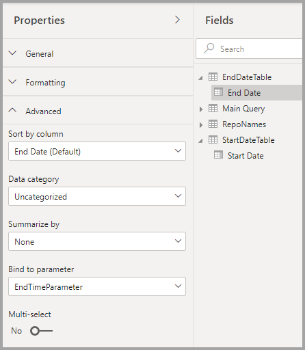

# <a name="dynamic-m-query-parameters-in-power-bi-desktop-preview"></a>Power BI Desktop の動的 M クエリ パラメーター (プレビュー)

**動的 M クエリ パラメーター** を使用すると、モデル作成者は、**レポートの閲覧者** がフィルターまたはスライサーを使用して [M クエリ パラメーター](/power-query/power-query-query-parameters)の値を設定できるようにすることができます。これはクエリ パフォーマンスの最適化に特に役立ちます。 動的 M クエリ パラメーターを使用すると、モデル作成者は、フィルター選択を DirectQuery ソース クエリに組み込む方法をさらに細かく制御できます。 

モデル作成者がフィルターの意図されたセマンティクスを理解すると、多くの場合、そのデータ ソースに対して効率的なクエリを記述する方法がわかるため、フィルター選択をソース クエリの適切な点に組み込んで、改善されたパフォーマンスで意図した結果を達成できるようになります。

## <a name="enabling-dynamic-m-query-parameters"></a>動的 M クエリ パラメーターの有効化

現在、**動的 M クエリ パラメーター** はプレビューの段階にあり、使用するには有効にする必要があります。 **[ファイル] > [オプションと設定] > [オプション]** の順に選択した後、左側のペインから **[プレビュー機能]** を選択します。 そこから、 **[Dynamic M Query Parameters]\(動的 M クエリ パラメーター\)** チェックボックスがオンになっていることを確認します。 変更内容を有効にするには、Power BI Desktop の再起動が必要になる場合があります。


この機能の前提条件として、有効な [M クエリ パラメーター](/power-query/power-query-query-parameters)を作成し、1 つ以上の Direct Query テーブルで参照している必要があります。 

> [!NOTE]
> この機能は一部の DirectQuery ソースでサポートされていないため、この記事の「[考慮事項と制限事項](#considerations-and-limitations)」セクションを必ず確認してください。

パラメーターに **単一の値** を動的に渡す例を見ていきましょう。

1. Power BI Desktop で、 **[データ]** タブから **[Power Query]** を起動し、リボンの **[パラメーターの管理]** ボタンの下にある **[新しいパラメーター]** を選択します。

    

2. 次に、パラメーターに関する次の情報を入力します。

    

3. 他にも追加するパラメーターがある場合は、もう一度 **[新規]** をクリックします。

    

4. 作成したパラメーターは、M クエリで参照できます。 M クエリを変更するには、変更するクエリを選択した状態で、[詳細エディター] を開きます。

    ![[詳細エディター] を開く](media/desktop-dynamic-m-query-parameters/dynamic-m-query-parameters-05.png)

5. 次に、M クエリでパラメーターを参照します。次の図では黄色で強調表示されています。 

    

6. これでパラメーターを作成し、M クエリで参照できました。次に、そのパラメーターで使用可能な値を提供する列を含むテーブルを作成する必要があります。 これにより、フィルターの選択に基づいてパラメーターが動的に設定されるようになります。 この例では、*StartTime* パラメーターと *EndTime* パラメーターを動的にする必要があります。 これらのパラメーターには日付と時刻のパラメーターが必要なため、パラメーターの日付を設定するために使用できる日付入力を生成したいと思います。 まず、新しいテーブルを作成します。

    

7. *StartTime* パラメーターの値に対して作成した最初のテーブルを次に示します。

    ```StartDateTable = CALENDAR (DATE(2016,1,1), DATE(2016,12,31))```

    

8. EndTime パラメーターの値に対して作成した 2 番目のテーブルを次に示します。

    ```EndDateTable = CALENDAR (DATE(2016,1,1), DATE(2016,12,31))```

    

    > [!NOTE]
    > 実際のテーブルに含まれていない別の列名を使用することをお勧めします。 同じ名前の場合、選択した値がフィルターとして実際のクエリに適用されます。

9. これで *Date* フィールドを持つテーブルが作成されたので、各フィールドをパラメーターにバインドできます。 フィールドをパラメーターにバインドすることは、実質的に、フィールドに対して選択した値が変更されると、値がパラメーターに渡され、パラメーターが参照される箇所のクエリが更新されることを意味します。 フィールドをバインドするには、 **[モデリング]** タブにアクセスし、新しく作成したフィールドを選択して、 **[詳細設定]** プロパティにアクセスします。

    > [!NOTE]
    > 列のデータ型は M パラメーターの型と一致する必要があります。

    

10. **[Bind to parameter]\(パラメーターにバインド\)** の下のドロップダウンを選択し、フィールドにバインドするパラメーターを選択します。

    

    この例では単一選択の値を使用する (パラメーターを 1 つの値に設定する) ため、 **[複数選択]** を既定値の **[いいえ]** に設定したままにしておきます。

    

    お客様のユース ケースで複数選択 (複数の値を 1 つのパラメーターに渡す) が必要な場合は、スイッチを **[はい]** に切り替えて、M クエリで複数の値を受け入れるように M クエリを適切に設定する必要があります。 複数の値を許可する *RepoNameParameter* の例を次に示します。

    

11. 他のパラメーターにバインドするフィールドが他にもある場合は、これらの手順を繰り返すことができます。

    

12. 最後に、スライサーで、またはフィルターとしてこのフィールドを参照できます。

    

マップされた列の複数選択が **[いいえ]** に設定されている場合は、スライサーで単一選択モードを使用するか、フィルター カードで単一選択を使用する必要があります。

## <a name="potential-security-risk"></a>潜在的なセキュリティ リスク

レポート閲覧者が M クエリ パラメーターの値を動的に設定できるようにすると、M クエリ内でのパラメーターの参照方法やパラメーターに渡される値に応じて、**インジェクション攻撃** を使用して追加データにアクセスしたり、ソース システムに対する変更をトリガーしたりできるようになる可能性があります。

たとえば、次のように構築された、パラメーター化された Kusto クエリがあるとします。

```
Products
| where Category == [Parameter inserted here] & HasReleased == 'True'
 | project ReleaseDate, Name, Category, Region```
```

パラメーターに適切な値 (たとえば *Games*) を渡してくれるフレンドリなユーザーの場合、問題は発生しないかもしれません。

```
| where Category == 'Games' & HasReleased == 'True'
```

しかし、攻撃者は、クエリを変更する値を渡して、より多くのデータにアクセスできる可能性があります (たとえば *'Games' //* )。

```
Products
| where Category == 'Games'// & HasReleased == 'True'
| project ReleaseDate, Name, Category, Region
```

この例では、攻撃者はクエリの一部をコメントに変更することによって、まだリリースされていないゲームに関する情報にアクセスすることができます。

**リスクを軽減する方法**

セキュリティ リスクを軽減するには、クエリ内で M パラメーター値の文字列を連結しないようにすることをお勧めします。  代わりに、ソース クエリに含まれる M 操作でこれらのパラメーター値を使用し、M エンジンとコネクタによって最終的なクエリが構築されるようにします。 または、使用可能な場合は、ソース クエリ言語およびコネクタに組み込まれているパラメーター渡しのメカニズムを使用します。 たとえば、[Azure Data Explorer](/azure/data-explorer/kusto/query/queryparametersstatement?pivots=azuredataexplorer) には、インジェクション攻撃から保護するように設計された組み込みのクエリ パラメーター機能があります。

次に例をいくつか示します。

* M クエリのフィルター処理操作を使用する例:
    ```
    Table.SelectRows(Source, (r) =\&gt; r[Columns] = Parameter)
    ```

* ソース クエリでパラメーターを宣言する (または、パラメーター値を入力としてソース クエリ関数に渡す) 例:
    ```
    declare query\_parameters (Name of Parameter : Type of Parameter);
    ```

## <a name="considerations-and-limitations"></a>考慮事項と制限事項

動的 M クエリ パラメーターを使用する際に検討すべき考慮事項と制限事項がいくつかあります。

* 1 つのパラメーターを複数のフィールドにバインドすることはできず、その逆もできません。
* この機能は M ベースのデータ ソースでのみサポートされています。 次の DirectQuery ソースはサポートされません。
    * T-SQL ベースのデータ ソース: SQL Server、Azure SQL Database、Synapse SQL プール (別名: Azure SQL Data Warehouse)、Synapse SQL OnDemand プール
    * ライブ接続データ ソース: Azure Analysis Services、SQL Server Analysis Services、Power BI Datasets
    * サポートされていないその他のデータ ソース: Oracle、Teradata、Relational SAP Hana
    * XMLA / TOM エンドポイントのプログラミングによって部分的にサポート: SAP BW と SAP Hana 


* すぐに使用できるパラメーターの型でサポートされていないものは、次のとおりです。
  * Any
  * Duration
  * True/False
  * Binary

* サポートされていないフィルター:
  * 相対時間スライサーまたはフィルター
  * 相対日付
  * 階層スライサー
  * 複数フィールドの一致フィルター
  * 除外フィルター / Not フィルター
  * クロス強調表示
  * ドリルダウン フィルター
  * クロス詳細フィルター
  * 上位 N のフィルター
* サポートされていない操作:
  * および
  * 内容
  * より小さい
  * より大きい
  * 次で始まる
  * 次で始まらない
  * 次ではない
  * 次の値を含まない
  * すべて選択する
  * [空白である]
  * 空白でない


## <a name="next-steps"></a>次の手順

Power BI Desktop では、あらゆる種類の操作を実行できます。 そのような機能について詳しくは、次のリソースをご覧ください。

* [Power BI での DirectQuery の使用について](desktop-directquery-about.md)
* [Power BI Desktop とは何ですか?](../fundamentals/desktop-what-is-desktop.md)
* [Power BI Desktop でのクエリの概要](../transform-model/desktop-query-overview.md)
* [Power BI Desktop でのデータ型](desktop-data-types.md)
* [Power BI Desktop でのデータの整形と結合](desktop-shape-and-combine-data.md)
* [Power BI Desktop での一般的なクエリ タスク](../transform-model/desktop-common-query-tasks.md)