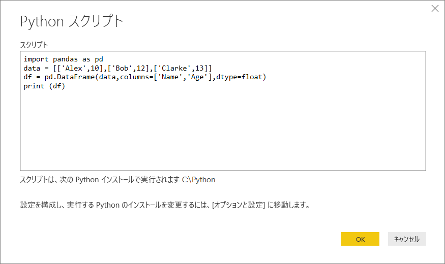
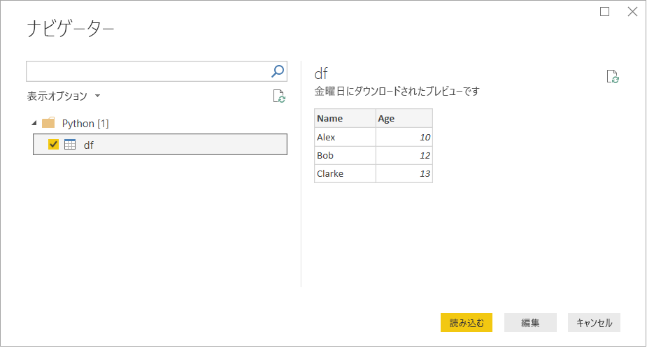

# <a name="run-python-scripts-in-power-bi-desktop"></a>Power BI Desktop で Python スクリプトを実行する

Power BI Desktop で Python スクリプトを直接実行し、生成されたデータセットを Power BI Desktop データ モデルにインポートできます。

## <a name="install-python"></a>Python をインストールする

Power BI Desktop で Python スクリプトを実行するには、ローカル コンピューターに Python をインストールする必要があります。 Python は、[Python Web サイト](https://www.python.org/)からダウンロードできます。 現在の Python スクリプト リリースでは、インストール パスで Unicode 文字とスペースがサポートされています。

### <a name="install-required-python-packages"></a>必要な Python パッケージをインストールする

Power BI Python 統合では、次の 2 つの Python パッケージがインストールされている必要があります。

* [Pandas](https://pandas.pydata.org/)。 データの操作と分析を行うためのソフトウェア ライブラリです。 ここでは、数値テーブルと時系列を操作するためのデータ構造と操作が提供されます。 インポートしたデータは、[pandas データ フレーム](https://www.tutorialspoint.com/python_pandas/python_pandas_dataframe.htm)に含まれている必要があります。 データ フレームは、2 次元のデータ構造体です。 たとえば、データは行と列の表形式で配置されます。
* [Matplotlib](https://matplotlib.org/)。 Python 用のプロット ライブラリとその数値解析の拡張機能 [NumPy](https://www.numpy.org/) です。 これにより、Tkinter、wxPython、Qt、GTK+ など、汎用 GUI ツールキットを使用して、アプリケーションにプロットを埋め込むためのオブジェクト指向 API が提供されます。

コンソールまたはシェルで、[pip](https://pip.pypa.io/en/stable/) コマンドライン ツールを使用して 2 つのパッケージをインストールします。 pip ツールは、より新しいバージョンの Python でパッケージ化されています。

```CMD
pip install pandas
pip install matplotlib
```

## <a name="enable-python-scripting"></a>Python スクリプトを有効にする

Python スクリプトを有効にするには

1. Power BI Desktop で、 **[ファイル]**  >  **[オプションと設定]**  >  **[オプション]**  >  **[Python スクリプト]** を選択します。 **[Python スクリプトのオプション]** ページが表示されます。

   

1. 必要に応じて、 **[Python ホーム ディレクトリが検出されました]** でローカルの Python インストール パスを指定します。

   上の画像では、Python のインストール ローカル パスは *C:\Python* です。 パスが、Power BI Desktop で使用するローカルの Python インストールであることを確認します。

1. **[OK]** を選択します。

ご利用の Python のインストールを指定すると、Power BI Desktop で Python スクリプトの実行を開始する準備ができます。

## <a name="run-python-scripts"></a>Python スクリプトを実行する

わずかな手順で、Python スクリプトを実行し、データ モデルを作成できます。 このモデルでは、レポートを作成して Power BI サービスで共有することができます。

### <a name="prepare-a-python-script"></a>Python スクリプトを準備する

まず、ローカル Python 開発環境でスクリプトを作成し、それが正常に実行されることを確認します。 たとえば、pandas をインポートしてデータ フレームを使用する、シンプルな Python スクリプトを次に示します。

```python
import pandas as pd
data = [['Alex',10],['Bob',12],['Clarke',13]]
df = pd.DataFrame(data,columns=['Name','Age'],dtype=float)
print (df)
```

このスクリプトを実行すると、次のように返されます。

```python
     Name   Age
0    Alex  10.0
1     Bob  12.0
2  Clarke  13.0
```

Power BI Desktop で Python スクリプトを準備し、実行するとき、いくつかの制限があります。

* pandas データ フレームだけがインポートされるため、Power BI にインポートするデータがデータ フレームで表されていることを確認してください
* Python スクリプトは、30 分以上実行するとタイムアウトになります
* ユーザー入力の待機中など、Python スクリプトの対話的呼び出しでスクリプトの実行が停止します
* Python スクリプト内で作業ディレクトリを設定する場合は、作業ディレクトリへの相対パスではなく、完全パスを定義する*必要があります*
* 現在、入れ子になったテーブルはサポートされていません

### <a name="run-your-python-script-and-import-data"></a>Python スクリプトを実行し、データをインポートする

Power BI Desktop で Python スクリプトを実行するには

1. [ホーム] リボンで **[データの取得]**  >  **[その他]** を選択します。

1. 次の画像に示すように、 **[その他]**  >  **[Python スクリプト]** を選択します。

   ![[データの取得] で Python スクリプトを選択する](media/desktop-python-scripts/python-scripts-1.png)

1. **[接続]** を選択します。 ローカルで最後にインストールした Python バージョンが、Python エンジンとして選択されます。 表示される **[Python スクリプト]** ダイアログ ボックスにスクリプトをコピーします。 ここでは、前に示したシンプルな Python スクリプトを入力します。

   

1. **[OK]** を選択します。 スクリプトが正常に実行されると、 **[ナビゲーター]** が表示され、データを読み込んで使用できます。 この例では、図に示すように **df** を選択し、 **[読み込み]** を選択します。

    

### <a name="troubleshooting"></a>トラブルシューティング

Python がインストールされていない、または特定されていない場合は、警告が表示されます。 複数のローカル コンピューターがインストールされている場合は、警告が表示されることもあります。 前の「Python をインストールする」セクションおよび「Python スクリプトを有効にする」セクションに戻って、確認してください。


#### <a name="using-custom-python-distributions"></a>カスタムの Python ディストリビューションの使用

Power BI では、ユーザーが指定した (設定ページで指定した) ディレクトリから python.exe 実行可能ファイルを使用して、スクリプトが直接実行されます。 環境 (Conda など) を準備するために追加の手順が必要なディストリビューションでは、実行が失敗する問題が発生する可能性があります。

関連する問題を回避するために、 https://www.python.org/ の公式の Python ディストリビューションを使用することをお勧めします。

カスタムの Python 環境プロンプトから Power BI Desktop を起動するという解決策も考えられます。

### <a name="refresh"></a>更新

Power BI Desktop で Python スクリプトを更新できます。 最新の情報に更新するには、 **[ホーム]** リボンに移動し、 **[更新]** を選択します。 Python スクリプトを更新するとき、Power BI Desktop で Python スクリプトをもう一度実行します。

## <a name="known-limitations"></a>既知の制限事項

現在、**拡張メタデータ (プレビュー)** 機能を有効にして作成されたレポートで Python スクリプトを使用することはできません。 既存のレポートは引き続き機能します。 詳細については、「[拡張データセット メタデータの使用 (プレビュー)](desktop-enhanced-dataset-metadata.md)」を参照してください。 

## <a name="next-steps"></a>次の手順

Power BI での Python については、次の追加情報を参照してください。

* [Power BI Desktop で Python ビジュアルを作成する](desktop-python-visuals.md)
* [Power BI で外部 Python IDE を使用する](desktop-python-ide.md)
