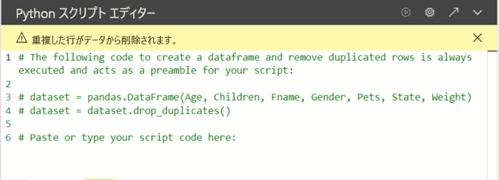

# <a name="create-power-bi-visuals-by-using-python"></a>Python を使用して Power BI ビジュアルを作成する

*Power BI Desktop* では、Python を使用してデータを視覚化できます。

## <a name="prerequisites"></a>前提条件

次の Python スクリプトを使用して、「[Power BI Desktop で Python スクリプトを実行する](desktop-python-scripts.md)」チュートリアルを確認します。

```python
import pandas as pd 
df = pd.DataFrame({ 
    'Fname':['Harry','Sally','Paul','Abe','June','Mike','Tom'], 
    'Age':[21,34,42,18,24,80,22], 
    'Weight': [180, 130, 200, 140, 176, 142, 210], 
    'Gender':['M','F','M','M','F','M','M'], 
    'State':['Washington','Oregon','California','Washington','Nevada','Texas','Nevada'],
    'Children':[4,1,2,3,0,2,0],
    'Pets':[3,2,2,5,0,1,5] 
}) 
print (df) 
```

「[Power BI Desktop で Python スクリプトを実行する](desktop-python-scripts.md)」の記事で、Python をローカル コンピューターにインストールし、Power BI Desktop で Python スクリプトに対してそれを有効にする方法が示されています。 このチュートリアルでは、上記のスクリプトのデータを使用して、Python ビジュアルの作成について示します。

## <a name="create-python-visuals-in-power-bi-desktop"></a>Power BI Desktop で Python ビジュアルを作成する

1. **[視覚化]** ウィンドウで **[Python ビジュアル]** を選択します。

   ![[視覚化] の [Python] オプション](media/desktop-python-visuals/python-visuals-2.png)

1. 表示される **[スクリプト ビジュアルを有効にする]** ダイアログ ボックスで、**[有効]** を選択します。

    レポートに Python ビジュアルを追加すると、Power BI Desktop によって次のアクションが行われます。

    - プレース ホルダーの Python ビジュアル イメージが、レポート キャンバスに表示されます。

    - **[Python スクリプト エディター]** が中央ペインの下部に表示されます。

    

1. 次に、**Age**、**Children**、**Fname**、**Gender**、**Pets**、**State**、および **Weight** フィールドを、**[値]** セクションの **[ここにデータ フィールドを追加してください]** と表示されている場所にドラッグします。

    

   Python スクリプトでは、**[値]** セクションに追加されたフィールドのみを使用できます。 Python スクリプトで作業しているときに、**[値]** セクションに対してフィールドを追加または削除することができます。 Power BI Desktop では、フィールドの変更が自動的に検出されます。

   > [!NOTE]
   > Python ビジュアルの既定の集計タイプは、 *[集計しない]* です。
   > 
   > 

1. これで、選択したデータを使用して、プロットを作成できます。

    フィールドを選択または削除すると、Python スクリプト エディターのサポート コードが自動的に生成されるか、削除されます。 

    選択に基づいて、Python スクリプト エディターによって次のバインド コードが生成されます。

    - エディターによって、追加したフィールドを含む、*データセット* データフレームが作成されました。
    - 既定の集計は、 *[集計しない]* です。
    - テーブル ビジュアルと同様、フィールドはグループ化され、重複する行は一度だけ表示されます。

    

     > [!TIP]
     > 自動グループ化を行いたくない場合や、重複を含めたすべての行を表示させたい場合があります。 その場合は、インデックス フィールドを追加し、すべての行が一意と見なされるようにし、グループ化されないようにします。

   データセット内の列には、それぞれの名前を使用してアクセスできます。 たとえば、Python スクリプトに `dataset["Age"]` をコード化して、Age フィールドにアクセスすることができます。

1. 選択したフィールドによって自動的に生成されたデータフレームを使って、Python の既定デバイスにプロットすることになる Python スクリプトを書き込む準備ができました。 スクリプトが完了したら、**[Python スクリプト エディター]** タイトル バーから **[実行]** を選択します。

   Power BI Desktop では、次のイベントのいずれかが発生したときにビジュアルが再度プロットされます。

   - **[Python スクリプト エディター]** タイトル バーから **[実行]** が選択された
   - データ更新、フィルター処理、または強調表示によってデータの変更が発生した

   Python スクリプトを実行してエラーが発生した場合、Python ビジュアルはプロットされず、キャンバスのエラー メッセージが表示されます。 エラーの詳細については、メッセージの **[詳細を確認する]** を選択します。

   視覚化されたより大きなビューを取得するには、**[Python スクリプト エディター]** を最小化することができます。

では、ビジュアルをいくつか作成してみましょう。

## <a name="create-a-scatter-plot"></a>散布図を作成する

散布図を作成して、年齢と体重の間に相関関係があるかどうかを確認してみましょう。

1. **[スクリプトのコードをここに貼り付けるか入力します]** の下に、次のコードを入力します。

   ```python
   import matplotlib.pyplot as plt 
   dataset.plot(kind='scatter', x='Age', y='Weight', color='red')
   plt.show() 
   ```  

   Python スクリプト エディター ウィンドウは、次のようになります。

   

   **matplotlib** ライブラリがインポートされ、ビジュアルがプロットおよび作成されます。

1. **[スクリプトの実行]** ボタンを選択すると、プレースホルダーの Python ビジュアル イメージで次の散布図が生成されます。

   

## <a name="create-a-line-plot-with-multiple-columns"></a>複数の列で線プロットを作成する

 子供とペットの数を示す線プロットを人ごとに作成してみましょう。 **[スクリプトのコードをここに貼り付けるか入力します]** の下のコードを削除するか、コメントして、次の Python コードを入力します。

 ```python
 import matplotlib.pyplot as plt 
ax = plt.gca() 
dataset.plot(kind='line',x='Fname',y='Children',ax=ax) 
dataset.plot(kind='line',x='Fname',y='Pets', color='red', ax=ax) 
plt.show() 
```

**[スクリプトの実行]** ボタンを選択すると、複数の列を使って次の線プロットが生成されます。


## <a name="create-a-bar-plot"></a>棒プロットを作成する

人の年齢ごとに棒プロットを作成してみましょう。 **[スクリプトのコードをここに貼り付けるか入力します]** の下のコードを削除するか、コメントして、次の Python コードを入力します。

```python
import matplotlib.pyplot as plt 
dataset.plot(kind='bar',x='Fname',y='Age') 
plt.show() 
```

**[スクリプトの実行]** ボタンを選択すると、次の棒プロットが生成されます。

 

## <a name="security"></a>Security

> [!IMPORTANT] 
> **Python スクリプトのセキュリティ:** Python ビジュアルは Python スクリプトから作成されますが、Python スクリプトにはセキュリティやプライバシーのリスクがあるコードが含まれる場合があります。 初めて Python ビジュアルを表示または Python ビジュアルと対話しようとすると、ユーザーにセキュリティ警告メッセージが表示されます。 作成者とソースを信頼する場合、または Python スクリプトを確認して理解した場合にのみ、Python ビジュアルを有効にします。
>  

## <a name="more-information-about-plotting-with-matplotlib-pandas-and-python"></a>Matplotlib、Pandas、Python でのプロットに関する詳細情報

このチュートリアルは、Power BI Desktop で Python を使用したビジュアルの作成を開始する際に役立つように設計されています。 Python、Pandas、Matplotlib ライブラリを使用してビジュアル レポートを作成するための多くのオプションと機能に関しては、ごく一部のみを紹介しています。 外部にはもっと多くの情報がありますが、ここでは作業を開始するためのリンクをいくつか示します。

- [Matplotlib](https://matplotlib.org/) Web サイトのドキュメント 
- [Matplotlib チュートリアル: Python で Matplotlib を使用するための基本ガイド](https://www.datasciencelearner.com/matplotlib-tutorial-complete-guide-to-use-matplotlib-with-python/) 
- [Matplotlib チュートリアル – 例を含む Python Matplotlib ライブラリ](https://www.edureka.co/blog/python-matplotlib-tutorial/) 
- [Pandas API リファレンス](https://pandas.pydata.org/pandas-docs/stable/reference/index.html) 
- [Power BI サービスでの Python の視覚化](https://powerbi.microsoft.com/blog/python-visualizations-in-power-bi-service/) 
- [Power BI で Python ビジュアルを使用する](https://www.absentdata.com/how-to-user-python-and-power-bi/)

## <a name="known-limitations"></a>既知の制限事項

Power BI Desktop での Python ビジュアルには、いくつかの制限があります。

- データ サイズの制限。 Python ビジュアルでプロット作成用に使用するデータは、150,000 行に制限されています。 150,000 を超える行が選択されている場合は、上位の 150,000 の行のみが使用され、メッセージがイメージに表示されます。 また、入力データには 250 MB の制限があります。 
- Python ビジュアルの入力データセットに 32,766 文字を超える文字列値が含まれている列がある場合、その値は切り捨てられます。
- 解像度。 Python ビジュアルはすべて 72 DPI で表示されます。
- 計算時間の制限。 Python ビジュアル計算で実行時間が 5 分を超えると、実行がタイムアウトされ、エラーが発生します。
- リレーションシップ。 他の Power BI Desktop ビジュアルと同様、定義されたリレーションシップを持たない異なるテーブルからデータ フィールドが選択されている場合、エラーが発生します。
- Python ビジュアルは、データ更新、フィルター処理、および強調表示の際に更新されます。 しかし、イメージ自体は対話型ではなく、クロス フィルター処理のソースにすることはできません。
- Python ビジュアルは他のビジュアルの強調表示に応答しますが、他の要素をクロス フィルター処理するために、Python ビジュアルの要素をクリックすることはできません。
- Python の既定のディスプレイ デバイスにプロットされるプロットだけが、キャンバス上に正しく表示されます。 異なる Python ディスプレイ デバイスを明示的に使用することは避けてください。
- Python ビジュアルでは、入力列の名前変更はサポートされていません。 列は、スクリプトの実行時に元の名前で参照されます。

## <a name="next-steps"></a>次の手順

Power BI での Python については、次の追加情報を参照してください。

- [Power BI Desktop で Python スクリプトを実行する](desktop-python-scripts.md)
- [Power BI で外部 Python IDE を使用する](desktop-python-ide.md)

