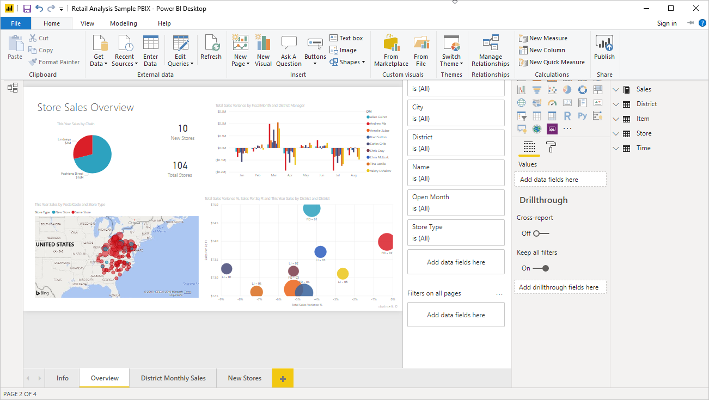
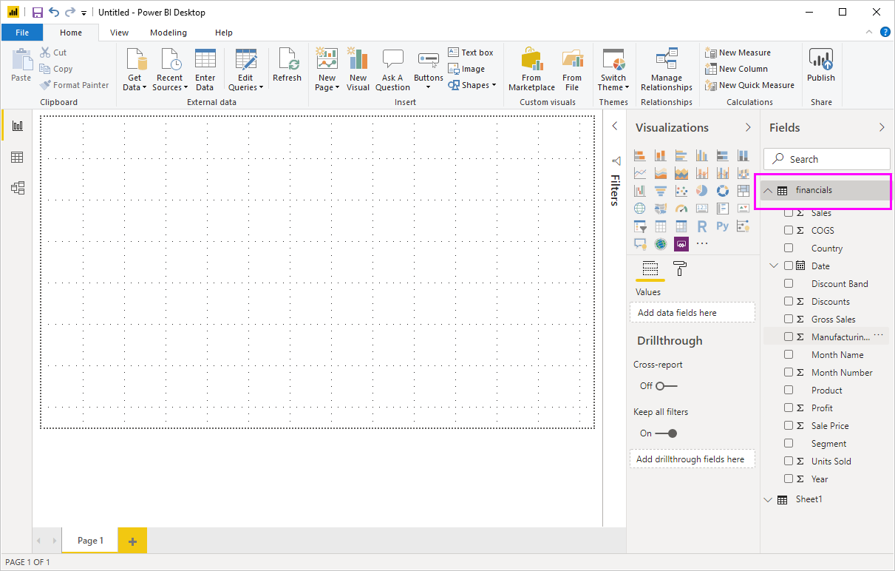

# クイック スタート: Power BI Desktop でデータに接続する

このクイックスタートでは、Power BI Desktop を使用してデータに接続します。これは、データ モデルの作成とレポートの作成における最初の手順です。

Power BI にサインアップしていない場合は、[無料の試用版にサインアップ](https://app.powerbi.com/signupredirect?pbi_source=web)してください。

## 前提条件

この記事の手順を完了するには、次のリソースが必要です。

* Power BI Desktop をダウンロードしてインストールします。このアプリケーションは無料であり、ローカル コンピューター上で動作します。 [Power BI Desktop は直接ダウンロード](https://powerbi.microsoft.com/desktop)することも、[Microsoft Store](https://aka.ms/pbidesktopstore) から入手することもできます。
* [このサンプル Excel ブックをダウンロード](https://go.microsoft.com/fwlink/?LinkID=521962)し、この Excel ファイルを保存できる *C:\PBID-qs* という名前のフォルダーを作成します。 このクイックスタートの後の手順では、それがダウンロード済みの Excel ブックのファイルの場所であることを前提とします。
* Power BI Desktop の多くのデータ コネクタには、認証のために Internet Explorer 10 (以降) が必要です。

## Power BI Desktop を起動する

Power BI Desktop をインストールしたら、アプリケーションを起動してローカル コンピューターで実行されるようにします。 Power BI チュートリアルが表示されます。 チュートリアルに従うか、またはダイアログを閉じて空のキャンバスから開始します。 キャンバスで、データからビジュアルとレポートを作成します。

## データへの接続

Power BI Desktop では、さまざまな種類のデータに接続できます。 これらのソースには、Microsoft Excel ファイルなどの基本的なデータ ソースが含まれます。 Salesforce、Microsoft Dynamics、Azure Blob Storage など、さまざまな種類のデータを含むオンライン サービスに接続できます。

データに接続するには、 **[ホーム]** リボンの **[データの取得]** を選択します。

![[ホーム] リボンの [データを取得]](media/desktop-quickstart-connect-to-data/qs-connect-data_02.png)

**[データを取得]** ウィンドウが表示されます。 Power BI Desktop が接続できるさまざまなデータ ソースから選択できます。 このクイックスタートでは、「[前提条件](#prerequisites)」でダウンロードした Excel ブックを使用します。

![[データを取得] のすべてのソース](media/desktop-quickstart-connect-to-data/qs-connect-data_03.png)

このデータ ソースは Excel ファイルであるため、 **[データの取得]** ウィンドウで **[Excel]** を選択し、 **[接続]** ボタンを選択します。

Power BI により、接続先の Excel ファイルの場所を指定するように求められます。 ダウンロードしたファイルは、"*財務サンプル*" と呼ばれます。 そのファイルを選択し、 **[開く]** を選択します。

![財務サンプルの [データを取得]](media/desktop-quickstart-connect-to-data/qs-connect-data_04.png)

Power BI Desktop によってブックが読み込まれ、その内容が読み取られ、ファイル内の使用可能なデータが **[ナビゲーター]** ウィンドウに表示されます。 このウィンドウで、Power BI Desktop に読み込むデータを選択できます。 各テーブルの横にあるチェックボックスをオンにすることで、インポートするテーブルを選択します。 使用可能なテーブルを両方インポートします。

![[ナビゲーター] ウィンドウでのデータの選択](media/desktop-quickstart-connect-to-data/qs-connect-data_05.png)

選択を行ったら、 **[読み込み]** を選択して Power BI Desktop にデータをインポートします。

## [フィールド] ウィンドウにデータを表示する

テーブルが読み込まれると、 **[フィールド]** ウィンドウにデータが表示されます。 テーブル名の横にある矢印を選択することで、各テーブルを展開できます。 次の図では、*financials* テーブルが展開され、各フィールドが表示されています。

これで完了です。 Power BI Desktop でデータに接続し、そのデータを読み込んで、それらのテーブル内のすべての利用可能なフィールドを表示しました。

## 次のステップ

データに接続したら、さまざまな操作を Power BI Desktop で行うことができます。 ビジュアルとレポートを作成できます。 操作を開始するには、次のリソースを参照してください。

* [Power BI Desktop の概要](../fundamentals/desktop-getting-started.md)
