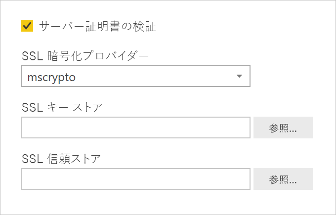
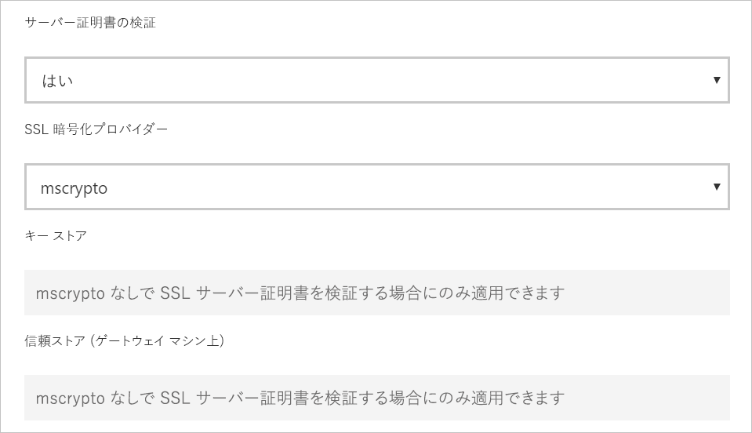

# <a name="enable-encryption-for-sap-hana"></a>SAP HANA の暗号化を有効にする

Power BI Desktop と Power BI サービスから SAP HANA サーバーへの接続を暗号化することをお勧めします。 HANA 暗号化は、SAP の専用 CommonCryptoLib (旧称 sapcrypto) ライブラリを使用して有効にすることができます。 SAP は CommonCryptoLib の使用を推奨しています。

> [!IMPORTANT]
> SAP では現在、OpenSSL をサポートしていません。結果として、Microsoft もそのサポートを停止しました。 既存の接続と新規の接続は 2020 年の終わりまで正しく機能しますが、2021 年 1 月 1 日からは機能しなくなります。 代わりに CommonCryptoLib を使用してください。

この記事では、OpenSSL を使用して暗号化を有効にする方法の概要を説明し、SAP ドキュメントの特定の領域を参照します。 コンテンツとリンクは定期的に更新されますが、包括的な指示とサポートについては、常に公式の SAP ドキュメントを参照してください。 OpenSSL ではなく CommonCryptoLib を使用して暗号化を設定する場合は、「[SAP HANA 2.0 で TLS/SSL を構成する方法](https://blogs.sap.com/2018/11/13/how-to-configure-tlsssl-in-sap-hana-2.0/)」を参照してください。OpenSSL から CommonCryptoLib に移行する手順については、[SAP Note 2093286](https://launchpad.support.sap.com/#/notes/2093286) を参照してください (s-user が必要です)。

> [!NOTE]
> この記事で詳しく説明されている暗号化のセットアップ手順は、SAML SSO のセットアップと構成の手順と重複しています。 HANA サーバーの暗号化プロバイダーとして OpenSSL と CommonCryptoLib のどちらを選択する場合でも、選択した内容が SAML の構成と暗号化の構成とで一貫していることを確認してください。

OpenSSL を使用して SAP HANA の暗号化を有効にするには、4 つのフェーズがあります。 次に、これらのフェーズについて説明します。  詳細については、「[SSL を使用して SAP HANA Studio と SAP HANA サーバー間の通信をセキュリティで保護する](https://blogs.sap.com/2015/09/28/securing-the-communication-between-sap-hana-studio-and-sap-hana-server-through-ssl/)」を参照してください。

## <a name="use-openssl"></a>OpenSSL を使用する

HANA サーバーが、その暗号化サービス プロバイダーとして OpenSSL を使用するように構成されていることを確認します。 以下の不足しているパス情報を、HANA サーバーのサーバー ID (sid) に置き換えます。


## <a name="create-a-certificate-signing-request"></a>証明書署名要求を作成する

HANA サーバーの X509 証明書署名要求を作成します。

1. SSH を使用して、HANA サーバーが実行されている Linux マシンに \<sid\>adm として接続します。

1. ホーム ディレクトリ _/_ _usr/sap/\<sid\>/home_ にアクセスします。

1. _.__ssl_ という名前の隠しディレクトリを作成します (存在しない場合)。

1. 次のコマンドを実行します。

    ```
    openssl req -newkey rsa:2048 -days 365 -sha256 -keyout Server\_Key.pem -out Server\_Req.pem -nodes
    ```

このコマンドは、証明書署名要求と秘密キーを作成します。 署名された証明書は、1 年間有効です (-days パラメーターを参照)。 共通名 (CN) の入力を求められたら、HANA サーバーがインストールされているコンピューターの完全修飾ドメイン名 (FQDN) を入力します。

## <a name="get-the-certificate-signed"></a>証明書に署名する

HANA サーバーへの接続に使用するクライアントによって信頼されている証明機関 (CA) によって証明書に署名します。

1. 信頼された会社の CA (次の例では CA\_Cert.pem および CA\_Key.pem で表します) が既にある場合は、次のコマンドを実行して証明書の要求に署名します。

    ```
    openssl x509 -req -days 365 -in Server\_Req.pem -sha256 -extfile /etc/ssl/openssl.cnf -extensions usr\_cert -CA CA\_Cert.pem -CAkey CA\_Key.pem -CAcreateserial -out Server\_Cert.pem
    ```

    使用できる CA がまだない場合は、「[SSL を使用して SAP HANA Studio と SAP HANA サーバー間の通信をセキュリティで保護する](https://blogs.sap.com/2015/09/28/securing-the-communication-between-sap-hana-studio-and-sap-hana-server-through-ssl/)」に記載されている手順に従って、自分でルート CA を作成することができます。

1. サーバー証明書、キー、CA の証明書を組み合わせることによって、HANA サーバー証明書チェーンを作成します (key.pem 名は SAP HANA での規則です)。

    ```
    cat Server\_Cert.pem Server\_Key.pem CA\_Cert.pem \> key.pem
    ```

1. 次のように、trust.pem という名前の CA\_Cert.pem のコピーを作成します (trust.pem の名前は SAP HANA での規則です)。

    ```
    cp CA\_Cert.pem trust.pem
    ```

1. HANA サーバーを再起動します。

1. クライアントと、SAP HANA サーバーの証明書の署名に使用した CA との間の信頼関係を確認します。

    クライアント コンピューターから HANA サーバーへの暗号化された接続を確立する前に、クライアントは、HANA サーバーの X509 証明書の署名に使用される CA を信頼する必要があります。

    Microsoft 管理コンソール (MMC) またはコマンドラインを使用して、この信頼関係が存在することを確認するにはさまざまな方法があります。 CA の X509 証明書 (trust.pem) を、接続を確立するユーザーの **[信頼されたルート証明機関]** フォルダーにインポートするか、クライアント コンピューター自体の同じフォルダーにインポートすることができます (そうすることが望ましい場合)。

    ![[信頼されたルート証明機関] フォルダー](media/desktop-sap-hana-encryption/trusted-root-certification.png)

    次の OpenSSL コマンドを実行するなどして、証明書を [信頼されたルート証明機関] フォルダーにインポートする前に、まず trust.pem を .crt ファイルに変換する必要があります。

    ```
    openssl x509 -outform der -in your-cert.pem -out your-cert.crt
    ```
    
    変換に OpenSSL を使用する方法の詳細については、[OpenSSL のドキュメント](https://www.openssl.org/docs/man1.0.2/man3/x509.html)を参照してください。

## <a name="test-the-connection"></a>接続をテストする

Power BI Desktop または Power BI サービスで接続をテストします。

1. Power BI Desktop または Power BI サービスの **[ゲートウェイの管理]** ページで、SAP HANA サーバーへの接続を確立する前に、 **[サーバー証明書の検証]** が有効になっていることを確認します。 **[SSL 暗号化プロバイダー]** については、OpenSSL セットアップ手順に従っている場合は mscrypto を選択し、そのライブラリを暗号化プロバイダーとして構成している場合は commoncrypto を選択します。 [SSL キーストア] と [SSL 信頼ストア] フィールドは空白のままにします。

    - Power BI Desktop

        

    - Power BI サービス

        

1. **[サーバー証明書の検証]** オプションを有効にして、Power BI Desktop にデータを読み込むか、Power BI サービス内のパブリッシュ済みレポートを更新することによって、サーバーへの暗号化された接続を正常に確立できることを確認します。
