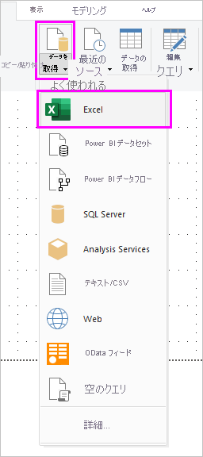
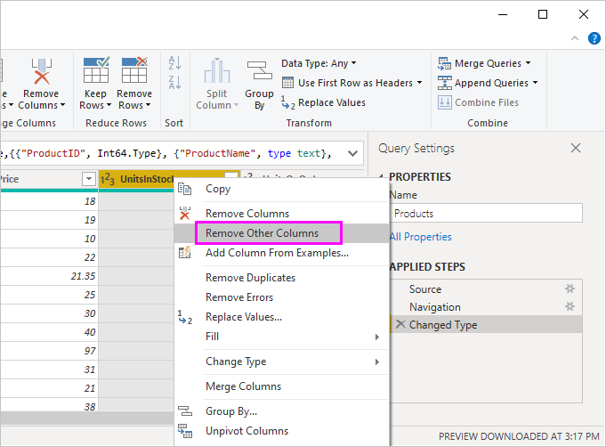
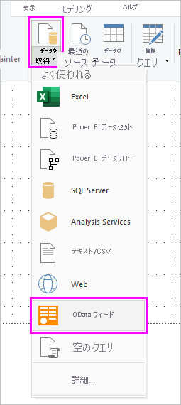
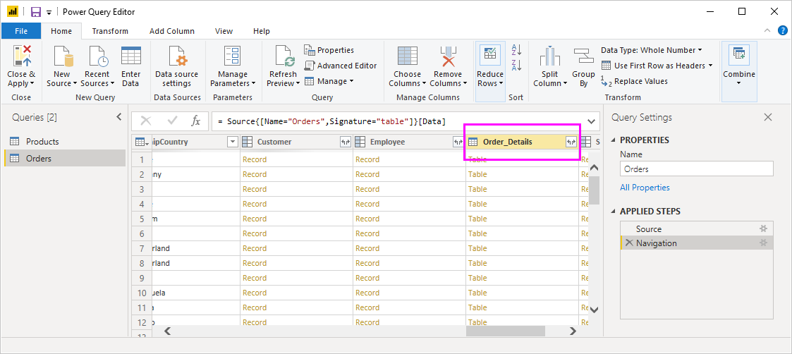
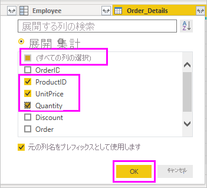
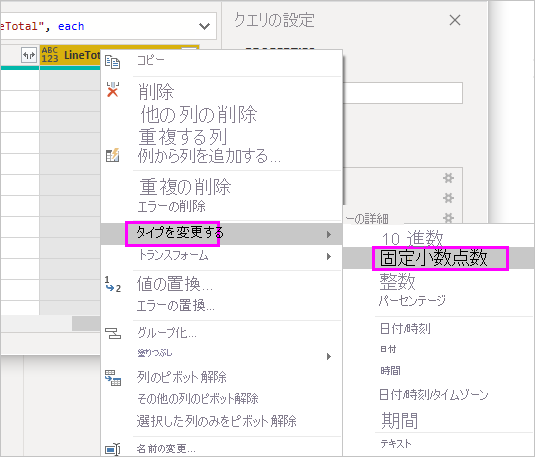
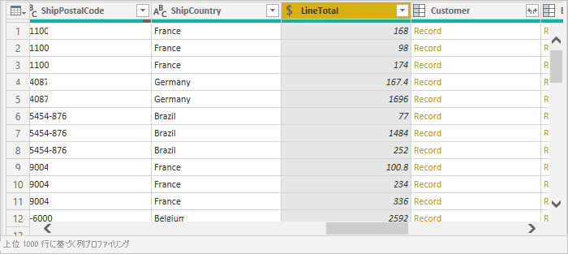
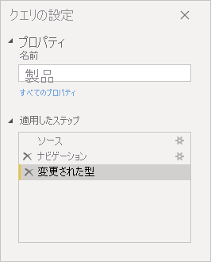
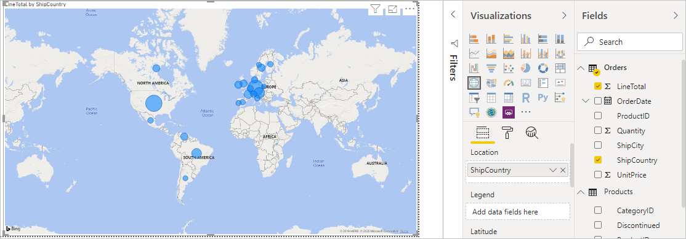

# チュートリアル:Excel と OData フィードの売上データを分析する

データのデータ ソースが複数存在することは一般的です。 たとえば、製品情報に 1 つ、売上情報に 1 つと、データベースが 2 つ用意されることがあります。 *Power BI Desktop* では、異なるソースからのデータを組み合わせて、興味深く説得力のあるデータ分析と視覚エフェクトを作成できます。

このチュートリアルでは、2 つのデータ ソースのデータを結合します。

* 製品情報が含まれる Excel ブック
* 注文データが含まれる OData フィード

これから各データセットをインポートし、変換や集計を行います。 次に、2 つのソースのデータを使用し、直観的に操作できる視覚情報を持つ売上分析レポートを作成します。 その後、SQL Server クエリ、CSV ファイル、Power BI Desktop の他のデータ ソースにこれらの手法を適用できます。

>[!NOTE]
>Power BI Desktop では多くの場合、タスクを複数の方法で実行できます。 たとえば、右クリックするか、列またはセルの **[その他のオプション]** メニューを使用し、リボンに追加の選択肢を表示できます。 以下の手順では、複数の代替方法を説明します。

## Excel 製品データをインポートする

最初に、Excel の *Products.xlsx* ブックから Power BI Desktop に製品データをインポートします。

1. [Products.xlsx Excel ブックをダウンロード](https://download.microsoft.com/download/1/4/E/14EDED28-6C58-4055-A65C-23B4DA81C4DE/Products.xlsx)し、*Products.xlsx* として保存します。

1. Power BI Desktop リボンの **[ホーム]** タブの **[データを取得]** の横にある矢印を選択し、 **[よく使われる]** メニューから **[Excel]** を選択します。

   

   >[!NOTE]
   >**[データを取得]** 項目自体を選ぶか、Power BI の **[作業の開始]** ダイアログ ボックスから **[データを取得]** を選び、 **[データを取得]** ダイアログで **[Excel]** または **[ファイル]**  >  **[Excel]** を選んで、 **[接続]** を選ぶこともできます。

1. **[開く]** ダイアログ ボックスで、**Products.xlsx** ファイルを探して選び、 **[開く]** を選びます。

1. **[ナビゲーター]** で **[製品]** テーブルを選択してから、 **[データの変換]** を選択します。

   ![Excel の [ナビゲーター] ウィンドウ](media/desktop-tutorial-analyzing-sales-data-from-excel-and-an-odata-feed/t_excelodata_2.png)

テーブル プレビューが Power Query エディターで開きます。ここで、変換を適用してデータをクリーンアップできます。

>[!NOTE]
>Power Query エディターは、Power BI Desktop の **[ホーム]** リボンから **[クエリの編集]**  >  **[クエリの編集]** を選んで開くことも、 **[レポート]** ビューで右クリックするかクエリの横にある **[その他のオプション]** を選んでから **[クエリの編集]** を選んで開くこともできます。

## 製品の列をクリーンアップする

結合されたレポートでは、Excel ブックの **ProductID**、**ProductName**、**QuantityPerUnit**、**UnitsInStock** 列が使用されます。 他の列は削除できます。

1. Power Query エディターで、**ProductID**、**ProductName**、**QuantityPerUnit**、**UnitsInStock** 列を選択します。 Ctrl キーを使用することで、複数の列を選択できます。Shift キーを使用すると、隣り合った列を選択できます。

1. 選択したヘッダーのいずれかを右クリックします。 ドロップダウン メニューから **[他の列の削除]** を選択します。
   **[ホーム]** リボン タブの **[列の管理]** グループから **[列の削除]**  >  **[他の列の削除]** を選んでもかまいません。

   

## OData フィードの注文データのインポート

次に、サンプルの Northwind 販売システムの OData フィードから注文データをインポートします。

1. Power Query エディターで、 **[新しいソース]** を選択し、 **[よく使われる]** メニューから **[OData フィード]** を選択します。

   

1. **[OData フィード]** ダイアログ ボックスに、Northwind OData フィードの URL である `https://services.odata.org/V3/Northwind/Northwind.svc/` を貼り付けます。 **[OK]** を選択します。

   ![[OData フィード] ダイアログ ボックス](media/desktop-tutorial-analyzing-sales-data-from-excel-and-an-odata-feed/get_odata2.png)

1. **[ナビゲーター]** で、**Orders** テーブルを選び、 **[データの変換]** を選んで、Power Query エディターにデータを読み込みます。

   

   >[!NOTE]
   >**[ナビゲーター]** では、チェック ボックスを選択せずにテーブル名を選んで、プレビューを表示できます。

## 注文データを展開する

リレーショナル データベースや Northwind OData フィードのように複数のテーブルが含まれるデータ ソースに接続するとき、テーブル参照を使用してクエリを作成できます。 **Orders** テーブルには、複数の関連テーブルへの参照が含まれています。 展開操作を使用し、関連する **Order_Details** テーブルの **ProductID**、**UnitPrice**、**Quantity** 列をサブジェクト (**Orders**) テーブルに追加できます。

1. **Order_Details** 列が表示されるまで、**Orders** テーブルを右にスクロールします。 データではなく、別のテーブルの参照が含まれています。

   

1. **Order_Details** 列のヘッダーで、 **[展開]** アイコン ![[展開] アイコン](media/desktop-tutorial-analyzing-sales-data-from-excel-and-an-odata-feed/expand.png) を選びます。

1. ドロップダウン メニューで、次のどちらかの操作を行います。

   1. すべての列をオフにするため、 **(すべての列を選択)** を選択します。

   1. **ProductID**、**UnitPrice**、**Quantity** を選んで、 **[OK]** を選びます。

      

**Order_Details** テーブルを展開すると、入れ子になっている新しい 3 つのテーブル列が **Order_Details** 列に取って代わります。 テーブルには、各注文の追加データ用の新しい行があります。

## カスタム計算列を作成する

Power Query エディターでは、データを充実させるために計算フィールドとカスタム フィールドを作成できます。 各注文の明細項目を計算する目的で、単価と項目数量を乗算してカスタム列を作成します。

1. Power Query エディターの **[列の追加]** リボン タブで、 **[カスタム列]** を選択します。

   

1. **[カスタム列]** ダイアログ ボックスで、 **[新しい列名]** フィールドに「**LineTotal**」と入力します。

1. **[カスタム列の式]** フィールドの " **=** " の後に、「 **[Order_Details.UnitPrice]** \* **[Order_Details.Quantity]** 」と入力します。 入力する代わりに、 **[使用できる列]** スクロール ボックスからフィールド名を選び、 **[<< 挿入]** を選んでもかまいません。

1. **[OK]** を選択します。

   ![[カスタム列] ダイアログ ボックス](media/desktop-tutorial-analyzing-sales-data-from-excel-and-an-odata-feed/custom-column-dialog-box.png)

   **Orders** テーブルの最後の列として、新しい **LineTotal** フィールドが表示されます。

## 新しいフィールドのデータ型を設定する

Power Query エディターでデータに接続すると、表示目的で各フィールドのデータ型が可能な範囲で推測されます。 ヘッダー アイコンに、各フィールドに割り当てられたデータ型が示されます。 **[ホーム]** リボン タブの **[変換]** グループの **[データ型]** で確認することもできます。

新しい **[LineTotal]** 列には **[任意]** データ型が入りますが、値は通貨です。 データ型を割り当てるには、 **[LineTotal]** 列のヘッダーを右クリックし、ドロップダウン メニューから **[型の変更]** を選択し、 **[固定小数点数]** を選択します。

>[!NOTE]
>または、**LineTotal** 列を選び、 **[ホーム]** リボン タブの **[変換]** 領域の **[データ型]** の横にある矢印を選んで、 **[固定小数点数]** を選んでもかまいません。

## 注文列をクリーンアップする

レポートでモデルの作業をしやすくするため、一部の列を削除したり、名前や順序を変更したりできます。

レポートでは次の列が使用される予定です。

* **OrderDate**
* **ShipCity**
* **ShipCountry**
* **Order_Details.ProductID**
* **Order_Details.UnitPrice**
* **Order_Details.Quantity**
* **LineTotal**

これらの列を選択し、Excel データの場合と同じように **[他の列の削除]** を使用します。 あるいは、一覧にない列を選択し、いずれかを右クリックし、 **[列の削除]** を選択できます。

"**Order_Details.** " というプレフィックスの付いた列の名前を変更し、 読みやすくすることができます。

1. 各列のヘッダーをダブルクリックまたは長押しし、列ヘッダーを右クリックし、ドロップダウン メニューから **[名前の変更]** を選択します。

1. **Order_Details.** プレフィックスを各名前から削除します。

最後に、**LineTotal** 列にアクセスしやすくするため、この列を左にドラッグして **ShipCountry** 列のすぐ右にドロップします。

## クエリのステップを確認する

データを整形したり、変換したりするための Power Query エディター アクションは記録されます。 各アクションは、右側にある **[クエリ設定]** ウィンドウの **[適用したステップ]** の下に表示されます。 **[適用したステップ]** で前のステップに戻り、各ステップを確認し、必要に応じて編集したり、削除したり、再配置したりできます。 ただし、前のステップを変更すると後のステップを壊す可能性があり、危険です。

Power Query エディターの左側にある **[クエリ]** の一覧で各クエリを選び、 **[クエリの設定]** で **[適用したステップ]** を確認します。 これまでのデータ変換を適用すると、2 つのクエリの **[適用したステップ]** は次のようになります。

 &nbsp;&nbsp; 

>[!TIP]
>[適用したステップ] の基礎は、[M 言語](https://docs.microsoft.com/powerquery-m/power-query-m-reference)とも呼ばれる *Power Query 言語*で記述された数式です。 数式を表示および編集するには、リボンの **[ホーム]** タブの **[クエリ]** グループで **[詳細エディター]** を選択します。

## 変換されたクエリをインポートする

変換したデータに問題がなく、Power BI Desktop の **[レポート]** ビューにインポートする用意ができたら、 **[ホーム]** リボン タブの **[閉じる]** グループで **[閉じて適用]**  >  **[閉じて適用]** の順に選択します。

データが読み込まれると、Power BI Desktop の **[レポート]** ビューの **[フィールド]** 一覧にクエリが表示されます。

![[フィールド] 一覧のクエリ](media/desktop-tutorial-analyzing-sales-data-from-excel-and-an-odata-feed/queries-in-fields-list.png)

## データセット間のリレーションシップを管理する

Power BI Desktop では、レポート作成のためにクエリを結合する必要はありません。 ただし、共通フィールドに基づくデータセット間のリレーションシップを使用し、レポートを拡張して充実させることができます。 Power BI Desktop でリレーションシップを自動的に検出できます。または、Power BI Desktop の **[リレーションシップの管理]** ダイアログ ボックスで作成することもできます。 詳しくは、「[Power BI Desktop でのリレーションシップの作成と管理](../transform-model/desktop-create-and-manage-relationships.md)」をご覧ください。

共有 `ProductID` フィールドにより、このチュートリアルの `Orders` データセットと `Products` データセットの間のリレーションシップが作成されます。

1. Power BI Desktop の **[レポート]** ビューで、 **[ホーム]** リボン タブの **[リレーションシップ]** 領域の **[リレーションシップの管理]** を選択します。

   ![[リレーションシップの管理] リボン](media/desktop-tutorial-analyzing-sales-data-from-excel-and-an-odata-feed/t_excelodata_5.png)

1. **[リレーションシップの管理]** ダイアログ ボックスでは、Power BI Desktop によって **Products** テーブルと **Orders** テーブルの間のアクティブなリレーションシップが既に検出されて一覧に表示されていることがわかります。 リレーションシップを表示するには、 **[編集]** を選びます。

   ![[リレーションシップの管理] ダイアログ](media/desktop-tutorial-analyzing-sales-data-from-excel-and-an-odata-feed/t_excelodata_6.png)

   **[リレーションシップの編集]** が開き、リレーションシップに関する詳細が示されます。  

   ![[リレーションシップの編集] ダイアログ](media/desktop-tutorial-analyzing-sales-data-from-excel-and-an-odata-feed/t_excelodata_7.png)

1. Power BI Desktop はリレーションシップを正しく自動検出しているので、 **[キャンセル]** 、 **[閉じる]** の順に選択できます。

Power BI Desktop の左側で、 **[モデル]** を選択し、クエリのリレーションシップを表示し、管理します。 2 つのクエリを接続する線の矢印をダブルクリックして **[リレーションシップの編集]** ダイアログを開き、リレーションシップを表示または変更します。

**[モデル]** ビューから **[レポート]** ビューに戻るには、 **[レポート]** アイコンを選択します。

## データを使って視覚エフェクトを作成する

Power BI Desktop レビュー ビューでさまざまな視覚エフェクトを作成し、データから分析情報を得ることができます。 レポートを複数のページで構成し、各ページに複数のビジュアルを含めることができます。 他のユーザーと共に視覚エフェクトを操作し、データの分析や把握に役立てることができます。 詳細については、「[Power BI サービスの編集ビューにおけるレポートの操作](../create-reports/service-interact-with-a-report-in-editing-view.md)」を参照してください。

両方のデータセットおよびそれらの間のリレーションシップを使うと、売上データの視覚化と分析に役立ちます。

最初に、両方のクエリからのフィールドを使う積み上げ縦棒グラフを作成し、各製品の注文数量を示します。

1. 右側の **[フィールド]** ウィンドウで **Orders** の **Quantity** フィールドを選ぶか、フィールドをキャンバスの空白の領域にドラッグします。 製品の合計注文数量を示す積み上げ縦棒グラフが作成されます。

1. 各製品の注文数量を表示するには、 **[フィールド]** ウィンドウで **Products** の **ProductName** を選択するか、フィールドをグラフにドラッグします。

1. 注文の多い順に製品を並べ替えるには、視覚エフェクトの右上にある **[その他のオプション]** の省略記号 ( **...** ) を選択し、 **[数量で並べ替える]** を選択します。

1. グラフの隅にあるハンドルを使ってグラフを拡大し、より多くの製品名が表示されるようにします。

   

次に、時間の経過 (**OrderDate**) に伴う注文の金額 (**LineTotal**) を示すグラフを作成します。

1. キャンバスで何も選択されていない状態で、 **[フィールド]** ウィンドウの **Orders** から **LineTotal** を選ぶか、キャンバスの空白領域にドラッグします。 積み上げ縦棒グラフに、すべての注文の合計金額が表示されます。

1. 積み上げ縦棒グラフを選択し、**Orders** から **OrderDate** を選択するか、グラフにドラッグします。 グラフに各注文日の明細合計が表示されるようになります。

1. 視覚エフェクトのサイズを変更したり、表示されるデータを増やしたりするには、視覚エフェクトの隅をドラッグします。

   

   >[!TIP]
   >グラフに **Years** と 3 つのデータ ポイントしか表示されない場合は、 **[視覚化]** ウィンドウの **[軸]** フィールドで **OrderDate** の横にある矢印を選択し、 **[日付の階層]** の代わりに **OrderDate** を選びます。

最後に、各国の注文金額を示すマップ視覚エフェクトを作成します。

1. キャンバスで何も選択されていない状態で、 **[フィールド]** ウィンドウの **Orders** から **ShipCountry** を選ぶか、キャンバスの空白領域にドラッグします。 Power BI Desktop では、データが国名であることが検出されます。 次に、地図が自動的に視覚化され、注文のある各国がデータ ポイントで示されます。

1. データ ポイントのサイズに各国の注文量を反映させるには、 **[LineTotal]** フィールドを地図にドラッグします。 **[視覚化]** ウィンドウの **[ここにデータ フィールドをドラッグしてください]** の **[サイズ]** までドラッグすることもできます。 マップ上の円のサイズが、各国からの注文の金額を反映するようになります。

   

## レポートのビジュアルと対話してさらに分析する

Power BI Desktop では、相互に強調表示し、互いにフィルターを適用するビジュアルを操作し、傾向をさらに明らかにすることができます。 詳しくは、「[Power BI レポートのフィルターと強調表示](../create-reports/power-bi-reports-filters-and-highlighting.md)」をご覧ください。

クエリ間のリレーションシップのため、ある視覚エフェクトと対話すると、そのページ上の他のすべての視覚エフェクトに反映されます。

マップ視覚エフェクトで、**カナダ**の中央にある円を選びます。 他の 2 つの視覚エフェクトがフィルター処理され、カナダの明細金額と注文数量が強調表示されます。

**[ProductName 別数量]** グラフの製品を選択すると、地図と、その製品のデータを反映させるための日付グラフ フィルターが表示されます。 **[LineTotal by OrderDate]** グラフの日付を選択すると、地図と、その日付のデータを表示するための製品グラフ フィルターが表示されます。

>[!TIP]
>選択を解除するには、再びクリックするか、他の視覚エフェクトのいずれかをクリックします。

## 完成した売上分析レポート

完成したレポートでは、Excel ファイル *Products.xlsx* と Northwind OData フィードからのデータが、さまざまな国の注文情報、期間、製品を分析するのに役立つビジュアルに結合されています。 レポートの準備ができたら、[それを Power BI サービスにアップロード](../create-reports/desktop-upload-desktop-files.md)して、他の Power BI ユーザーと共有できます。

## 次の手順

* [Microsoft Learn for Power BI](https://docs.microsoft.com/learn/powerplatform/power-bi?WT.mc_id=powerbi_landingpage-docs-link)
* [Power BI Desktop のビデオを見る](/power-bi/fundamentals/desktop-videos)
* [Power BI フォーラムにアクセスする](https://go.microsoft.com/fwlink/?LinkID=519326)
* [Power BI ブログを読む](https://go.microsoft.com/fwlink/?LinkID=519327)
